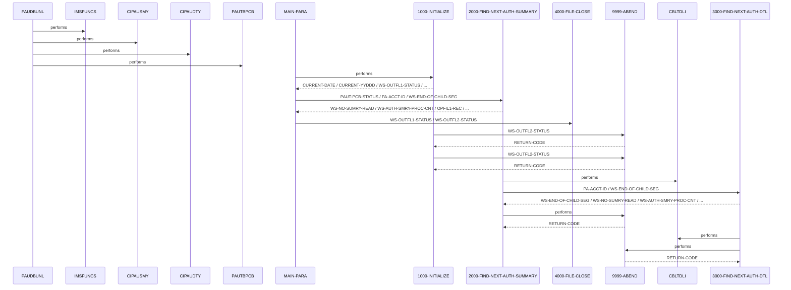

# PAUDBUNL

**File**: `cbl/PAUDBUNL.CBL`
**Type**: FileType.COBOL
**Analyzed**: 2026-03-04 03:22:38.574527

## Purpose

The PAUDBUNL program extracts authorization summary and detail information from an IMS database and writes it to two sequential output files. It reads authorization summary records and then associated detail records, writing each to a separate output file.

**Business Context**: UNKNOWN

## Inputs

| Name | Type | Description |
|------|------|-------------|
| PAUTBPCB | IOType.IMS_SEGMENT | IMS PCB used to access the authorization summary and detail segments. |
| PENDING-AUTH-SUMMARY | IOType.IMS_SEGMENT | Authorization summary segment read from IMS. |
| PENDING-AUTH-DETAILS | IOType.IMS_SEGMENT | Authorization detail segment read from IMS. |

## Outputs

| Name | Type | Description |
|------|------|-------------|
| OPFILE1 | IOType.FILE_SEQUENTIAL | Contains authorization summary records extracted from the IMS database. |
| OPFILE2 | IOType.FILE_SEQUENTIAL | Contains authorization detail records extracted from the IMS database. |

## Called Programs

| Program | Call Type | Purpose |
|---------|-----------|---------|
| CBLTDLI | CallType.STATIC_CALL | Issue IMS DL/I calls to retrieve authorization summary and detail segments. |
| CBLTDLI | CallType.STATIC_CALL | Issue IMS DL/I calls to retrieve authorization detail segments. |
| IMSFUNCS | CallType.OTHER | UNKNOWN |
| CIPAUSMY | CallType.OTHER | UNKNOWN |
| CIPAUDTY | CallType.OTHER | UNKNOWN |
| PAUTBPCB | CallType.OTHER | UNKNOWN |

## Business Rules

- **BR001**: Only write authorization summary records to OPFILE1 if the account ID is numeric.

## Paragraphs/Procedures

### PAUDBUNL
> [Source: PAUDBUNL.cbl.md](PAUDBUNL.CBL.d/PAUDBUNL.cbl.md)
This is the program ID paragraph. It appears to be a placeholder as it contains no executable code. It likely serves as an identifier for the program within the COBOL environment. It calls other programs, but their purpose is unknown.

### MAIN-PARA
> [Source: MAIN-PARA.cbl.md](PAUDBUNL.CBL.d/MAIN-PARA.cbl.md)
This paragraph serves as the main entry point and orchestrates the overall program flow. It first performs the 1000-INITIALIZE paragraph to open files and set up the environment. Then, it enters a loop that repeatedly performs 2000-FIND-NEXT-AUTH-SUMMARY until the end of the root segment is reached, indicated by WS-END-OF-ROOT-SEG being set to 'Y'. Finally, it performs 4000-FILE-CLOSE to close the output files before terminating the program. It uses PAUTBPCB from the linkage section.

### 1000-INITIALIZE
> [Source: 1000-INITIALIZE.cbl.md](PAUDBUNL.CBL.d/1000-INITIALIZE.cbl.md)
This paragraph initializes the program environment. It accepts the current date and day from the system. It then attempts to open two output files, OPFILE1 and OPFILE2. If either OPEN operation fails (WS-OUTFL1-STATUS or WS-OUTFL2-STATUS not equal to spaces or '00'), an error message is displayed, and the program abends by performing 9999-ABEND. It consumes no input files but initializes output files. It writes messages to the console using DISPLAY.

### 1000-EXIT
> [Source: 1000-EXIT.cbl.md](PAUDBUNL.CBL.d/1000-EXIT.cbl.md)
This paragraph simply provides an exit point for the 1000-INITIALIZE paragraph, allowing for a PERFORM...THRU structure.

### 2000-FIND-NEXT-AUTH-SUMMARY
> [Source: 2000-FIND-NEXT-AUTH-SUMMARY.cbl.md](PAUDBUNL.CBL.d/2000-FIND-NEXT-AUTH-SUMMARY.cbl.md)
This paragraph retrieves the next authorization summary segment from the IMS database. It initializes PAUT-PCB-STATUS and then calls CBLTDLI with the FUNC-GN parameter to retrieve the next root segment (authorization summary). If the call is successful (PAUT-PCB-STATUS is spaces), it increments counters, moves the data to OPFIL1-REC, initializes ROOT-SEG-KEY and CHILD-SEG-REC, moves PA-ACCT-ID to ROOT-SEG-KEY, and writes the OPFIL1-REC to OPFILE1 if PA-ACCT-ID is numeric. After writing the summary record, it calls 3000-FIND-NEXT-AUTH-DTL to retrieve the associated detail records. If the PCB status is 'GB', it sets the end-of-database flag. If the PCB status is neither spaces nor 'GB', it displays an error message and abends. It consumes data from the IMS database via CBLTDLI and writes to OPFILE1. It modifies ROOT-SEG-KEY, PENDING-AUTH-SUMMARY, and OPFIL1-REC.

### 2000-EXIT
> [Source: 2000-EXIT.cbl.md](PAUDBUNL.CBL.d/2000-EXIT.cbl.md)
This paragraph provides an exit point for the 2000-FIND-NEXT-AUTH-SUMMARY paragraph, allowing for a PERFORM...THRU structure.

### 3000-FIND-NEXT-AUTH-DTL
> [Source: 3000-FIND-NEXT-AUTH-DTL.cbl.md](PAUDBUNL.CBL.d/3000-FIND-NEXT-AUTH-DTL.cbl.md)
This paragraph retrieves the next authorization detail segment associated with the current authorization summary segment. It calls CBLTDLI with the FUNC-GNP parameter to retrieve the next child segment (authorization detail). If the call is successful (PAUT-PCB-STATUS is spaces), it increments counters, moves the data to CHILD-SEG-REC, and writes the OPFIL2-REC to OPFILE2. If the PCB status is 'GE', it sets the end-of-child-segment flag. If the PCB status is neither spaces nor 'GE', it displays an error message and abends. It consumes data from the IMS database via CBLTDLI and writes to OPFILE2. It modifies PENDING-AUTH-DETAILS, CHILD-SEG-REC, and WS-END-OF-CHILD-SEG.

### 3000-EXIT
> [Source: 3000-EXIT.cbl.md](PAUDBUNL.CBL.d/3000-EXIT.cbl.md)
This paragraph provides an exit point for the 3000-FIND-NEXT-AUTH-DTL paragraph, allowing for a PERFORM...THRU structure.

### 4000-FILE-CLOSE
> [Source: 4000-FILE-CLOSE.cbl.md](PAUDBUNL.CBL.d/4000-FILE-CLOSE.cbl.md)
This paragraph closes the output files, OPFILE1 and OPFILE2. It displays a message indicating that the files are being closed. It checks the status of each CLOSE operation (WS-OUTFL1-STATUS and WS-OUTFL2-STATUS). If an error occurs during the close operation (status is not spaces or '00'), an error message is displayed, but the program does not abend. It consumes no input files but closes output files. It writes messages to the console using DISPLAY.

### 4000-EXIT
> [Source: 4000-EXIT.cbl.md](PAUDBUNL.CBL.d/4000-EXIT.cbl.md)
This paragraph provides an exit point for the 4000-FILE-CLOSE paragraph, allowing for a PERFORM...THRU structure.

### 9999-ABEND
> [Source: 9999-ABEND.cbl.md](PAUDBUNL.CBL.d/9999-ABEND.cbl.md)
This paragraph handles abnormal termination of the program. It first displays the message 'IMSUNLOD ABENDING ...' to the console, indicating that the program is terminating due to an error condition (line 4). It then sets the RETURN-CODE to 16, which signals to the calling environment that the program terminated abnormally (line 6). Finally, it uses the GOBACK statement to terminate the program and return control to the calling program or operating system (line 7). This paragraph is likely invoked when a critical error is encountered that prevents the program from continuing normal execution. It does not call any other paragraphs or programs.

### 9999-EXIT
> [Source: 9999-EXIT.cbl.md](PAUDBUNL.CBL.d/9999-EXIT.cbl.md)
This paragraph provides a standard exit point for the program. It consists of a single EXIT statement (line 10). This paragraph likely serves as a common point to exit the program under normal circumstances, allowing for consistent program termination. It is a simple exit and does not perform any specific actions or call any other paragraphs or programs before exiting.

## Control Flow

```mermaid
flowchart TD
    %% Title: PAUDBUNL.CBL
    1000_EXIT["1000-EXIT"]
    1000_INITIALIZE["1000-INITIALIZE"]
    9999_ABEND["9999-ABEND"]
    2000_EXIT["2000-EXIT"]
    2000_FIND_NEXT_AUTH_SUMMARY["2000-FIND-NEXT-AUTH-SUMMARY"]
    3000_FIND_NEXT_AUTH_DTL["3000-FIND-NEXT-AUTH-DTL"]
    CBLTDLI__ext(["CBLTDLI"])
    3000_EXIT["3000-EXIT"]
    4000_EXIT["4000-EXIT"]
    4000_FILE_CLOSE["4000-FILE-CLOSE"]
    9999_EXIT["9999-EXIT"]
    MAIN_PARA["MAIN-PARA"]
    1000_INITIALIZE --> 9999_ABEND
    2000_FIND_NEXT_AUTH_SUMMARY --> 3000_FIND_NEXT_AUTH_DTL
    2000_FIND_NEXT_AUTH_SUMMARY --> 9999_ABEND
    2000_FIND_NEXT_AUTH_SUMMARY -.->|calls| CBLTDLI__ext
    3000_FIND_NEXT_AUTH_DTL --> 9999_ABEND
    3000_FIND_NEXT_AUTH_DTL -.->|calls| CBLTDLI__ext
    MAIN_PARA --> 1000_INITIALIZE
    MAIN_PARA --> 2000_FIND_NEXT_AUTH_SUMMARY
    MAIN_PARA --> 4000_FILE_CLOSE
```

## Open Questions

- ? What is the purpose of the called programs IMSFUNCS, CIPAUSMY, CIPAUDTY, and PAUTBPCB?
  - Context: The program calls these programs in the PAUDBUNL paragraph, but their functionality is not clear from the provided code.
- ? What is the structure of the IMS segments PENDING-AUTH-SUMMARY and PENDING-AUTH-DETAILS?
  - Context: The program reads these segments from the IMS database, but their structure is not defined in the provided code.
- ? What is the structure of OPFILE1-REC and OPFILE2-REC?
  - Context: The program writes to these output files, but the structure of the records is not defined in the provided code.

## Sequence Diagram

```mermaid
sequenceDiagram
    participant PAUDBUNL as PAUDBUNL
    participant IMSFUNCS as IMSFUNCS
    participant CIPAUSMY as CIPAUSMY
    participant CIPAUDTY as CIPAUDTY
    participant PAUTBPCB as PAUTBPCB
    participant MAIN_PARA as MAIN-PARA
    participant 1000_INITIALIZE as 1000-INITIALIZE
    participant 2000_FIND_NEXT_AUTH_SUMMARY as 2000-FIND-NEXT-AUTH-SUMMARY
    participant 4000_FILE_CLOSE as 4000-FILE-CLOSE
    participant 9999_ABEND as 9999-ABEND
    participant CBLTDLI as CBLTDLI
    participant 3000_FIND_NEXT_AUTH_DTL as 3000-FIND-NEXT-AUTH-DTL
    PAUDBUNL->>IMSFUNCS: performs
    PAUDBUNL->>CIPAUSMY: performs
    PAUDBUNL->>CIPAUDTY: performs
    PAUDBUNL->>PAUTBPCB: performs
    MAIN_PARA->>1000_INITIALIZE: performs
    1000_INITIALIZE-->>MAIN_PARA: CURRENT-DATE / CURRENT-YYDDD / WS-OUTFL1-STATUS / ...
    MAIN_PARA->>2000_FIND_NEXT_AUTH_SUMMARY: PAUT-PCB-STATUS / PA-ACCT-ID / WS-END-OF-CHILD-SEG
    2000_FIND_NEXT_AUTH_SUMMARY-->>MAIN_PARA: WS-NO-SUMRY-READ / WS-AUTH-SMRY-PROC-CNT / OPFIL1-REC / ...
    MAIN_PARA->>4000_FILE_CLOSE: WS-OUTFL1-STATUS / WS-OUTFL2-STATUS
    1000_INITIALIZE->>9999_ABEND: WS-OUTFL2-STATUS
    9999_ABEND-->>1000_INITIALIZE: RETURN-CODE
    1000_INITIALIZE->>9999_ABEND: WS-OUTFL2-STATUS
    9999_ABEND-->>1000_INITIALIZE: RETURN-CODE
    2000_FIND_NEXT_AUTH_SUMMARY->>CBLTDLI: performs
    2000_FIND_NEXT_AUTH_SUMMARY->>3000_FIND_NEXT_AUTH_DTL: PA-ACCT-ID / WS-END-OF-CHILD-SEG
    3000_FIND_NEXT_AUTH_DTL-->>2000_FIND_NEXT_AUTH_SUMMARY: WS-END-OF-CHILD-SEG / WS-NO-SUMRY-READ / WS-AUTH-SMRY-PROC-CNT / ...
    2000_FIND_NEXT_AUTH_SUMMARY->>9999_ABEND: performs
    9999_ABEND-->>2000_FIND_NEXT_AUTH_SUMMARY: RETURN-CODE
    3000_FIND_NEXT_AUTH_DTL->>CBLTDLI: performs
    3000_FIND_NEXT_AUTH_DTL->>9999_ABEND: performs
    9999_ABEND-->>3000_FIND_NEXT_AUTH_DTL: RETURN-CODE
```
