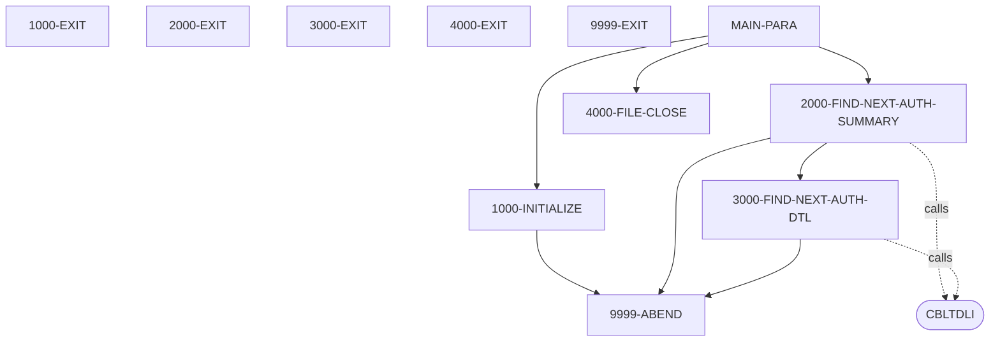

# PAUDBUNL

**File**: `cbl/PAUDBUNL.CBL`
**Type**: FileType.COBOL
**Analyzed**: 2026-03-16 20:04:51.467370

## Purpose

The PAUDBUNL program unloads pending authorization summary and detail segments from an IMS database to two sequential output files. It reads PAUTSUM0 root segments and PAUTDTL1 child segments from the IMS database and writes them to OPFILE1 and OPFILE2 respectively, if the account ID is numeric.

**Business Context**: This program is used to extract pending authorization data from an IMS database for reporting or archival purposes.

## Inputs

| Name | Type | Description |
|------|------|-------------|
| IMS Database (PAUTSUM0, PAUTDTL1) | IOType.IMS_SEGMENT | Pending authorization summary (PAUTSUM0) and detail (PAUTDTL1) segments from the IMS database. |
| PAUTBPCB | IOType.PARAMETER | PCB mask for IMS calls. |

## Outputs

| Name | Type | Description |
|------|------|-------------|
| OPFILE1 | IOType.FILE_SEQUENTIAL | Sequential file containing pending authorization summary segments (PAUTSUM0). |
| OPFILE2 | IOType.FILE_SEQUENTIAL | Sequential file containing pending authorization detail segments (PAUTDTL1). |

## Called Programs

| Program | Call Type | Purpose |
|---------|-----------|---------|
| CBLTDLI | CallType.STATIC_CALL | Performs IMS database calls to retrieve segments. |
| CBLTDLI | CallType.STATIC_CALL | Performs IMS database calls to retrieve segments. |
| DLITCBL | CallType.STATIC_CALL | Entry point for IMS calls. |
| 9999-ABEND | CallType.STATIC_CALL | Abends the program when an error occurs. |

## Business Rules

- **BR001**: Only write the summary record to OPFILE1 if the account ID (PA-ACCT-ID) is numeric.
- **BR002**: If the PAUT-PCB-STATUS is not spaces and not 'GB', Abend the program.
- **BR003**: If the PAUT-PCB-STATUS is not spaces and not 'GE', Abend the program.

## Paragraphs/Procedures

### MAIN-PARA
> [Source: MAIN-PARA.cbl.md](PAUDBUNL.CBL.d/MAIN-PARA.cbl.md)

```
MAIN-PARA  (5 statements, depth=1)
PARAGRAPH
├── UNKNOWN: ENTRY 'DLITCBL'                 USING PAUTBPCB
├── PERFORM_THRU: PERFORM 1000-INITIALIZE                THRU 1000-EXIT
├── PERFORM_THRU: PERFORM 2000-FIND-NEXT-AUTH-SUMMARY    THRU 2000-EXIT
UNTIL   WS-END-OF-ROOT-SEG = 'Y'
├── PERFORM_THRU: PERFORM 4000-FILE-CLOSE THRU 4000-EXIT
└── GOBACK: GOBACK
```
This is the main control paragraph of the PAUDBUNL program. It first calls 1000-INITIALIZE to perform initial setup tasks such as accepting the current date and opening the output files (OPFILE1 and OPFILE2). It then enters a loop that continues until the end of the AUTHDB is reached, indicated by WS-END-OF-ROOT-SEG being set to 'Y'. Inside the loop, it calls 2000-FIND-NEXT-AUTH-SUMMARY to retrieve and process the next pending authorization summary segment. After processing all summary segments, it calls 4000-FILE-CLOSE to close the output files before terminating the program with GOBACK. The paragraph also includes an ENTRY point 'DLITCBL' for IMS calls.

### 1000-INITIALIZE
> [Source: 1000-INITIALIZE.cbl.md](PAUDBUNL.CBL.d/1000-INITIALIZE.cbl.md)

```
1000-INITIALIZE  (18 statements, depth=3)
PARAGRAPH
├── ACCEPT: ACCEPT CURRENT-DATE     FROM DATE
├── ACCEPT: ACCEPT CURRENT-YYDDD    FROM DAY
├── DISPLAY: DISPLAY 'STARTING PROGRAM PAUDBUNL::'
├── DISPLAY: DISPLAY '*-------------------------------------*'
├── DISPLAY: DISPLAY 'TODAYS DATE            :' CURRENT-DATE
├── DISPLAY: DISPLAY ' '
├── OPEN: OPEN OUTPUT OPFILE1
├── IF: IF WS-OUTFL1-STATUS =  SPACES OR '00'
│   ├── CONTINUE: CONTINUE
│   └── ELSE: ELSE
│       ├── DISPLAY: DISPLAY 'ERROR IN OPENING OPFILE1:' WS-OUTFL1-STATUS
│       └── PERFORM: PERFORM 9999-ABEND
├── OPEN: OPEN OUTPUT OPFILE2
└── IF: IF WS-OUTFL2-STATUS =  SPACES OR '00'
    ├── CONTINUE: CONTINUE
    └── ELSE: ELSE
        ├── DISPLAY: DISPLAY 'ERROR IN OPENING OPFILE2:' WS-OUTFL2-STATUS
        └── PERFORM: PERFORM 9999-ABEND
```
This paragraph initializes the program by accepting the current date and opening the output files, OPFILE1 and OPFILE2. It accepts the current date from the system and stores it in CURRENT-DATE and CURRENT-YYDDD. It then opens OPFILE1 and OPFILE2 for output. If either file fails to open, an error message is displayed, and the program abends by calling 9999-ABEND. The paragraph displays messages to the console indicating the start of the program and the current date. The paragraph ensures that the output files are ready for writing before the main processing loop begins.

### 2000-FIND-NEXT-AUTH-SUMMARY
> [Source: 2000-FIND-NEXT-AUTH-SUMMARY.cbl.md](PAUDBUNL.CBL.d/2000-FIND-NEXT-AUTH-SUMMARY.cbl.md)

```
2000-FIND-NEXT-AUTH-SUMMARY  (20 statements, depth=3)
PARAGRAPH
├── INITIALIZE: INITIALIZE PAUT-PCB-STATUS
├── CALL: CALL 'CBLTDLI'            USING  FUNC-GN
PAUTBPCB
PENDING-AUTH-SUMMARY
ROOT-UNQUAL-SSA
├── IF: IF PAUT-PCB-STATUS = SPACES
│   ├── ADD: ADD 1                 TO WS-NO-SUMRY-READ
│   ├── ADD: ADD 1                 TO WS-AUTH-SMRY-PROC-CNT
│   ├── MOVE: MOVE PENDING-AUTH-SUMMARY TO OPFIL1-REC
│   ├── INITIALIZE: INITIALIZE ROOT-SEG-KEY
│   ├── INITIALIZE: INITIALIZE CHILD-SEG-REC
│   ├── MOVE: MOVE PA-ACCT-ID           TO ROOT-SEG-KEY
│   └── IF: IF PA-ACCT-ID IS NUMERIC
│       ├── WRITE: WRITE OPFIL1-REC
│       ├── INITIALIZE: INITIALIZE WS-END-OF-CHILD-SEG
│       └── PERFORM_THRU: PERFORM 3000-FIND-NEXT-AUTH-DTL THRU 3000-EXIT
UNTIL  WS-END-OF-CHILD-SEG='Y'
├── IF: IF PAUT-PCB-STATUS = 'GB'
│   ├── SET: SET END-OF-AUTHDB     TO TRUE
│   └── MOVE: MOVE 'Y' TO WS-END-OF-ROOT-SEG
└── IF: IF PAUT-PCB-STATUS NOT EQUAL TO  SPACES AND 'GB'
    ├── DISPLAY: DISPLAY 'AUTH SUM  GN FAILED  :' PAUT-PCB-STATUS
    ├── DISPLAY: DISPLAY 'KEY FEEDBACK AREA    :' PAUT-KEYFB
    └── PERFORM: PERFORM 9999-ABEND
```
This paragraph retrieves the next pending authorization summary segment from the IMS database. It initializes PAUT-PCB-STATUS, then calls CBLTDLI with FUNC-GN to retrieve the next summary segment (PAUTSUM0) using the ROOT-UNQUAL-SSA. If the call is successful (PAUT-PCB-STATUS is spaces), it increments counters WS-NO-SUMRY-READ and WS-AUTH-SMRY-PROC-CNT, moves the retrieved segment to OPFIL1-REC, and writes it to OPFILE1 if PA-ACCT-ID is numeric. It then calls 3000-FIND-NEXT-AUTH-DTL to process the child segments associated with the current summary segment. If the end of the database is reached (PAUT-PCB-STATUS is 'GB'), it sets WS-END-OF-ROOT-SEG to 'Y'. If the call fails (PAUT-PCB-STATUS is neither spaces nor 'GB'), it displays an error message and abends the program.

### 3000-FIND-NEXT-AUTH-DTL
> [Source: 3000-FIND-NEXT-AUTH-DTL.cbl.md](PAUDBUNL.CBL.d/3000-FIND-NEXT-AUTH-DTL.cbl.md)

```
3000-FIND-NEXT-AUTH-DTL  (15 statements, depth=2)
PARAGRAPH
├── CALL: CALL 'CBLTDLI'            USING  FUNC-GNP
PAUTBPCB
PENDING-AUTH-DETAILS
CHILD-UNQUAL-SSA
├── IF: IF PAUT-PCB-STATUS = SPACES
│   ├── SET: SET MORE-AUTHS       TO TRUE
│   ├── ADD: ADD 1                 TO WS-NO-SUMRY-READ
│   ├── ADD: ADD 1                 TO WS-AUTH-SMRY-PROC-CNT
│   ├── MOVE: MOVE PENDING-AUTH-DETAILS TO CHILD-SEG-REC
│   └── WRITE: WRITE OPFIL2-REC
├── IF: IF PAUT-PCB-STATUS = 'GE'
│   ├── MOVE: MOVE 'Y' TO WS-END-OF-CHILD-SEG
│   └── DISPLAY: DISPLAY 'CHILD SEG FLAG GE : '
WS-END-OF-CHILD-SEG
├── IF: IF PAUT-PCB-STATUS NOT EQUAL TO  SPACES AND 'GE'
│   ├── DISPLAY: DISPLAY 'GNP CALL FAILED  :' PAUT-PCB-STATUS
│   ├── DISPLAY: DISPLAY 'KFB AREA IN CHILD:' PAUT-KEYFB
│   └── PERFORM: PERFORM 9999-ABEND
└── INITIALIZE: INITIALIZE PAUT-PCB-STATUS
```
This paragraph retrieves the next pending authorization detail segment (PAUTDTL1) associated with the current summary segment. It calls CBLTDLI with FUNC-GNP to retrieve the next detail segment using CHILD-UNQUAL-SSA. If the call is successful (PAUT-PCB-STATUS is spaces), it sets MORE-AUTHS to TRUE, increments counters WS-NO-SUMRY-READ and WS-AUTH-SMRY-PROC-CNT, moves the retrieved segment to CHILD-SEG-REC, and writes it to OPFILE2. If the end of the child segments is reached (PAUT-PCB-STATUS is 'GE'), it sets WS-END-OF-CHILD-SEG to 'Y'. If the call fails (PAUT-PCB-STATUS is neither spaces nor 'GE'), it displays an error message and abends the program. The paragraph initializes PAUT-PCB-STATUS before exiting.

### 4000-FILE-CLOSE
> [Source: 4000-FILE-CLOSE.cbl.md](PAUDBUNL.CBL.d/4000-FILE-CLOSE.cbl.md)

```
4000-FILE-CLOSE  (11 statements, depth=3)
PARAGRAPH
├── DISPLAY: DISPLAY 'CLOSING THE FILE'
├── CLOSE: CLOSE OPFILE1
├── IF: IF WS-OUTFL1-STATUS =  SPACES OR '00'
│   ├── CONTINUE: CONTINUE
│   └── ELSE: ELSE
│       └── DISPLAY: DISPLAY 'ERROR IN CLOSING 1ST FILE:'WS-OUTFL1-STATUS
├── CLOSE: CLOSE OPFILE2
└── IF: IF WS-OUTFL2-STATUS =  SPACES OR '00'
    ├── CONTINUE: CONTINUE
    └── ELSE: ELSE
        └── DISPLAY: DISPLAY 'ERROR IN CLOSING 2ND FILE:'WS-OUTFL2-STATUS
```
This paragraph closes the output files, OPFILE1 and OPFILE2. It displays a message indicating that the files are being closed. It closes OPFILE1 and OPFILE2, checking the file status after each close operation. If an error occurs during the close operation for either file, an error message is displayed. This paragraph ensures that all output files are properly closed before the program terminates, preventing potential data loss or corruption.

## Control Flow


```mermaid
flowchart TD
    %% Title: PAUDBUNL.CBL
    1000_EXIT["1000-EXIT"]
    1000_INITIALIZE["1000-INITIALIZE"]
    9999_ABEND["9999-ABEND"]
    2000_EXIT["2000-EXIT"]
    2000_FIND_NEXT_AUTH_SUMMARY["2000-FIND-NEXT-AUTH-SUMMARY"]
    3000_FIND_NEXT_AUTH_DTL["3000-FIND-NEXT-AUTH-DTL"]
    CBLTDLI__ext(["CBLTDLI"])
    3000_EXIT["3000-EXIT"]
    4000_EXIT["4000-EXIT"]
    4000_FILE_CLOSE["4000-FILE-CLOSE"]
    9999_EXIT["9999-EXIT"]
    MAIN_PARA["MAIN-PARA"]
    1000_INITIALIZE --> 9999_ABEND
    2000_FIND_NEXT_AUTH_SUMMARY --> 3000_FIND_NEXT_AUTH_DTL
    2000_FIND_NEXT_AUTH_SUMMARY --> 9999_ABEND
    2000_FIND_NEXT_AUTH_SUMMARY -.->|calls| CBLTDLI__ext
    3000_FIND_NEXT_AUTH_DTL --> 9999_ABEND
    3000_FIND_NEXT_AUTH_DTL -.->|calls| CBLTDLI__ext
    MAIN_PARA --> 1000_INITIALIZE
    MAIN_PARA --> 2000_FIND_NEXT_AUTH_SUMMARY
    MAIN_PARA --> 4000_FILE_CLOSE
```
