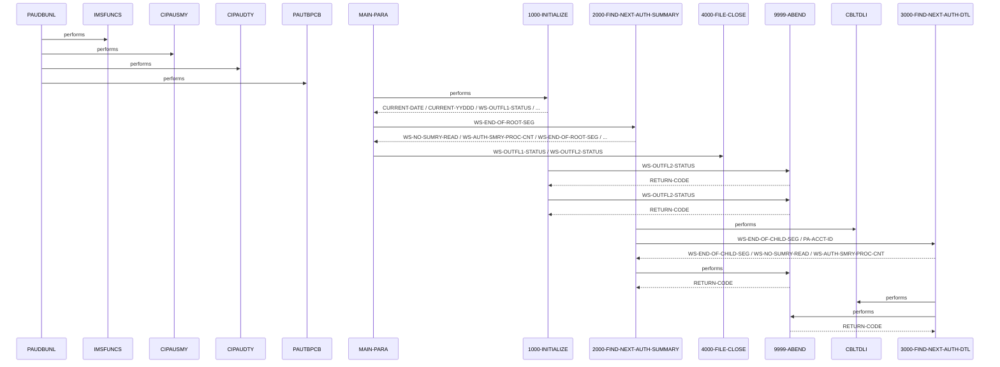

# PAUDBUNL

**File**: `cbl/PAUDBUNL.CBL`
**Type**: FileType.COBOL
**Analyzed**: 2026-03-04 04:39:10.714255

## Purpose

This COBOL program extracts authorization summary and detail information from an IMS database and writes it to two sequential output files. It reads authorization summary records and then reads associated detail records, writing each to a separate output file.

**Business Context**: UNKNOWN

## Inputs

| Name | Type | Description |
|------|------|-------------|
| PAUTBPCB | IOType.IMS_SEGMENT | IMS PCB used to access authorization summary and detail segments. |
| PENDING-AUTH-SUMMARY | IOType.IMS_SEGMENT | Authorization summary segment read from IMS. |
| PENDING-AUTH-DETAILS | IOType.IMS_SEGMENT | Authorization detail segment read from IMS. |

## Outputs

| Name | Type | Description |
|------|------|-------------|
| OPFILE1 | IOType.FILE_SEQUENTIAL | Sequential file containing authorization summary records. |
| OPFILE2 | IOType.FILE_SEQUENTIAL | Sequential file containing authorization detail records. |

## Called Programs

| Program | Call Type | Purpose |
|---------|-----------|---------|
| CBLTDLI | CallType.STATIC_CALL | Issue IMS DL/I calls to retrieve authorization summary and detail segments. |
| CBLTDLI | CallType.STATIC_CALL | Issue IMS DL/I calls to retrieve authorization detail segments. |

## Paragraphs/Procedures

### PAUDBUNL
> [Source: PAUDBUNL.cbl.md](PAUDBUNL.CBL.d/PAUDBUNL.cbl.md)
This is the program ID paragraph. It does not contain any executable code. It serves as the entry point definition for the program.

### MAIN-PARA
> [Source: MAIN-PARA.cbl.md](PAUDBUNL.CBL.d/MAIN-PARA.cbl.md)

```
MAIN-PARA  (5 statements, depth=1)
PARAGRAPH
├── UNKNOWN: ENTRY 'DLITCBL' USING PAUTBPCB
├── PERFORM_THRU: PERFORM 1000-INITIALIZE THRU 1000-EXIT
├── PERFORM_THRU: PERFORM 2000-FIND-NEXT-AUTH-SUMMARY THRU 2000-EXIT UNTIL WS-END-OF-RO...
├── PERFORM_THRU: PERFORM 4000-FILE-CLOSE THRU 4000-EXIT
└── GOBACK: GOBACK
```
This paragraph serves as the main control flow for the program. It first calls 1000-INITIALIZE to perform initial setup, including opening output files. Then, it enters a loop, repeatedly calling 2000-FIND-NEXT-AUTH-SUMMARY to read authorization summary records from the IMS database. The loop continues until WS-END-OF-ROOT-SEG is set to 'Y', indicating the end of the root segment. Finally, it calls 4000-FILE-CLOSE to close the output files before terminating the program. The paragraph uses PERFORM statements to call other paragraphs and a UNTIL loop to control the processing of authorization summary records.

### 1000-INITIALIZE
> [Source: 1000-INITIALIZE.cbl.md](PAUDBUNL.CBL.d/1000-INITIALIZE.cbl.md)

```
1000-INITIALIZE  (18 statements, depth=3)
PARAGRAPH
├── ACCEPT: ACCEPT CURRENT-DATE FROM DATE
├── ACCEPT: ACCEPT CURRENT-YYDDD FROM DAY
├── DISPLAY: DISPLAY 'STARTING PROGRAM PAUDBUNL::'
├── DISPLAY: DISPLAY '*-------------------------------------*'
├── DISPLAY: DISPLAY 'TODAYS DATE :' CURRENT-DATE
├── DISPLAY: DISPLAY ' '
├── OPEN: OPEN OUTPUT OPFILE1
├── IF: IF WS-OUTFL1-STATUS = SPACES OR '00' CONTINUE ELSE DISPLAY 'ERROR IN ...
│   ├── CONTINUE: CONTINUE
│   └── ELSE: ELSE
│       ├── DISPLAY: DISPLAY 'ERROR IN OPENING OPFILE1:' WS-OUTFL1-STATUS
│       └── PERFORM: PERFORM 9999-ABEND
├── OPEN: OPEN OUTPUT OPFILE2
└── IF: IF WS-OUTFL2-STATUS = SPACES OR '00' CONTINUE ELSE DISPLAY 'ERROR IN ...
    ├── CONTINUE: CONTINUE
    └── ELSE: ELSE
        ├── DISPLAY: DISPLAY 'ERROR IN OPENING OPFILE2:' WS-OUTFL2-STATUS
        └── PERFORM: PERFORM 9999-ABEND
```
This paragraph initializes the program by accepting the current date and opening the output files OPFILE1 and OPFILE2. It accepts the current date and day from the system. It then opens OPFILE1 and OPFILE2 for output. If either file fails to open, an error message is displayed, and the program abends by calling 9999-ABEND. The file status codes WS-OUTFL1-STATUS and WS-OUTFL2-STATUS are checked after each OPEN statement. The paragraph ensures that the output files are ready for writing before the main processing loop begins. The paragraph uses IF statements to check the file status and PERFORM 9999-ABEND to handle file opening errors.

### 1000-EXIT
> [Source: 1000-EXIT.cbl.md](PAUDBUNL.CBL.d/1000-EXIT.cbl.md)

```
1000-EXIT  (1 statements, depth=1)
PARAGRAPH
└── EXIT: EXIT
```
This paragraph simply contains an EXIT statement, providing a common exit point for the 1000-INITIALIZE paragraph.

### 2000-FIND-NEXT-AUTH-SUMMARY
> [Source: 2000-FIND-NEXT-AUTH-SUMMARY.cbl.md](PAUDBUNL.CBL.d/2000-FIND-NEXT-AUTH-SUMMARY.cbl.md)

```
2000-FIND-NEXT-AUTH-SUMMARY  (20 statements, depth=3)
PARAGRAPH
├── INITIALIZE: INITIALIZE PAUT-PCB-STATUS
├── CALL: CALL 'CBLTDLI' USING FUNC-GN PAUTBPCB PENDING-AUTH-SUMMARY ROOT-UNQUA...
├── IF: IF PAUT-PCB-STATUS = SPACES *> SET NOT-END-OF-AUTHDB TO TRUE ADD 1 TO...
│   ├── ADD: ADD 1 TO WS-NO-SUMRY-READ
│   ├── ADD: ADD 1 TO WS-AUTH-SMRY-PROC-CNT
│   ├── MOVE: MOVE PENDING-AUTH-SUMMARY TO OPFIL1-REC
│   ├── INITIALIZE: INITIALIZE ROOT-SEG-KEY
│   ├── INITIALIZE: INITIALIZE CHILD-SEG-REC
│   ├── MOVE: MOVE PA-ACCT-ID TO ROOT-SEG-KEY
│   └── IF: IF PA-ACCT-ID IS NUMERIC WRITE OPFIL1-REC INITIALIZE WS-END-OF-CHILD-...
│       ├── WRITE: WRITE OPFIL1-REC
│       ├── INITIALIZE: INITIALIZE WS-END-OF-CHILD-SEG
│       └── PERFORM_THRU: PERFORM 3000-FIND-NEXT-AUTH-DTL THRU 3000-EXIT UNTIL WS-END-OF-CHILD-...
├── IF: IF PAUT-PCB-STATUS = 'GB' SET END-OF-AUTHDB TO TRUE MOVE 'Y' TO WS-EN...
│   ├── SET: SET END-OF-AUTHDB TO TRUE
│   └── MOVE: MOVE 'Y' TO WS-END-OF-ROOT-SEG
└── IF: IF PAUT-PCB-STATUS NOT EQUAL TO SPACES AND 'GB' DISPLAY 'AUTH SUM GN ...
    ├── DISPLAY: DISPLAY 'AUTH SUM GN FAILED :' PAUT-PCB-STATUS
    ├── DISPLAY: DISPLAY 'KEY FEEDBACK AREA :' PAUT-KEYFB
    └── PERFORM: PERFORM 9999-ABEND
```
This paragraph retrieves the next authorization summary segment from the IMS database. It initializes PAUT-PCB-STATUS and then calls CBLTDLI with FUNC-GN to retrieve the next summary segment using the PAUTBPCB and ROOT-UNQUAL-SSA. If the call is successful (PAUT-PCB-STATUS is spaces), it increments counters WS-NO-SUMRY-READ and WS-AUTH-SMRY-PROC-CNT, moves the retrieved data to OPFIL1-REC, initializes ROOT-SEG-KEY and CHILD-SEG-REC, moves PA-ACCT-ID to ROOT-SEG-KEY, writes the OPFIL1-REC to OPFILE1 (if PA-ACCT-ID is numeric), and then calls 3000-FIND-NEXT-AUTH-DTL to retrieve the associated detail segments until WS-END-OF-CHILD-SEG is set to 'Y'. If PAUT-PCB-STATUS is 'GB', it sets END-OF-AUTHDB to TRUE and WS-END-OF-ROOT-SEG to 'Y', indicating the end of the authorization database. If the call fails (PAUT-PCB-STATUS is not spaces or 'GB'), it displays an error message and abends by calling 9999-ABEND. The paragraph uses IMS calls to retrieve data, IF statements to check the PCB status and PA-ACCT-ID, and PERFORM statements to call other paragraphs.

### 2000-EXIT
> [Source: 2000-EXIT.cbl.md](PAUDBUNL.CBL.d/2000-EXIT.cbl.md)

```
2000-EXIT  (1 statements, depth=1)
PARAGRAPH
└── EXIT: EXIT
```
This paragraph simply contains an EXIT statement, providing a common exit point for the 2000-FIND-NEXT-AUTH-SUMMARY paragraph.

### 3000-FIND-NEXT-AUTH-DTL
> [Source: 3000-FIND-NEXT-AUTH-DTL.cbl.md](PAUDBUNL.CBL.d/3000-FIND-NEXT-AUTH-DTL.cbl.md)

```
3000-FIND-NEXT-AUTH-DTL  (15 statements, depth=2)
PARAGRAPH
├── CALL: CALL 'CBLTDLI' USING FUNC-GNP PAUTBPCB PENDING-AUTH-DETAILS CHILD-UNQ...
├── IF: IF PAUT-PCB-STATUS = SPACES SET MORE-AUTHS TO TRUE ADD 1 TO WS-NO-SUM...
│   ├── SET: SET MORE-AUTHS TO TRUE
│   ├── ADD: ADD 1 TO WS-NO-SUMRY-READ
│   ├── ADD: ADD 1 TO WS-AUTH-SMRY-PROC-CNT
│   ├── MOVE: MOVE PENDING-AUTH-DETAILS TO CHILD-SEG-REC
│   └── WRITE: WRITE OPFIL2-REC
├── IF: IF PAUT-PCB-STATUS = 'GE' *> SET NO-MORE-AUTHS TO TRUE MOVE 'Y' TO WS...
│   ├── MOVE: MOVE 'Y' TO WS-END-OF-CHILD-SEG
│   └── DISPLAY: DISPLAY 'CHILD SEG FLAG GE : ' WS-END-OF-CHILD-SEG
├── IF: IF PAUT-PCB-STATUS NOT EQUAL TO SPACES AND 'GE' DISPLAY 'GNP CALL FAI...
│   ├── DISPLAY: DISPLAY 'GNP CALL FAILED :' PAUT-PCB-STATUS
│   ├── DISPLAY: DISPLAY 'KFB AREA IN CHILD:' PAUT-KEYFB
│   └── PERFORM: PERFORM 9999-ABEND
└── INITIALIZE: INITIALIZE PAUT-PCB-STATUS
```
This paragraph retrieves the next authorization detail segment from the IMS database. It calls CBLTDLI with FUNC-GNP to retrieve the next detail segment using PAUTBPCB and CHILD-UNQUAL-SSA. If the call is successful (PAUT-PCB-STATUS is spaces), it sets MORE-AUTHS to TRUE, increments counters WS-NO-SUMRY-READ and WS-AUTH-SMRY-PROC-CNT, moves the retrieved data to CHILD-SEG-REC, and writes the OPFIL2-REC to OPFILE2. If PAUT-PCB-STATUS is 'GE', it sets WS-END-OF-CHILD-SEG to 'Y', indicating no more detail segments exist for the current summary segment. If the call fails (PAUT-PCB-STATUS is not spaces or 'GE'), it displays an error message and abends by calling 9999-ABEND. The paragraph uses IMS calls to retrieve data, IF statements to check the PCB status, and PERFORM statements to call other paragraphs.

### 3000-EXIT
> [Source: 3000-EXIT.cbl.md](PAUDBUNL.CBL.d/3000-EXIT.cbl.md)

```
3000-EXIT  (1 statements, depth=1)
PARAGRAPH
└── EXIT: EXIT
```
This paragraph simply contains an EXIT statement, providing a common exit point for the 3000-FIND-NEXT-AUTH-DTL paragraph.

### 4000-FILE-CLOSE
> [Source: 4000-FILE-CLOSE.cbl.md](PAUDBUNL.CBL.d/4000-FILE-CLOSE.cbl.md)

```
4000-FILE-CLOSE  (11 statements, depth=3)
PARAGRAPH
├── DISPLAY: DISPLAY 'CLOSING THE FILE'
├── CLOSE: CLOSE OPFILE1
├── IF: IF WS-OUTFL1-STATUS = SPACES OR '00' CONTINUE ELSE DISPLAY 'ERROR IN ...
│   ├── CONTINUE: CONTINUE
│   └── ELSE: ELSE
│       └── DISPLAY: DISPLAY 'ERROR IN CLOSING 1ST FILE:'WS-OUTFL1-STATUS
├── CLOSE: CLOSE OPFILE2
└── IF: IF WS-OUTFL2-STATUS = SPACES OR '00' CONTINUE ELSE DISPLAY 'ERROR IN ...
    ├── CONTINUE: CONTINUE
    └── ELSE: ELSE
        └── DISPLAY: DISPLAY 'ERROR IN CLOSING 2ND FILE:'WS-OUTFL2-STATUS
```
This paragraph closes the output files OPFILE1 and OPFILE2. It displays a message indicating that the files are being closed. It then closes OPFILE1 and OPFILE2. If either file fails to close, an error message is displayed. The file status codes WS-OUTFL1-STATUS and WS-OUTFL2-STATUS are checked after each CLOSE statement. The paragraph ensures that the output files are properly closed before the program terminates. The paragraph uses CLOSE statements to close the files and IF statements to check the file status.

### 4000-EXIT
> [Source: 4000-EXIT.cbl.md](PAUDBUNL.CBL.d/4000-EXIT.cbl.md)

```
4000-EXIT  (1 statements, depth=1)
PARAGRAPH
└── EXIT: EXIT
```
This paragraph simply contains an EXIT statement, providing a common exit point for the 4000-FILE-CLOSE paragraph.

### 9999-ABEND
> [Source: 9999-ABEND.cbl.md](PAUDBUNL.CBL.d/9999-ABEND.cbl.md)

```
9999-ABEND  (3 statements, depth=1)
PARAGRAPH
├── DISPLAY: DISPLAY 'IMSUNLOD ABENDING ...'
├── MOVE: MOVE 16 TO RETURN-CODE
└── GOBACK: GOBACK
```
This paragraph is executed when the program needs to terminate abnormally. It displays a message 'IMSUNLOD ABENDING ...' to the console (line 4). It then sets the RETURN-CODE to 16 (line 6), indicating an error condition to the calling program or system. Finally, it terminates the program execution using the GOBACK statement (line 7), returning control to the caller. This paragraph serves as a centralized point for handling abnormal terminations, ensuring a consistent exit status and providing a diagnostic message.

### 9999-EXIT
> [Source: 9999-EXIT.cbl.md](PAUDBUNL.CBL.d/9999-EXIT.cbl.md)

```
9999-EXIT  (1 statements, depth=1)
PARAGRAPH
└── EXIT: EXIT
```
This paragraph provides a standard exit point for the program. It consists of a single EXIT statement (line 10), which allows the program to cleanly exit from a PERFORM loop or other structured construct. This paragraph ensures that control is returned to the calling paragraph or program in a controlled manner. It does not perform any specific actions other than providing a consistent exit point.

## Control Flow


```mermaid
flowchart TD
    %% Title: PAUDBUNL.CBL
    1000_EXIT["1000-EXIT"]
    1000_INITIALIZE["1000-INITIALIZE"]
    9999_ABEND["9999-ABEND"]
    2000_EXIT["2000-EXIT"]
    2000_FIND_NEXT_AUTH_SUMMARY["2000-FIND-NEXT-AUTH-SUMMARY"]
    3000_FIND_NEXT_AUTH_DTL["3000-FIND-NEXT-AUTH-DTL"]
    CBLTDLI__ext(["CBLTDLI"])
    3000_EXIT["3000-EXIT"]
    4000_EXIT["4000-EXIT"]
    4000_FILE_CLOSE["4000-FILE-CLOSE"]
    9999_EXIT["9999-EXIT"]
    MAIN_PARA["MAIN-PARA"]
    1000_INITIALIZE --> 9999_ABEND
    2000_FIND_NEXT_AUTH_SUMMARY --> 3000_FIND_NEXT_AUTH_DTL
    2000_FIND_NEXT_AUTH_SUMMARY --> 9999_ABEND
    2000_FIND_NEXT_AUTH_SUMMARY -.->|calls| CBLTDLI__ext
    3000_FIND_NEXT_AUTH_DTL --> 9999_ABEND
    3000_FIND_NEXT_AUTH_DTL -.->|calls| CBLTDLI__ext
    MAIN_PARA --> 1000_INITIALIZE
    MAIN_PARA --> 2000_FIND_NEXT_AUTH_SUMMARY
    MAIN_PARA --> 4000_FILE_CLOSE
```

## Open Questions

- ? What is the purpose of the IMSFUNCS, CIPAUSMY, CIPAUDTY, and PAUTBPCB calls?
  - Context: These programs are called in the PAUDBUNL paragraph, but their purpose is not clear from the provided code.
- ? What is the structure of the IMS segments PENDING-AUTH-SUMMARY and PENDING-AUTH-DETAILS?
  - Context: The code reads these segments, but their structure is not defined in the provided code.
- ? What is the business context of this program?
  - Context: The code extracts authorization data, but the specific business process it supports is not clear.

## Sequence Diagram


```mermaid
sequenceDiagram
    participant PAUDBUNL as PAUDBUNL
    participant IMSFUNCS as IMSFUNCS
    participant CIPAUSMY as CIPAUSMY
    participant CIPAUDTY as CIPAUDTY
    participant PAUTBPCB as PAUTBPCB
    participant MAIN_PARA as MAIN-PARA
    participant 1000_INITIALIZE as 1000-INITIALIZE
    participant 2000_FIND_NEXT_AUTH_SUMMARY as 2000-FIND-NEXT-AUTH-SUMMARY
    participant 4000_FILE_CLOSE as 4000-FILE-CLOSE
    participant 9999_ABEND as 9999-ABEND
    participant CBLTDLI as CBLTDLI
    participant 3000_FIND_NEXT_AUTH_DTL as 3000-FIND-NEXT-AUTH-DTL
    PAUDBUNL->>IMSFUNCS: performs
    PAUDBUNL->>CIPAUSMY: performs
    PAUDBUNL->>CIPAUDTY: performs
    PAUDBUNL->>PAUTBPCB: performs
    MAIN_PARA->>1000_INITIALIZE: performs
    1000_INITIALIZE-->>MAIN_PARA: CURRENT-DATE / CURRENT-YYDDD / WS-OUTFL1-STATUS / ...
    MAIN_PARA->>2000_FIND_NEXT_AUTH_SUMMARY: WS-END-OF-ROOT-SEG
    2000_FIND_NEXT_AUTH_SUMMARY-->>MAIN_PARA: WS-NO-SUMRY-READ / WS-AUTH-SMRY-PROC-CNT / WS-END-OF-ROOT-SEG / ...
    MAIN_PARA->>4000_FILE_CLOSE: WS-OUTFL1-STATUS / WS-OUTFL2-STATUS
    1000_INITIALIZE->>9999_ABEND: WS-OUTFL2-STATUS
    9999_ABEND-->>1000_INITIALIZE: RETURN-CODE
    1000_INITIALIZE->>9999_ABEND: WS-OUTFL2-STATUS
    9999_ABEND-->>1000_INITIALIZE: RETURN-CODE
    2000_FIND_NEXT_AUTH_SUMMARY->>CBLTDLI: performs
    2000_FIND_NEXT_AUTH_SUMMARY->>3000_FIND_NEXT_AUTH_DTL: WS-END-OF-CHILD-SEG / PA-ACCT-ID
    3000_FIND_NEXT_AUTH_DTL-->>2000_FIND_NEXT_AUTH_SUMMARY: WS-END-OF-CHILD-SEG / WS-NO-SUMRY-READ / WS-AUTH-SMRY-PROC-CNT
    2000_FIND_NEXT_AUTH_SUMMARY->>9999_ABEND: performs
    9999_ABEND-->>2000_FIND_NEXT_AUTH_SUMMARY: RETURN-CODE
    3000_FIND_NEXT_AUTH_DTL->>CBLTDLI: performs
    3000_FIND_NEXT_AUTH_DTL->>9999_ABEND: performs
    9999_ABEND-->>3000_FIND_NEXT_AUTH_DTL: RETURN-CODE
```
