# CardDemo Authorization System Design Document

## 1. Executive Summary

The CardDemo Authorization System is a mission-critical financial middleware platform designed to manage the lifecycle of credit card transaction authorizations. Its primary purpose is to provide a robust, high-availability bridge between real-time transaction requests and the permanent financial records of an organization. The system serves bank administrators, fraud investigators, and automated payment gateways by ensuring that every pending authorization is tracked, validated, and eventually reconciled or purged. At its core, the system solves the business problem of "stale" authorizations—transactions that are approved but never fully cleared—which can tie up customer credit lines and create financial reporting inaccuracies. By maintaining an accurate view of pending transactions, the system ensures that a customer's available credit is always reflective of their true financial standing.

The functional scope of the system is comprehensive, covering real-time MQ-based request ingestion, online inquiry and maintenance via CICS screens, and large-scale batch maintenance. Key workflows include the ingestion of authorization requests through [COPAUA0C](cbl/COPAUA0C.cbl.md), the online review of pending transactions via [COPAUS0C](cbl/COPAUS0C.cbl.md), and the critical fraud-marking capability provided by [COPAUS2C](cbl/COPAUS2C.cbl.md). The system handles complex hierarchical data relationships, linking high-level account summaries to granular transaction details. Users can browse lists of authorizations by account ID, drill down into specific transaction metadata, and manually override fraud statuses. Batch processes like [CBPAUP0C](cbl/CBPAUP0C.cbl.md) ensure the system remains performant by automatically deleting expired records based on configurable business rules.

Technically, the system is built on a classic Mainframe-to-Cloud-Ready foundation, utilizing COBOL for business logic, CICS for online transaction processing, and IMS (Information Management System) for hierarchical data storage. It leverages IBM MQ for asynchronous messaging and DB2 for relational fraud reporting. The integration of these technologies allows the system to handle the high-concurrency requirements of financial services while maintaining strict ACID compliance. Data flows from external MQ queues into IMS databases, is surfaced through BMS maps, and is archived or reported via JCL-driven batch utilities. The use of GSAM (Generalized Sequential Access Method) databases like [PASFLDBD](ims/PASFLDBD.DBD.md) allows the system to bridge the gap between hierarchical database structures and sequential file processing.

The system boundaries are well-defined: it accepts inputs from MQ request queues and user terminal entries, while producing outputs in the form of updated IMS segments, DB2 fraud records, and sequential flat files for downstream reporting. It integrates externally with payment networks (via MQ) and internal reporting systems (via GSAM and sequential unloads). The system relies on standard IMS control blocks, including DBDs like [DBPAUTP0](ims/DBPAUTP0.dbd.md) and PSBs like [PSBPAUTB](ims/PSBPAUTB.psb.md), to define its data universe. The business value of this system is immense; it directly supports credit limit accuracy and fraud mitigation. If this system were unavailable, the organization would face significant financial risk due to unmonitored credit exposure and an inability to respond to fraudulent activity in real-time, directly impacting customer trust and regulatory compliance.

## 2. Architecture Overview

The system follows a multi-tier architecture designed for high-volume transaction processing and data integrity. It is divided into three primary layers: the **Ingestion/Interface Layer**, the **Processing/Business Logic Layer**, and the **Data Persistence Layer**.

### Integration Patterns
- **Asynchronous Messaging**: Real-time authorization requests are ingested via IBM MQ using [COPAUA0C](cbl/COPAUA0C.cbl.md).
- **Online Transactional (OLTP)**: CICS-based screens ([COPAU00](COPAU00.bms.md), [COPAU01](COPAU01.bms.md)) provide immediate access to IMS data for human operators.
- **Batch Processing**: JCL-driven jobs handle bulk data movement (unloads/loads) and scheduled database maintenance.
- **Hierarchical-to-Relational Bridge**: The system synchronizes specific fraud events from the IMS hierarchical store to DB2 relational tables via [COPAUS2C](cbl/COPAUS2C.cbl.md).
- **Sequential Data Exchange**: Uses GSAM databases ([PASFLDBD](ims/PASFLDBD.DBD.md), [PADFLDBD](ims/PADFLDBD.DBD.md)) and sequential files to interface with external reporting tools.

### Actual System Call Graph
```mermaid
flowchart TD

    subgraph jobs[" "]
        DBPAUTP0([DBPAUTP0])
        UNLDPADB([UNLDPADB])
    end

    subgraph procs[" "]
        CBPAUP0C[CBPAUP0C]
        CCPAUERY[/CCPAUERY/]
        CCPAURLY[/CCPAURLY/]
        CCPAURQY[/CCPAURQY/]
        CIPAUDTY[/CIPAUDTY/]
        CIPAUSMY[/CIPAUSMY/]
        COPAU00[/COPAU00/]
        COPAU01[/COPAU01/]
        COPAUA0C[COPAUA0C]
        COPAUS0C[COPAUS0C]
        COPAUS1C[COPAUS1C]
        COPAUS2C[COPAUS2C]
        DBUNLDGS[DBUNLDGS]
        IMSFUNCS[/IMSFUNCS/]
        PADFLPCB[/PADFLPCB/]
        PASFLPCB[/PASFLPCB/]
        PAUDBLOD[PAUDBLOD]
        PAUDBUNL[PAUDBUNL]
        PAUTBPCB[/PAUTBPCB/]
    end

    subgraph external[" "]
        CBLTDLI>CBLTDLI]
        CDEMO_TO_PROGRAM>CDEMO-TO-PROGRAM]
        DFSRRC00>DFSRRC00]
        MQCLOSE>MQCLOSE]
        MQGET>MQGET]
        MQOPEN>MQOPEN]
        MQPUT1>MQPUT1]
        WS_PGM_AUTH_FRAUD>WS-PGM-AUTH-FRAUD]
    end

    %% Call relationships
    CBPAUP0C --> PAUDBUNL
    CBPAUP0C --> PAUDBUNL
    CBPAUP0C --> PAUDBUNL
    CBPAUP0C -.->|COPY| COPYBOOKS
    COPAUA0C --> COPAUA0C
    COPAUA0C --> COPAUA0C
    COPAUA0C --> COPAUA0C
    COPAUA0C --> COPAUA0C
    COPAUA0C --> COPAUA0C
    COPAUA0C --> COPAUA0C
    COPAUA0C --> COPAUA0C
    COPAUA0C --> COPAUA0C
    COPAUA0C --> COPAUA0C
    COPAUA0C --> COPAUA0C
    COPAUA0C --> COPAUA0C
    COPAUA0C --> COPAUA0C
    COPAUA0C --> COPAUA0C
    COPAUA0C --> COPAUA0C
    COPAUA0C --> COPAUA0C
    COPAUA0C --> COPAUA0C
    COPAUA0C --> COPAUA0C
    COPAUA0C --> COPAUA0C
    COPAUA0C --> COPAUA0C
    COPAUA0C --> COPAUA0C
    COPAUA0C --> COPAUA0C
    COPAUA0C --> COPAUA0C
    COPAUA0C --> COPAUA0C
    COPAUA0C --> COPAUA0C
    COPAUA0C --> COPAUA0C
    COPAUA0C --> COPAUA0C
    COPAUA0C --> COPAUA0C
    COPAUA0C --> COPAUA0C
    COPAUA0C -.->|COPY| COPYBOOKS
    COPAUA0C --> MQOPEN
    COPAUA0C --> MQGET
    COPAUA0C --> MQPUT1
    COPAUA0C --> MQCLOSE
    COPAUS0C --> PAUDBUNL
    COPAUS0C --> PAUDBLOD
    COPAUS0C --> PAUDBLOD
    COPAUS0C --> PAUDBUNL
    COPAUS0C --> COPAUS2C
    COPAUS0C --> COPAUA0C
    COPAUS0C --> COPAUA0C
    COPAUS0C --> PAUDBUNL
    COPAUS0C --> PAUDBUNL
    COPAUS0C --> CBPAUP0C
    COPAUS0C --> CBPAUP0C
    COPAUS0C --> CBPAUP0C
    COPAUS0C --> CBPAUP0C
    COPAUS0C --> COPAUS0C
    COPAUS0C --> COPAUS0C
    COPAUS0C --> COPAUS1C
    COPAUS0C --> COPAUS1C
    COPAUS0C --> COPAUS1C
    COPAUS0C --> COPAUS0C
    COPAUS0C --> COPAUS1C
    COPAUS0C --> COPAUS1C
    COPAUS0C --> COPAUS1C
    COPAUS0C --> COPAUS1C
    COPAUS0C --> COPAUS1C
    COPAUS0C --> COPAUS1C
    COPAUS0C --> COPAUS1C
    COPAUS0C --> COPAUS1C
    COPAUS0C --> COPAUS0C
    COPAUS0C --> COPAUS0C
    COPAUS0C --> COPAUS0C
    COPAUS0C --> COPAUS0C
    COPAUS0C --> COPAUS0C
    COPAUS0C --> COPAUS0C
    COPAUS0C --> COPAUS0C
    COPAUS0C --> COPAUS0C
    COPAUS0C --> COPAUS0C
    COPAUS0C --> COPAUS0C
    COPAUS0C --> COPAUS0C
    COPAUS0C --> COPAUS0C
    COPAUS0C --> COPAUS0C
    COPAUS0C --> COPAUS0C
    COPAUS0C --> COPAUS0C
    COPAUS0C --> COPAUS0C
    COPAUS0C --> COPAUS0C
    COPAUS0C --> COPAUS0C
    COPAUS0C --> COPAUS0C
    COPAUS0C --> COPAUS0C
    COPAUS0C --> COPAUS0C
    COPAUS0C --> COPAUS0C
    COPAUS0C --> COPAUS0C
    COPAUS0C --> COPAUS0C
    COPAUS0C --> COPAUS0C
    COPAUS0C --> COPAUS0C
    COPAUS0C --> COPAUS0C
    COPAUS0C --> COPAUS0C
    COPAUS0C --> COPAUS0C
    COPAUS0C --> COPAUS0C
    COPAUS0C --> COPAUS0C
    COPAUS0C -.->|COPY| COPYBOOKS
    COPAUS0C --> CDEMO_TO_PROGRAM
    COPAUS0C --> CDEMO_TO_PROGRAM
    COPAUS0C --> CDEMO_TO_PROGRAM
    COPAUS1C --> COPAUS1C
    COPAUS1C --> COPAUS1C
    COPAUS1C --> COPAUS1C
    COPAUS1C --> COPAUS1C
    COPAUS1C --> COPAUS0C
    COPAUS1C --> COPAUS0C
    COPAUS1C --> COPAUS1C
    COPAUS1C --> COPAUS1C
    COPAUS1C --> COPAUS1C
    COPAUS1C --> COPAUS1C
    COPAUS1C --> COPAUS1C
    COPAUS1C -.->|COPY| COPYBOOKS
    COPAUS1C --> WS_PGM_AUTH_FRAUD
    COPAUS2C -.->|COPY| COPYBOOKS
    DBPAUTP0 --> DFSRRC00
    DBUNLDGS --> PAUDBUNL
    DBUNLDGS --> PAUDBUNL
    DBUNLDGS -.->|COPY| COPYBOOKS
    DBUNLDGS --> CBLTDLI
    DBUNLDGS --> CBLTDLI
    PAUDBLOD --> PAUDBLOD
    PAUDBLOD --> PAUDBUNL
    PAUDBLOD --> PAUDBLOD
    PAUDBLOD --> PAUDBLOD
    PAUDBLOD --> PAUDBUNL
    PAUDBLOD --> PAUDBUNL
    PAUDBLOD -.->|COPY| COPYBOOKS
    PAUDBLOD --> CBLTDLI
    PAUDBLOD --> CBLTDLI
    PAUDBLOD --> CBLTDLI
    PAUDBUNL --> PAUDBUNL
    PAUDBUNL --> COPAUA0C
    PAUDBUNL --> COPAUA0C
    PAUDBUNL --> DBUNLDGS
    PAUDBUNL --> PAUDBUNL
    PAUDBUNL --> PAUDBUNL
    PAUDBUNL --> DBUNLDGS
    PAUDBUNL --> PAUDBUNL
    PAUDBUNL -.->|COPY| COPYBOOKS
    PAUDBUNL --> CBLTDLI
    PAUDBUNL --> CBLTDLI
    PAUDBUNL --> CBLTDLI
    PAUDBUNL --> CBLTDLI
    UNLDPADB --> DFSRRC00
    UNLDPADB --> DFSRRC00
    UNLDPADB --> DFSRRC00
    UNLDPADB --> DFSRRC00
```

## 3. Component Catalog

| Component | Type | Purpose | Dependencies | Doc Link |
|-----------|------|---------|--------------|----------|
| [PAUDBUNL](cbl/PAUDBUNL.CBL.md) | COBOL | Unloads IMS auth summary/detail to sequential files | [PAUTBPCB](cpy/PAUTBPCB.CPY.md), CBLTDLI | [Link](cbl/PAUDBUNL.CBL.md) |
| [DBUNLDGS](cbl/DBUNLDGS.CBL.md) | COBOL | Unloads IMS segments to GSAM databases | [PASFLPCB](cpy/PASFLPCB.CPY.md), [PADFLPCB](cpy/PADFLPCB.CPY.md) | [Link](cbl/DBUNLDGS.CBL.md) |
| [PAUDBLOD](cbl/PAUDBLOD.CBL.md) | COBOL | Sequential file to IMS database loader | [CIPAUSMY](cpy/CIPAUSMY.cpy.md), [CIPAUDTY](cpy/CIPAUDTY.cpy.md) | [Link](cbl/PAUDBLOD.CBL.md) |
| [CBPAUP0C](cbl/CBPAUP0C.cbl.md) | COBOL | Batch cleanup of expired authorizations | [CIPAUSMY](cpy/CIPAUSMY.cpy.md), [CIPAUDTY](cpy/CIPAUDTY.cpy.md) | [Link](cbl/CBPAUP0C.cbl.md) |
| [COPAUS2C](cbl/COPAUS2C.cbl.md) | COBOL | DB2 Fraud reporting logic | [AUTHFRDS](ddl/AUTHFRDS.ddl.md), [CIPAUDTY](cpy/CIPAUDTY.cpy.md) | [Link](cbl/COPAUS2C.cbl.md) |
| [COPAUA0C](cbl/COPAUA0C.cbl.md) | COBOL | MQ-triggered authorization request handler | MQOPEN, MQGET, [CCPAUERY](cpy/CCPAUERY.cpy.md) | [Link](cbl/COPAUA0C.cbl.md) |
| [COPAUS1C](cbl/COPAUS1C.cbl.md) | COBOL | Online Detail View & Fraud Toggle | [COPAU01](COPAU01.bms.md), [COPAUS2C](cbl/COPAUS2C.cbl.md) | [Link](cbl/COPAUS1C.cbl.md) |
| [COPAUS0C](cbl/COPAUS0C.cbl.md) | COBOL | Online Summary List & Navigation | [COPAU00](COPAU00.bms.md), [COPAUS1C](cbl/COPAUS1C.cbl.md) | [Link](cbl/COPAUS0C.cbl.md) |
| [UNLDPADB](jcl/UNLDPADB.JCL.md) | JCL | Job to unload PAUTHDB to flat files | DFSRRC00, [PAUDBUNL](cbl/PAUDBUNL.CBL.md) | [Link](jcl/UNLDPADB.JCL.md) |
| [LOADPADB](jcl/LOADPADB.JCL.md) | JCL | Job to load PAUTDB from flat files | DFSRRC00, [PAUDBLOD](cbl/PAUDBLOD.CBL.md) | [Link](jcl/LOADPADB.JCL.md) |
| [CBPAUP0J](jcl/CBPAUP0J.jcl.md) | JCL | Job to execute expired auth cleanup | [CBPAUP0C](cbl/CBPAUP0C.cbl.md) | [Link](jcl/CBPAUP0J.jcl.md) |
| [UNLDGSAM](jcl/UNLDGSAM.JCL.md) | JCL | Job to unload GSAM databases | [DBUNLDGS](cbl/DBUNLDGS.CBL.md), [DLIGSAMP](ims/DLIGSAMP.PSB.md) | [Link](jcl/UNLDGSAM.JCL.md) |
| [DBPAUTP0](ims/DBPAUTP0.dbd.md) | DBD | Primary Authorization Database Definition | - | [Link](ims/DBPAUTP0.dbd.md) |
| [DBPAUTX0](ims/DBPAUTX0.dbd.md) | DBD | Secondary Index for Authorization Database | - | [Link](ims/DBPAUTX0.dbd.md) |
| [PASFLDBD](ims/PASFLDBD.DBD.md) | DBD | GSAM Summary Database Definition | - | [Link](ims/PASFLDBD.DBD.md) |
| [PADFLDBD](ims/PADFLDBD.DBD.md) | DBD | GSAM Detail Database Definition | - | [Link](ims/PADFLDBD.DBD.md) |
| [PSBPAUTB](ims/PSBPAUTB.psb.md) | PSB | Program Specification for Batch Access | [DBPAUTP0](ims/DBPAUTP0.dbd.md) | [Link](ims/PSBPAUTB.psb.md) |
| [PSBPAUTL](ims/PSBPAUTL.psb.md) | PSB | PSB for Browse-only Access | [DBPAUTP0](ims/DBPAUTP0.dbd.md) | [Link](ims/PSBPAUTL.psb.md) |
| [AUTHFRDS](ddl/AUTHFRDS.ddl.md) | DDL | DB2 Fraud Reporting Table Schema | - | [Link](ddl/AUTHFRDS.ddl.md) |
| [XAUTHFRD](ddl/XAUTHFRD.ddl.md) | DDL | Unique Index for Fraud Table | - | [Link](ddl/XAUTHFRD.ddl.md) |
| [IMSFUNCS](cpy/IMSFUNCS.cpy.md) | COPY | IMS DL/I Function Codes | - | [Link](cpy/IMSFUNCS.cpy.md) |
| [CIPAUSMY](cpy/CIPAUSMY.cpy.md) | COPY | IMS Summary Segment Layout | - | [Link](cpy/CIPAUSMY.cpy.md) |
| [CIPAUDTY](cpy/CIPAUDTY.cpy.md) | COPY | IMS Detail Segment Layout | - | [Link](cpy/CIPAUDTY.cpy.md) |
| [CCPAUERY](cpy/CCPAUERY.cpy.md) | COPY | Standardized Error Log Record | - | [Link](cpy/CCPAUERY.cpy.md) |

## 4. Subsystem Breakdown

### Authorization Ingestion Subsystem
This subsystem is responsible for the entry of new authorization requests into the system.
- **Key Program**: [COPAUA0C](cbl/COPAUA0C.cbl.md)
- **Function**: Listens to MQ queues, parses incoming requests using [CCPAURQY](cpy/CCPAURQY.cpy.md), and initiates the IMS database insertion.
- **Integration**: Uses IBM MQ for external connectivity and [CCPAUERY](cpy/CCPAUERY.cpy.md) for logging ingestion errors.

### Online Inquiry & Maintenance Subsystem
Provides the user interface for bank staff to monitor and manage pending authorizations.
- **Summary Screen**: [COPAUS0C](cbl/COPAUS0C.cbl.md) displays a paginated list of authorizations for an account using map [COPAU00](COPAU00.bms.md).
- **Detail Screen**: [COPAUS1C](cbl/COPAUS1C.cbl.md) allows deep-dive into a single transaction using map [COPAU01](COPAU01.bms.md).
- **Fraud Action**: [COPAUS2C](cbl/COPAUS2C.cbl.md) is called to persist fraud flags to DB2 relational table [AUTHFRDS](ddl/AUTHFRDS.ddl.md).

### Batch Maintenance & Data Utility Subsystem
Handles the "heavy lifting" of data lifecycle management.
- **Cleanup**: [CBPAUP0C](cbl/CBPAUP0C.cbl.md) (executed via [CBPAUP0J](jcl/CBPAUP0J.jcl.md)) purges stale records based on expiry days.
- **Migration/Backup**: [PAUDBUNL](cbl/PAUDBUNL.CBL.md) and [PAUDBLOD](cbl/PAUDBLOD.CBL.md) facilitate moving data between IMS and sequential files.
- **GSAM Archiving**: [DBUNLDGS](cbl/DBUNLDGS.CBL.md) unloads data to GSAM databases [PASFLDBD](ims/PASFLDBD.DBD.md) and [PADFLDBD](ims/PADFLDBD.DBD.md) for long-term storage or reporting.

## 5. Data Architecture

### Data Stores
1.  **IMS HIDAM Database ([DBPAUTP0](ims/DBPAUTP0.dbd.md))**:
    *   **Root Segment ([PAUTSUM0](ims/DBPAUTP0.dbd.md))**: Account-level summary (limits, balances, status). Keyed by `ACCNTID`.
    *   **Child Segment ([PAUTDTL1](ims/DBPAUTP0.dbd.md))**: Transaction-level details (amounts, merchant info, fraud flags). Keyed by `PAUT9CTS`.
2.  **IMS Secondary Index ([DBPAUTX0](ims/DBPAUTX0.dbd.md))**: Provides alternative access paths to the authorization data.
3.  **DB2 Relational Table ([AUTHFRDS](ddl/AUTHFRDS.ddl.md))**: Stores fraud-specific records for reporting and cross-system analysis. Indexed by [XAUTHFRD](ddl/XAUTHFRD.ddl.md).
4.  **GSAM Databases**: [PASFLDBD](ims/PASFLDBD.DBD.md) (Summary) and [PADFLDBD](ims/PADFLDBD.DBD.md) (Details) used for sequential-access IMS data.

### Data Flow Narrative
1.  **Ingestion**: MQ Message -> [COPAUA0C](cbl/COPAUA0C.cbl.md) -> IMS [PAUTSUM0](ims/DBPAUTP0.dbd.md)/[PAUTDTL1](ims/DBPAUTP0.dbd.md).
2.  **Online Review**: IMS -> [COPAUS0C](cbl/COPAUS0C.cbl.md) -> BMS Map -> User.
3.  **Fraud Reporting**: User Action -> [COPAUS1C](cbl/COPAUS1C.cbl.md) -> [COPAUS2C](cbl/COPAUS2C.cbl.md) -> DB2 [AUTHFRDS](ddl/AUTHFRDS.ddl.md).
4.  **Maintenance**: IMS -> [CBPAUP0C](cbl/CBPAUP0C.cbl.md) -> (Conditional Delete based on [CIPAUDTY](cpy/CIPAUDTY.cpy.md) date fields).
5.  **Unload/Load**: IMS -> [PAUDBUNL](cbl/PAUDBUNL.CBL.md) -> Sequential Files -> [PAUDBLOD](cbl/PAUDBLOD.CBL.md) -> IMS.

## 6. Integration Points

-   **IBM MQ**: The system integrates with external payment gateways via MQ. [COPAUA0C](cbl/COPAUA0C.cbl.md) uses `MQOPEN` and `MQGET` to process these requests.
-   **CICS-to-CICS**: Programs use `XCTL` (via [CDEMO-TO-PROGRAM](CDEMO-TO-PROGRAM.md)) to navigate between screens while maintaining state in the `DFHCOMMAREA`.
-   **Batch-to-IMS**: Batch jobs use the `DFSRRC00` region controller to interface with IMS databases in BMP or DLI modes.
-   **DB2 Integration**: [COPAUS2C](cbl/COPAUS2C.cbl.md) performs SQL operations to bridge hierarchical IMS data to relational DB2 storage for fraud reporting.

## 7. Business Rules Summary

### Expiry Logic
- **Rule**: A detail segment is considered expired if `Current Date - Auth Date >= P-EXPIRY-DAYS` (Default: 5 days).
- **Source**: [CBPAUP0C](cbl/CBPAUP0C.cbl.md)

### Summary Deletion Logic
- **Rule**: A root summary segment is deleted if all its child details are gone and approved/declined counts are zero.
- **Source**: [CBPAUP0C](cbl/CBPAUP0C.cbl.md)

### Fraud Reporting Logic
- **Rule**: If a fraud record exists (SQLCODE -803), update the existing record; otherwise, insert a new one.
- **Source**: [COPAUS2C](cbl/COPAUS2C.cbl.md)

### Data Validation
- **Rule**: Account IDs must be numeric and non-blank before database lookup.
- **Source**: [COPAUS0C](cbl/COPAUS0C.cbl.md), [PAUDBLOD](cbl/PAUDBLOD.CBL.md)

### Duplicate Handling
- **Rule**: During database loading, if a segment already exists (IMS status 'II'), skip the insertion without abending.
- **Source**: [PAUDBLOD](cbl/PAUDBLOD.CBL.md)

## 8. Error Handling Patterns

-   **IMS Status Codes**: Programs consistently check `PCB-STATUS` (defined in [PAUTBPCB](cpy/PAUTBPCB.CPY.md)). 'GB' (End of database) and 'GE' (Segment not found) are handled as logic flow, while others trigger `9999-ABEND`.
-   **DB2 SQL Codes**: [COPAUS2C](cbl/COPAUS2C.cbl.md) specifically handles `-803` (Duplicate Key) to switch from INSERT to UPDATE mode.
-   **CICS Abends**: Online programs use `NOHANDLE` on certain commands but perform manual `EIBRESP` checks to provide user-friendly error messages on the BMS maps.
-   **Centralized Logging**: [CCPAUERY](cpy/CCPAUERY.cpy.md) provides a standardized structure for error log records, including severity levels (INFO, WARNING, CRITICAL) and subsystem identifiers (IMS, MQ, DB2).
-   **File Status Codes**: Batch programs like [PAUDBUNL](cbl/PAUDBUNL.CBL.md) check file status codes (e.g., '00' or spaces) before proceeding with I/O.

## 9. Open Questions and Uncertainties

- ❓ **QUESTION**: In [CBPAUP0C](cbl/CBPAUP0C.cbl.md), the summary deletion logic checks `PA-APPROVED-AUTH-CNT <= 0` twice. Is this a bug where it should have checked `PA-DECLINED-AUTH-CNT` for the second condition?
- ❓ **QUESTION**: [PAUDBUNL](cbl/PAUDBUNL.CBL.md) opens `OPFILE2` but never writes to it. Is this a placeholder for future child-segment separation that was never implemented?
- ❓ **QUESTION**: The MQ trigger logic in [COPAUA0C](cbl/COPAUA0C.cbl.md) uses `NOHANDLE` on `RETRIEVE`. If the retrieve fails, the program continues with potentially uninitialized queue names. Is there a fallback mechanism?
- ❓ **QUESTION**: [DBUNLDGS](cbl/DBUNLDGS.CBL.md) skips root segments where `PA-ACCT-ID` is not numeric. Are these "bad" records logged anywhere for reconciliation?

## Flows

The following sequence diagrams illustrate key call sequences identified in the codebase, showing how programs interact during execution.

### Flow 1

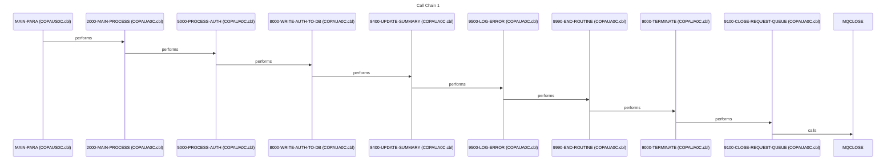

### Flow 2

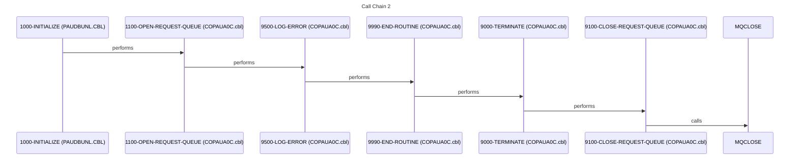

### Flow 3

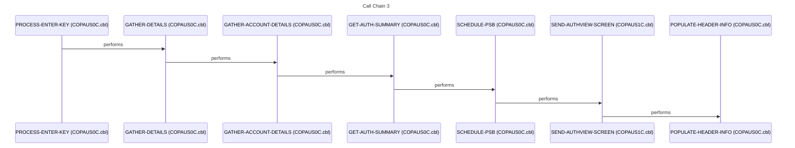

### Flow 4

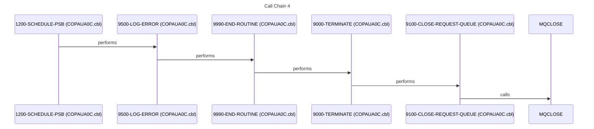

### Flow 5

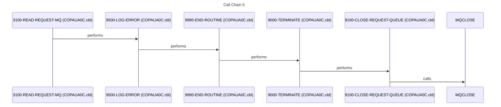

### Flow 6

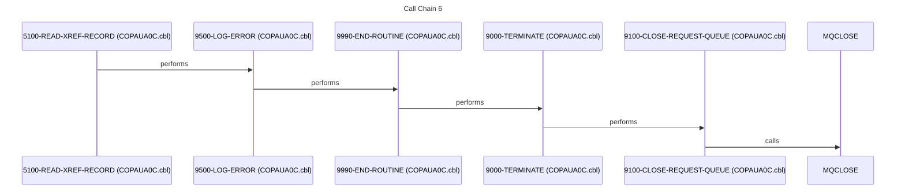

### Flow 7

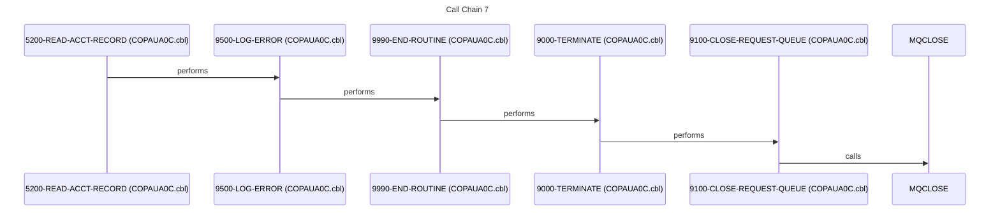

### Flow 8

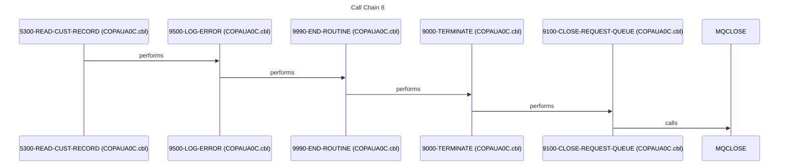

### Flow 9

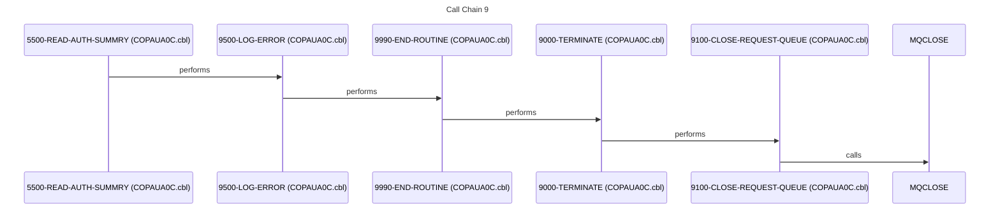

### Flow 10

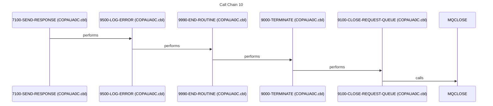
