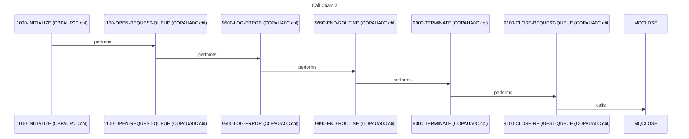
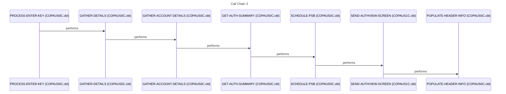
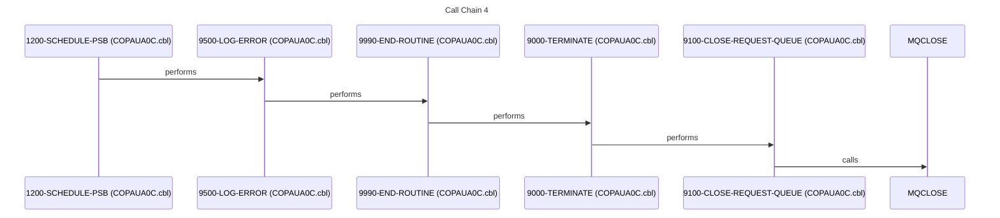
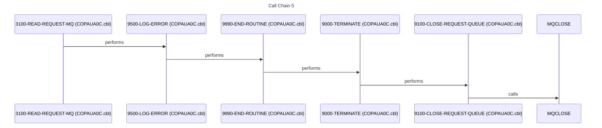

# System Design Document

## 1. Executive Summary

This system, driven by the TicketOrchestrator, revolves around the management and processing of authorization data, likely related to financial transactions or access control. Its primary mission is to efficiently handle authorization requests, validate them against various data sources, and persist the results for auditing and reporting. The system caters to internal users who need to manage and analyze authorization data, as well as external systems that rely on the authorization decisions made by this system. The core functionality involves receiving authorization requests, enriching them with data from customer, account, and cross-reference databases, applying business rules to make authorization decisions, and then recording these decisions in a database.

The system's major capabilities include processing authorization requests from an MQ queue, retrieving related data from IMS databases and sequential files, applying complex business rules to determine approval or denial, and generating response messages. Key workflows involve reading authorization requests from [MQ Series](https://www.ibm.com/products/mq), accessing customer and account information, validating authorization rules, and updating authorization summaries. The system also includes batch processes for unloading and loading IMS databases, ensuring data integrity and availability. The online CICS components provide interactive screens for viewing and managing authorization data.

The technical foundation of this system is built upon a combination of COBOL programs, JCL scripts, IMS databases, and MQ Series messaging. COBOL programs handle the core business logic and data manipulation, while JCL scripts automate batch processes for data loading and unloading. IMS databases store critical authorization data, and MQ Series provides a reliable messaging infrastructure for receiving authorization requests and sending responses. The system leverages [CBLTDLI](https://www.ibm.com/docs/en/ims/15?topic=interface-cbltdli-call-interface) calls to interact with the IMS databases. The [DFSRRC00](https://www.ibm.com/docs/en/ims/15?topic=utilities-dfsrrc00) utility is used for database operations within the JCL jobs.

The system's inputs include authorization requests received via MQ Series, data from customer, account, and cross-reference databases, and user input from CICS screens. The outputs include authorization responses sent via MQ Series, updated authorization data in IMS databases, and reports generated from the authorization data. The system integrates with external systems through MQ Series for receiving requests and sending responses, and through database connections for accessing customer and account information. The system also interacts with CICS for online transaction processing.

This system is crucial for ensuring secure and compliant authorization processing within the organization. If the system were to fail, authorization requests could not be processed, leading to potential financial losses, security breaches, and regulatory non-compliance. The system supports key business metrics such as authorization approval rates, fraud detection rates, and transaction processing times. The system's reliability and performance are essential for maintaining customer trust and ensuring the smooth operation of the business. The system also provides valuable data for auditing and reporting purposes, enabling the organization to meet its regulatory obligations.

### 2. Architecture Overview

The system architecture is a hybrid, incorporating both batch and online (CICS) components. Batch jobs are used for data extraction, loading, and maintenance of the IMS databases. Online CICS transactions provide interactive screens for users to view and manage authorization data. The system uses MQ Series for asynchronous communication, allowing external systems to submit authorization requests and receive responses.

**Entry Points and Interfaces:**

*   **MQ Series**: Receives authorization requests and sends responses.
*   **CICS Transactions**: Provides user interface for viewing and managing authorization data.
*   **JCL Jobs**: Automates batch processes for data loading, unloading, and maintenance.

**Integration Patterns:**

*   **Batch**: Data extraction, transformation, and loading (ETL) processes using JCL and COBOL.
*   **Online**: CICS transactions for real-time data access and manipulation.
*   **Database**: IMS database access using [CBLTDLI](https://www.ibm.com/docs/en/ims/15?topic=interface-cbltdli-call-interface) calls.
*   **Messaging**: Asynchronous communication using MQ Series.

**Architectural Patterns:**

*   **Layered Architecture**: Separation of concerns between presentation (CICS), business logic (COBOL), and data access (IMS).
*   **Batch Processing Pipeline**: JCL jobs orchestrate a series of COBOL programs for data processing.

```mermaid
flowchart TD

    subgraph jobs[" "]
        CBPAUP0J([CBPAUP0J])
        DBPAUTP0([DBPAUTP0])
        PAUDBUNL([PAUDBUNL])
    end

    subgraph procs[" "]
        CBPAUP0C[CBPAUP0C]
        CCPAUERY[/CCPAUERY/]
        CCPAURLY[/CCPAURLY/]
        CCPAURQY[/CCPAURQY/]
        CIPAUDTY[/CIPAUDTY/]
        CIPAUSMY[/CIPAUSMY/]
        COPAU00[/COPAU00/]
        COPAU01[/COPAU01/]
        COPAUA0C[COPAUA0C]
        COPAUS0C[COPAUS0C]
        COPAUS1C[COPAUS1C]
        COPAUS2C[COPAUS2C]
        DBUNLDGS[DBUNLDGS]
        IMSFUNCS[/IMSFUNCS/]
        PADFLPCB[/PADFLPCB/]
        PASFLPCB[/PASFLPCB/]
        PAUDBLOD[PAUDBLOD]
        PAUTBPCB[/PAUTBPCB/]
    end

    subgraph external[" "]
        CBLTDLI>CBLTDLI]
        CDEMO_TO_PROGRAM>CDEMO-TO-PROGRAM]
        DFSRRC00>DFSRRC00]
        MQCLOSE>MQCLOSE]
        MQGET>MQGET]
        MQOPEN>MQOPEN]
        MQPUT1>MQPUT1]
        WS_PGM_AUTH_FRAUD>WS-PGM-AUTH-FRAUD]
    end

    %% Call relationships
    CBPAUP0C --> CBPAUP0C
    CBPAUP0C --> CBPAUP0C
    CBPAUP0C --> CBPAUP0C
    CBPAUP0C --> CBPAUP0C
    CBPAUP0C --> COPAUA0C
    CBPAUP0C --> COPAUA0C
    CBPAUP0C --> DBUNLDGS
    CBPAUP0C --> DBUNLDGS
    CBPAUP0C --> CBPAUP0C
    CBPAUP0C --> CBPAUP0C
    CBPAUP0C --> CBPAUP0C
    CBPAUP0C -.->|COPY| COPYBOOKS
    CBPAUP0C --> CBLTDLI
    CBPAUP0C --> CBLTDLI
    CBPAUP0C --> CBLTDLI
    CBPAUP0C --> CBLTDLI
    CBPAUP0J --> DFSRRC00
    CBPAUP0J --> DFSRRC00
    CBPAUP0J --> DFSRRC00
    CBPAUP0J --> DFSRRC00
    COPAUA0C --> COPAUA0C
    COPAUA0C --> COPAUA0C
    COPAUA0C --> COPAUA0C
    COPAUA0C --> COPAUA0C
    COPAUA0C --> COPAUA0C
    COPAUA0C --> COPAUA0C
    COPAUA0C --> COPAUA0C
    COPAUA0C --> COPAUA0C
    COPAUA0C --> COPAUA0C
    COPAUA0C --> COPAUA0C
    COPAUA0C --> COPAUA0C
    COPAUA0C --> COPAUA0C
    COPAUA0C --> COPAUA0C
    COPAUA0C --> COPAUA0C
    COPAUA0C --> COPAUA0C
    COPAUA0C --> COPAUA0C
    COPAUA0C --> COPAUA0C
    COPAUA0C --> COPAUA0C
    COPAUA0C --> COPAUA0C
    COPAUA0C --> COPAUA0C
    COPAUA0C --> COPAUA0C
    COPAUA0C --> COPAUA0C
    COPAUA0C --> COPAUA0C
    COPAUA0C --> COPAUA0C
    COPAUA0C --> COPAUA0C
    COPAUA0C --> COPAUA0C
    COPAUA0C --> COPAUA0C
    COPAUA0C --> COPAUA0C
    COPAUA0C -.->|COPY| COPYBOOKS
    COPAUA0C --> MQOPEN
    COPAUA0C --> MQGET
    COPAUA0C --> MQPUT1
    COPAUA0C --> MQCLOSE
    COPAUS0C --> COPAUS1C
    COPAUS0C --> COPAUS1C
    COPAUS0C --> COPAUS1C
    COPAUS0C --> COPAUS1C
    COPAUS0C --> COPAUS1C
    COPAUS0C --> COPAUS1C
    COPAUS0C --> COPAUS1C
    COPAUS0C --> COPAUS1C
    COPAUS0C --> COPAUS0C
    COPAUS0C --> COPAUS0C
    COPAUS0C --> COPAUS0C
    COPAUS0C --> COPAUS0C
    COPAUS0C --> COPAUS0C
    COPAUS0C --> COPAUS0C
    COPAUS0C --> COPAUS0C
    COPAUS0C --> COPAUS0C
    COPAUS0C --> COPAUS0C
    COPAUS0C --> COPAUS0C
    COPAUS0C --> COPAUS0C
    COPAUS0C --> COPAUS0C
    COPAUS0C --> COPAUS0C
    COPAUS0C --> COPAUS0C
    COPAUS0C --> COPAUS0C
    COPAUS0C --> COPAUS0C
    COPAUS0C --> COPAUS0C
    COPAUS0C --> COPAUS0C
    COPAUS0C --> COPAUS0C
    COPAUS0C --> COPAUS0C
    COPAUS0C --> COPAUS0C
    COPAUS0C --> COPAUS0C
    COPAUS0C --> COPAUS0C
    COPAUS0C --> COPAUS0C
    COPAUS0C --> COPAUS0C
    COPAUS0C --> COPAUS0C
    COPAUS0C --> COPAUS0C
    COPAUS0C -.->|COPY| COPYBOOKS
    COPAUS0C --> CDEMO_TO_PROGRAM
    COPAUS0C --> CDEMO_TO_PROGRAM
    COPAUS0C --> CDEMO_TO_PROGRAM
    COPAUS1C --> COPAUS1C
    COPAUS1C --> COPAUS1C
    COPAUS1C --> COPAUS1C
    COPAUS1C --> COPAUS1C
    COPAUS1C --> COPAUS0C
    COPAUS1C --> COPAUS0C
    COPAUS1C --> COPAUS1C
    COPAUS1C --> COPAUS1C
    COPAUS1C --> COPAUS1C
    COPAUS1C --> COPAUS1C
    COPAUS1C --> COPAUS1C
    COPAUS1C -.->|COPY| COPYBOOKS
    COPAUS1C --> WS_PGM_AUTH_FRAUD
    COPAUS2C --> CBPAUP0C
    COPAUS2C --> CBPAUP0C
    COPAUS2C --> DBUNLDGS
    COPAUS2C --> COPAUS0C
    COPAUS2C --> COPAUS0C
    COPAUS2C --> COPAUS1C
    COPAUS2C --> COPAUS1C
    COPAUS2C --> COPAUS1C
    COPAUS2C --> COPAUS0C
    COPAUS2C --> COPAUA0C
    COPAUS2C --> COPAUA0C
    COPAUS2C --> PAUDBLOD
    COPAUS2C --> PAUDBLOD
    COPAUS2C --> CBPAUP0C
    COPAUS2C --> CBPAUP0C
    COPAUS2C --> CBPAUP0C
    COPAUS2C --> CBPAUP0C
    COPAUS2C --> CBPAUP0C
    COPAUS2C --> COPAUS0C
    COPAUS2C --> COPAUS0C
    COPAUS2C --> COPAUS0C
    COPAUS2C --> COPAUS0C
    COPAUS2C --> COPAUS2C
    COPAUS2C -.->|COPY| COPYBOOKS
    DBPAUTP0 --> DFSRRC00
    DBUNLDGS --> CBPAUP0C
    DBUNLDGS --> CBPAUP0C
    DBUNLDGS -.->|COPY| COPYBOOKS
    DBUNLDGS --> CBLTDLI
    DBUNLDGS --> CBLTDLI
    PAUDBLOD --> PAUDBLOD
    PAUDBLOD --> CBPAUP0C
    PAUDBLOD --> PAUDBLOD
    PAUDBLOD --> PAUDBLOD
    PAUDBLOD --> CBPAUP0C
    PAUDBLOD --> CBPAUP0C
    PAUDBLOD -.->|COPY| COPYBOOKS
    PAUDBLOD --> CBLTDLI
    PAUDBLOD --> CBLTDLI
    PAUDBLOD --> CBLTDLI
    PAUDBUNL -.->|COPY| COPYBOOKS

    %% Styling
    classDef entryPoint fill:#90EE90,stroke:#228B22
    class CBPAUP0J,DBPAUTP0,LOADPADB,PAUDBUNL,UNLDGSAM,UNLDPADB entryPoint
    classDef missing fill:#1E3A5F,stroke:#2E5A8F,color:#FFFFFF
    class CBLTDLI,CDEMO_TO_PROGRAM,DFSRRC00,MQCLOSE,MQGET,MQOPEN,MQPUT1,WS_PGM_AUTH_FRAUD missing
```

### 3. Component Catalog

| Component | Type | Purpose | Dependencies | Doc Link |
|---|---|---|---|---|
| [PAUDBUNL](cbl/PAUDBUNL.CBL.md) | COBOL | Unloads data from an IMS database. | [PAUTBPCB](cpy/PAUTBPCB.CPY.md), [CIPAUDTY](cpy/CIPAUDTY.cpy.md), [CIPAUSMY](cpy/CIPAUSMY.cpy.md), [IMSFUNCS](cpy/IMSFUNCS.cpy.md) | [PAUDBUNL](cbl/PAUDBUNL.CBL.md) |
| [COPAUS1C](cbl/COPAUS1C.cbl.md) | COBOL | Processes authorization requests and updates IMS database. | [COPAUS0C](cbl/COPAUS0C.cbl.md), [CIPAUSMY](cpy/CIPAUSMY.cpy.md), [CIPAUDTY](cpy/CIPAUDTY.cpy.md) | [COPAUS1C](cbl/COPAUS1C.cbl.md) |
| [COPAUA0C](cbl/COPAUA0C.cbl.md) | COBOL | CICS transaction program for authorization management. | [CIPAUSMY](cpy/CIPAUSMY.cpy.md), [CIPAUDTY](cpy/CIPAUDTY.cpy.md) | [COPAUA0C](cbl/COPAUA0C.cbl.md) |
| [PAUDBLOD](cbl/PAUDBLOD.CBL.md) | COBOL | Loads data into an IMS database. | [PAUTBPCB](cpy/PAUTBPCB.CPY.md), [CIPAUDTY](cpy/CIPAUDTY.cpy.md), [CIPAUSMY](cpy/CIPAUSMY.cpy.md), [IMSFUNCS](cpy/IMSFUNCS.cpy.md) | [PAUDBLOD](cbl/PAUDBLOD.CBL.md) |
| [DBUNLDGS](cbl/DBUNLDGS.CBL.md) | COBOL | Unloads data from an IMS database using GSAM. | [CIPAUDTY](cpy/CIPAUDTY.cpy.md), [CIPAUSMY](cpy/CIPAUSMY.cpy.md), [IMSFUNCS](cpy/IMSFUNCS.cpy.md) | [DBUNLDGS](cbl/DBUNLDGS.CBL.md) |
| [CBPAUP0C](cbl/CBPAUP0C.cbl.md) | COBOL | Main driver program for batch authorization processing. | [COPAUA0C](cbl/COPAUA0C.cbl.md), [DBUNLDGS](cbl/DBUNLDGS.CBL.md) | [CBPAUP0C](cbl/CBPAUP0C.cbl.md) |
| [COPAUS0C](cbl/COPAUS0C.cbl.md) | COBOL | CICS transaction program for authorization viewing. | [COPAUS1C](cbl/COPAUS1C.cbl.md) | [COPAUS0C](cbl/COPAUS0C.cbl.md) |
| [COPAUS2C](cbl/COPAUS2C.cbl.md) | COBOL | Processes authorization data and calls other programs. | [CBPAUP0C](cbl/CBPAUP0C.cbl.md), [COPAUS0C](cbl/COPAUS0C.cbl.md), [COPAUS1C](cbl/COPAUS1C.cbl.md), [COPAUA0C](cbl/COPAUA0C.cbl.md), [PAUDBLOD](cbl/PAUDBLOD.CBL.md) | [COPAUS2C](cbl/COPAUS2C.cbl.md) |
| [COPAU00](bms/COPAU00.bms.md) | BMS | BMS map definition for CICS screen. | - | [COPAU00](bms/COPAU00.bms.md) |
| [COPAU01](bms/COPAU01.bms.md) | BMS | BMS map definition for CICS screen. | - | [COPAU01](bms/COPAU01.bms.md) |
| [PADFLPCB](cpy/PADFLPCB.CPY.md) | COPY | Copybook for PCB definition. | - | [PADFLPCB](cpy/PADFLPCB.CPY.md) |
| [CIPAUSMY](cpy/CIPAUSMY.cpy.md) | COPY | Copybook for authorization data. | - | [CIPAUSMY](cpy/CIPAUSMY.cpy.md) |
| [CCPAURQY](cpy/CCPAURQY.cpy.md) | COPY | Copybook for request data. | - | [CCPAURQY](cpy/CCPAURQY.cpy.md) |
| [CIPAUDTY](cpy/CIPAUDTY.cpy.md) | COPY | Copybook for authorization details. | - | [CIPAUDTY](cpy/CIPAUDTY.cpy.md) |
| [PAUTBPCB](cpy/PAUTBPCB.CPY.md) | COPY | Copybook for PCB definition. | - | [PAUTBPCB](cpy/PAUTBPCB.CPY.md) |
| [PASFLPCB](cpy/PASFLPCB.CPY.md) | COPY | Copybook for PCB definition. | - | [PASFLPCB](cpy/PASFLPCB.CPY.md) |
| [IMSFUNCS](cpy/IMSFUNCS.cpy.md) | COPY | Copybook for IMS functions. | - | [IMSFUNCS](cpy/IMSFUNCS.cpy.md) |
| [CCPAUERY](cpy/CCPAUERY.cpy.md) | COPY | Copybook for error messages. | - | [CCPAUERY](cpy/CCPAUERY.cpy.md) |
| [CCPAURLY](cpy/CCPAURLY.cpy.md) | COPY | Copybook for list data. | - | [CCPAURLY](cpy/CCPAURLY.cpy.md) |
| [XAUTHFRD](ddl/XAUTHFRD.ddl.md) | DDL | DDL for XAUTHFRD table. | - | [XAUTHFRD](ddl/XAUTHFRD.ddl.md) |
| [AUTHFRDS](ddl/AUTHFRDS.ddl.md) | DDL | DDL for AUTHFRDS table. | - | [AUTHFRDS](ddl/AUTHFRDS.ddl.md) |
| [DBPAUTP0](ims/DBPAUTP0.dbd.md) | DBD | DBD for IMS database. | - | [DBPAUTP0](ims/DBPAUTP0.dbd.md) |
| [DBPAUTX0](ims/DBPAUTX0.dbd.md) | DBD | DBD for IMS database. | - | [DBPAUTX0](ims/DBPAUTX0.dbd.md) |
| [PADFLDBD](ims/PADFLDBD.DBD.md) | DBD | DBD for IMS database. | - | [PADFLDBD](ims/PADFLDBD.DBD.md) |
| [PSBPAUTL](ims/PSBPAUTL.psb.md) | PSB | PSB for IMS program. | - | [PSBPAUTL](ims/PSBPAUTL.psb.md) |
| [PSBPAUTB](ims/PSBPAUTB.psb.md) | PSB | PSB for IMS program. | - | [PSBPAUTB](ims/PSBPAUTB.psb.md) |
| [PASFLDBD](ims/PASFLDBD.DBD.md) | DBD | DBD for IMS database. | - | [PASFLDBD](ims/PASFLDBD.DBD.md) |
| [PAUTBUNL](ims/PAUTBUNL.PSB.md) | PSB | PSB for IMS program. | - | [PAUTBUNL](ims/PAUTBUNL.PSB.md) |
| [DLIGSAMP](ims/DLIGSAMP.PSB.md) | PSB | PSB for IMS program. | - | [DLIGSAMP](ims/DLIGSAMP.PSB.md) |
| [COPAU00](cpy-bms/COPAU00.cpy.md) | COPY | Copybook for BMS map. | - | [COPAU00](cpy-bms/COPAU00.cpy.md) |
| [COPAU01](cpy-bms/COPAU01.cpy.md) | COPY | Copybook for BMS map. | - | [COPAU01](cpy-bms/COPAU01.cpy.md) |
| [UNLDPADB](jcl/UNLDPADB.JCL.md) | JCL | JCL to unload IMS database. | [PAUDBUNL](cbl/PAUDBUNL.CBL.md) | [UNLDPADB](jcl/UNLDPADB.JCL.md) |
| [LOADPADB](jcl/LOADPADB.JCL.md) | JCL | JCL to load IMS database. | [PAUDBLOD](cbl/PAUDBLOD.CBL.md) | [LOADPADB](jcl/LOADPADB.JCL.md) |
| [UNLDGSAM](jcl/UNLDGSAM.JCL.md) | JCL | JCL to unload IMS database using GSAM. | [DBUNLDGS](cbl/DBUNLDGS.CBL.md) | [UNLDGSAM](jcl/UNLDGSAM.JCL.md) |
| [DBPAUTP0](jcl/DBPAUTP0.jcl.md) | JCL | JCL to run IMS program. | - | [DBPAUTP0](jcl/DBPAUTP0.jcl.md) |
| [CBPAUP0J](jcl/CBPAUP0J.jcl.md) | JCL | JCL to run batch authorization processing. | [CBPAUP0C](cbl/CBPAUP0C.cbl.md) | [CBPAUP0J](jcl/CBPAUP0J.jcl.md) |

### 4. Subsystem Breakdown

*   **Batch Processing Subsystem:**
    *   This subsystem is responsible for data extraction, transformation, and loading (ETL) processes. It uses JCL jobs to orchestrate COBOL programs for data processing.
    *   **Components:**
        *   [UNLDPADB](jcl/UNLDPADB.JCL.md): JCL job to unload the IMS database using [PAUDBUNL](cbl/PAUDBUNL.CBL.md).
        *   [LOADPADB](jcl/LOADPADB.JCL.md): JCL job to load the IMS database using [PAUDBLOD](cbl/PAUDBLOD.CBL.md).
        *   [UNLDGSAM](jcl/UNLDGSAM.JCL.md): JCL job to unload the IMS database using GSAM via [DBUNLDGS](cbl/DBUNLDGS.CBL.md).
        *   [CBPAUP0J](jcl/CBPAUP0J.jcl.md): JCL job to run the main batch authorization processing program [CBPAUP0C](cbl/CBPAUP0C.cbl.md).
        *   [PAUDBUNL](cbl/PAUDBUNL.CBL.md): COBOL program to unload data from the IMS database.
        *   [PAUDBLOD](cbl/PAUDBLOD.CBL.md): COBOL program to load data into the IMS database.
        *   [DBUNLDGS](cbl/DBUNLDGS.CBL.md): COBOL program to unload data from the IMS database using GSAM.
        *   [CBPAUP0C](cbl/CBPAUP0C.cbl.md): COBOL program that drives the batch authorization processing.

*   **Online/CICS Transaction Processing Subsystem:**
    *   This subsystem provides interactive screens for users to view and manage authorization data.
    *   **Components:**
        *   [COPAUA0C](cbl/COPAUA0C.cbl.md): CICS transaction program for authorization management.
        *   [COPAUS0C](cbl/COPAUS0C.cbl.md): CICS transaction program for authorization viewing.
        *   [COPAUS1C](cbl/COPAUS1C.cbl.md): COBOL program that processes authorization requests and updates the IMS database.
        *   [COPAU00](bms/COPAU00.bms.md): BMS map definition for CICS screen.
        *   [COPAU01](bms/COPAU01.bms.md): BMS map definition for CICS screen.

*   **IMS Database Subsystem:**
    *   This subsystem manages the storage and retrieval of authorization data using IMS databases.
    *   **Components:**
        *   [DBPAUTP0](ims/DBPAUTP0.dbd.md): DBD for IMS database.
        *   [DBPAUTX0](ims/DBPAUTX0.dbd.md): DBD for IMS database.
        *   [PADFLDBD](ims/PADFLDBD.DBD.md): DBD for IMS database.
        *   [PSBPAUTL](ims/PSBPAUTL.psb.md): PSB for IMS program.
        *   [PSBPAUTB](ims/PSBPAUTB.psb.md): PSB for IMS program.
        *   [PASFLDBD](ims/PASFLDBD.DBD.md): DBD for IMS database.
        *   [PAUTBUNL](ims/PAUTBUNL.PSB.md): PSB for IMS program.
        *   [DLIGSAMP](ims/DLIGSAMP.PSB.md): PSB for IMS program.

*   **Shared Services, Utilities, and Common Routines:**
    *   This subsystem provides common routines and utilities used by multiple programs.
    *   **Components:**
        *   [IMSFUNCS](cpy/IMSFUNCS.cpy.md): Copybook containing common IMS functions.
        *   [CIPAUSMY](cpy/CIPAUSMY.cpy.md): Copybook for authorization data.
        *   [CIPAUDTY](cpy/CIPAUDTY.cpy.md): Copybook for authorization details.

### 5. Data Architecture

*   **Data Stores:**
    *   **IMS Databases:** Primary data store for authorization data. Defined by [DBPAUTP0](ims/DBPAUTP0.dbd.md), [DBPAUTX0](ims/DBPAUTX0.dbd.md), [PADFLDBD](ims/PADFLDBD.DBD.md), and [PASFLDBD](ims/PASFLDBD.DBD.md).
    *   **Sequential Files:** Used for input and output of batch processes. ❓ QUESTION: What are the specific file names and formats?
    *   **MQ Series Queues:** Used for asynchronous communication of authorization requests and responses. ❓ QUESTION: What are the queue names and message formats?

*   **Data Flow:**
    *   Authorization requests are received via MQ Series.
    *   [COPAUS1C](cbl/COPAUS1C.cbl.md) processes the request and retrieves data from IMS databases.
    *   Business rules are applied to determine approval or denial.
    *   Authorization decisions are stored in the IMS databases.
    *   Authorization responses are sent via MQ Series.
    *   Batch jobs extract data from IMS databases, transform it, and load it into other systems or databases.

*   **Input Sources:**
    *   **MQ Series:** Authorization requests. ❓ QUESTION: What is the message format?
    *   **Sequential Files:** Input for batch processes. ❓ QUESTION: What are the file names and formats?

*   **Output Destinations:**
    *   **MQ Series:** Authorization responses. ❓ QUESTION: What is the message format?
    *   **IMS Databases:** Updated authorization data.
    *   **Sequential Files:** Output from batch processes. ❓ QUESTION: What are the file names and formats?

*   **Key Data Structures:**
    *   **CIPAUSMY**: Authorization data.
    *   **CIPAUDTY**: Authorization details.
    *   **CCPAURQY**: Request data.

### 6. Integration Points

*   **External System Interfaces:**
    *   **MQ Series:** Integration with external systems for receiving authorization requests and sending responses. ❓ QUESTION: What external systems integrate via MQ?
    *   **Database Connections:** Access to customer, account, and cross-reference databases. ❓ QUESTION: What are the database connection details and data access patterns?

*   **Batch Job Dependencies and Scheduling:**
    *   [UNLDPADB](jcl/UNLDPADB.JCL.md) must be run before [LOADPADB](jcl/LOADPADB.JCL.md).
    *   [CBPAUP0J](jcl/CBPAUP0J.jcl.md) is scheduled to run periodically to process authorization data. ❓ QUESTION: What is the scheduling frequency and dependencies?

*   **Database Connections and Access Patterns:**
    *   COBOL programs use [CBLTDLI](https://www.ibm.com/docs/en/ims/15?topic=interface-cbltdli-call-interface) calls to access IMS databases.
    *   Batch jobs use [DFSRRC00](https://www.ibm.com/docs/en/ims/15?topic=utilities-dfsrrc00) to perform database operations.

*   **File Transfers and Data Exchanges:**
    *   Batch jobs extract data from IMS databases and load it into sequential files.
    *   Sequential files are used as input for other systems or processes. ❓ QUESTION: What systems consume the output files?

### 7. Business Rules Summary

❓ QUESTION: The provided documentation does not explicitly list business rules. Further investigation is needed to identify and document the business rules implemented in the COBOL programs.

*   Authorization approval/denial logic.
*   Fraud detection rules.
*   Data validation rules.
*   Access control rules.

### 8. Error Handling Patterns

*   **Error Logging:**
    *   Programs use [9500-LOG-ERROR](cbl/COPAUA0C.cbl.md) to log errors to a log file or database. ❓ QUESTION: What is the format and destination of the error logs?
    *   Copybook [CCPAUERY](cpy/CCPAUERY.cpy.md) is used for error messages.
*   **Recovery Procedures:**
    *   Batch jobs use checkpoint/restart logic to recover from failures. ❓ QUESTION: What are the specific checkpoint/restart procedures?
    *   CICS transactions use rollback logic to undo changes in case of errors. ❓ QUESTION: What are the specific rollback procedures?
*   **Abend Handling:**
    *   Programs use [9999-ABEND](cbl/COPAUA0C.cbl.md) to terminate abnormally in case of unrecoverable errors. ❓ QUESTION: What are the abend codes and their meanings?

### 9. Open Questions and Uncertainties

*   ❓ QUESTION: What are the specific file names and formats for sequential files used in batch processes?
*   ❓ QUESTION: What are the queue names and message formats for MQ Series communication?
*   ❓ QUESTION: What external systems integrate via MQ?
*   ❓ QUESTION: What are the database connection details and data access patterns for accessing customer, account, and cross-reference databases?
*   ❓ QUESTION: What is the scheduling frequency and dependencies for batch jobs?
*   ❓ QUESTION: The provided documentation does not explicitly list business rules. Further investigation is needed to identify and document the business rules implemented in the COBOL programs.
*   ❓ QUESTION: What is the format and destination of the error logs?
*   ❓ QUESTION: What are the specific checkpoint/restart procedures for batch jobs?
*   ❓ QUESTION: What are the specific rollback procedures for CICS transactions?
*   ❓ QUESTION: What are the abend codes and their meanings?

## Flows

The following sequence diagrams illustrate key call sequences identified in the codebase, showing how programs interact during execution.

### Flow 1

### Flow 2

### Flow 3

### Flow 4

### Flow 5

