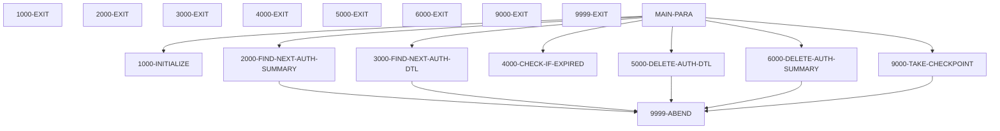
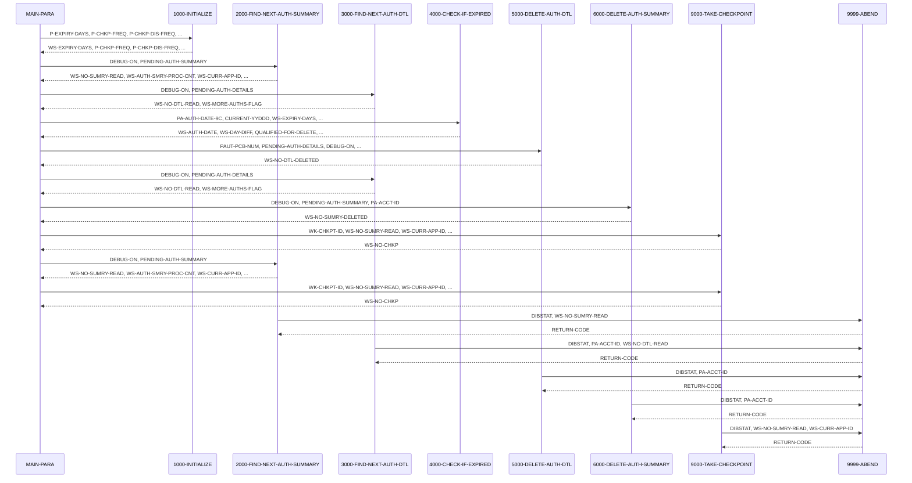

# CBPAUP0C

**File**: `cbl/CBPAUP0C.cbl`
**Type**: FileType.COBOL
**Analyzed**: 2026-02-03 21:06:57.273145

## Purpose

This COBOL batch IMS program, CBPAUP0C, deletes expired pending authorization messages from the IMS database. It reads pending authorization summary and detail segments, checks if the authorization has expired based on a configurable expiry period, and deletes the expired detail segments. It also deletes the summary segment if all its detail segments have been deleted, and takes checkpoints periodically.

**Business Context**: This program is part of the CardDemo application and is used to purge expired authorization data, likely to maintain data storage and improve performance.

## Inputs

| Name | Type | Description |
|------|------|-------------|
| PAUTSUM0 | IOType.IMS_SEGMENT | Pending Authorization Summary segment from IMS database, containing summary information about pending authorizations. |
| PAUTDTL1 | IOType.IMS_SEGMENT | Pending Authorization Detail segment from IMS database, containing detailed information about individual pending authorizations. |
| SYSIN | IOType.PARAMETER | System input parameters including expiry days, checkpoint frequency, checkpoint display frequency, and debug flag. |

## Business Rules

- **BR001**: Determine if an authorization detail is expired based on the difference between the current date and the authorization date, compared to the expiry days parameter.
- **BR002**: Adjust summary counts and amounts based on whether the authorization was approved or declined before deleting the detail record.
- **BR003**: Delete the authorization summary if both approved and declined authorization counts are zero.

## Paragraphs/Procedures

### MAIN-PARA
This is the main control paragraph for the CBPAUP0C program. It orchestrates the deletion of expired pending authorization messages. It begins by calling 1000-INITIALIZE to set up the program environment, including accepting parameters from SYSIN and initializing variables. Then, it enters a loop that continues until either an error flag is set or the end of the authorization database is reached. Inside this loop, it retrieves the next authorization summary using 2000-FIND-NEXT-AUTH-SUMMARY. For each summary, it retrieves authorization details using 3000-FIND-NEXT-AUTH-DTL in an inner loop. The 4000-CHECK-IF-EXPIRED paragraph determines if each detail record is expired. If a detail record is expired, 5000-DELETE-AUTH-DTL is called to delete it, and the summary counts are adjusted. After processing all details for a summary, 6000-DELETE-AUTH-SUMMARY is called to delete the summary if all details have been removed. Checkpoints are taken periodically using 9000-TAKE-CHECKPOINT based on the P-CHKP-FREQ parameter to prevent excessive rollback in case of failure. Finally, the program displays summary statistics and terminates.

### 1000-INITIALIZE
This paragraph initializes the program environment. It accepts the current date and Julian date from the system using ACCEPT statements. It then accepts parameters from SYSIN into the PRM-INFO group item, displaying these parameters for debugging purposes. It validates the P-EXPIRY-DAYS parameter, defaulting to 5 if the input is non-numeric. Similarly, it validates P-CHKP-FREQ and P-CHKP-DIS-FREQ, defaulting to 5 and 10 respectively if the input is invalid. Finally, it ensures that the P-DEBUG-FLAG is either 'Y' or 'N', defaulting to 'N' if it is not 'Y'. This paragraph ensures that the program has valid configuration settings before proceeding with the main processing logic. No error handling is explicitly performed in this paragraph, but invalid input values are handled by assigning default values.

### 2000-FIND-NEXT-AUTH-SUMMARY
This paragraph retrieves the next pending authorization summary segment from the IMS database. It uses the EXEC DLI GN command with the PAUTSUM0 segment name to fetch the next summary record into the PENDING-AUTH-SUMMARY area. Before the GET NEXT call, if the DEBUG-ON flag is set, it displays the current number of summary records read. After the call, it evaluates the DIBSTAT return code. If DIBSTAT is '  ', it sets the NOT-END-OF-AUTHDB flag to TRUE, increments the summary read count (WS-NO-SUMRY-READ), increments the summary process count (WS-AUTH-SMRY-PROC-CNT), and moves the account ID (PA-ACCT-ID) to WS-CURR-APP-ID. If DIBSTAT is 'GB', it sets the END-OF-AUTHDB flag to TRUE, indicating the end of the database. If DIBSTAT is any other value, it displays an error message with the DIBSTAT code and the number of summary records read before abending, then calls 9999-ABEND to terminate the program. This paragraph handles IMS database access and error conditions related to reading summary segments.

### 3000-FIND-NEXT-AUTH-DTL
This paragraph retrieves the next pending authorization detail segment from the IMS database. It uses the EXEC DLI GNP command with the PAUTDTL1 segment name to fetch the next detail record into the PENDING-AUTH-DETAILS area. Before the GET NEXT WITHIN PARENT call, if the DEBUG-ON flag is set, it displays the current number of detail records read. After the call, it evaluates the DIBSTAT return code. If DIBSTAT is '  ', it sets the MORE-AUTHS flag to TRUE and increments the detail read count (WS-NO-DTL-READ). If DIBSTAT is 'GE' or 'GB', it sets the NO-MORE-AUTHS flag to TRUE, indicating either the end of the parent or the end of the database. If DIBSTAT is any other value, it displays an error message with the DIBSTAT code, the summary account ID (PA-ACCT-ID), and the number of detail records read before abending, then calls 9999-ABEND to terminate the program. This paragraph handles IMS database access and error conditions related to reading detail segments.

### 4000-CHECK-IF-EXPIRED
This paragraph determines if a pending authorization detail record has expired. It calculates the authorization date (WS-AUTH-DATE) by subtracting the PA-AUTH-DATE-9C field from 99999. It then calculates the difference (WS-DAY-DIFF) between the current Julian date (CURRENT-YYDDD) and the calculated authorization date. If this difference is greater than or equal to the expiry days (WS-EXPIRY-DAYS), the QUALIFIED-FOR-DELETE flag is set to TRUE. Before setting the flag, it checks the PA-AUTH-RESP-CODE. If it is '00' (approved), it decrements the approved authorization count (PA-APPROVED-AUTH-CNT) and amount (PA-APPROVED-AUTH-AMT) in the summary record. Otherwise (declined), it decrements the declined authorization count (PA-DECLINED-AUTH-CNT) and amount (PA-DECLINED-AUTH-AMT) in the summary record. If the authorization is not expired, the NOT-QUALIFIED-FOR-DELETE flag is set to TRUE. This paragraph implements the core business rule for determining authorization expiry and updates the summary record accordingly.

### 5000-DELETE-AUTH-DTL
This paragraph deletes a pending authorization detail segment from the IMS database. It uses the EXEC DLI DLET command with the PAUTDTL1 segment name to delete the current detail record. Before the delete call, if the DEBUG-ON flag is set, it displays the account ID (PA-ACCT-ID) of the record being deleted. After the call, it checks the DIBSTAT return code. If DIBSTAT is SPACES, it increments the detail deleted count (WS-NO-DTL-DELETED). Otherwise, it displays an error message with the DIBSTAT code and the account ID, then calls 9999-ABEND to terminate the program. This paragraph handles the physical deletion of detail segments from the IMS database and associated error handling.

### 6000-DELETE-AUTH-SUMMARY
This paragraph deletes a pending authorization summary segment from the IMS database. It uses the EXEC DLI DLET command with the PAUTSUM0 segment name to delete the current summary record. Before the delete call, if the DEBUG-ON flag is set, it displays the account ID (PA-ACCT-ID) of the record being deleted. After the call, it checks the DIBSTAT return code. If DIBSTAT is SPACES, it increments the summary deleted count (WS-NO-SUMRY-DELETED). Otherwise, it displays an error message with the DIBSTAT code and the account ID, then calls 9999-ABEND to terminate the program. This paragraph handles the physical deletion of summary segments from the IMS database and associated error handling.

### 9000-TAKE-CHECKPOINT
This paragraph takes an IMS checkpoint. It uses the EXEC DLI CHKP command with a unique checkpoint ID (WK-CHKPT-ID). After the checkpoint call, it checks the DIBSTAT return code. If DIBSTAT is SPACES, it increments the checkpoint count (WS-NO-CHKP). If the checkpoint count reaches the checkpoint display frequency (P-CHKP-DIS-FREQ), it resets the checkpoint count to zero and displays a success message with the current authorization count (WS-NO-SUMRY-READ) and application ID (WS-CURR-APP-ID). If DIBSTAT is not SPACES, it displays an error message with the DIBSTAT code, the record count, and the application ID, then calls 9999-ABEND to terminate the program. This paragraph ensures that the program can be restarted from a known point in case of failure, minimizing data loss and reprocessing time.

### 9999-ABEND
This paragraph handles program termination due to an error condition. It displays a message indicating that the program is abending. It sets the RETURN-CODE to 16, indicating an abnormal termination. Finally, it executes a GOBACK statement to return control to the calling environment. This paragraph provides a consistent and controlled way to terminate the program when an unrecoverable error occurs.

## Dead Code

The following artifacts were identified as dead code by static analysis:

| Artifact | Type | Line | Reason |
|----------|------|------|--------|
| 9999-EXIT | paragraph | 385 | Paragraph '9999-EXIT' is never PERFORMed or referenced by any other paragraph or program |

## Control Flow

## Open Questions

- ? What is the structure of the IMS database being accessed?
  - Context: The program uses IMS DL/I calls, but the PSB and DBD are not available to determine the exact database structure and relationships.

## Sequence Diagram

