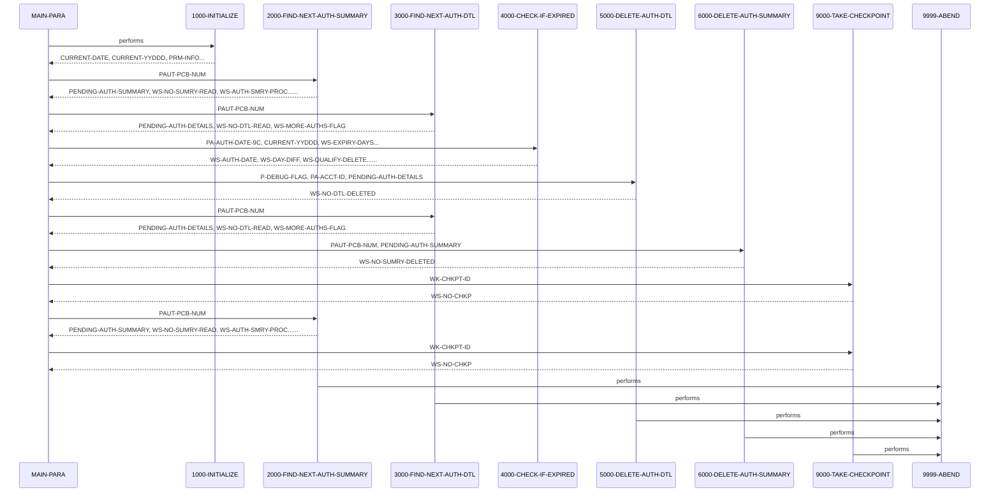

# CBPAUP0C

**File:** cbl/CBPAUP0C.cbl
**Type:** COBOL
**Status:** In Progress
**Iterations:** 1
**Analyzed:** 2026-01-30 19:46:38.329060

## Purpose

Batch IMS program that traverses the authorization database, reads pending authorization summary segments (PAUTSUM0), and for each, reads child detail segments (PAUTDTL1). It checks each detail for expiry based on days since authorization date exceeding a parameter-driven threshold, deletes expired details via DLI DLET, adjusts in-memory summary counters accordingly, and deletes the parent summary if both approved and declined auth counts reach zero after processing all details. Periodically takes IMS checkpoints and displays processing statistics at end.

**Business Context:** CardDemo Authorization Module: Cleanup of expired pending authorization messages to maintain database hygiene by removing stale transaction details and empty summaries.
**Program Type:** BATCH
**Citations:** Lines 3, 4, 5, 136, 140, 142, 144, 156, 169

## Calling Context

**Linkage Section:** IO-PCB-MASK, PGM-PCB-MASK

## Inputs

### PRM-INFO
- **Type:** PARAMETER
- **Description:** Command line parameters from SYSIN containing expiry days (P-EXPIRY-DAYS), checkpoint frequency (P-CHKP-FREQ), display frequency (P-CHKP-DIS-FREQ), and debug flag (P-DEBUG-FLAG)
- **Lines:** 189

### PENDING-AUTH-SUMMARY
- **Type:** IMS_SEGMENT
- **Description:** Root segment PAUTSUM0 containing summary data like PA-ACCT-ID, PA-APPROVED-AUTH-CNT, PA-DECLINED-AUTH-CNT, etc., read via GN calls
- **Copybook:** [CIPAUSMY](../copybooks/CIPAUSMY.cpy.md)
- **Lines:** 223, 256

### PENDING-AUTH-DETAILS
- **Type:** IMS_SEGMENT
- **Description:** Child segment PAUTDTL1 under current summary, containing details like PA-AUTH-DATE-9C, PA-AUTH-RESP-CODE, PA-TRANSACTION-AMT, read via GNP calls
- **Copybook:** [CIPAUDTY](../copybooks/CIPAUDTY.cpy.md)
- **Lines:** 255

## Outputs

### PENDING-AUTH-DETAILS
- **Type:** IMS_SEGMENT
- **Description:** Deletion of expired PAUTDTL1 segments via DLI DLET (no inserts/updates)
- **Copybook:** [CIPAUDTY](../copybooks/CIPAUDTY.cpy.md)
- **Lines:** 310

### PENDING-AUTH-SUMMARY
- **Type:** IMS_SEGMENT
- **Description:** Deletion of PAUTSUM0 segments with zero counts after detail processing via DLI DLET (no inserts/updates to counters; adjustments are in-memory only for delete decision)
- **Copybook:** [CIPAUSMY](../copybooks/CIPAUSMY.cpy.md)
- **Lines:** 335

### CHECKPOINT
- **Type:** OTHER
- **Description:** IMS checkpoints taken periodically via DLI CHKP to ensure transaction integrity
- **Lines:** 355

### PROCESSING STATISTICS
- **Type:** REPORT
- **Description:** Console DISPLAY of counts: summaries read/deleted, details read/deleted
- **Lines:** 173, 174, 175, 176

## Business Rules

### BR001: Delete detail segment if days elapsed since authorization date (CURRENT-YYDDD - (99999 - PA-AUTH-DATE-9C)) >= P-EXPIRY-DAYS (default 5)
**Logic:** Compute WS-DAY-DIFF and set QUALIFIED-FOR-DELETE if >= WS-EXPIRY-DAYS; adjust in-memory summary counters based on PA-AUTH-RESP-CODE ('00' approved else declined)
**Conditions:** WS-DAY-DIFF >= WS-EXPIRY-DAYS, PA-AUTH-RESP-CODE = '00'
**Lines:** 280, 282, 284, 287, 291

### BR002: Delete summary segment after all details processed if PA-APPROVED-AUTH-CNT <= 0 (note: code has duplicate condition, likely intended PA-DECLINED-AUTH-CNT <=0 also)
**Logic:** Check after detail loop; code as-is: PA-APPROVED-AUTH-CNT <=0 AND PA-APPROVED-AUTH-CNT <=0
**Conditions:** PA-APPROVED-AUTH-CNT <= 0
**Lines:** 156

### BR003: Take IMS checkpoint every P-CHKP-FREQ (default 5) summaries processed; display status every P-CHKP-DIS-FREQ (default 10) checkpoints
**Logic:** Increment WS-AUTH-SMRY-PROC-CNT; call 9000 if > P-CHKP-FREQ; reset counter
**Conditions:** WS-AUTH-SMRY-PROC-CNT > P-CHKP-FREQ, WS-NO-CHKP >= P-CHKP-DIS-FREQ
**Lines:** 160, 361

## Copybooks Used

| Copybook | Location | Purpose | Line |
|----------|----------|---------|------|
| [CIPAUSMY](../copybooks/CIPAUSMY.cpy.md) | WORKING_STORAGE | Defines layout of PENDING-AUTH-SUMMARY (PAUTSUM0 root segment) including PA-ACCT-ID, counters for approved/declined auths | 117 |
| [CIPAUDTY](../copybooks/CIPAUDTY.cpy.md) | WORKING_STORAGE | Defines layout of PENDING-AUTH-DETAILS (PAUTDTL1 child segment) including PA-AUTH-DATE-9C, PA-AUTH-RESP-CODE, amounts | 121 |

## Data Flow

### Reads From
- **PENDING-AUTH-SUMMARY**: PA-ACCT-ID, PA-APPROVED-AUTH-CNT, PA-APPROVED-AUTH-AMT, PA-DECLINED-AUTH-CNT, PA-DECLINED-AUTH-AMT
  (Lines: 233, 156, 287)
- **PENDING-AUTH-DETAILS**: PA-AUTH-DATE-9C, PA-AUTH-RESP-CODE, PA-APPROVED-AMT, PA-TRANSACTION-AMT
  (Lines: 280, 287, 289, 292)

### Writes To
- **PENDING-AUTH-DETAILS**: (entire segment deleted)
  (Lines: 310)
- **PENDING-AUTH-SUMMARY**: (entire segment deleted)
  (Lines: 335)

### Transformations
- **PA-AUTH-DATE-9C** → **WS-AUTH-DATE**: WS-AUTH-DATE = 99999 - PA-AUTH-DATE-9C to convert packed date to YYDDD format
  (Lines: 280)
- **CURRENT-YYDDD, WS-AUTH-DATE** → **WS-DAY-DIFF**: WS-DAY-DIFF = CURRENT-YYDDD - WS-AUTH-DATE to compute days since authorization
  (Lines: 282)
- **PA-APPROVED-AUTH-CNT, PA-APPROVED-AUTH-AMT** → **PA-APPROVED-AUTH-CNT, PA-APPROVED-AUTH-AMT**: In-memory subtraction if approved and expired: SUBTRACT 1 FROM CNT, AMT FROM PA-APPROVED-AUTH-AMT (not persisted)
  (Lines: 288, 289)
- **PA-DECLINED-AUTH-CNT, PA-DECLINED-AUTH-AMT** → **PA-DECLINED-AUTH-CNT, PA-DECLINED-AUTH-AMT**: In-memory subtraction if declined and expired: SUBTRACT 1 FROM CNT, PA-TRANSACTION-AMT FROM AMT (not persisted)
  (Lines: 291, 292)

## Key Paragraphs

### MAIN-PARA
**Purpose:** This is the primary orchestration paragraph that controls the entire program flow as the entry point after PROCEDURE DIVISION. It begins by performing 1000-INITIALIZE to accept parameters, set defaults, and prepare variables from date and SYSIN. It then enters the main processing loop by first performing 2000-FIND-NEXT-AUTH-SUMMARY to GU the first summary segment. The loop continues until ERR-FLG-ON or END-OF-AUTHDB, nested with a detail loop via 3000-FIND-NEXT-AUTH-DTL until NO-MORE-AUTHS, where each detail is checked for expiry in 4000-CHECK-IF-EXPIRED and deleted via 5000-DELETE-AUTH-DTL if qualified. After all details for a summary, it checks if summary counters <=0 (approved cnt) and deletes via 6000-DELETE-AUTH-SUMMARY if so. Periodically checks WS-AUTH-SMRY-PROC-CNT against P-CHKP-FREQ to perform 9000-TAKE-CHECKPOINT and resets counter. After loop exit, takes final checkpoint, displays aggregate statistics (reads/deletes for summary/details), and GOBACKs. No explicit error handling here beyond loop conditions relying on subordinate abends. It consumes IMS PCB masks from LINKAGE, parameters, and date; produces deletions and checkpoints; implements business logic for expiry cleanup traversal.
- Calls: 1000-INITIALIZE, 2000-FIND-NEXT-AUTH-SUMMARY, 3000-FIND-NEXT-AUTH-DTL, 4000-CHECK-IF-EXPIRED, 5000-DELETE-AUTH-DTL, 6000-DELETE-AUTH-SUMMARY, 9000-TAKE-CHECKPOINT
- Lines: 136-180

### 1000-INITIALIZE
**Purpose:** This initialization paragraph sets up program variables and parameters at startup. It accepts CURRENT-DATE from DATE and CURRENT-YYDDD from DAY for expiry calculations, then reads PRM-INFO from SYSIN containing expiry days, chkpt freq, dis freq, debug flag. Displays startup messages with parms and date. Validates and sets defaults: WS-EXPIRY-DAYS to P-EXPIRY-DAYS if numeric else 5; P-CHKP-FREQ to 5 if invalid; P-CHKP-DIS-FREQ to 10; P-DEBUG-FLAG to 'N' if not 'Y'. Consumes system date and SYSIN parameters; produces initialized WS-VARIABLES, PRM-INFO, and console displays. No business decisions beyond validation; no error handling (invalid parms use defaults); no calls made. Flow passes to 1000-EXIT.
- Called by: MAIN-PARA
- Lines: 183-211

### 1000-EXIT
**Purpose:** Standard exit paragraph that simply performs EXIT to return control to caller (MAIN-PARA). No inputs consumed, no outputs produced, no logic, no error handling, no calls. Serves as procedural delimiter after 1000-INITIALIZE logic.
- Lines: 212-213

### 2000-FIND-NEXT-AUTH-SUMMARY
**Purpose:** This paragraph retrieves the next root summary segment (PAUTSUM0) via DLI GN call into PENDING-AUTH-SUMMARY. If DEBUG-ON, displays read count. Evaluates DIBSTAT: '  ' sets NOT-END-OF-AUTHDB, increments WS-NO-SUMRY-READ and WS-AUTH-SMRY-PROC-CNT, moves PA-ACCT-ID to WS-CURR-APP-ID; 'GB' sets END-OF-AUTHDB; other statuses display error and perform 9999-ABEND. Consumes current PCB position and prior summary data; produces next PENDING-AUTH-SUMMARY in memory, updated counters WS-NO-SUMRY-READ/WS-AUTH-SMRY-PROC-CNT, or abend. Implements decision logic on IMS status for continuation/abend; error handling via EVALUATE leading to abend on failure. Called repeatedly in MAIN-PARA loop to traverse summaries.
- Called by: MAIN-PARA
- Calls: 9999-ABEND
- Lines: 216-243

### 2000-EXIT
**Purpose:** Standard exit paragraph that performs EXIT to return to MAIN-PARA loop. No data manipulation, decisions, or error handling.
- Lines: 244-244

### 3000-FIND-NEXT-AUTH-DTL
**Purpose:** Retrieves next child detail segment (PAUTDTL1) under current summary via DLI GNP into PENDING-AUTH-DETAILS. If DEBUG-ON, displays read count. Evaluates DIBSTAT: '  '/'GE'/'GB' set MORE-AUTHS or NO-MORE-AUTHS and increment WS-NO-DTL-READ if found; other statuses display errors (with PA-ACCT-ID) and abend via 9999-ABEND. Consumes current position under summary; produces next detail in memory or end flag. Logic decides loop continuation; error handling abends on unexpected status. Called in nested loop in MAIN-PARA.
- Called by: MAIN-PARA
- Calls: 9999-ABEND
- Lines: 248-273

### 3000-EXIT
**Purpose:** Standard exit paragraph performing EXIT.
- Lines: 274-274

### 4000-CHECK-IF-EXPIRED
**Purpose:** Determines if current detail is expired by computing WS-AUTH-DATE = 99999 - PA-AUTH-DATE-9C, then WS-DAY-DIFF = CURRENT-YYDDD - WS-AUTH-DATE. If WS-DAY-DIFF >= WS-EXPIRY-DAYS, sets QUALIFIED-FOR-DELETE and adjusts in-memory summary counters: if PA-AUTH-RESP-CODE='00' subtract 1/amt from approved cnt/amt else from declined. Else sets NOT-QUALIFIED-FOR-DELETE. Consumes detail fields and current date/expiry param; produces flags and modified in-memory summary counters (not persisted). Implements core expiry business rule with conditional counter adjustments; no error handling or calls. Used to qualify deletions.
- Called by: MAIN-PARA
- Lines: 277-299

### 4000-EXIT
**Purpose:** Standard exit performing EXIT.
- Lines: 300-300

### 5000-DELETE-AUTH-DTL
**Purpose:** Performs DLI DLET to delete current expired PAUTDTL1 segment from PENDING-AUTH-DETAILS if qualified. If DEBUG-ON, displays app ID. Checks DIBSTAT=SPACES to increment WS-NO-DTL-DELETED else displays error/APP-ID and abends via 9999-ABEND. Consumes qualified detail in memory; produces database deletion and updated delete counter or abend. Error handling via status check leading to abend; no other logic.
- Called by: MAIN-PARA
- Calls: 9999-ABEND
- Lines: 303-324

### 5000-EXIT
**Purpose:** Standard exit performing EXIT.
- Lines: 325-325

### 6000-DELETE-AUTH-SUMMARY
**Purpose:** Performs DLI DLET to delete current PAUTSUM0 summary segment from PENDING-AUTH-SUMMARY if counters indicate empty. If DEBUG-ON, displays app ID. Checks DIBSTAT=SPACES to increment WS-NO-SUMRY-DELETED else displays error/APP-ID and abends. Consumes qualified summary; produces DB deletion and counter or abend. Error handling via status/abend.
- Called by: MAIN-PARA
- Calls: 9999-ABEND
- Lines: 328-348

### 6000-EXIT
**Purpose:** Standard exit performing EXIT.
- Lines: 349-349

### 9000-TAKE-CHECKPOINT
**Purpose:** Issues DLI CHKP with WK-CHKPT-ID for IMS transaction checkpoint. If DIBSTAT=SPACES, increments WS-NO-CHKP and if >= P-CHKP-DIS-FREQ resets counter and displays success with counts/APP-ID; else displays failure details and abends. Consumes current checkpoint ID/counter; produces committed position and optional display or abend. Implements periodic recovery point logic with error abend.
- Called by: MAIN-PARA
- Calls: 9999-ABEND
- Lines: 352-372

### 9000-EXIT
**Purpose:** Standard exit performing EXIT.
- Lines: 374-374

### 9999-ABEND
**Purpose:** Error termination paragraph called on any IMS failure or invalid status. Displays abend message, sets RETURN-CODE=16, and GOBACKs. Consumes no specific data; produces non-zero return code to halt batch job. No conditions or validation; serves as centralized fatal error handler.
- Called by: 2000-FIND-NEXT-AUTH-SUMMARY, 3000-FIND-NEXT-AUTH-DTL, 5000-DELETE-AUTH-DTL, 6000-DELETE-AUTH-SUMMARY, 9000-TAKE-CHECKPOINT
- Lines: 377-385

### 9999-EXIT
**Purpose:** Standard exit paragraph following 9999-ABEND that performs EXIT (though rarely reached as GOBACK precedes). No logic or data flow.
- Lines: 386-386

## Inter-Paragraph Data Flow

| Caller | Callee | Inputs | Outputs | Purpose |
|--------|--------|--------|---------|---------|
| MAIN-PARA | 1000-INITIALIZE | - | CURRENT-DATE, CURRENT-YYDDD, PRM-INFO, WS-EXPIRY-DAYS, P-CHKP-FREQ, P-CHKP-DIS-FREQ, P-DEBUG-FLAG | Initializes current date, YYDDD date, parameter information from SYSIN, and sets or defaults expiry days, checkpoint frequencies, and debug flag. |
| MAIN-PARA | 2000-FIND-NEXT-AUTH-SUMMARY | P-DEBUG-FLAG, PAUT-PCB-NUM, WS-NO-SUMRY-READ | PENDING-AUTH-SUMMARY, WS-NO-SUMRY-READ, WS-AUTH-SMRY-PROC-CNT, WS-CURR-APP-ID, WS-END-OF-AUTHDB-FLAG | Performs IMS GN to retrieve the next pending authorization summary segment and updates read counters, current app ID, and end-of-database flag. |
| MAIN-PARA | 3000-FIND-NEXT-AUTH-DTL | P-DEBUG-FLAG, PAUT-PCB-NUM, WS-NO-DTL-READ, PA-ACCT-ID | PENDING-AUTH-DETAILS, WS-NO-DTL-READ, WS-MORE-AUTHS-FLAG | Performs IMS GNP to retrieve the next child pending authorization detail segment and updates detail read counter and more-auths flag. |
| MAIN-PARA | 4000-CHECK-IF-EXPIRED | PA-AUTH-DATE-9C, CURRENT-YYDDD, WS-EXPIRY-DAYS, PA-AUTH-RESP-CODE, PA-APPROVED-AMT, PA-TRANSACTION-AMT | WS-AUTH-DATE, WS-DAY-DIFF, WS-QUALIFY-DELETE-FLAG, PA-APPROVED-AUTH-CNT, PA-APPROVED-AUTH-AMT, PA-DECLINED-AUTH-CNT, PA-DECLINED-AUTH-AMT | Computes age of authorization detail and sets delete qualification flag while adjusting summary counters if expired. |
| MAIN-PARA | 5000-DELETE-AUTH-DTL | P-DEBUG-FLAG, PA-ACCT-ID, PENDING-AUTH-DETAILS | WS-NO-DTL-DELETED | Performs IMS DLET to delete the current positioned pending authorization detail segment and increments deleted details counter. |
| MAIN-PARA | 3000-FIND-NEXT-AUTH-DTL | PAUT-PCB-NUM | PENDING-AUTH-DETAILS, WS-NO-DTL-READ, WS-MORE-AUTHS-FLAG | Retrieves the next pending authorization detail segment child of the current summary using IMS GNP and updates detail read count and more aut hs flag. |
| MAIN-PARA | 6000-DELETE-AUTH-SUMMARY | PAUT-PCB-NUM, PENDING-AUTH-SUMMARY | WS-NO-SUMRY-DELETED | Deletes the current pending authorization summary root segment from IMS database using DLET and increments summary deleted count. |
| MAIN-PARA | 9000-TAKE-CHECKPOINT | WK-CHKPT-ID | WS-NO-CHKP | Takes an IMS checkpoint using the current checkpoint ID and updates the checkpoint counter. |
| MAIN-PARA | 2000-FIND-NEXT-AUTH-SUMMARY | PAUT-PCB-NUM | PENDING-AUTH-SUMMARY, WS-NO-SUMRY-READ, WS-AUTH-SMRY-PROC-CNT, WS-CURR-APP-ID, WS-END-OF-AUTHDB-FLAG | Retrieves the next pending authorization summary root segment using IMS GN, updates counts and current app ID, and sets end-of-database flag if applicable. |
| MAIN-PARA | 9000-TAKE-CHECKPOINT | WK-CHKPT-ID | WS-NO-CHKP | Takes an IMS checkpoint using the current checkpoint ID and updates the checkpoint counter. |
| 2000-FIND-NEXT-AUTH-SUMMARY | 9999-ABEND | - | - | Terminates the program abnormally when the IMS GN call for authorization summary fails. |
| 3000-FIND-NEXT-AUTH-DTL | 9999-ABEND | - | - | Terminates the program abnormally when the IMS GNP call for authorization detail fails. |
| 5000-DELETE-AUTH-DTL | 9999-ABEND | - | - | Terminates the program abnormally when the IMS DLET call for authorization detail fails. |
| 6000-DELETE-AUTH-SUMMARY | 9999-ABEND | - | - | Terminates the program abnormally when the IMS DLET call for authorization summary fails. |
| 9000-TAKE-CHECKPOINT | 9999-ABEND | - | - | Terminates the program abnormally when the IMS CHKP call fails. |

## Error Handling

- **DIBSTAT NOT '  ' OR 'GB' in summary GN:** DISPLAY error and PERFORM 9999-ABEND
  (Lines: 237)
- **DIBSTAT NOT '  '/'GE'/'GB' in detail GNP:** DISPLAY error details and PERFORM 9999-ABEND
  (Lines: 267)
- **DIBSTAT NOT SPACES after DLET detail/summary:** DISPLAY failure and PERFORM 9999-ABEND
  (Lines: 318, 343)
- **DIBSTAT NOT SPACES after CHKP:** DISPLAY failure and PERFORM 9999-ABEND
  (Lines: 366)
- **Main loop until ERR-FLG-ON (set externally via abend):** Exit loop and proceed to final stats/checkpoint
  (Lines: 142)

## Open Questions

- **Line 156 condition: IF PA-APPROVED-AUTH-CNT <= 0 AND PA-APPROVED-AUTH-CNT <= 0 – duplicate field; intended PA-DECLINED-AUTH-CNT?**
  - Context: Code as provided uses same field twice, likely copy-paste error preventing declined-only summaries from deletion
  - Suggestion: Review copybook CIPAUSMY or runtime behavior; static analysis flags potential bug
- **No persistence of in-memory counter adjustments to non-deleted summaries**
  - Context: 4000 adjusts PA-*-CNT/AMT but no DLI CHG/ISRT before next GN; counters only used for delete decision
  - Suggestion: Confirm if intentional (counters recalculated elsewhere) or missing update logic

## Sequence Diagram

---
*Generated by War Rig WAR_RIG*