# COPAUA0C

**File**: `cbl/COPAUA0C.cbl`
**Type**: FileType.COBOL
**Analyzed**: 2026-02-03 21:08:17.196445

## Purpose

This is an empty COBOL program. It contains no code and performs no operations.

## Paragraphs/Procedures

### COPAUA0C
This is the main program paragraph. It calls other paragraphs to initialize, process authorization requests, and terminate. It does not contain any specific logic but acts as the entry point and orchestrator for the program's execution. It calls MAIN-PARA to perform the core logic.

### MAIN-PARA
This paragraph serves as the main control loop for the program. It first calls 1000-INITIALIZE to set up the environment and open the necessary resources. Then, it calls 2000-MAIN-PROCESS to handle the processing of authorization requests from the message queue. Finally, it calls 9000-TERMINATE to close resources and exit the program. After the calls to the initialization, processing, and termination paragraphs, the program executes a CICS RETURN command to terminate the CICS transaction.

### 1000-INITIALIZE
This paragraph initializes the program environment. It retrieves the MQTM from CICS, which contains the request queue name and trigger data. It moves the queue name and trigger data to working storage variables. It then sets the wait interval to 5000. It calls 1100-OPEN-REQUEST-QUEUE to open the request queue and 3100-READ-REQUEST-MQ to read the first request message from the queue. If the RETRIEVE command fails, the program continues without setting the queue name or trigger data. The paragraph prepares the program to process messages from the request queue.

### 1000-EXIT
This paragraph is a simple exit point for the 1000-INITIALIZE paragraph. It does not perform any specific actions but provides a standard exit point for the PERFORM THRU construct.

### 1100-OPEN-REQUEST-QUEUE
This paragraph opens the request message queue. It moves MQOT-Q to MQOD-OBJECTTYPE of MQM-OD-REQUEST and WS-REQUEST-QNAME to MQOD-OBJECTNAME of MQM-OD-REQUEST. It computes WS-OPTIONS as MQOO-INPUT-SHARED. It then calls the MQOPEN API to open the queue. If the MQOPEN call is successful (WS-COMPCODE = MQCC-OK), it sets WS-REQUEST-MQ-OPEN to TRUE. Otherwise, it moves error information to error variables, sets error flags, and calls 9500-LOG-ERROR to log the error. The paragraph establishes a connection to the message queue for subsequent message processing.

### 1100-EXIT
This paragraph is a simple exit point for the 1100-OPEN-REQUEST-QUEUE paragraph. It does not perform any specific actions but provides a standard exit point for the PERFORM THRU construct.

### 1200-SCHEDULE-PSB
This paragraph schedules a PSB (Program Specification Block) in IMS. It executes a DLI SCHD command to schedule the PSB specified by PSB-NAME. It moves the DIBSTAT value to IMS-RETURN-CODE. If the PSB has been scheduled more than once, it executes a DLI TERM command to terminate the PSB and then executes another DLI SCHD command to schedule it again. If the status is OK, it sets IMS-PSB-SCHD to TRUE. Otherwise, it moves error information to error variables, sets error flags, and calls 9500-LOG-ERROR to log the error. The paragraph prepares the IMS environment for database access.

### 1200-EXIT
This paragraph is a simple exit point for the 1200-SCHEDULE-PSB paragraph. It does not perform any specific actions but provides a standard exit point for the PERFORM THRU construct.

### 2000-MAIN-PROCESS
This paragraph is the main processing loop of the program. It performs the loop until either NO-MORE-MSG-AVAILABLE is true or WS-LOOP-END is true. Inside the loop, it calls 2100-EXTRACT-REQUEST-MSG to extract the request message, 5000-PROCESS-AUTH to process the authorization request, and adds 1 to WS-MSG-PROCESSED. It then executes a CICS SYNCPOINT command. It sets IMS-PSB-NOT-SCHD to TRUE. If WS-MSG-PROCESSED is greater than WS-REQSTS-PROCESS-LIMIT, it sets WS-LOOP-END to TRUE; otherwise, it calls 3100-READ-REQUEST-MQ to read the next request message. The paragraph orchestrates the processing of authorization requests from the message queue.

### 2000-EXIT
This paragraph is a simple exit point for the 2000-MAIN-PROCESS paragraph. It does not perform any specific actions but provides a standard exit point for the PERFORM THRU construct.

### 2100-EXTRACT-REQUEST-MSG
This paragraph extracts data from the MQ message (W01-GET-BUFFER) received from the request queue. It uses the UNSTRING statement to parse the comma-delimited message into individual fields such as authorization date, time, card number, authorization type, card expiry date, message type, message source, processing code, transaction amount, merchant category code, acquirer country code, POS entry mode, merchant ID, merchant name, merchant city, merchant state, merchant zip, and transaction ID. The alphanumeric transaction amount (WS-TRANSACTION-AMT-AN) is converted to a numeric value and stored in PA-RQ-TRANSACTION-AMT. This paragraph prepares the extracted data for subsequent processing by other paragraphs. No error handling is performed within this paragraph. After extracting the data, control passes to the next paragraph.

### 2100-EXIT
This paragraph simply provides an exit point from the 2100-EXTRACT-REQUEST-MSG paragraph. It contains only the EXIT statement and serves as a standard way to terminate the execution of the paragraph, allowing for a clean return to the calling paragraph or section. It does not perform any data manipulation, error handling, or call any other paragraphs. Its primary purpose is to provide a consistent and predictable exit point.

### 3100-READ-REQUEST-MQ
This paragraph reads a request message from the MQ queue. It sets the MQGMO options for no syncpoint, wait, convert, and fail if quiescing. It also sets the MQMD fields for message ID, correlation ID, and format. The MQGET call retrieves the message from the queue specified by W01-HCONN-REQUEST and W01-HOBJ-REQUEST, placing the message in W01-GET-BUFFER. If the MQGET call is successful (WS-COMPCODE = MQCC-OK), the correlation ID and reply-to queue name are saved. If the MQGET call fails and the reason code is MQRC-NO-MSG-AVAILABLE, the NO-MORE-MSG-AVAILABLE flag is set to TRUE. Otherwise, an error is logged using the 9500-LOG-ERROR paragraph, including the component code, reason code, error message, and card number. The paragraph uses the MQGET API to retrieve the message.

### 3100-EXIT
This paragraph provides an exit point from the 3100-READ-REQUEST-MQ paragraph. It contains only the EXIT statement and serves as a standard way to terminate the execution of the paragraph, allowing for a clean return to the calling paragraph or section. It does not perform any data manipulation, error handling, or call any other paragraphs. Its primary purpose is to provide a consistent and predictable exit point.

### 5000-PROCESS-AUTH
This paragraph orchestrates the authorization processing. It starts by setting the APPROVE-AUTH flag to TRUE. It then performs 1200-SCHEDULE-PSB. After that, it sets CARD-FOUND-XREF and FOUND-ACCT-IN-MSTR to TRUE. It calls 5100-READ-XREF-RECORD to read the card cross-reference record. If the card is found in the cross-reference file (CARD-FOUND-XREF), it calls 5200-READ-ACCT-RECORD, 5300-READ-CUST-RECORD, 5500-READ-AUTH-SUMMRY, and 5600-READ-PROFILE-DATA. It then calls 6000-MAKE-DECISION and 7100-SEND-RESPONSE. Finally, if the card is found in the cross-reference file, it calls 8000-WRITE-AUTH-TO-DB. This paragraph controls the overall flow of the authorization process, calling various sub-paragraphs to perform specific tasks. The paragraph uses conditional logic to determine which paragraphs to call based on the CARD-FOUND-XREF flag.

### 5000-EXIT
This paragraph provides an exit point from the 5000-PROCESS-AUTH paragraph. It contains only the EXIT statement and serves as a standard way to terminate the execution of the paragraph, allowing for a clean return to the calling paragraph or section. It does not perform any data manipulation, error handling, or call any other paragraphs. Its primary purpose is to provide a consistent and predictable exit point.

### 5100-READ-XREF-RECORD
This paragraph reads the card cross-reference record from the CICS VSAM file WS-CCXREF-FILE. It moves the card number (PA-RQ-CARD-NUM) to the XREF-CARD-NUM field, which is used as the RIDFLD for the READ command. The CICS READ command retrieves the CARD-XREF-RECORD from the file. The paragraph then evaluates the WS-RESP-CD to determine the outcome of the READ command. If the record is found (DFHRESP(NORMAL)), CARD-FOUND-XREF is set to TRUE. If the record is not found (DFHRESP(NOTFND)), CARD-NFOUND-XREF and NFOUND-ACCT-IN-MSTR are set to TRUE, and a warning message is logged using 9500-LOG-ERROR. If any other error occurs, a critical error message is logged using 9500-LOG-ERROR. The paragraph uses the CICS READ command to access the VSAM file.

### 5100-EXIT
This paragraph provides an exit point from the 5100-READ-XREF-RECORD paragraph. It contains only the EXIT statement and serves as a standard way to terminate the execution of the paragraph, allowing for a clean return to the calling paragraph or section. It does not perform any data manipulation, error handling, or call any other paragraphs. Its primary purpose is to provide a consistent and predictable exit point.

### 5200-READ-ACCT-RECORD
This paragraph reads the account record from the CICS VSAM file WS-ACCTFILENAME. It moves the account ID (XREF-ACCT-ID) from the cross-reference record to WS-CARD-RID-ACCT-ID, which is then moved to WS-CARD-RID-ACCT-ID-X and used as the RIDFLD for the READ command. The CICS READ command retrieves the ACCOUNT-RECORD from the file. The paragraph then evaluates the WS-RESP-CD to determine the outcome of the READ command. If the record is found (DFHRESP(NORMAL)), FOUND-ACCT-IN-MSTR is set to TRUE. If the record is not found (DFHRESP(NOTFND)), NFOUND-ACCT-IN-MSTR is set to TRUE, and a warning message is logged using 9500-LOG-ERROR. If any other error occurs, a critical error message is logged using 9500-LOG-ERROR. The paragraph uses the CICS READ command to access the VSAM file.

### 5200-EXIT
This paragraph provides an exit point from the 5200-READ-ACCT-RECORD paragraph. It contains only the EXIT statement and serves as a standard way to terminate the execution of the paragraph, allowing for a clean return to the calling paragraph or section. It does not perform any data manipulation, error handling, or call any other paragraphs. Its primary purpose is to provide a consistent and predictable exit point.

### 5300-READ-CUST-RECORD
This paragraph reads the customer record from the VSAM file WS-CUSTFILENAME using the CICS READ command. The customer ID (XREF-CUST-ID) is moved to WS-CARD-RID-CUST-ID and used as the record key. The paragraph checks the CICS response code (WS-RESP-CD). If the record is found (DFHRESP(NORMAL)), FOUND-CUST-IN-MSTR is set to TRUE. If the record is not found (DFHRESP(NOTFND)), NFOUND-CUST-IN-MSTR is set to TRUE, an error message is constructed, and 9500-LOG-ERROR is performed. If any other error occurs during the read, an error message with the CICS response codes is constructed, and 9500-LOG-ERROR is performed. The paragraph uses WS-CUSTFILENAME to determine which VSAM file to read from. The paragraph sets flags FOUND-CUST-IN-MSTR or NFOUND-CUST-IN-MSTR based on whether the customer record was found or not.

### 5300-EXIT
This paragraph is a standard EXIT paragraph. It simply contains the EXIT statement, which returns control to the calling paragraph. It does not perform any specific logic or data manipulation.

### 5500-READ-AUTH-SUMMRY
This paragraph reads the pending authorization summary from the IMS database using a DL/I GU (Get Unique) call. The account ID (XREF-ACCT-ID) is moved to PA-ACCT-ID and used as the search argument. The paragraph checks the IMS return code (DIBSTAT). If the segment is found (STATUS-OK), FOUND-PAUT-SMRY-SEG is set to TRUE. If the segment is not found (SEGMENT-NOT-FOUND), NFOUND-PAUT-SMRY-SEG is set to TRUE. If any other error occurs, an error message with the IMS return code is constructed, and 9500-LOG-ERROR is performed. The paragraph uses PAUT-PCB-NUM to determine which PCB to use for the IMS call. The paragraph sets flags FOUND-PAUT-SMRY-SEG or NFOUND-PAUT-SMRY-SEG based on whether the pending authorization summary segment was found or not.

### 5500-EXIT
This paragraph is a standard EXIT paragraph. It simply contains the EXIT statement, which returns control to the calling paragraph. It does not perform any specific logic or data manipulation.

### 5600-READ-PROFILE-DATA
This paragraph currently contains only a CONTINUE statement. It serves as a placeholder and does not perform any data reading or processing. It might be intended for future implementation to read profile data, but currently, it does nothing.

### 5600-EXIT
This paragraph is a standard EXIT paragraph. It simply contains the EXIT statement, which returns control to the calling paragraph. It does not perform any specific logic or data manipulation.

### 6000-MAKE-DECISION
This paragraph makes the authorization decision based on available credit and other factors. It first moves request data to response fields. If a pending authorization summary is found (FOUND-PAUT-SMRY-SEG), it calculates available credit using PA-CREDIT-LIMIT and PA-CREDIT-BALANCE. If the transaction amount (WS-TRANSACTION-AMT) exceeds the available credit, DECLINE-AUTH is set to TRUE. If no pending authorization summary is found, it checks if the account is found in the master (FOUND-ACCT-IN-MSTR) and uses ACCT-CREDIT-LIMIT and ACCT-CURR-BAL to calculate available credit. If the account is not found in the master, DECLINE-AUTH is set to TRUE. If DECLINE-AUTH is TRUE, AUTH-RESP-DECLINED is set to TRUE, '05' is moved to PA-RL-AUTH-RESP-CODE, and 0 is moved to PA-RL-APPROVED-AMT. Otherwise, AUTH-RESP-APPROVED is set to TRUE, '00' is moved to PA-RL-AUTH-RESP-CODE, and PA-RQ-TRANSACTION-AMT is moved to PA-RL-APPROVED-AMT. Finally, it sets a reason code (PA-RL-AUTH-RESP-REASON) based on various conditions like card not found, insufficient funds, etc. The paragraph constructs the response message in W02-PUT-BUFFER using STRING statement.

### 6000-EXIT
This paragraph is a standard EXIT paragraph. It simply contains the EXIT statement, which returns control to the calling paragraph. It does not perform any specific logic or data manipulation.

### 7100-SEND-RESPONSE
This paragraph sends the authorization response message to the reply queue using MQPUT1. It sets the MQ object descriptor (MQM-OD-REPLY) with the reply queue name (WS-REPLY-QNAME) and object type. It sets the MQ message descriptor (MQM-MD-REPLY) with message type, correlation ID, and other properties. It then calls MQPUT1 with the appropriate parameters, including the connection handle, object descriptor, message descriptor, put message options, buffer length, and buffer containing the response message. It checks the completion code (WS-COMPCODE). If the MQPUT1 call fails, an error message is constructed, and 9500-LOG-ERROR is performed. The paragraph uses WS-RESP-LENGTH to determine the length of the message to be sent. The paragraph constructs MQ messages and calls MQPUT1 to send the message.

### 7100-EXIT
This paragraph is a standard EXIT paragraph. It simply contains the EXIT statement, which returns control to the calling paragraph. It does not perform any specific logic or data manipulation.

### 8000-WRITE-AUTH-TO-DB
This paragraph serves as a coordinator for writing authorization information to the database. It orchestrates the update of the pending authorization summary and the insertion of authorization details. It does not directly consume any specific input data but relies on data already present in working storage, such as authorization request and response data. It calls 8400-UPDATE-SUMMARY to update the pending authorization summary with the latest authorization counts and amounts. It then calls 8500-INSERT-AUTH to insert the authorization details into the database. There is no explicit business logic or error handling within this paragraph itself; it delegates these responsibilities to the called paragraphs. After the two PERFORM statements, control falls through to the next paragraph.

### 8000-EXIT
This paragraph provides a standard exit point for the 8000-WRITE-AUTH-TO-DB paragraph. It contains only the EXIT statement, which returns control to the calling paragraph. It does not perform any data manipulation, business logic, or error handling. Its sole purpose is to provide a consistent and structured way to exit the 8000-WRITE-AUTH-TO-DB process.

### 8400-UPDATE-SUMMARY
This paragraph updates the pending authorization summary in the IMS database. It first checks if a pending authorization summary segment already exists (lines 15, 38). If not (NFOUND-PAUT-SMRY-SEG), it initializes the PENDING-AUTH-SUMMARY, moves the account and customer IDs (XREF-ACCT-ID, XREF-CUST-ID) to the summary segment (PA-ACCT-ID, PA-CUST-ID). It then moves the account credit limits (ACCT-CREDIT-LIMIT, ACCT-CASH-CREDIT-LIMIT) to the summary segment (PA-CREDIT-LIMIT, PA-CASH-LIMIT). Based on whether the authorization was approved (AUTH-RESP-APPROVED), it increments the approved or declined authorization counts (PA-APPROVED-AUTH-CNT, PA-DECLINED-AUTH-CNT) and amounts (PA-APPROVED-AUTH-AMT, PA-DECLINED-AUTH-AMT) in the summary. If the authorization was approved, it also updates the credit balance (PA-CREDIT-BALANCE). Finally, it either updates (REPL) or inserts (ISRT) the PENDING-AUTH-SUMMARY segment into the IMS database using EXEC DLI commands. If the IMS operation fails (STATUS-OK is false), it logs an error using 9500-LOG-ERROR, setting various error fields (ERR-LOCATION, ERR-CRITICAL, ERR-IMS, ERR-CODE-1, ERR-MESSAGE, ERR-EVENT-KEY).

### 8400-EXIT
This paragraph provides a standard exit point for the 8400-UPDATE-SUMMARY paragraph. It contains only the EXIT statement, which returns control to the calling paragraph. It does not perform any data manipulation, business logic, or error handling. Its sole purpose is to provide a consistent and structured way to exit the 8400-UPDATE-SUMMARY process.

### 8500-INSERT-AUTH
This paragraph inserts authorization details into the IMS database. It first retrieves the current date and time using CICS ASKTIME and FORMATTIME commands, storing them in WS-CUR-DATE-X6, WS-CUR-TIME-X6, and WS-CUR-TIME-MS. It then converts these values into a format suitable for storage in the database (PA-AUTH-DATE-9C, PA-AUTH-TIME-9C) by subtracting them from a large number. It moves various fields from the authorization request (PA-RQ-*) and response (PA-RL-*) into the PENDING-AUTH-DETAILS segment. Based on whether the authorization was approved (AUTH-RESP-APPROVED), it sets either PA-MATCH-PENDING or PA-MATCH-AUTH-DECLINED to TRUE. It initializes PA-AUTH-FRAUD and PA-FRAUD-RPT-DATE to spaces. It moves the account ID (XREF-ACCT-ID) to PA-ACCT-ID. Finally, it inserts the PENDING-AUTH-DETAILS segment into the IMS database using an EXEC DLI ISRT command. If the IMS operation fails (STATUS-OK is false), it logs an error using 9500-LOG-ERROR, setting various error fields (ERR-LOCATION, ERR-CRITICAL, ERR-IMS, ERR-CODE-1, ERR-MESSAGE, ERR-EVENT-KEY).

### 8500-EXIT
This paragraph provides a standard exit point for the 8500-INSERT-AUTH paragraph. It contains only the EXIT statement, which returns control to the calling paragraph. It does not perform any data manipulation, business logic, or error handling. Its sole purpose is to provide a consistent and structured way to exit the 8500-INSERT-AUTH process.

### 9000-TERMINATE
This paragraph handles the termination logic for the program. It first checks if the IMS PSB has been scheduled (IMS-PSB-SCHD). If so, it terminates the IMS PSB using an EXEC DLI TERM command. It then calls 9100-CLOSE-REQUEST-QUEUE to close the request MQ queue. The paragraph ensures a clean termination of the program by releasing IMS resources and closing MQ connections. There is no specific input or output data handled directly within this paragraph, as it focuses on resource management. Error handling is delegated to the called paragraph 9100-CLOSE-REQUEST-QUEUE.

### 9000-EXIT
This paragraph provides a standard exit point for the 9000-TERMINATE paragraph. It contains only the EXIT statement, which returns control to the calling paragraph. It does not perform any data manipulation, business logic, or error handling. Its sole purpose is to provide a consistent and structured way to exit the 9000-TERMINATE process.

### 9100-CLOSE-REQUEST-QUEUE
This paragraph closes the request MQ queue if it is open. It checks if the request MQ queue is open (WS-REQUEST-MQ-OPEN). If it is, it calls the MQCLOSE API to close the queue, passing the connection handle (W01-HCONN-REQUEST), object handle (W01-HOBJ-REQUEST), and other MQ parameters. The MQCLOSE call returns a completion code (WS-COMPCODE) and a reason code (WS-REASON). If the MQCLOSE call fails (WS-COMPCODE is not MQCC-OK), it logs a warning error using 9500-LOG-ERROR, setting various error fields (ERR-LOCATION, ERR-WARNING, ERR-MQ, ERR-CODE-1, ERR-CODE-2, ERR-MESSAGE). If the MQCLOSE call is successful, it sets WS-REQUEST-MQ-CLSE to TRUE. The paragraph handles potential errors during the MQ queue closure process and logs them appropriately.

### 9100-EXIT
This paragraph provides a standard exit point for the 9100-CLOSE-REQUEST-QUEUE paragraph. It contains only the EXIT statement, which returns control to the calling paragraph. It does not perform any data manipulation, business logic, or error handling. Its sole purpose is to provide a consistent and structured way to exit the 9100-CLOSE-REQUEST-QUEUE process.

### 9500-LOG-ERROR
This paragraph logs error information to a CICS temporary data queue (TDQ) named CSSL. It first retrieves the current date and time using CICS ASKTIME and FORMATTIME commands (lines 4-12), storing them in WS-CUR-DATE-X6 and WS-CUR-TIME-X6 respectively. It then moves the transaction ID (WS-CICS-TRANID) and program ID (WS-PGM-AUTH) into the ERROR-LOG-RECORD, along with the current date and time (lines 14-17). The ERROR-LOG-RECORD is then written to the CSSL queue using the CICS WRITEQ TD command (lines 19-24). Finally, it checks if the error is critical (ERR-CRITICAL) and, if so, performs 9990-END-ROUTINE to terminate the CICS task (lines 26-28). This paragraph ensures that error information is captured for debugging and analysis.

### ~~9500-EXIT~~ (Dead Code)
*Paragraph '9500-EXIT' is never PERFORMed or referenced by any other paragraph or program*

### 9990-END-ROUTINE
This paragraph is responsible for terminating the CICS task. It first performs the 9000-TERMINATE paragraph (line 37), which likely handles resource cleanup and other finalization tasks. After 9000-TERMINATE completes, it issues a CICS RETURN command (lines 39-40) to end the CICS task. This paragraph ensures that the CICS task is properly terminated after a critical error has been logged.

### ~~9990-EXIT~~ (Dead Code)
*Paragraph '9990-EXIT' is never PERFORMed or referenced by any other paragraph or program*

## Dead Code

The following artifacts were identified as dead code by static analysis:

| Artifact | Type | Line | Reason |
|----------|------|------|--------|
| 9500-EXIT | paragraph | 1012 | Paragraph '9500-EXIT' is never PERFORMed or referenced by any other paragraph or program |
| 9990-EXIT | paragraph | 1024 | Paragraph '9990-EXIT' is never PERFORMed or referenced by any other paragraph or program |

## Control Flow

```mermaid
flowchart TD
    %% Title: COPAUA0C.cbl
    1000_EXIT["1000-EXIT"]
    1000_INITIALIZE["1000-INITIALIZE"]
    1100_OPEN_REQUEST_QUEUE["1100-OPEN-REQUEST-QUEUE"]
    3100_READ_REQUEST_MQ["3100-READ-REQUEST-MQ"]
    1100_EXIT["1100-EXIT"]
    9500_LOG_ERROR["9500-LOG-ERROR"]
    MQOPEN__ext(["MQOPEN"])
    1200_EXIT["1200-EXIT"]
    1200_SCHEDULE_PSB["1200-SCHEDULE-PSB"]
    2000_EXIT["2000-EXIT"]
    2000_MAIN_PROCESS["2000-MAIN-PROCESS"]
    2100_EXTRACT_REQUEST_MSG["2100-EXTRACT-REQUEST-MSG"]
    5000_PROCESS_AUTH["5000-PROCESS-AUTH"]
    2100_EXIT["2100-EXIT"]
    3100_EXIT["3100-EXIT"]
    MQGET__ext(["MQGET"])
    5000_EXIT["5000-EXIT"]
    5100_READ_XREF_RECORD["5100-READ-XREF-RECORD"]
    5200_READ_ACCT_RECORD["5200-READ-ACCT-RECORD"]
    5300_READ_CUST_RECORD["5300-READ-CUST-RECORD"]
    5500_READ_AUTH_SUMMRY["5500-READ-AUTH-SUMMRY"]
    5600_READ_PROFILE_DATA["5600-READ-PROFILE-DATA"]
    6000_MAKE_DECISION["6000-MAKE-DECISION"]
    7100_SEND_RESPONSE["7100-SEND-RESPONSE"]
    8000_WRITE_AUTH_TO_DB["8000-WRITE-AUTH-TO-DB"]
    5100_EXIT["5100-EXIT"]
    WS_CCXREF_FILE__ext[("WS-CCXREF-FILE")]
    5200_EXIT["5200-EXIT"]
    WS_ACCTFILENAME__ext[("WS-ACCTFILENAME")]
    5300_EXIT["5300-EXIT"]
    WS_CUSTFILENAME__ext[("WS-CUSTFILENAME")]
    5500_EXIT["5500-EXIT"]
    5600_EXIT["5600-EXIT"]
    6000_EXIT["6000-EXIT"]
    7100_EXIT["7100-EXIT"]
    MQPUT1__ext(["MQPUT1"])
    8000_EXIT["8000-EXIT"]
    8400_UPDATE_SUMMARY["8400-UPDATE-SUMMARY"]
    8500_INSERT_AUTH["8500-INSERT-AUTH"]
    8400_EXIT["8400-EXIT"]
    8500_EXIT["8500-EXIT"]
    9000_EXIT["9000-EXIT"]
    9000_TERMINATE["9000-TERMINATE"]
    9100_CLOSE_REQUEST_QUEUE["9100-CLOSE-REQUEST-QUEUE"]
    MQCLOSE__ext(["MQCLOSE"])
    9100_EXIT["9100-EXIT"]
    9500_EXIT["9500-EXIT"]
    9990_END_ROUTINE["9990-END-ROUTINE"]
    9990_EXIT["9990-EXIT"]
    MAIN_PARA["MAIN-PARA"]
    1000_INITIALIZE --> 1100_OPEN_REQUEST_QUEUE
    1000_INITIALIZE --> 3100_READ_REQUEST_MQ
    1100_OPEN_REQUEST_QUEUE --> 9500_LOG_ERROR
    1100_OPEN_REQUEST_QUEUE -.->|calls| MQOPEN__ext
    1200_SCHEDULE_PSB --> 9500_LOG_ERROR
    2000_MAIN_PROCESS --> 2100_EXTRACT_REQUEST_MSG
    2000_MAIN_PROCESS --> 3100_READ_REQUEST_MQ
    2000_MAIN_PROCESS --> 5000_PROCESS_AUTH
    3100_READ_REQUEST_MQ --> 9500_LOG_ERROR
    3100_READ_REQUEST_MQ -.->|calls| MQGET__ext
    5000_PROCESS_AUTH --> 1200_SCHEDULE_PSB
    5000_PROCESS_AUTH --> 5100_READ_XREF_RECORD
    5000_PROCESS_AUTH --> 5200_READ_ACCT_RECORD
    5000_PROCESS_AUTH --> 5300_READ_CUST_RECORD
    5000_PROCESS_AUTH --> 5500_READ_AUTH_SUMMRY
    5000_PROCESS_AUTH --> 5600_READ_PROFILE_DATA
    5000_PROCESS_AUTH --> 6000_MAKE_DECISION
    5000_PROCESS_AUTH --> 7100_SEND_RESPONSE
    5000_PROCESS_AUTH --> 8000_WRITE_AUTH_TO_DB
    5100_READ_XREF_RECORD --> 9500_LOG_ERROR
    5100_READ_XREF_RECORD -.->|reads| WS_CCXREF_FILE__ext
    5200_READ_ACCT_RECORD --> 9500_LOG_ERROR
    5200_READ_ACCT_RECORD -.->|reads| WS_ACCTFILENAME__ext
    5300_READ_CUST_RECORD --> 9500_LOG_ERROR
    5300_READ_CUST_RECORD -.->|reads| WS_CUSTFILENAME__ext
    5500_READ_AUTH_SUMMRY --> 9500_LOG_ERROR
    7100_SEND_RESPONSE --> 9500_LOG_ERROR
    7100_SEND_RESPONSE -.->|calls| MQPUT1__ext
    8000_WRITE_AUTH_TO_DB --> 8400_UPDATE_SUMMARY
    8000_WRITE_AUTH_TO_DB --> 8500_INSERT_AUTH
    8400_UPDATE_SUMMARY --> 9500_LOG_ERROR
    8500_INSERT_AUTH --> 9500_LOG_ERROR
    9000_TERMINATE --> 9100_CLOSE_REQUEST_QUEUE
    9100_CLOSE_REQUEST_QUEUE --> 9500_LOG_ERROR
    9100_CLOSE_REQUEST_QUEUE -.->|calls| MQCLOSE__ext
    9500_LOG_ERROR --> 9990_END_ROUTINE
    9990_END_ROUTINE --> 9000_TERMINATE
    MAIN_PARA --> 1000_INITIALIZE
    MAIN_PARA --> 2000_MAIN_PROCESS
    MAIN_PARA --> 9000_TERMINATE
```



## Open Questions

- ? What is the intended purpose of this empty COBOL program?
  - Context: The program contains no code, so its purpose cannot be determined from the source file.

## Sequence Diagram

```mermaid
sequenceDiagram
    COPAUA0C->>CMQODV: performs
    COPAUA0C->>CMQMDV: performs
    COPAUA0C->>CMQODV: performs
    COPAUA0C->>CMQMDV: performs
    COPAUA0C->>CMQV: performs
    COPAUA0C->>CMQTML: performs
    COPAUA0C->>CMQPMOV: performs
    COPAUA0C->>CMQGMOV: performs
    COPAUA0C->>CCPAURQY: performs
    COPAUA0C->>CCPAURLY: performs
    COPAUA0C->>CCPAUERY: performs
    COPAUA0C->>CIPAUSMY: performs
    COPAUA0C->>CIPAUDTY: performs
    COPAUA0C->>CVACT03Y: performs
    COPAUA0C->>CVACT01Y: performs
    COPAUA0C->>CVCUS01Y: performs
    MAIN-PARA->>1000-INITIALIZE: performs
    1000-INITIALIZE-->>MAIN-PARA: WS-REQUEST-QNAME, WS-TRIGGER-DATA, WS-WAIT-INTERVAL
    MAIN-PARA->>2000-MAIN-PROCESS: WS-REQSTS-PROCESS-LIMIT, WS-MSG-PROCESSED
    2000-MAIN-PROCESS-->>MAIN-PARA: WS-MSG-PROCESSED
    MAIN-PARA->>9000-TERMINATE: performs
    1000-INITIALIZE->>1100-OPEN-REQUEST-QUEUE: WS-REQUEST-QNAME, WS-OPTIONS
    1100-OPEN-REQUEST-QUEUE-->>1000-INITIALIZE: W01-HOBJ-REQUEST, WS-COMPCODE, WS-REASON
    1000-INITIALIZE->>3100-READ-REQUEST-MQ: WS-WAIT-INTERVAL, W01-HCONN-REQUEST, W01-HOBJ-REQUEST
    3100-READ-REQUEST-MQ-->>1000-INITIALIZE: WS-SAVE-CORRELID, WS-REPLY-QNAME, WS-COMPCODE, ...
    1100-OPEN-REQUEST-QUEUE->>MQOPEN: performs
    1100-OPEN-REQUEST-QUEUE->>9500-LOG-ERROR: WS-CICS-TRANID, WS-PGM-AUTH, WS-COMPCODE, ...
    9500-LOG-ERROR-->>1100-OPEN-REQUEST-QUEUE: WS-ABS-TIME, WS-CUR-DATE-X6, WS-CUR-TIME-X6
    1200-SCHEDULE-PSB->>9500-LOG-ERROR: WS-CICS-TRANID, WS-PGM-AUTH, IMS-RETURN-CODE, ...
    9500-LOG-ERROR-->>1200-SCHEDULE-PSB: WS-ABS-TIME, WS-CUR-DATE-X6, WS-CUR-TIME-X6
    2000-MAIN-PROCESS->>2100-EXTRACT-REQUEST-MSG: W01-GET-BUFFER, W01-DATALEN
    2100-EXTRACT-REQUEST-MSG-->>2000-MAIN-PROCESS: PA-RQ-AUTH-DATE, PA-RQ-AUTH-TIME, PA-RQ-CARD-NUM, ...
    2000-MAIN-PROCESS->>5000-PROCESS-AUTH: performs
    2000-MAIN-PROCESS->>3100-READ-REQUEST-MQ: WS-WAIT-INTERVAL, MQMI-NONE, MQCI-NONE, ...
    3100-READ-REQUEST-MQ-->>2000-MAIN-PROCESS: MQGMO-OPTIONS, MQMD-MSGID OF MQM-MD-REQUEST, MQMD-CORRELID OF MQM-MD-REQUEST, ...
    3100-READ-REQUEST-MQ->>MQGET: performs
    3100-READ-REQUEST-MQ->>9500-LOG-ERROR: WS-CICS-TRANID, WS-PGM-AUTH, WS-CUR-DATE-X6, ...
    5000-PROCESS-AUTH->>1200-SCHEDULE-PSB: PSB-NAME
    1200-SCHEDULE-PSB-->>5000-PROCESS-AUTH: IMS-RETURN-CODE, IMS-PSB-SCHD
    5000-PROCESS-AUTH->>5100-READ-XREF-RECORD: PA-RQ-CARD-NUM, WS-CCXREF-FILE, WS-RESP-CD, ...
    5100-READ-XREF-RECORD-->>5000-PROCESS-AUTH: CARD-FOUND-XREF, CARD-NFOUND-XREF, NFOUND-ACCT-IN-MSTR, ...
    5000-PROCESS-AUTH->>5200-READ-ACCT-RECORD: XREF-ACCT-ID, WS-ACCTFILENAME, WS-CARD-RID-ACCT-ID-X, ...
    5200-READ-ACCT-RECORD-->>5000-PROCESS-AUTH: FOUND-ACCT-IN-MSTR, NFOUND-ACCT-IN-MSTR, ERR-LOCATION, ...
    5000-PROCESS-AUTH->>5300-READ-CUST-RECORD: XREF-CUST-ID, WS-CUSTFILENAME, WS-CARD-RID-CUST-ID-X, ...
    5300-READ-CUST-RECORD-->>5000-PROCESS-AUTH: FOUND-CUST-IN-MSTR, NFOUND-CUST-IN-MSTR, ERR-LOCATION, ...
    5000-PROCESS-AUTH->>5500-READ-AUTH-SUMMRY: XREF-ACCT-ID, PA-ACCT-ID
    5500-READ-AUTH-SUMMRY-->>5000-PROCESS-AUTH: IMS-RETURN-CODE, FOUND-PAUT-SMRY-SEG, NFOUND-PAUT-SMRY-SEG, ...
    5000-PROCESS-AUTH->>5600-READ-PROFILE-DATA: performs
    5000-PROCESS-AUTH->>6000-MAKE-DECISION: FOUND-PAUT-SMRY-SEG, PA-CREDIT-LIMIT, PA-CREDIT-BALANCE, ...
    6000-MAKE-DECISION-->>5000-PROCESS-AUTH: APPROVE-AUTH, DECLINE-AUTH, INSUFFICIENT-FUND, ...
    5000-PROCESS-AUTH->>7100-SEND-RESPONSE: MQOT-Q, WS-REPLY-QNAME, MQMT-REPLY, ...
    7100-SEND-RESPONSE-->>5000-PROCESS-AUTH: WS-COMPCODE, WS-REASON, ERR-LOCATION, ...
    5000-PROCESS-AUTH->>8000-WRITE-AUTH-TO-DB: performs
    5100-READ-XREF-RECORD->>9500-LOG-ERROR: WS-CICS-TRANID, WS-PGM-AUTH, WS-CUR-DATE-X6, ...
    9500-LOG-ERROR-->>5100-READ-XREF-RECORD: WS-ABS-TIME
    5100-READ-XREF-RECORD->>9500-LOG-ERROR: WS-CICS-TRANID, WS-PGM-AUTH, WS-CUR-DATE-X6, ...
    9500-LOG-ERROR-->>5100-READ-XREF-RECORD: WS-ABS-TIME
    5100-READ-XREF-RECORD->>WS-CCXREF-FILE: performs
    5200-READ-ACCT-RECORD->>9500-LOG-ERROR: WS-CICS-TRANID, WS-PGM-AUTH, WS-CUR-DATE-X6, ...
    9500-LOG-ERROR-->>5200-READ-ACCT-RECORD: WS-ABS-TIME
    5200-READ-ACCT-RECORD->>9500-LOG-ERROR: WS-CICS-TRANID, WS-PGM-AUTH, WS-CUR-DATE-X6, ...
    9500-LOG-ERROR-->>5200-READ-ACCT-RECORD: WS-ABS-TIME
    5200-READ-ACCT-RECORD->>WS-ACCTFILENAME: performs
    5300-READ-CUST-RECORD->>9500-LOG-ERROR: WS-CICS-TRANID, WS-PGM-AUTH, WS-ABS-TIME, ...
    5300-READ-CUST-RECORD->>9500-LOG-ERROR: WS-CICS-TRANID, WS-PGM-AUTH, WS-ABS-TIME, ...
    5300-READ-CUST-RECORD->>WS-CUSTFILENAME: performs
    5500-READ-AUTH-SUMMRY->>9500-LOG-ERROR: WS-CICS-TRANID, WS-PGM-AUTH, WS-ABS-TIME, ...
    7100-SEND-RESPONSE->>MQPUT1: performs
    7100-SEND-RESPONSE->>9500-LOG-ERROR: WS-CICS-TRANID, WS-PGM-AUTH, WS-ABS-TIME, ...
    8000-WRITE-AUTH-TO-DB->>8400-UPDATE-SUMMARY: NFOUND-PAUT-SMRY-SEG, XREF-ACCT-ID, XREF-CUST-ID, ...
    8400-UPDATE-SUMMARY-->>8000-WRITE-AUTH-TO-DB: PENDING-AUTH-SUMMARY, IMS-RETURN-CODE
    8000-WRITE-AUTH-TO-DB->>8500-INSERT-AUTH: WS-ABS-TIME, WS-CUR-DATE-X6, WS-CUR-TIME-X6, ...
    8500-INSERT-AUTH-->>8000-WRITE-AUTH-TO-DB: WS-YYDDD, WS-CUR-TIME-N6, WS-TIME-WITH-MS, ...
    8400-UPDATE-SUMMARY->>9500-LOG-ERROR: WS-CICS-TRANID, WS-PGM-AUTH, WS-ABS-TIME, ...
    9500-LOG-ERROR-->>8400-UPDATE-SUMMARY: WS-ABS-TIME, WS-CUR-DATE-X6, WS-CUR-TIME-X6
    8500-INSERT-AUTH->>9500-LOG-ERROR: WS-CICS-TRANID, WS-PGM-AUTH, WS-ABS-TIME, ...
    9500-LOG-ERROR-->>8500-INSERT-AUTH: WS-ABS-TIME, WS-CUR-DATE-X6, WS-CUR-TIME-X6
    9000-TERMINATE->>9100-CLOSE-REQUEST-QUEUE: WS-REQUEST-MQ-OPEN
    9100-CLOSE-REQUEST-QUEUE->>MQCLOSE: performs
    9100-CLOSE-REQUEST-QUEUE->>9500-LOG-ERROR: WS-CICS-TRANID, WS-PGM-AUTH, WS-ABS-TIME, ...
    9500-LOG-ERROR-->>9100-CLOSE-REQUEST-QUEUE: WS-ABS-TIME, WS-CUR-DATE-X6, WS-CUR-TIME-X6
    9500-LOG-ERROR->>9990-END-ROUTINE: ERR-CRITICAL
    9990-END-ROUTINE->>9000-TERMINATE: performs
```
