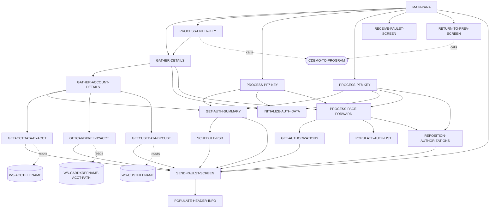

# UNKNOWN

**File**: `cbl/COPAUS0C.cbl`
**Type**: COBOL
**Analyzed**: 2026-02-03 21:12:58.786830

## Purpose

The purpose of this COBOL program cannot be determined as the provided source code is empty.

## Paragraphs/Procedures

### COPAUS0C
This is the main paragraph and entry point for the COPAUS0C CICS program. It does not contain any logic itself, but serves as a placeholder. It is implicitly called by CICS when the transaction is initiated. It immediately falls through to the MAIN-PARA paragraph to begin processing. The paragraph does not directly consume any inputs or produce any outputs. It does not implement any business logic or error handling. It simply transfers control to the MAIN-PARA paragraph.

### MAIN-PARA
This paragraph is the main control logic for the COPAUS0C program. It determines whether the program is being called for the first time or is re-entering after a screen display. If it's the first time (EIBCALEN = 0), it initializes the CARDDEMO-COMMAREA, sets the program context, and displays the initial screen using SEND-PAULST-SCREEN. If it's a re-entry, it receives the screen input using RECEIVE-PAULST-SCREEN and processes the user's action based on the EIBAID.  If the user presses ENTER, it calls PROCESS-ENTER-KEY to validate the account ID and potentially transfer to the authorization details program. If PF3 is pressed, it returns to the previous menu. If PF7 or PF8 are pressed, it pages through the authorization list. Invalid key presses result in an error message. Finally, it returns control to CICS with the updated COMMAREA.

### PROCESS-ENTER-KEY
This paragraph processes the user's input after pressing the ENTER key. It validates the account ID entered by the user. If the account ID is spaces, low-values, or not numeric, an error message is displayed. If the account ID is valid, it checks if an authorization has been selected. If an authorization is selected (SEL0001I - SEL0005I), it sets the CDEMO-TO-PROGRAM to WS-PGM-AUTH-DTL and XCTLs to that program to display the authorization details. If no authorization is selected, it continues to GATHER-DETAILS. If the selection is invalid, an error message is displayed. The paragraph consumes input from COPAU0AI and CARDDEMO-COMMAREA. It potentially modifies CDEMO-TO-PROGRAM and calls CDEMO-TO-PROGRAM via XCTL.

### GATHER-DETAILS
This paragraph orchestrates the retrieval and preparation of data for display. It first moves -1 to ACCTIDL of COPAU0AI. If WS-ACCT-ID is not LOW-VALUES, it performs GATHER-ACCOUNT-DETAILS to retrieve account details. Then, it performs INITIALIZE-AUTH-DATA to initialize authorization data. If FOUND-PAUT-SMRY-SEG is true, it performs PROCESS-PAGE-FORWARD to retrieve and display the authorization list. This paragraph consumes WS-ACCT-ID and FOUND-PAUT-SMRY-SEG. It calls GATHER-ACCOUNT-DETAILS, INITIALIZE-AUTH-DATA, and PROCESS-PAGE-FORWARD to perform specific tasks. It sets up the data for the screen display.

### PROCESS-PF7-KEY
This paragraph handles the processing when the PF7 key (previous page) is pressed. If the current page number (CDEMO-CPVS-PAGE-NUM) is greater than 1, it decrements the page number, retrieves the authorization key for the previous page from CDEMO-CPVS-PAUKEY-PREV-PG, and calls GET-AUTH-SUMMARY. It then sets SEND-ERASE-NO to TRUE, sets NEXT-PAGE-YES to TRUE, and calls INITIALIZE-AUTH-DATA and PROCESS-PAGE-FORWARD to display the previous page of authorizations. If the current page number is not greater than 1, it displays a message indicating that the user is already at the top of the page. The paragraph consumes CDEMO-CPVS-PAGE-NUM and CDEMO-CPVS-PAUKEY-PREV-PG. It calls GET-AUTH-SUMMARY, INITIALIZE-AUTH-DATA, and PROCESS-PAGE-FORWARD. It modifies CDEMO-CPVS-PAGE-NUM and WS-AUTH-KEY-SAVE.

### PROCESS-PF8-KEY
This paragraph handles the processing when the PF8 key (next page) is pressed. It checks if CDEMO-CPVS-PAUKEY-LAST is spaces or low-values. If it is, it moves LOW-VALUES to WS-AUTH-KEY-SAVE. Otherwise, it moves CDEMO-CPVS-PAUKEY-LAST to WS-AUTH-KEY-SAVE, calls GET-AUTH-SUMMARY, and calls REPOSITION-AUTHORIZATIONS. It then sets SEND-ERASE-NO to TRUE. If NEXT-PAGE-YES is true, it calls INITIALIZE-AUTH-DATA and PROCESS-PAGE-FORWARD to display the next page of authorizations. Otherwise, it displays a message indicating that the user is already at the bottom of the page. The paragraph consumes CDEMO-CPVS-PAUKEY-LAST and NEXT-PAGE-YES. It calls GET-AUTH-SUMMARY, REPOSITION-AUTHORIZATIONS, INITIALIZE-AUTH-DATA, and PROCESS-PAGE-FORWARD. It potentially modifies WS-AUTH-KEY-SAVE.

### PROCESS-PAGE-FORWARD
This paragraph retrieves and populates the authorization list for the current page. It initializes WS-IDX to 1 and CDEMO-CPVS-PAUKEY-LAST to LOW-VALUES. It then enters a loop that continues until WS-IDX is greater than 5, AUTHS-EOF is true, or ERR-FLG-ON is true. Inside the loop, it calls REPOSITION-AUTHORIZATIONS if EIBAID is DFHPF7 and WS-IDX is 1, otherwise it calls GET-AUTHORIZATIONS. If AUTHS-NOT-EOF and ERR-FLG-OFF are true, it calls POPULATE-AUTH-LIST, increments WS-IDX, moves PA-AUTHORIZATION-KEY to CDEMO-CPVS-PAUKEY-LAST, and if WS-IDX is 2, it increments CDEMO-CPVS-PAGE-NUM and moves PA-AUTHORIZATION-KEY to CDEMO-CPVS-PAUKEY-PREV-PG. After the loop, if AUTHS-NOT-EOF and ERR-FLG-OFF are true, it calls GET-AUTHORIZATIONS. If AUTHS-NOT-EOF and ERR-FLG-OFF are true, it sets NEXT-PAGE-YES to TRUE, otherwise it sets NEXT-PAGE-NO to TRUE. The paragraph consumes EIBAID, AUTHS-EOF, ERR-FLG-ON, AUTHS-NOT-EOF, and ERR-FLG-OFF. It calls REPOSITION-AUTHORIZATIONS, GET-AUTHORIZATIONS, and POPULATE-AUTH-LIST. It modifies WS-IDX, CDEMO-CPVS-PAUKEY-LAST, CDEMO-CPVS-PAGE-NUM, and CDEMO-CPVS-PAUKEY-PREV-PG.

### GET-AUTHORIZATIONS
This paragraph retrieves the next pending authorization detail segment (PAUTDTL1) from the IMS database. It uses the DLI GNP (Get Next within Parent) command with the PAUT-PCB-NUM PCB. The retrieved segment is placed into PENDING-AUTH-DETAILS. The DIBSTAT field is moved to IMS-RETURN-CODE. The paragraph then evaluates the IMS-RETURN-CODE. If the status is OK, it sets AUTHS-NOT-EOF to TRUE. If the status is SEGMENT-NOT-FOUND or END-OF-DB, it sets AUTHS-EOF to TRUE. If the status is OTHER, it sets WS-ERR-FLG to 'Y', constructs an error message, moves it to WS-MESSAGE, moves -1 to ACCTIDL of COPAU0AI, and calls SEND-PAULST-SCREEN to display the error. The paragraph consumes PAUT-PCB-NUM. It modifies PENDING-AUTH-DETAILS, IMS-RETURN-CODE, AUTHS-NOT-EOF, AUTHS-EOF, WS-ERR-FLG, WS-MESSAGE, and ACCTIDL of COPAU0AI. It calls SEND-PAULST-SCREEN in case of an error.

### REPOSITION-AUTHORIZATIONS
This paragraph repositions the IMS database cursor to a specific authorization record. It moves WS-AUTH-KEY-SAVE to PA-AUTHORIZATION-KEY. It then uses the DLI GNP command with the WHERE clause to retrieve the PAUTDTL1 segment where PAUT9CTS matches PA-AUTHORIZATION-KEY. The retrieved segment is placed into PENDING-AUTH-DETAILS. The DIBSTAT field is moved to IMS-RETURN-CODE. The paragraph then evaluates the IMS-RETURN-CODE. If the status is OK, it sets AUTHS-NOT-EOF to TRUE. If the status is SEGMENT-NOT-FOUND or END-OF-DB, it sets AUTHS-EOF to TRUE. If the status is OTHER, it sets WS-ERR-FLG to 'Y', constructs an error message, moves it to WS-MESSAGE, moves -1 to ACCTIDL of COPAU0AI, and calls SEND-PAULST-SCREEN to display the error. The paragraph consumes WS-AUTH-KEY-SAVE. It modifies PA-AUTHORIZATION-KEY, PENDING-AUTH-DETAILS, IMS-RETURN-CODE, AUTHS-NOT-EOF, AUTHS-EOF, WS-ERR-FLG, WS-MESSAGE, and ACCTIDL of COPAU0AI. It calls SEND-PAULST-SCREEN in case of an error.

### POPULATE-AUTH-LIST
This paragraph populates the authorization list on the screen with data from the PENDING-AUTH-DETAILS segment. It moves PA-APPROVED-AMT to WS-AUTH-AMT, rearranges PA-AUTH-ORIG-TIME to WS-AUTH-TIME, and rearranges PA-AUTH-ORIG-DATE to WS-AUTH-DATE. It then translates PA-AUTH-RESP-CODE to WS-AUTH-APRV-STAT ('A' for approved, 'D' for denied). It then uses an EVALUATE statement based on WS-IDX to move the authorization details to the corresponding fields in the COPAU0AI map (TRNID01I-TRNID05I, PDATE01I-PDATE05I, PTIME01I-PTIME05I, PTYPE01I-PTYPE05I, PAPRV01I-PAPRV05I, PSTAT01I-PSTAT05I, PAMT001I-PAMT005I). It also moves PA-AUTHORIZATION-KEY to CDEMO-CPVS-AUTH-KEYS(WS-IDX) and DFHBMUNP to SEL0001A-SEL0005A. The paragraph consumes PA-APPROVED-AMT, PA-AUTH-ORIG-TIME, PA-AUTH-ORIG-DATE, PA-AUTH-RESP-CODE, PA-AUTHORIZATION-KEY, PA-TRANSACTION-ID, PA-AUTH-TYPE, PA-MATCH-STATUS, and WS-IDX. It modifies WS-AUTH-AMT, WS-AUTH-TIME, WS-AUTH-DATE, WS-AUTH-APRV-STAT, CDEMO-CPVS-AUTH-KEYS, TRNID01I-TRNID05I, PDATE01I-PDATE05I, PTIME01I-PTIME05I, PTYPE01I-PTYPE05I, PAPRV01I-PAPRV05I, PSTAT01I-PSTAT05I, PAMT001I-PAMT005I, and SEL0001A-SEL0005A.

### SCHEDULE-PSB
The SCHEDULE-PSB paragraph is responsible for scheduling a Program Specification Block (PSB) for IMS database interaction. It first attempts to schedule the PSB using the DLI SCHD command, specifying the PSB name and the NODHABEND option to prevent abnormal termination. The IMS return code (DIBSTAT) is then moved to IMS-RETURN-CODE for evaluation. If the PSB has been scheduled more than once, it terminates the current PSB and schedules it again. If the scheduling is successful (STATUS-OK), it sets the IMS-PSB-SCHD flag to TRUE. If scheduling fails, it sets WS-ERR-FLG to 'Y', constructs an error message containing the IMS return code, moves -1 to ACCTIDL of COPAU0AI, and calls the SEND-PAULST-SCREEN program to display the error message to the user. This paragraph ensures that the PSB is properly scheduled and handles potential errors during the scheduling process, providing feedback to the user via the screen.

### INITIALIZE-AUTH-DATA
This paragraph initializes authorization data fields on the COPAU0A screen. It iterates through five authorization slots (WS-IDX from 1 to 5) and sets the corresponding screen fields (SEL0001A to SEL0005A, TRNID01I to TRNID05I, PDATE01I to PDATE05I, PTIME01I to PTIME05I, PTYPE01I to PTYPE05I, PAPRV01I to PAPRV05I, PSTAT01I to PSTAT05I, and PAMT001I to PAMT005I) to default values. Specifically, the selection fields (SEL0001A to SEL0005A) are initialized with 'DFHBMPRO', and the remaining fields are initialized with spaces. This initialization prepares the screen for displaying authorization information. There are no calls to other paragraphs or programs within this paragraph. Error handling is not explicitly present, as the 'WHEN OTHER' condition in the EVALUATE statement simply continues the loop.

### RETURN-TO-PREV-SCREEN
This paragraph handles the return to the previous CICS screen. It checks if the CDEMO-TO-PROGRAM field is empty (LOW-VALUES or SPACES). If it is, it defaults the target program to 'COSGN00C'. It then moves the current transaction ID (WS-CICS-TRANID) to CDEMO-FROM-TRANID, the program name (WS-PGM-AUTH-SMRY) to CDEMO-FROM-PROGRAM, and sets CDEMO-PGM-CONTEXT to ZEROS. Finally, it executes a CICS XCTL command to transfer control to the program specified in CDEMO-TO-PROGRAM, passing the CARDDEMO-COMMAREA. This paragraph facilitates navigation back to the calling program, preserving context information. No specific error handling is implemented within this paragraph.

### SEND-PAULST-SCREEN
This paragraph sends the COPAU0A screen to the CICS terminal. It first checks the IMS-PSB-SCHD flag. If it's set, it performs a CICS SYNCPOINT. Then, it calls the POPULATE-HEADER-INFO paragraph to populate the header information on the screen. It moves the contents of WS-MESSAGE to the ERRMSGO field in the output map (COPAU0AO). Finally, it executes a CICS SEND MAP command to send the COPAU0A screen, either with ERASE option (if SEND-ERASE-YES is true) or without it, positioning the cursor on the screen. This paragraph is responsible for displaying the formatted data on the CICS terminal. Error handling is implicit in the CICS SEND command, relying on CICS mechanisms.

### RECEIVE-PAULST-SCREEN
This paragraph receives data from the COPAU0A CICS screen. It executes a CICS RECEIVE MAP command, retrieving data from the COPAU0A mapset ('COPAU00') into the COPAU0AI input map structure. The RESP and RESP2 options capture the CICS response codes in WS-RESP-CD and WS-REAS-CD, respectively. This paragraph is the primary mechanism for obtaining user input from the CICS screen. Error handling relies on checking the WS-RESP-CD and WS-REAS-CD after the RECEIVE command, although this is not explicitly shown in this snippet.

### POPULATE-HEADER-INFO
This paragraph populates the header information on the COPAU0A screen. It moves the current date to WS-CURDATE-DATA using the FUNCTION CURRENT-DATE. It then moves CCDA-TITLE01 and CCDA-TITLE02 to TITLE01O and TITLE02O in the output map, respectively. The transaction ID (WS-CICS-TRANID) and program name (WS-PGM-AUTH-SMRY) are moved to TRNNAMEO and PGMNAMEO, respectively. The current date and time are formatted and moved to CURDATEO and CURTIMEO in the output map. This paragraph prepares the header section of the screen with relevant context information. There are no calls to other paragraphs or programs within this paragraph. Error handling is not explicitly present.

### GATHER-ACCOUNT-DETAILS
This paragraph orchestrates the retrieval and formatting of account and customer details for display. It calls GETCARDXREF-BYACCT to retrieve card cross-reference information based on the account ID. It then calls GETACCTDATA-BYACCT to retrieve account data and GETCUSTDATA-BYCUST to retrieve customer data. The customer ID is moved to CUSTIDO. The customer's name and address are constructed by concatenating individual fields into CNAMEO, ADDR001O, and ADDR002O. The customer's phone number is moved to PHONE1O. Account credit limits are moved to CREDLIMO and CASHLIMO. Finally, it calls GET-AUTH-SUMMARY to retrieve authorization summary information. If authorization summary data is found, it moves the approved/declined counts and amounts to the corresponding output fields. If not found, these fields are set to zero. This paragraph acts as a central point for gathering and preparing data for the screen. Error handling is delegated to the called paragraphs.

### GETCARDXREF-BYACCT
This paragraph retrieves the card cross-reference record from the CARDXREF file based on the account ID. It moves the account ID (WS-ACCT-ID) to the record ID field (WS-CARD-RID-ACCT-ID-X). It then executes a CICS READ command to read the CARDXREF record. If the read is successful (DFHRESP(NORMAL)), it moves the customer ID and card number from the cross-reference record to CDEMO-CUST-ID and CDEMO-CARD-NUM, respectively. If the record is not found (DFHRESP(NOTFND)), it constructs an error message and calls SEND-PAULST-SCREEN to display it. If any other error occurs, it sets an error flag, constructs an error message, and calls SEND-PAULST-SCREEN to display the error. This paragraph retrieves the link between the account and customer. Error handling involves displaying messages on the screen if the record is not found or if a system error occurs.

### GETACCTDATA-BYACCT
This paragraph retrieves account data from the ACCOUNT file based on the account ID. It moves the account ID (XREF-ACCT-ID) to WS-CARD-RID-ACCT-ID-X. It then executes a CICS READ command to read the ACCOUNT record. If the read is successful (DFHRESP(NORMAL)), it continues processing. If the record is not found (DFHRESP(NOTFND)), it constructs an error message and calls SEND-PAULST-SCREEN to display it. If any other error occurs, it sets an error flag, constructs an error message, and calls SEND-PAULST-SCREEN to display the error. This paragraph retrieves the account details. Error handling involves displaying messages on the screen if the record is not found or if a system error occurs.

### GETCUSTDATA-BYCUST
This paragraph retrieves customer data from the CUSTOMER file based on the customer ID. It moves the customer ID (XREF-CUST-ID) to WS-CARD-RID-CUST-ID. It then executes a CICS READ command to read the CUSTOMER record. If the read is successful (DFHRESP(NORMAL)), it continues processing. If the record is not found (DFHRESP(NOTFND)), it constructs an error message and calls SEND-PAULST-SCREEN to display it. If any other error occurs, it sets an error flag, constructs an error message, and calls SEND-PAULST-SCREEN to display the error. This paragraph retrieves the customer details. Error handling involves displaying messages on the screen if the record is not found or if a system error occurs.

### GET-AUTH-SUMMARY
This paragraph retrieves the authorization summary from the IMS database. It first calls SCHEDULE-PSB to schedule the PSB. It then moves the account ID (CDEMO-ACCT-ID) to PA-ACCT-ID. It executes a DLI GU (Get Unique) command to retrieve the PAUTSUM0 segment from the IMS database, using the PAUT-PCB-NUM PCB. If the segment is found (STATUS-OK), it sets FOUND-PAUT-SMRY-SEG to TRUE. If the segment is not found (SEGMENT-NOT-FOUND), it sets NFOUND-PAUT-SMRY-SEG to TRUE. If any other error occurs, it sets an error flag, constructs an error message, and calls SEND-PAULST-SCREEN to display the error. This paragraph retrieves the authorization summary data. Error handling involves displaying messages on the screen if a system error occurs.

## Control Flow

## Open Questions

- ? What is the purpose of this program?
  - Context: The source code is empty, so the program's functionality cannot be determined.

## Sequence Diagram

```mermaid
sequenceDiagram
    COPAUS0C->>COCOM01Y: performs
    COPAUS0C->>COPAU00: performs
    COPAUS0C->>COTTL01Y: performs
    COPAUS0C->>CSDAT01Y: performs
    COPAUS0C->>CSMSG01Y: performs
    COPAUS0C->>CSMSG02Y: performs
    COPAUS0C->>CVACT01Y: performs
    COPAUS0C->>CVACT02Y: performs
    COPAUS0C->>CVACT03Y: performs
    COPAUS0C->>CVCUS01Y: performs
    COPAUS0C->>CIPAUSMY: performs
    COPAUS0C->>CIPAUDTY: performs
    COPAUS0C->>DFHAID: performs
    COPAUS0C->>DFHBMSCA: performs
    MAIN-PARA->>SEND-PAULST-SCREEN: WS-MESSAGE, SEND-ERASE-YES
    MAIN-PARA->>GATHER-DETAILS: WS-ACCT-ID
    MAIN-PARA->>SEND-PAULST-SCREEN: WS-MESSAGE, SEND-ERASE-YES
    MAIN-PARA->>RECEIVE-PAULST-SCREEN: performs
    RECEIVE-PAULST-SCREEN-->>MAIN-PARA: WS-RESP-CD, WS-REAS-CD
    MAIN-PARA->>PROCESS-ENTER-KEY: ACCTIDI OF COPAU0AI, SEL0001I OF COPAU0AI, SEL0002I OF COPAU0AI, ...
    PROCESS-ENTER-KEY-->>MAIN-PARA: WS-ACCT-ID, WS-ERR-FLG, WS-MESSAGE, ...
    MAIN-PARA->>SEND-PAULST-SCREEN: WS-MESSAGE, SEND-ERASE-YES
    MAIN-PARA->>RETURN-TO-PREV-SCREEN: WS-CICS-TRANID, WS-PGM-AUTH-SMRY, CDEMO-TO-PROGRAM
    RETURN-TO-PREV-SCREEN-->>MAIN-PARA: CDEMO-FROM-TRANID, CDEMO-FROM-PROGRAM, CDEMO-PGM-CONTEXT
    MAIN-PARA->>SEND-PAULST-SCREEN: WS-MESSAGE, SEND-ERASE-YES
    MAIN-PARA->>PROCESS-PF7-KEY: CDEMO-CPVS-PAGE-NUM, CDEMO-CPVS-PAUKEY-PREV-PG
    PROCESS-PF7-KEY-->>MAIN-PARA: WS-AUTH-KEY-SAVE, WS-MESSAGE, SEND-ERASE-NO, ...
    MAIN-PARA->>SEND-PAULST-SCREEN: WS-MESSAGE, SEND-ERASE-YES
    MAIN-PARA->>PROCESS-PF8-KEY: CDEMO-CPVS-PAUKEY-LAST, WS-ACCT-ID, NEXT-PAGE-YES
    PROCESS-PF8-KEY-->>MAIN-PARA: WS-AUTH-KEY-SAVE, SEND-ERASE-NO
    MAIN-PARA->>SEND-PAULST-SCREEN: WS-MESSAGE, SEND-ERASE-YES
    MAIN-PARA->>SEND-PAULST-SCREEN: WS-MESSAGE, SEND-ERASE-YES
    PROCESS-ENTER-KEY->>GATHER-DETAILS: WS-ACCT-ID
    GATHER-DETAILS-->>PROCESS-ENTER-KEY: ACCTIDL, CDEMO-CPVS-PAGE-NUM
    PROCESS-ENTER-KEY->>CDEMO-TO-PROGRAM: performs
    GATHER-DETAILS->>GATHER-ACCOUNT-DETAILS: WS-ACCT-ID
    GATHER-ACCOUNT-DETAILS-->>GATHER-DETAILS: CUSTIDO, CNAMEO, ADDR001O, ...
    GATHER-DETAILS->>INITIALIZE-AUTH-DATA: performs
    INITIALIZE-AUTH-DATA-->>GATHER-DETAILS: WS-IDX
    GATHER-DETAILS->>PROCESS-PAGE-FORWARD: ERR-FLG-OFF, FOUND-PAUT-SMRY-SEG, EIBAID, ...
    PROCESS-PAGE-FORWARD-->>GATHER-DETAILS: WS-IDX, CDEMO-CPVS-PAUKEY-LAST, CDEMO-CPVS-PAGE-NUM, ...
    PROCESS-PF7-KEY->>GET-AUTH-SUMMARY: CDEMO-ACCT-ID
    GET-AUTH-SUMMARY-->>PROCESS-PF7-KEY: PA-ACCT-ID, IMS-RETURN-CODE, FOUND-PAUT-SMRY-SEG, ...
    PROCESS-PF7-KEY->>INITIALIZE-AUTH-DATA: performs
    INITIALIZE-AUTH-DATA-->>PROCESS-PF7-KEY: WS-IDX
    PROCESS-PF7-KEY->>PROCESS-PAGE-FORWARD: ERR-FLG-OFF, EIBAID, CDEMO-CPVS-PAGE-NUM, ...
    PROCESS-PAGE-FORWARD-->>PROCESS-PF7-KEY: WS-IDX, CDEMO-CPVS-PAUKEY-LAST, CDEMO-CPVS-PAGE-NUM, ...
    PROCESS-PF8-KEY->>GET-AUTH-SUMMARY: CDEMO-ACCT-ID, PA-ACCT-ID
    GET-AUTH-SUMMARY-->>PROCESS-PF8-KEY: IMS-RETURN-CODE, WS-ERR-FLG, WS-MESSAGE, ...
    PROCESS-PF8-KEY->>REPOSITION-AUTHORIZATIONS: WS-AUTH-KEY-SAVE
    REPOSITION-AUTHORIZATIONS-->>PROCESS-PF8-KEY: IMS-RETURN-CODE, WS-ERR-FLG, WS-MESSAGE, ...
    PROCESS-PF8-KEY->>INITIALIZE-AUTH-DATA: performs
    INITIALIZE-AUTH-DATA-->>PROCESS-PF8-KEY: SEL0001A OF COPAU0AI, TRNID01I OF COPAU0AI, PDATE01I OF COPAU0AI, ...
    PROCESS-PF8-KEY->>PROCESS-PAGE-FORWARD: ERR-FLG-OFF, EIBAID, DFHPF7, ...
    PROCESS-PAGE-FORWARD-->>PROCESS-PF8-KEY: WS-IDX, CDEMO-CPVS-PAUKEY-LAST, CDEMO-CPVS-PAGE-NUM, ...
    PROCESS-PAGE-FORWARD->>REPOSITION-AUTHORIZATIONS: WS-AUTH-KEY-SAVE
    REPOSITION-AUTHORIZATIONS-->>PROCESS-PAGE-FORWARD: IMS-RETURN-CODE, WS-ERR-FLG, WS-MESSAGE, ...
    PROCESS-PAGE-FORWARD->>GET-AUTHORIZATIONS: performs
    GET-AUTHORIZATIONS-->>PROCESS-PAGE-FORWARD: IMS-RETURN-CODE, WS-ERR-FLG, WS-MESSAGE
    PROCESS-PAGE-FORWARD->>POPULATE-AUTH-LIST: PA-APPROVED-AMT, PA-AUTH-ORIG-TIME, PA-AUTH-ORIG-DATE, ...
    POPULATE-AUTH-LIST-->>PROCESS-PAGE-FORWARD: WS-AUTH-AMT, WS-AUTH-TIME, WS-CURDATE-YY, ...
    PROCESS-PAGE-FORWARD->>GET-AUTHORIZATIONS: performs
    GET-AUTHORIZATIONS-->>PROCESS-PAGE-FORWARD: IMS-RETURN-CODE, WS-ERR-FLG, WS-MESSAGE
    GET-AUTHORIZATIONS->>SEND-PAULST-SCREEN: WS-MESSAGE, ACCTIDL, IMS-PSB-SCHD, ...
    REPOSITION-AUTHORIZATIONS->>SEND-PAULST-SCREEN: WS-MESSAGE, ACCTIDL, IMS-PSB-SCHD, ...
    SCHEDULE-PSB->>SEND-PAULST-SCREEN: WS-MESSAGE, IMS-PSB-SCHD, SEND-ERASE-YES
    RETURN-TO-PREV-SCREEN->>CDEMO-TO-PROGRAM: performs
    SEND-PAULST-SCREEN->>POPULATE-HEADER-INFO: WS-CICS-TRANID, WS-PGM-AUTH-SMRY, WS-CURDATE-MONTH, ...
    GATHER-ACCOUNT-DETAILS->>GETCARDXREF-BYACCT: WS-ACCT-ID, WS-CARDXREFNAME-ACCT-PATH
    GETCARDXREF-BYACCT-->>GATHER-ACCOUNT-DETAILS: WS-RESP-CD, WS-REAS-CD, WS-RESP-CD-DIS, ...
    GATHER-ACCOUNT-DETAILS->>GETACCTDATA-BYACCT: XREF-ACCT-ID, WS-ACCTFILENAME
    GETACCTDATA-BYACCT-->>GATHER-ACCOUNT-DETAILS: WS-RESP-CD, WS-REAS-CD, WS-RESP-CD-DIS, ...
    GATHER-ACCOUNT-DETAILS->>GETCUSTDATA-BYCUST: XREF-CUST-ID, WS-CUSTFILENAME
    GETCUSTDATA-BYCUST-->>GATHER-ACCOUNT-DETAILS: WS-RESP-CD, WS-REAS-CD, WS-RESP-CD-DIS, ...
    GATHER-ACCOUNT-DETAILS->>GET-AUTH-SUMMARY: CDEMO-ACCT-ID
    GET-AUTH-SUMMARY-->>GATHER-ACCOUNT-DETAILS: PA-ACCT-ID, IMS-RETURN-CODE, WS-ERR-FLG, ...
    GETCARDXREF-BYACCT->>SEND-PAULST-SCREEN: WS-MESSAGE, IMS-PSB-SCHD, SEND-ERASE-YES
    GETCARDXREF-BYACCT->>SEND-PAULST-SCREEN: WS-MESSAGE, IMS-PSB-SCHD, SEND-ERASE-YES
    GETCARDXREF-BYACCT->>WS-CARDXREFNAME-ACCT-PATH: performs
    GETACCTDATA-BYACCT->>SEND-PAULST-SCREEN: WS-MESSAGE, IMS-PSB-SCHD, SEND-ERASE-YES
    GETACCTDATA-BYACCT->>SEND-PAULST-SCREEN: WS-MESSAGE, IMS-PSB-SCHD, SEND-ERASE-YES
    GETACCTDATA-BYACCT->>WS-ACCTFILENAME: performs
    GETCUSTDATA-BYCUST->>SEND-PAULST-SCREEN: WS-MESSAGE, IMS-PSB-SCHD, SEND-ERASE-YES
    GETCUSTDATA-BYCUST->>SEND-PAULST-SCREEN: WS-MESSAGE, IMS-PSB-SCHD, SEND-ERASE-YES
    GETCUSTDATA-BYCUST->>WS-CUSTFILENAME: performs
    GET-AUTH-SUMMARY->>SCHEDULE-PSB: PSB-NAME
    SCHEDULE-PSB-->>GET-AUTH-SUMMARY: IMS-RETURN-CODE, IMS-PSB-SCHD
    GET-AUTH-SUMMARY->>SEND-PAULST-SCREEN: WS-MESSAGE, IMS-PSB-SCHD, SEND-ERASE-YES
```

