# COPAUS0C

**File:** cbl/COPAUS0C.cbl
**Type:** COBOL
**Status:** In Progress
**Iterations:** 1
**Analyzed:** 2026-01-30 19:33:45.085539

## Purpose

COPAUS0C is a CICS online program that displays a paginated list of authorizations for a specified account ID on the PAULST screen. It handles first-time invocation by initializing data and sending the initial screen, subsequent interactions by receiving map data, processing user keys (ENTER for selection/validation, PF3 to exit, PF7/PF8 for paging), and navigating to detail screens via XCTL. Error conditions like invalid account ID or selection are handled by displaying messages without abending.

**Business Context:** Card demo application screen for viewing and selecting payment authorizations associated with an account.
**Program Type:** ONLINE_CICS
**Citations:** Lines 1, 3, 15, 49, 79

## Calling Context

**Entry Points:** WS-CICS-TRANID
**Linkage Section:** CARDDEMO-COMMAREA

## Inputs

### COPAU0AI
- **Type:** CICS_MAP
- **Description:** Input map fields including ACCTIDI for account ID entry and SEL0001I-SEL0005I for authorization selection flags.
- **Copybook:** [COPAU0AI](../copybooks/COPAU0AI.cpy.md)
- **Lines:** 87, 96, 109, 113, 115, 119, 123, 127

### CARDDEMO-COMMAREA
- **Type:** CICS_COMMAREA
- **Description:** CICS commarea carrying persistent data like CDEMO-ACCT-ID, CDEMO-PGM-REENTER flag, page numbers, authorization keys, and navigation targets.
- **Lines:** 16, 25, 27, 32

### EIBAID
- **Type:** OTHER
- **Description:** CICS attention identifier (DFHENTER, DFHPF3, DFHPF7, DFHPF8) indicating user key press.
- **Copybook:** [DFHAID](../copybooks/DFHAID.cpy.md)
- **Lines:** 49

## Outputs

### COPAU0AO
- **Type:** CICS_MAP
- **Description:** Output map populated with ACCTIDO display field, ERRMSGO for error messages, authorization list details, and cursor positioning via ACCTIDL.
- **Copybook:** [COPAU0AO](../copybooks/COPAU0AO.cpy.md)
- **Lines:** 11, 34, 55

### CARDDEMO-COMMAREA
- **Type:** CICS_COMMAREA
- **Description:** Updated commarea with navigation data (CDEMO-TO-PROGRAM, CDEMO-ACCT-ID, selected keys, flags) passed on RETURN or XCTL.
- **Lines:** 17, 61, 80, 139

## Called Programs

| Program | Call Type | Purpose | Line |
|---------|-----------|---------|------|
| [CDEMO-TO-PROGRAM](./CDEMO-TO-PROGRAM.cbl.md) | CICS_XCTL | Transfer control to authorization detail program (WS-PGM-AUTH-DTL) when valid 'S' selection made on an authorization line. | 146 |

## Business Rules

### BR001: Account ID must be provided and numeric before fetching authorizations.
**Logic:** Validate ACCTIDI not spaces/low-values and numeric; set error message and cursor if invalid.
**Conditions:** IF ACCTIDI OF COPAU0AI = SPACES OR LOW-VALUES, IF ACCTIDI OF COPAU0AI IS NOT NUMERIC
**Lines:** 87, 96

### BR002: Authorization selection requires 'S' or 's' in one of SEL0001I-SEL0005I fields.
**Logic:** Map non-spaces/low SELxxxxI to corresponding CDEMO-CPVS-AUTH-KEYS index; validate flag value before XCTL.
**Conditions:** WHEN SEL0001I NOT = SPACES AND LOW-VALUES, EVALUATE CDEMO-CPVS-PAU-SEL-FLG WHEN 'S' WHEN 's'
**Lines:** 109, 137

### BR003: PF7 only allowed if current page > 1 to prevent paging before first page.
**Logic:** Decrement page number only if >1; else display 'already at top' message.
**Conditions:** IF CDEMO-CPVS-PAGE-NUM > 1
**Lines:** 184

## Copybooks Used

| Copybook | Location | Purpose | Line |
|----------|----------|---------|------|
| [COPAU0AI](../copybooks/COPAU0AI.cpy.md) | WORKING_STORAGE | Defines input map fields for account ID and selection indicators. | 87 |
| [COPAU0AO](../copybooks/COPAU0AO.cpy.md) | WORKING_STORAGE | Defines output map fields for screen display including messages and list. | 11 |
| [CARDDEMO-COMMAREA](../copybooks/CARDDEMO-COMMAREA.cpy.md) | LINKAGE | Common commarea structure for navigation and data persistence across programs. | 16 |

## Data Flow

### Reads From
- **COPAU0AI**: ACCTIDI, SEL0001I, SEL0002I, SEL0003I, SEL0004I, SEL0005I
  (Lines: 87, 109)
- **CARDDEMO-COMMAREA**: CDEMO-ACCT-ID, CDEMO-PGM-REENTER
  (Lines: 27, 32)
- **EIBAID**: DFHENTER, DFHPF3, DFHPF7, DFHPF8
  (Lines: 49)

### Writes To
- **COPAU0AO**: ACCTIDO, ERRMSGO
  (Lines: 34, 55)
- **CARDDEMO-COMMAREA**: CDEMO-ACCT-ID, CDEMO-TO-PROGRAM, CDEMO-CPVS-PAU-SELECTED, CDEMO-PGM-CONTEXT
  (Lines: 107, 139)

### Transformations
- **ACCTIDI OF COPAU0AI** → **WS-ACCT-ID**: Direct move if numeric and valid; else LOW-VALUES.
  (Lines: 106)
- **SEL0001I OF COPAU0AI** → **CDEMO-CPVS-PAU-SELECTED**: Move SEL flag and index into CDEMO-CPVS-AUTH-KEYS(1) if not spaces/low.
  (Lines: 110)
- **CDEMO-CPVS-PAGE-NUM** → **CDEMO-CPVS-PAGE-NUM**: Decrement by 1 for PF7 previous page.
  (Lines: 185)

## Key Paragraphs

### COPAUS0C
**Purpose:** UNKNOWN - Entry paragraph not present in provided code snippet; static analysis indicates it calls multiple programs and CICS/BMS resources at line 23 to initialize the transaction. Likely performs CICS housekeeping, BMS mapset load (DFHBMSCA), and initial calls before transferring to MAIN-PARA. No inputs/outputs or logic visible in snippet. No business decisions evident. No error handling shown. Calls listed programs per outline.
- Calls: COCOM01Y, COPAU00, COTTL01Y, CSDAT01Y, CSMSG01Y, CSMSG02Y, CVACT01Y, CVACT02Y, CVACT03Y, CVCUS01Y, CIPAUSMY, CIPAUDTY, DFHAID, DFHBMSCA
- Lines: 23-23

### MAIN-PARA
**Purpose:** This is the primary orchestration paragraph controlling the entire program flow as the main CICS transaction handler. It initializes flags (ERR-FLG-OFF, AUTHS-NOT-EOF, NEXT-PAGE-NO, SEND-ERASE-YES), clears WS-MESSAGE and sets ACCTIDL to -1 as inputs from working storage and prior state. It produces updated map fields, commarea, and screen sends as outputs. Business logic checks EIBCALEN=0 for first call (initialize commarea, set reenter, low-values map, send screen) versus subsequent (load commarea, handle reenter: gather details if new, else receive map and EVALUATE EIBAID for ENTER/PF3/PF7/PF8/other with appropriate processing and screen send). Error handling for invalid AID sets WS-ERR-FLG 'Y', invalid message, cursor -1. Finally executes CICS RETURN with TRANSID and commarea. Calls SEND-PAULST-SCREEN repeatedly for screen I/O, GATHER-DETAILS for data prep, RECEIVE-PAULST-SCREEN for input, and key-specific processors to handle user actions.
- Calls: SEND-PAULST-SCREEN, GATHER-DETAILS, RECEIVE-PAULST-SCREEN, PROCESS-ENTER-KEY, RETURN-TO-PREV-SCREEN, PROCESS-PF7-KEY, PROCESS-PF8-KEY
- Lines: 3-82

### PROCESS-ENTER-KEY
**Purpose:** This paragraph processes the ENTER key press, primarily validating account ID input and handling authorization selection for drill-down. It consumes ACCTIDI and SEL0001I-SEL0005I from input map COPAU0AI, plus current WS-ACCT-ID state. It produces updated WS-ACCT-ID/CDEMO-ACCT-ID, CDEMO-CPVS-PAU-SEL-FLG/SELECTED, WS-MESSAGE/ERR-FLG if errors, ACCTIDL cursor position, and triggers XCTL or refresh. Business logic: if ACCTIDI spaces/low, error 'enter Acct Id'; if not numeric, error 'must be Numeric'; else move to WS/CDEMO, evaluate SEL fields to map to auth key array index 1-5 or default spaces, then if valid sel flag='S'/'s' set AUTH-DTL program/CONTEXT=0 and XCTL, else invalid sel message. Error handling sets 'Y' flag, message, -1 cursor without abend. Always calls GATHER-DETAILS post-processing for screen refresh. Calls CDEMO-TO-PROGRAM via XCTL for selected auth details.
- Called by: MAIN-PARA
- Calls: GATHER-DETAILS, CDEMO-TO-PROGRAM
- Lines: 84-161

### GATHER-DETAILS
**Purpose:** This paragraph orchestrates data gathering for screen refresh after key processing or validation. It consumes WS-ACCT-ID from prior validation. It produces ACCTIDL cursor -1, CDEMO-CPVS-PAGE-NUM=0 reset, initialized auth data, and populated account/auth list via subordinates. Business logic: unconditionally reset cursor/page; if WS-ACCT-ID valid (not low), perform GATHER-ACCOUNT-DETAILS for account info, INITIALIZE-AUTH-DATA to clear list, and conditional PROCESS-PAGE-FORWARD if PAUT-SMRY-SEG found (IMS fetch success). No explicit errors handled here; defers to callees. No loops or complex decisions beyond the IF. Calls subordinates to delegate data fetch and pagination setup.
- Called by: MAIN-PARA, PROCESS-ENTER-KEY
- Calls: GATHER-ACCOUNT-DETAILS, INITIALIZE-AUTH-DATA, PROCESS-PAGE-FORWARD
- Lines: 163-179

### PROCESS-PF7-KEY
**Purpose:** This paragraph handles PF7 key for previous page navigation in the authorization list. It consumes CDEMO-CPVS-PAGE-NUM and PAUKEY-PREV-PG array from commarea/state. It produces decremented page num, restored WS-AUTH-KEY-SAVE from prev page key, updated auth summary data, SEND-ERASE-NO/NEXT-PAGE-YES flags, cursor -1, refreshed list. Business logic: if page-num >1, compute page-num -1, move prev-pg key to save, GET-AUTH-SUMMARY (IMS?), set flags/cursor, INITIALIZE-AUTH-DATA, PROCESS-PAGE-FORWARD for repopulation; else set 'already at top' WS-MESSAGE and no-erase. Error handling implicit via message display, no abend. Enables backward pagination only when possible. Calls GET-AUTH-SUMMARY for data reload, INITIALIZE/PROCESS for screen prep.
- Called by: MAIN-PARA
- Calls: GET-AUTH-SUMMARY, INITIALIZE-AUTH-DATA, PROCESS-PAGE-FORWARD
- Lines: 181-204

### PROCESS-PF8-KEY
**Purpose:** This paragraph serves as the primary handler for the PF8 key press to initiate paging forward in the pending authorizations list. It consumes the CDEMO-CPVS-PAUKEY-LAST field from the CICS map to determine the starting position, checking if it is spaces or low-values to decide whether to initialize WS-AUTH-KEY-SAVE or copy the value (lines 4-7). It then performs GET-AUTH-SUMMARY to retrieve summary data and REPOSITION-AUTHORIZATIONS to position the IMS cursor at the saved key (line 9-10). The paragraph prepares the screen by moving -1 to ACCTIDL of COPAU0AI and setting SEND-ERASE-NO to TRUE (lines 13-15). It evaluates the NEXT-PAGE-YES flag: if true, performs INITIALIZE-AUTH-DATA to clear authorization data and PROCESS-PAGE-FORWARD to load the next page's records (lines 17-20); otherwise, sets WS-MESSAGE to indicate the user is at the bottom (lines 22-24). No direct error handling is performed here, but it relies on flags set by subordinate paragraphs. The business logic ensures paging only proceeds if prior positioning allows more data. Outputs include updated map control fields and flags directing screen refresh.
- Calls: GET-AUTH-SUMMARY, REPOSITION-AUTHORIZATIONS, INITIALIZE-AUTH-DATA, PROCESS-PAGE-FORWARD
- Lines: 1-25

### PROCESS-PAGE-FORWARD
**Purpose:** This paragraph orchestrates the loading of the next page by fetching up to 5 authorization records from IMS and populating the screen list. It first checks ERR-FLG-OFF, initializes WS-IDX to 1, and clears CDEMO-CPVS-PAUKEY-LAST (lines 30-34). It enters a PERFORM UNTIL loop (WS-IDX >5 or EOF or error), conditionally calling REPOSITION-AUTHORIZATIONS if EIBAID=DFHPF7 and WS-IDX=1, otherwise GET-AUTHORIZATIONS (lines 36-41). On successful read (AUTHS-NOT-EOF and no error), it calls POPULATE-AUTH-LIST, increments WS-IDX, saves the PA-AUTHORIZATION-KEY to CDEMO-CPVS-PAUKEY-LAST, and if WS-IDX=2, increments CDEMO-CPVS-PAGE-NUM and saves the key to previous page array (lines 42-53). After the loop, it performs one more GET-AUTHORIZATIONS to peek ahead and sets NEXT-PAGE-YES if more data available, else NEXT-PAGE-NO (lines 57-64). Inputs include IMS cursor position, EIBAID, and error flags; outputs are populated map fields via subordinate calls and updated pagination state. Business decisions control loop exit and conditional repositioning for PF7 compatibility. Error handling skips processing if ERR-FLG-ON.
- Called by: PROCESS-PF8-KEY
- Calls: REPOSITION-AUTHORIZATIONS, GET-AUTHORIZATIONS, POPULATE-AUTH-LIST
- Lines: 27-66

### GET-AUTHORIZATIONS
**Purpose:** This paragraph performs a sequential IMS GNP call to retrieve the next PAUTDTL1 segment in the pending authorizations chain. It executes DLI GNP using PAUT-PCB-NUM into PENDING-AUTH-DETAILS without SSA for unqualified next (lines 71-73). It moves DIBSTAT to IMS-RETURN-CODE and evaluates status: STATUS-OK sets AUTHS-NOT-EOF; SEGMENT-NOT-FOUND or END-OF-DB sets AUTHS-EOF; other statuses set WS-ERR-FLG to 'Y', build error message into WS-MESSAGE with IMS code, move -1 to ACCTIDL, and perform SEND-PAULST-SCREEN (lines 76-94). Inputs are the current IMS PCB position post prior calls. Outputs are PENDING-AUTH-DETAILS populated on success, or error flags/message/screen on failure. Business logic categorizes IMS statuses into EOF, not-EOF, or error without further validation. Error handling immediately notifies user via screen for system errors. No subordinate calls beyond the DLI exec.
- Called by: PROCESS-PAGE-FORWARD
- Calls: SEND-PAULST-SCREEN
- Lines: 68-96

### REPOSITION-AUTHORIZATIONS
**Purpose:** This paragraph repositions the IMS cursor to a specific authorization using the saved key for paging continuity. It moves WS-AUTH-KEY-SAVE to PA-AUTHORIZATION-KEY, then executes DLI GNP with SSA WHERE PAUT9CTS = PA-AUTHORIZATION-KEY into PENDING-AUTH-DETAILS (lines 101-106). It evaluates DIBSTAT similarly to GET-AUTHORIZATIONS: OK sets AUTHS-NOT-EOF, NOT-FOUND/EOD sets EOF, other sets WS-ERR-FLG 'Y', builds reposition-specific error message, sets ACCTIDL=-1, and performs SEND-PAULST-SCREEN (lines 109-127). Inputs are WS-AUTH-KEY-SAVE and PCB position. Outputs mirror GET-AUTHORIZATIONS with qualified retrieve. Business logic enables restart from last key for forward paging. Error handling matches GET with tailored message. Called selectively for initial positioning or PF7 cases.
- Called by: PROCESS-PF8-KEY, PROCESS-PAGE-FORWARD
- Calls: SEND-PAULST-SCREEN
- Lines: 98-129

### POPULATE-AUTH-LIST
**Purpose:** This paragraph transforms and maps a single PENDING-AUTH-DETAILS record into the corresponding row (1-5) of the CICS map for screen display. It moves/formats PA-APPROVED-AMT to WS-AUTH-AMT, reformats PA-AUTH-ORIG-TIME into HH:MM:SS in WS-AUTH-TIME, reformats PA-AUTH-ORIG-DATE via temp WS-CURDATE fields to MM-DD-YY in WS-AUTH-DATE, and sets WS-AUTH-APRV-STAT to 'A' or 'D' based on PA-AUTH-RESP-CODE='00' (lines 134-149). It then EVALUATEs WS-IDX (1-5), saving PA-AUTHORIZATION-KEY to CDEMO-CPVS-AUTH-KEYS(n) and moving fields to specific map positions like TRNIDnnI=PA-TRANSACTION-ID, PDATEnnI=WS-AUTH-DATE, etc., setting SEL000nA=DFHBMUNP for unprotected (lines 151-214). Inputs are global PENDING-AUTH-DETAILS and WS-IDX. Outputs are row-specific COPAU0AI fields populated. Business logic handles status mapping and field formatting for user-readable display. No error handling or conditions beyond IDX range; OTHER IDX continues without action.
- Called by: PROCESS-PAGE-FORWARD
- Lines: 131-215

### INITIALIZE-AUTH-DATA
**Purpose:** This paragraph's primary purpose is to initialize the five authorization data lines on the input map to a protected, blank state before screen display, ensuring users see cleared fields with non-selectable options initially. It consumes no external inputs but uses a loop counter WS-IDX initialized implicitly by PERFORM VARYING. It produces modifications to COPAU0AI fields: for each of 5 lines, sets SEL000XA (likely BMS attribute field) to DFHBMPRO (protected/unmodifiable) and clears data fields TRNID0XI, PDATE0XI, PTIME0XI, PTYPE0XI, PAPRV0XI, PSTAT0XI, PAMT00XI to SPACES. The business logic implements a fixed loop via PERFORM VARYING WS-IDX FROM 1 BY 1 UNTIL >5, using EVALUATE WS-IDX with WHEN 1-5 cases to target specific indexed fields, and WHEN OTHER CONTINUE for safety. No decisions or validations are performed beyond the loop bound. No error handling or exceptional conditions are addressed in this paragraph. It makes no calls to other paragraphs or programs.
- Lines: 1-55

### RETURN-TO-PREV-SCREEN
**Purpose:** This paragraph's primary purpose is to orchestrate the transfer of control back to the previous program via CICS XCTL, preserving context for navigation in the CARDDEMO application. It consumes values from CDEMO-TO-PROGRAM (checked for validity), WS-CICS-TRANID, WS-PGM-AUTH-SMRY, and implicitly CARDDEMO-COMMAREA structure. It produces updates to CARDDEMO-COMMAREA fields: sets CDEMO-TO-PROGRAM to 'COSGN00C' if LOW-VALUES or SPACES, moves WS-CICS-TRANID to CDEMO-FROM-TRANID, WS-PGM-AUTH-SMRY to CDEMO-FROM-PROGRAM, and ZEROS to CDEMO-PGM-CONTEXT, then executes XCTL with the COMMAREA. The business logic checks the next program field with IF CDEMO-TO-PROGRAM = LOW-VALUES OR SPACES to default it, ensuring reliable navigation. No validations on other fields. No explicit error handling, relying on CICS XCTL response implicitly. It calls the external program CDEMO-TO-PROGRAM (COSGN00C) via CICS_XCTL to return to prior screen.
- Calls: CDEMO-TO-PROGRAM
- Lines: 57-70

### SEND-PAULST-SCREEN
**Purpose:** This paragraph's primary purpose is to prepare and transmit the COPAU0A PAULST screen to the user terminal, including header population and conditional erase. It consumes flags IMS-PSB-SCHD and SEND-ERASE-YES, WS-MESSAGE, and relies on prior initialization of COPAU0AO. It produces a fully populated COPAU0AO output map by performing header info, moving WS-MESSAGE to ERRMSGO, and sending via CICS SEND MAP with CURSOR positioning, optionally ERASE. The business logic first handles IMS commitment: if IMS-PSB-SCHD, sets IMS-PSB-NOT-SCHD and executes SYNCPOINT. Then performs POPULATE-HEADER-INFO to fill titles, tranid, pgmname, date/time. Moves error message. Conditionally sends with ERASE if SEND-ERASE-YES. No field-level validations. Error handling limited to IMS flag check, no CICS SEND response check shown. It calls POPULATE-HEADER-INFO to populate dynamic header data.
- Calls: POPULATE-HEADER-INFO
- Lines: 71-99

### RECEIVE-PAULST-SCREEN
**Purpose:** This paragraph's primary purpose is to capture user input from the COPAU0A PAULST screen into the input map structure for subsequent processing. It consumes no explicit data, relying on terminal input. It produces filled COPAU0AI fields from user entry and populates WS-RESP-CD and WS-REAS-CD with CICS response codes. The business logic is a straightforward EXEC CICS RECEIVE MAP INTO(COPAU0AI) with RESP/RESP2 capture. No conditions, loops, or decisions are made. Error handling captures response codes but performs no actions like checks or abends on them. It makes no calls to other paragraphs or programs.
- Lines: 101-111

### POPULATE-HEADER-INFO
**Purpose:** This paragraph's primary purpose is to dynamically populate the static header section of the COPAU0A output map with current session and timestamp information. It consumes WS-CICS-TRANID, WS-PGM-AUTH-SMRY, CCDA-TITLE01/02 (likely from COMMAREA), and computes current date/time via FUNCTION CURRENT-DATE into WS-CURDATE-DATA. It produces updated COPAU0AO header fields: TITLE01O/TITLE02O from CCDA, TRNNAMEO from tranid, PGMNAMEO from program summary, CURDATEO as formatted MM-DD-YY, CURTIMEO as HH-MM-SS. The business logic gets current date, substrings to WS-CURDATE-MM/DD/YY and concatenates to WS-CURDATE-MM-DD-YY for output; similarly parses time fields to WS-CURTIME-HH/MM/SS and concatenates. No conditional logic or validations. No error handling for date function or moves. It makes no calls to other paragraphs or programs.
- Lines: 113-134

### GATHER-ACCOUNT-DETAILS
**Purpose:** This paragraph serves as the primary orchestrator for collecting and formatting account details after subordinate data retrievals. It consumes data populated by prior PERFORMs: XREF-CUST-ID/CARD-NUM from card xref, account fields like credit limits from account record, customer fields like name/address/phone from customer record (lines 8-30). It produces formatted output fields in the COPAU0AI map: CUSTIDO from CUST-ID, CNAMEO via STRING of names, ADDR001O/ADDR002O via STRING of address components, PHONE1O, CREDLIMO/CASHLIMO from account limits via display formatting WS-DISPLAY-AMT (lines 8-35). After calling GET-AUTH-SUMMARY, it implements business logic to conditionally populate auth display fields APPRCNTO/DECLCNTO etc. from PENDING-AUTH-SUMMARY if FOUND-PAUT-SMRY-SEG is true, else zeros them out (lines 38-58). No direct error handling here; relies on subordinates to send error screens if issues occur. It calls four subordinate paragraphs sequentially to fetch data and GET-AUTH-SUMMARY last for IMS summary (lines 4-6,36). This consolidates all data for presumed subsequent screen send in caller.
- Calls: GETCARDXREF-BYACCT, GETACCTDATA-BYACCT, GETCUSTDATA-BYCUST, GET-AUTH-SUMMARY
- Lines: 1-59

### GETCARDXREF-BYACCT
**Purpose:** This paragraph retrieves the card cross-reference record for the input account ID using CICS READ on alternate index path. It consumes WS-ACCT-ID from working storage (likely map/commarea input), moves to WS-CARD-RID-ACCT-ID-X as RIDFLD (line 66). Performs CICS READ DATASET INTO CARD-XREF-RECORD, capturing RESP/RESP2 (lines 67-75). On NORMAL, moves XREF-CUST-ID to CDEMO-CUST-ID and XREF-CARD-NUM to CDEMO-CARD-NUM for use by later paragraphs (lines 79-80). Implements error logic via EVALUATE WS-RESP-CD: NOTFND builds error message in WS-MESSAGE with account ID and codes, sets ACCTIDL OF COPAU0AI to -1, PERFORM SEND-PAULST-SCREEN (lines 82-95); OTHER sets WS-ERR-FLG='Y', builds system error message, same send (lines 96-110). No outputs written besides potential map updates for error. Calls SEND-PAULST-SCREEN on errors to display diagnostics to user. This ensures valid cust/card linkage before proceeding to account/customer reads.
- Called by: GATHER-ACCOUNT-DETAILS
- Calls: SEND-PAULST-SCREEN
- Lines: 61-111

### GETACCTDATA-BYACCT
**Purpose:** This paragraph fetches the account record using the ACCT-ID from prior xref read. Consumes XREF-ACCT-ID moved to WS-CARD-RID-ACCT-ID / WS-CARD-RID-ACCT-ID-X as RIDFLD (line 116). Executes CICS READ DATASET WS-ACCTFILENAME INTO ACCOUNT-RECORD with RESP/RESP2 (lines 117-125). On NORMAL, continues with ACCOUNT-RECORD populated for credit limit extraction in caller (line 129). Error handling mirrors prior: NOTFND builds 'Account not found' WS-MESSAGE with ID/codes, sets ACCTIDL=-1, SEND-PAULST-SCREEN (lines 131-144); OTHER sets WS-ERR-FLG, 'System error' message, same send (lines 145-159). Produces ACCOUNT-RECORD fields like ACCT-CREDIT-LIMIT for later MOVE to display (used line 31). No direct business decisions beyond resp check. Calls SEND-PAULST-SCREEN on failures to halt with user-visible error.
- Called by: GATHER-ACCOUNT-DETAILS
- Calls: SEND-PAULST-SCREEN
- Lines: 113-160

### GETCUSTDATA-BYCUST
**Purpose:** This paragraph reads customer record using CUST-ID from xref. Consumes XREF-CUST-ID moved to WS-CARD-RID-CUST-ID / RIDFLD WS-CARD-RID-CUST-ID-X (line 165). CICS READ DATASET WS-CUSTFILENAME INTO CUSTOMER-RECORD, RESP/RESP2 (lines 167-175). NORMAL continues, populating customer fields for formatting (line 179). NOTFND: error message 'Customer not found' with ID/codes to WS-MESSAGE, ACCTIDL=-1, SEND-PAULST-SCREEN (lines 181-193); OTHER: WS-ERR-FLG, system error message, same (lines 195-209). Outputs CUSTOMER-RECORD fields to be strung/MOVED to map fields like CNAMEO (used lines 9,17). Validates customer existence post-xref. Calls SEND-PAULST-SCREEN for error display.
- Called by: GATHER-ACCOUNT-DETAILS
- Calls: SEND-PAULST-SCREEN
- Lines: 162-210

### GET-AUTH-SUMMARY
**Purpose:** This paragraph retrieves IMS pending auth summary segment for the account. First PERFORM SCHEDULE-PSB (presumed PCB setup, line 215). Consumes CDEMO-ACCT-ID (from earlier?) moved to PA-ACCT-ID (line 217). EXEC DLI GU on PAUT-PCB-NUM for SEGMENT PAUTSUM0 INTO PENDING-AUTH-SUMMARY WHERE ACCNTID=PA-ACCT-ID (lines 219-223). Evaluates DIBSTAT to IMS-RETURN-CODE: STATUS-OK sets FOUND-PAUT-SMRY-SEG (line 228); SEGMENT-NOT-FOUND sets NFOUND-PAUT-SMRY-SEG (line 230); OTHER sets WS-ERR-FLG, error message with code to WS-MESSAGE, ACCTIDL=-1, SEND-PAULST-SCREEN (lines 232-242). Produces PENDING-AUTH-SUMMARY fields for conditional MOVE to display in caller (used lines 39+). Handles IMS-specific status codes for success/notfound/error. Calls SCHEDULE-PSB for IMS prep and SEND-PAULST-SCREEN on error.
- Called by: GATHER-ACCOUNT-DETAILS
- Calls: SCHEDULE-PSB, SEND-PAULST-SCREEN
- Lines: 212-243

### SCHEDULE-PSB
**Purpose:** The SCHEDULE-PSB paragraph's primary purpose is to schedule the IMS Program Specification Block (PSB) using the DL/I SCHD command to enable database access for the transaction (lines 2-5). It consumes PSB-NAME (line 3), which must be predefined in working storage or passed via linkage, and DIBSTAT feedback from the EXEC (lines 6,15). The paragraph first moves DIBSTAT to IMS-RETURN-CODE (line 6). It then checks if PSB-SCHEDULED-MORE-THAN-ONCE (line 7); if true, it terminates the existing schedule with DLI TERM (lines 8-9), reschedules with another SCHD (lines 11-14), and updates IMS-RETURN-CODE (line 15). Next, it evaluates STATUS-OK (line 17) to determine success: if okay, sets IMS-PSB-SCHD to TRUE (line 18) to signal successful PSB activation for downstream use. On failure, it produces error outputs by setting WS-ERR-FLG to 'Y' (line 20), building WS-MESSAGE via STRING with error code (lines 22-27), and setting ACCTIDL of COPAU0AI to -1 (line 28) as an error indicator. Error handling avoids abend due to NODHABEND option and instead routes to user notification via PERFORM SEND-PAULST-SCREEN (line 29), likely displaying the PAULST screen with the error. The business logic enforces exclusive PSB scheduling by handling duplicates proactively and provides clear status flags for program flow control. No external programs are called, only the local SEND-PAULST-SCREEN paragraph on error path. This ensures reliable IMS resource setup before further transaction processing.
- Calls: SEND-PAULST-SCREEN
- Lines: 1-31

## Inter-Paragraph Data Flow

| Caller | Callee | Inputs | Outputs | Purpose |
|--------|--------|--------|---------|---------|
| MAIN-PARA | SEND-PAULST-SCREEN | WS-MESSAGE | - | Sends the Paulst authorization summary screen map to the terminal with optional erase after populating header info and moving the message. |
| MAIN-PARA | GATHER-DETAILS | WS-ACCT-ID | - | Gathers account details and initializes authorization data for the account if provided, then processes the first page of summary data if found. |
| MAIN-PARA | SEND-PAULST-SCREEN | WS-MESSAGE | - | Sends the Paulst authorization summary screen map to the terminal with erase after gathering details and populating header info. |
| MAIN-PARA | RECEIVE-PAULST-SCREEN | - | WS-RESP-CD, WS-REAS-CD | Receives input data from the Paulst screen map into COPAU0AI and captures CICS response and reason codes. |
| MAIN-PARA | PROCESS-ENTER-KEY | WS-PGM-AUTH-DTL, WS-PGM-AUTH-SMRY, WS-CICS-TRANID | WS-ACCT-ID, WS-ERR-FLG, WS-MESSAGE | Validates entered account ID and selection fields, sets errors or XCTLs to detail program on valid 'S' selection, and regathers details. |
| MAIN-PARA | SEND-PAULST-SCREEN | WS-MESSAGE | - | Sends the COPAU0A authorization list screen map to the terminal with populated header, error message, optional erase, and cursor. |
| MAIN-PARA | RETURN-TO-PREV-SCREEN | CDEMO-TO-PROGRAM, WS-CICS-TRANID, WS-PGM-AUTH-SMRY | CDEMO-TO-PROGRAM, CDEMO-FROM-TRANID, CDEMO-FROM-PROGRAM, CDEMO-PGM-CONTEXT | Configures the CARDDEMO-COMMAREA with from/to program and transaction details and executes XCTL to transfer control to the previous program. |
| MAIN-PARA | SEND-PAULST-SCREEN | WS-MESSAGE | - | Sends the COPAU0A authorization list screen map to the terminal with populated header, error message, optional erase, and cursor. |
| MAIN-PARA | PROCESS-PF7-KEY | CDEMO-CPVS-PAGE-NUM, CDEMO-CPVS-PAUKEY-PREV-PG | CDEMO-CPVS-PAGE-NUM, WS-AUTH-KEY-SAVE, WS-MESSAGE | Processes the PF7 key to move to the previous page of authorizations by decrementing page number and gathering data if possible, or sets an error message if at the first page. |
| MAIN-PARA | SEND-PAULST-SCREEN | WS-MESSAGE | - | Sends the COPAU0A authorization list screen map to the terminal with populated header, error message, optional erase, and cursor. |
| MAIN-PARA | PROCESS-PF8-KEY | - | WS-AUTH-KEY-SAVE, WS-MESSAGE | Handles PF8 keypress to reposition authorizations using the last key and advance to the next page if possible. |
| MAIN-PARA | SEND-PAULST-SCREEN | WS-MESSAGE | - | Sends the COPAU0A map to the terminal with header info and message, erasing the screen if the erase flag is set. |
| MAIN-PARA | SEND-PAULST-SCREEN | WS-MESSAGE | - | Sends the COPAU0A map to the terminal with header info and message, erasing the screen if the erase flag is set. |
| PROCESS-ENTER-KEY | GATHER-DETAILS | WS-ACCT-ID | - | Gathers account details and initializes authorization data to display the first page of summaries if an account ID is provided. |
| GATHER-DETAILS | GATHER-ACCOUNT-DETAILS | - | WS-DISPLAY-AMT12, WS-DISPLAY-AMT9, WS-DISPLAY-COUNT | Fetches and formats account, customer, and authorization summary data into display fields for the screen. |
| GATHER-DETAILS | INITIALIZE-AUTH-DATA | - | - | Initializes the five authorization detail lines in the COPAU0AI map by setting selection fields to DFHBMPRO and input fields to spaces. |
| GATHER-DETAILS | PROCESS-PAGE-FORWARD | - | - | Retrieves and populates up to five authorization records into the screen list for the current page, updates pagination keys, and determines if more pages exist. |
| PROCESS-PF7-KEY | GET-AUTH-SUMMARY | - | - | Reads the pending authorization summary IMS segment for the current account ID and sets flags based on the retrieval status. |
| PROCESS-PF7-KEY | INITIALIZE-AUTH-DATA | - | - | Initializes the five authorization detail lines in the COPAU0AI map by setting selection fields to DFHBMPRO and input fields to spaces. |
| PROCESS-PF7-KEY | PROCESS-PAGE-FORWARD | - | - | Retrieves and populates up to five authorization records into the screen list for the current page, updates pagination keys, and determines if more pages exist. |
| PROCESS-PF8-KEY | GET-AUTH-SUMMARY | - | IMS-RETURN-CODE, WS-ERR-FLG, WS-MESSAGE | Retrieves the pending authorization summary segment from IMS using the account ID as the qualification criterion. |
| PROCESS-PF8-KEY | REPOSITION-AUTHORIZATIONS | WS-AUTH-KEY-SAVE | IMS-RETURN-CODE, WS-ERR-FLG, WS-MESSAGE | Repositions the IMS database cursor to the specific pending authorization detail segment using the saved authorization key. |
| PROCESS-PF8-KEY | INITIALIZE-AUTH-DATA | - | WS-IDX | Initializes the five authorization list entries on the screen map by setting display fields to spaces using a loop over WS-IDX. |
| PROCESS-PF8-KEY | PROCESS-PAGE-FORWARD | - | WS-IDX | Processes the next forward page of authorizations by looping to fetch and populate up to five details, updating page number and navigation keys. |
| PROCESS-PAGE-FORWARD | REPOSITION-AUTHORIZATIONS | WS-AUTH-KEY-SAVE | IMS-RETURN-CODE, WS-ERR-FLG, WS-MESSAGE | Repositions the IMS database cursor to the specific pending authorization detail segment using the saved authorization key. |
| PROCESS-PAGE-FORWARD | GET-AUTHORIZATIONS | PAUT-PCB-NUM | IMS-RETURN-CODE, WS-ERR-FLG, WS-MESSAGE | Retrieves the next PAUTDTL1 authorization segment from IMS using a DLI GNP call and handles return status. |
| PROCESS-PAGE-FORWARD | POPULATE-AUTH-LIST | WS-IDX | WS-AUTH-AMT, WS-AUTH-TIME, WS-AUTH-DATE, WS-AUTH-APRV-STAT | Transfers and formats data from the current authorization segment to the corresponding screen list fields based on WS-IDX. |
| PROCESS-PAGE-FORWARD | GET-AUTHORIZATIONS | PAUT-PCB-NUM | IMS-RETURN-CODE, WS-ERR-FLG, WS-MESSAGE | Retrieves the next PAUTDTL1 authorization segment from IMS using a DLI GNP call and handles return status. |
| GET-AUTHORIZATIONS | SEND-PAULST-SCREEN | WS-MESSAGE | IMS-PSB-NOT-SCHD | Sends the populated authorization list screen map with error message and performs syncpoint if IMS PSB was scheduled. |
| REPOSITION-AUTHORIZATIONS | SEND-PAULST-SCREEN | WS-MESSAGE | IMS-PSB-NOT-SCHD | Sends the populated authorization list screen map with error message and performs syncpoint if IMS PSB was scheduled. |
| SEND-PAULST-SCREEN | POPULATE-HEADER-INFO | WS-CICS-TRANID, WS-PGM-AUTH-SMRY | WS-CURDATE-DATA, WS-CURDATE-MM, WS-CURDATE-DD, WS-CURDATE-YY, WS-CURDATE-MM-DD-YY, WS-CURTIME-HOURS, WS-CURTIME-MM, WS-CURTIME-SS, WS-CURTIME-HH-MM-SS | Populates the screen header with titles, transaction ID, program name, current date, and current time. |
| GATHER-ACCOUNT-DETAILS | GETCARDXREF-BYACCT | WS-ACCT-ID, WS-CARDXREFNAME-ACCT-PATH | WS-RESP-CD, WS-REAS-CD, WS-RESP-CD-DIS, WS-REAS-CD-DIS, WS-MESSAGE, WS-ERR-FLG | Reads the card cross-reference record by account ID to obtain associated customer ID and card number. |
| GATHER-ACCOUNT-DETAILS | GETACCTDATA-BYACCT | WS-ACCTFILENAME | WS-CARD-RID-ACCT-ID, WS-RESP-CD, WS-REAS-CD, WS-RESP-CD-DIS, WS-REAS-CD-DIS, WS-MESSAGE, WS-ERR-FLG | Reads the account record from the account file using the account ID. |
| GATHER-ACCOUNT-DETAILS | GETCUSTDATA-BYCUST | WS-CUSTFILENAME | WS-CARD-RID-CUST-ID, WS-RESP-CD, WS-REAS-CD, WS-RESP-CD-DIS, WS-REAS-CD-DIS, WS-MESSAGE, WS-ERR-FLG | Reads the customer record from the customer file using the customer ID. |
| GATHER-ACCOUNT-DETAILS | GET-AUTH-SUMMARY | PAUT-PCB-NUM | IMS-RETURN-CODE, WS-ERR-FLG, WS-MESSAGE | Retrieves the authorization summary IMS segment for the account after scheduling the PSB. |
| GETCARDXREF-BYACCT | SEND-PAULST-SCREEN | WS-MESSAGE | - | Sends the COPAU0A map to display header information and an error message about account not found or system error in XREF file. |
| GETCARDXREF-BYACCT | SEND-PAULST-SCREEN | WS-MESSAGE | - | Sends the COPAU0A map to display header information and an error message about account not found or system error in XREF file. |
| GETACCTDATA-BYACCT | SEND-PAULST-SCREEN | WS-MESSAGE | - | Sends the COPAU0A map to display header information and an error message about account not found or system error in ACCT file. |
| GETACCTDATA-BYACCT | SEND-PAULST-SCREEN | WS-MESSAGE | - | Sends the COPAU0A map to display header information and an error message about account not found or system error in ACCT file. |
| GETCUSTDATA-BYCUST | SEND-PAULST-SCREEN | WS-MESSAGE | - | Sends the COPAU0A map to display header information and an error message about customer not found or system error in CUST file. |
| GETCUSTDATA-BYCUST | SEND-PAULST-SCREEN | WS-MESSAGE | - | Displays an error message on the Paulst screen when customer record read fails or not found. |
| GET-AUTH-SUMMARY | SCHEDULE-PSB | - | IMS-RETURN-CODE | Schedules the IMS PSB to enable database segment access for authorization summary retrieval. |
| GET-AUTH-SUMMARY | SEND-PAULST-SCREEN | WS-MESSAGE | - | Displays an error message on the Paulst screen when IMS read of auth summary encounters a system error. |
| SCHEDULE-PSB | SEND-PAULST-SCREEN | WS-MESSAGE | - | Displays an error message on the Paulst screen when PSB scheduling fails. |

## Error Handling

- **EIBAID = OTHER (invalid key):** Set WS-ERR-FLG 'Y', ACCTIDL -1, WS-MESSAGE 'Invalid key', perform SEND-PAULST-SCREEN
  (Lines: 71)
- **ACCTIDI = SPACES OR LOW-VALUES:** Set WS-ACCT-ID LOW-VALUES, WS-ERR-FLG 'Y', WS-MESSAGE 'Please enter Acct Id...', ACCTIDL -1
  (Lines: 87)
- **ACCTIDI NOT NUMERIC:** Set WS-ACCT-ID LOW-VALUES, WS-ERR-FLG 'Y', WS-MESSAGE 'Acct Id must be Numeric ...', ACCTIDL -1
  (Lines: 96)
- **CDEMO-CPVS-PAU-SEL-FLG NOT 'S'/'s':** WS-MESSAGE 'Invalid selection. Valid value is S', ACCTIDL -1
  (Lines: 150)
- **CDEMO-CPVS-PAGE-NUM <= 1 on PF7:** WS-MESSAGE 'You are already at the top of the page...', SEND-ERASE-NO
  (Lines: 200)

## CICS Operations

| Command | Resource | Purpose | Line |
|---------|----------|---------|------|
| RETURN | TRANSID (WS-CICS-TRANID) COMMAREA (CARDDEMO-COMMAREA) | End transaction, specify next transid and pass updated commarea. | 79 |
| XCTL | PROGRAM(CDEMO-TO-PROGRAM) COMMAREA(CARDDEMO-COMMAREA) | Link to authorization detail program without returning, passing commarea. | 145 |

## Open Questions

- **Details of subordinate paragraphs (e.g., GATHER-ACCOUNT-DETAILS, INITIALIZE-AUTH-DATA, PROCESS-PAGE-FORWARD, SEND-PAULST-SCREEN)**
  - Context: Referenced in PERFORM statements but code snippet ends at line 205; logic, inputs/outputs, IMS calls not visible.
  - Suggestion: Provide full source code for complete analysis.
- **IMS database interactions (e.g., PAUT-SMRY-SEG, GET-AUTH-SUMMARY, SCHEDULE-PSB)**
  - Context: Conditionals like FOUND-PAUT-SMRY-SEG (175) and calls hinted but no EXEC DL/I or PCB references in snippet.
  - Suggestion: Include IMS-related code sections.
- **Copybook and BMS map definitions (e.g., full structure of COPAU0AI/AO, CARDDEMO-COMMAREA)**
  - Context: Fields like SEL0001I, PA-AUTHORIZATION-KEY referenced but structures unknown.
  - Suggestion: Analyze associated COPYBOOK or BMS files.
- **POPULATE-AUTH-LIST and other hinted complex paragraphs**
  - Context: Static analysis hints detail modifications/decisions/loops but not in provided code.
  - Suggestion: Full file or specific line ranges.

## Sequence Diagram

```mermaid
sequenceDiagram
    COPAUS0C->>COCOM01Y: performs
    COPAUS0C->>COPAU00: performs
    COPAUS0C->>COTTL01Y: performs
    COPAUS0C->>CSDAT01Y: performs
    COPAUS0C->>CSMSG01Y: performs
    COPAUS0C->>CSMSG02Y: performs
    COPAUS0C->>CVACT01Y: performs
    COPAUS0C->>CVACT02Y: performs
    COPAUS0C->>CVACT03Y: performs
    COPAUS0C->>CVCUS01Y: performs
    COPAUS0C->>CIPAUSMY: performs
    COPAUS0C->>CIPAUDTY: performs
    COPAUS0C->>DFHAID: performs
    COPAUS0C->>DFHBMSCA: performs
    MAIN-PARA->>SEND-PAULST-SCREEN: WS-MESSAGE
    MAIN-PARA->>GATHER-DETAILS: WS-ACCT-ID
    MAIN-PARA->>SEND-PAULST-SCREEN: WS-MESSAGE
    MAIN-PARA->>RECEIVE-PAULST-SCREEN: performs
    RECEIVE-PAULST-SCREEN-->>MAIN-PARA: WS-RESP-CD, WS-REAS-CD
    MAIN-PARA->>PROCESS-ENTER-KEY: WS-PGM-AUTH-DTL, WS-PGM-AUTH-SMRY, WS-CICS-TRANID
    PROCESS-ENTER-KEY-->>MAIN-PARA: WS-ACCT-ID, WS-ERR-FLG, WS-MESSAGE
    MAIN-PARA->>SEND-PAULST-SCREEN: WS-MESSAGE
    MAIN-PARA->>RETURN-TO-PREV-SCREEN: CDEMO-TO-PROGRAM, WS-CICS-TRANID, WS-PGM-AUTH-SMRY
    RETURN-TO-PREV-SCREEN-->>MAIN-PARA: CDEMO-TO-PROGRAM, CDEMO-FROM-TRANID, CDEMO-FROM-PROGRAM...
    MAIN-PARA->>SEND-PAULST-SCREEN: WS-MESSAGE
    MAIN-PARA->>PROCESS-PF7-KEY: CDEMO-CPVS-PAGE-NUM, CDEMO-CPVS-PAUKEY...
    PROCESS-PF7-KEY-->>MAIN-PARA: CDEMO-CPVS-PAGE-NUM, WS-AUTH-KEY-SAVE, WS-MESSAGE
    MAIN-PARA->>SEND-PAULST-SCREEN: WS-MESSAGE
    MAIN-PARA->>PROCESS-PF8-KEY: performs
    PROCESS-PF8-KEY-->>MAIN-PARA: WS-AUTH-KEY-SAVE, WS-MESSAGE
    MAIN-PARA->>SEND-PAULST-SCREEN: WS-MESSAGE
    MAIN-PARA->>SEND-PAULST-SCREEN: WS-MESSAGE
    PROCESS-ENTER-KEY->>GATHER-DETAILS: WS-ACCT-ID
    PROCESS-ENTER-KEY->>CDEMO-TO-PROGRAM: performs
    GATHER-DETAILS->>GATHER-ACCOUNT-DETAILS: performs
    GATHER-ACCOUNT-DETAILS-->>GATHER-DETAILS: WS-DISPLAY-AMT12, WS-DISPLAY-AMT9, WS-DISPLAY-COUNT
    GATHER-DETAILS->>INITIALIZE-AUTH-DATA: performs
    GATHER-DETAILS->>PROCESS-PAGE-FORWARD: performs
    PROCESS-PF7-KEY->>GET-AUTH-SUMMARY: performs
    PROCESS-PF7-KEY->>INITIALIZE-AUTH-DATA: performs
    PROCESS-PF7-KEY->>PROCESS-PAGE-FORWARD: performs
    PROCESS-PF8-KEY->>GET-AUTH-SUMMARY: performs
    GET-AUTH-SUMMARY-->>PROCESS-PF8-KEY: IMS-RETURN-CODE, WS-ERR-FLG, WS-MESSAGE
    PROCESS-PF8-KEY->>REPOSITION-AUTHORIZATIONS: WS-AUTH-KEY-SAVE
    REPOSITION-AUTHORIZATIONS-->>PROCESS-PF8-KEY: IMS-RETURN-CODE, WS-ERR-FLG, WS-MESSAGE
    PROCESS-PF8-KEY->>INITIALIZE-AUTH-DATA: performs
    INITIALIZE-AUTH-DATA-->>PROCESS-PF8-KEY: WS-IDX
    PROCESS-PF8-KEY->>PROCESS-PAGE-FORWARD: performs
    PROCESS-PAGE-FORWARD-->>PROCESS-PF8-KEY: WS-IDX
    PROCESS-PAGE-FORWARD->>REPOSITION-AUTHORIZATIONS: WS-AUTH-KEY-SAVE
    REPOSITION-AUTHORIZATIONS-->>PROCESS-PAGE-FORWARD: IMS-RETURN-CODE, WS-ERR-FLG, WS-MESSAGE
    PROCESS-PAGE-FORWARD->>GET-AUTHORIZATIONS: PAUT-PCB-NUM
    GET-AUTHORIZATIONS-->>PROCESS-PAGE-FORWARD: IMS-RETURN-CODE, WS-ERR-FLG, WS-MESSAGE
    PROCESS-PAGE-FORWARD->>POPULATE-AUTH-LIST: WS-IDX
    POPULATE-AUTH-LIST-->>PROCESS-PAGE-FORWARD: WS-AUTH-AMT, WS-AUTH-TIME, WS-AUTH-DATE...
    PROCESS-PAGE-FORWARD->>GET-AUTHORIZATIONS: PAUT-PCB-NUM
    GET-AUTHORIZATIONS-->>PROCESS-PAGE-FORWARD: IMS-RETURN-CODE, WS-ERR-FLG, WS-MESSAGE
    GET-AUTHORIZATIONS->>SEND-PAULST-SCREEN: WS-MESSAGE
    SEND-PAULST-SCREEN-->>GET-AUTHORIZATIONS: IMS-PSB-NOT-SCHD
    REPOSITION-AUTHORIZATIONS->>SEND-PAULST-SCREEN: WS-MESSAGE
    SEND-PAULST-SCREEN-->>REPOSITION-AUTHORIZATIONS: IMS-PSB-NOT-SCHD
    RETURN-TO-PREV-SCREEN->>CDEMO-TO-PROGRAM: performs
    SEND-PAULST-SCREEN->>POPULATE-HEADER-INFO: WS-CICS-TRANID, WS-PGM-AUTH-SMRY
    POPULATE-HEADER-INFO-->>SEND-PAULST-SCREEN: WS-CURDATE-DATA, WS-CURDATE-MM, WS-CURDATE-DD...
    GATHER-ACCOUNT-DETAILS->>GETCARDXREF-BYACCT: WS-ACCT-ID, WS-CARDXREFNAME-A...
    GETCARDXREF-BYACCT-->>GATHER-ACCOUNT-DETAILS: WS-RESP-CD, WS-REAS-CD, WS-RESP-CD-DIS...
    GATHER-ACCOUNT-DETAILS->>GETACCTDATA-BYACCT: WS-ACCTFILENAME
    GETACCTDATA-BYACCT-->>GATHER-ACCOUNT-DETAILS: WS-CARD-RID-ACCT-ID, WS-RESP-CD, WS-REAS-CD...
    GATHER-ACCOUNT-DETAILS->>GETCUSTDATA-BYCUST: WS-CUSTFILENAME
    GETCUSTDATA-BYCUST-->>GATHER-ACCOUNT-DETAILS: WS-CARD-RID-CUST-ID, WS-RESP-CD, WS-REAS-CD...
    GATHER-ACCOUNT-DETAILS->>GET-AUTH-SUMMARY: PAUT-PCB-NUM
    GET-AUTH-SUMMARY-->>GATHER-ACCOUNT-DETAILS: IMS-RETURN-CODE, WS-ERR-FLG, WS-MESSAGE
    GETCARDXREF-BYACCT->>SEND-PAULST-SCREEN: WS-MESSAGE
    GETCARDXREF-BYACCT->>SEND-PAULST-SCREEN: WS-MESSAGE
    GETCARDXREF-BYACCT->>WS-CARDXREFNAME-ACCT-PATH: performs
    GETACCTDATA-BYACCT->>SEND-PAULST-SCREEN: WS-MESSAGE
    GETACCTDATA-BYACCT->>SEND-PAULST-SCREEN: WS-MESSAGE
    GETACCTDATA-BYACCT->>WS-ACCTFILENAME: performs
    GETCUSTDATA-BYCUST->>SEND-PAULST-SCREEN: WS-MESSAGE
    GETCUSTDATA-BYCUST->>SEND-PAULST-SCREEN: WS-MESSAGE
    GETCUSTDATA-BYCUST->>WS-CUSTFILENAME: performs
    GET-AUTH-SUMMARY->>SCHEDULE-PSB: performs
    SCHEDULE-PSB-->>GET-AUTH-SUMMARY: IMS-RETURN-CODE
    GET-AUTH-SUMMARY->>SEND-PAULST-SCREEN: WS-MESSAGE
    SCHEDULE-PSB->>SEND-PAULST-SCREEN: WS-MESSAGE
```

---
*Generated by War Rig WAR_RIG*