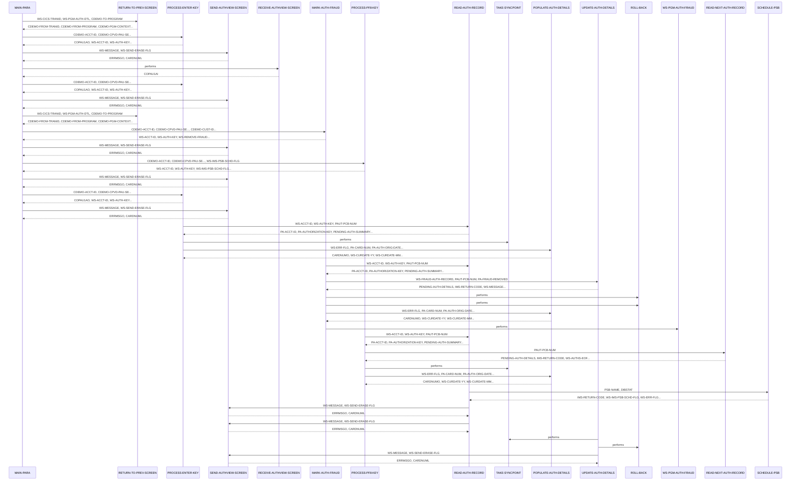

# COPAUS1C

**File:** cbl/COPAUS1C.cbl
**Type:** COBOL
**Status:** In Progress
**Iterations:** 1
**Analyzed:** 2026-01-30 19:50:53.258245

## Purpose

This program provides a detailed view of a specific pending authorization message within the CardDemo application. It allows users to view transaction details, navigate to the next authorization record, and toggle the fraud status of a transaction.

**Business Context:** CardDemo Authorization Module - enables administrators or investigators to review flagged or pending credit card authorizations for potential fraud.
**Program Type:** ONLINE_CICS
**Citations:** Lines 3, 5, 188, 191

## Calling Context

**Called By:** [COPAUS0C](./COPAUS0C.cbl.md)
**Entry Points:** CPVD
**Linkage Section:** DFHCOMMAREA

## Inputs

### DFHCOMMAREA
- **Type:** CICS_COMMAREA
- **Description:** Contains session data including account ID and the selected authorization key from the summary screen.
- **Copybook:** [COCOM01Y](../copybooks/COCOM01Y.cpy.md)
- **Lines:** 152, 171

### PAUTSUM0
- **Type:** IMS_SEGMENT
- **Description:** Pending Authorization Summary root segment, accessed by Account ID.
- **Copybook:** [CIPAUSMY](../copybooks/CIPAUSMY.cpy.md)
- **Lines:** 440, 442

### PAUTDTL1
- **Type:** IMS_SEGMENT
- **Description:** Pending Authorization Details child segment, containing specific transaction data.
- **Copybook:** [CIPAUDTY](../copybooks/CIPAUDTY.cpy.md)
- **Lines:** 466, 496

## Outputs

### COPAU1A
- **Type:** CICS_MAP
- **Description:** The Detail View screen displaying authorization details like card number, amount, merchant info, and fraud status.
- **Copybook:** [COPAU01](../copybooks/COPAU01.cpy.md)
- **Lines:** 382, 390

### PAUTDTL1
- **Type:** IMS_SEGMENT
- **Description:** Updated detail segment when fraud status is toggled.
- **Copybook:** [CIPAUDTY](../copybooks/CIPAUDTY.cpy.md)
- **Lines:** 525

## Called Programs

| Program | Call Type | Purpose | Line |
|---------|-----------|---------|------|
| [COPAUS2C](./COPAUS2C.cbl.md) | CICS_LINK | Handles fraud reporting logic and validation. | 249 |
| [CDEMO-TO-PROGRAM](./CDEMO-TO-PROGRAM.cbl.md) | STATIC_CALL | XCTL to the previous screen (usually COPAUS0C). | 368 |

## Business Rules

### BR001: Fraud Status Toggle
**Logic:** If the record is already marked as fraud, it is toggled to removed; otherwise, it is marked as confirmed fraud.
**Conditions:** IF PA-FRAUD-CONFIRMED, SET PA-FRAUD-REMOVED TO TRUE, SET PA-FRAUD-CONFIRMED TO TRUE
**Lines:** 236, 242

### BR002: Authorization Response Mapping
**Logic:** Maps response codes to 'A' (Approved/Green) or 'D' (Declined/Red) for display.
**Conditions:** IF PA-AUTH-RESP-CODE = '00'
**Lines:** 311, 317

## Copybooks Used

| Copybook | Location | Purpose | Line |
|----------|----------|---------|------|
| [COCOM01Y](../copybooks/COCOM01Y.cpy.md) | WORKING_STORAGE | Common Commarea for CardDemo | 109 |
| [COPAU01](../copybooks/COPAU01.cpy.md) | WORKING_STORAGE | BMS Mapset for Authorization screens | 122 |
| [CIPAUSMY](../copybooks/CIPAUSMY.cpy.md) | WORKING_STORAGE | IMS Segment Layout for Auth Summary | 142 |
| [CIPAUDTY](../copybooks/CIPAUDTY.cpy.md) | WORKING_STORAGE | IMS Segment Layout for Auth Details | 146 |

## Data Flow

### Reads From
- **PAUTDTL1**: PA-CARD-NUM, PA-APPROVED-AMT, PA-MERCHANT-NAME
  (Lines: 295, 308, 352)

### Writes To
- **COPAU1AO**: CARDNUMO, AUTHDTO, AUTHAMTO
  (Lines: 295, 301, 309)

### Transformations
- **PA-AUTH-ORIG-DATE** → **AUTHDTO**: Reformatting YYMMDD to MM/DD/YY for display.
  (Lines: 297, 301)

## Key Paragraphs

### MAIN-PARA
**Purpose:** This is the primary orchestration paragraph for the CICS program. It initializes program flags and checks the EIBCALEN to determine if the program was started fresh or re-entered. If the COMMAREA is empty, it redirects to the summary screen. If valid data exists, it evaluates the user's input (EIBAID) to determine whether to process the Enter key (view details), PF3 (return), PF5 (mark fraud), or PF8 (next record). It ensures the CICS session is maintained by returning with the transaction ID and COMMAREA.
- Calls: RETURN-TO-PREV-SCREEN, PROCESS-ENTER-KEY, SEND-AUTHVIEW-SCREEN, RECEIVE-AUTHVIEW-SCREEN, MARK-AUTH-FRAUD, PROCESS-PF8-KEY
- Lines: 157-206

### PROCESS-ENTER-KEY
**Purpose:** This paragraph handles the logic when the Enter key is pressed or when the program is first entered with a selection. It clears the output map and validates that the Account ID and Authorization Key are present in the COMMAREA. If valid, it calls READ-AUTH-RECORD to fetch data from the IMS database. It manages the IMS PSB state by checking if it was scheduled and then taking a syncpoint to release resources. Finally, it calls POPULATE-AUTH-DETAILS to prepare the data for the screen.
- Called by: MAIN-PARA
- Calls: READ-AUTH-RECORD, TAKE-SYNCPOINT, POPULATE-AUTH-DETAILS
- Lines: 208-228

### MARK-AUTH-FRAUD
**Purpose:** This paragraph implements the business logic for toggling the fraud status of a transaction. It retrieves the current record from the database and checks the existing fraud flag. It then flips the flag (Confirmed to Removed or vice versa) and prepares the WS-FRAUD-DATA structure. It performs a CICS LINK to COPAUS2C to process the fraud update logic. If the link is successful and the update succeeds, it calls UPDATE-AUTH-DETAILS to commit the change to the IMS database; otherwise, it performs a rollback.
- Called by: MAIN-PARA
- Calls: READ-AUTH-RECORD, UPDATE-AUTH-DETAILS, ROLL-BACK, POPULATE-AUTH-DETAILS
- Lines: 230-266

### PROCESS-PF8-KEY
**Purpose:** This paragraph facilitates sequential navigation through authorization records for a specific account. It first reads the current record to establish position in the IMS database and then calls READ-NEXT-AUTH-RECORD to fetch the subsequent child segment. If the end of the database is reached, it sets a message for the user. If a record is found, it updates the selection key in the COMMAREA and calls POPULATE-AUTH-DETAILS to refresh the screen with the new record's data.
- Called by: MAIN-PARA
- Calls: READ-AUTH-RECORD, READ-NEXT-AUTH-RECORD, TAKE-SYNCPOINT, POPULATE-AUTH-DETAILS
- Lines: 268-289

### POPULATE-AUTH-DETAILS
**Purpose:** This paragraph maps the raw data from the IMS PENDING-AUTH-DETAILS segment into the BMS map fields for display. It performs several data transformations, including formatting dates (YYMMDD to MM/DD/YY) and times (HHMMSS to HH:MM:SS). It also includes logic to set screen attributes, such as coloring the response code green for approvals and red for declines. It uses a SEARCH ALL statement against a hardcoded reason table to translate numeric decline codes into human-readable descriptions.
- Called by: PROCESS-ENTER-KEY, MARK-AUTH-FRAUD, PROCESS-PF8-KEY
- Lines: 291-358

### READ-AUTH-RECORD
**Purpose:** This paragraph performs the physical I/O to the IMS database to retrieve a specific authorization. It first ensures the PSB is scheduled. It then issues a 'GU' (Get Unique) call to the root segment (PAUTSUM0) using the Account ID. If the root is found, it issues a 'GNP' (Get Next within Parent) call to find the specific child segment (PAUTDTL1) matching the Authorization Key. It handles various IMS status codes, setting EOF flags or error messages as appropriate.
- Called by: PROCESS-ENTER-KEY, MARK-AUTH-FRAUD, PROCESS-PF8-KEY
- Calls: SCHEDULE-PSB, SEND-AUTHVIEW-SCREEN
- Lines: 431-491

### UPDATE-AUTH-DETAILS
**Purpose:** This paragraph updates an existing authorization record in the IMS database. It moves the updated fraud information into the segment layout and issues an IMS 'REPL' (Replace) command for the PAUTDTL1 segment. If the update is successful, it calls TAKE-SYNCPOINT to commit the transaction and sets a success message. If the update fails for any reason, it triggers a ROLL-BACK to ensure data integrity and reports the system error to the user.
- Called by: MARK-AUTH-FRAUD
- Calls: TAKE-SYNCPOINT, ROLL-BACK, SEND-AUTHVIEW-SCREEN
- Lines: 520-552

## Inter-Paragraph Data Flow

| Caller | Callee | Inputs | Outputs | Purpose |
|--------|--------|--------|---------|---------|
| MAIN-PARA | RETURN-TO-PREV-SCREEN | WS-CICS-TRANID, WS-PGM-AUTH-DTL, CDEMO-TO-PROGRAM | CDEMO-FROM-TRANID, CDEMO-FROM-PROGRAM, CDEMO-PGM-CONTEXT, CDEMO-PGM-ENTER | Transfers control back to the previous program using CICS XCTL after setting up the necessary communication area fields. |
| MAIN-PARA | PROCESS-ENTER-KEY | CDEMO-ACCT-ID, CDEMO-CPVD-PAU-SELECTED, WS-IMS-PSB-SCHD-FLG | COPAU1AO, WS-ACCT-ID, WS-AUTH-KEY, WS-IMS-PSB-SCHD-FLG, WS-ERR-FLG | Validates input account and authorization data to retrieve and populate authorization record details. |
| MAIN-PARA | SEND-AUTHVIEW-SCREEN | WS-MESSAGE, WS-SEND-ERASE-FLG, COPAU1AO | ERRMSGO, CARDNUML | Displays the authorization view screen to the user via CICS SEND, including any error messages and header information. |
| MAIN-PARA | RECEIVE-AUTHVIEW-SCREEN | - | COPAU1AI | Receives user input from the authorization view screen into the map input structure. |
| MAIN-PARA | PROCESS-ENTER-KEY | CDEMO-ACCT-ID, CDEMO-CPVD-PAU-SELECTED, WS-IMS-PSB-SCHD-FLG | COPAU1AO, WS-ACCT-ID, WS-AUTH-KEY, WS-IMS-PSB-SCHD-FLG, WS-ERR-FLG | Validates input account and authorization data to retrieve and populate authorization record details. |
| MAIN-PARA | SEND-AUTHVIEW-SCREEN | WS-MESSAGE, WS-SEND-ERASE-FLG | ERRMSGO, CARDNUML | Displays the authorization view screen to the user with current messages and header information. |
| MAIN-PARA | RETURN-TO-PREV-SCREEN | WS-CICS-TRANID, WS-PGM-AUTH-DTL, CDEMO-TO-PROGRAM | CDEMO-FROM-TRANID, CDEMO-FROM-PROGRAM, CDEMO-PGM-CONTEXT, CDEMO-PGM-ENTER | Transfers control back to the previous program using CICS XCTL while passing the communication area. |
| MAIN-PARA | MARK-AUTH-FRAUD | CDEMO-ACCT-ID, CDEMO-CPVD-PAU-SELECTED, CDEMO-CUST-ID, WS-PGM-AUTH-FRAUD | WS-ACCT-ID, WS-AUTH-KEY, WS-REMOVE-FRAUD, WS-REPORT-FRAUD, WS-FRAUD-AUTH-RECORD, WS-FRD-ACCT-ID, WS-FRD-CUST-ID, WS-MESSAGE, CDEMO-CPVD-PAU-SELECTED | Toggles the fraud status of an authorization record and updates the database via an external fraud program link. |
| MAIN-PARA | SEND-AUTHVIEW-SCREEN | WS-MESSAGE, WS-SEND-ERASE-FLG | ERRMSGO, CARDNUML | Refreshes the authorization view screen to show updated data or error messages after user interaction. |
| MAIN-PARA | PROCESS-PF8-KEY | CDEMO-ACCT-ID, CDEMO-CPVD-PAU-SELECTED, WS-IMS-PSB-SCHD-FLG | WS-ACCT-ID, WS-AUTH-KEY, WS-IMS-PSB-SCHD-FLG, WS-SEND-ERASE-FLG, WS-MESSAGE, CDEMO-CPVD-PAU-SELECTED | Navigates to the next authorization record in the database when the PF8 key is pressed. |
| MAIN-PARA | SEND-AUTHVIEW-SCREEN | WS-MESSAGE, WS-SEND-ERASE-FLG | ERRMSGO, CARDNUML | Sends the authorization view screen to the CICS terminal, optionally erasing the previous screen content. |
| MAIN-PARA | PROCESS-ENTER-KEY | CDEMO-ACCT-ID, CDEMO-CPVD-PAU-SELECTED | COPAU1AO, WS-ACCT-ID, WS-AUTH-KEY, WS-IMS-PSB-SCHD-FLG, WS-ERR-FLG | Validates input data and coordinates the retrieval of authorization records and population of screen details. |
| MAIN-PARA | SEND-AUTHVIEW-SCREEN | WS-MESSAGE, WS-SEND-ERASE-FLG | ERRMSGO, CARDNUML | Sends the authorization view screen to the CICS terminal, optionally erasing the previous screen content. |
| PROCESS-ENTER-KEY | READ-AUTH-RECORD | WS-ACCT-ID, WS-AUTH-KEY, PAUT-PCB-NUM | PA-ACCT-ID, PA-AUTHORIZATION-KEY, PENDING-AUTH-SUMMARY, IMS-RETURN-CODE, WS-AUTHS-EOF, WS-ERR-FLG, WS-MESSAGE, PENDING-AUTH-DETAILS | Retrieves authorization summary and detail segments from the IMS database using the account ID and authorization key. |
| PROCESS-ENTER-KEY | TAKE-SYNCPOINT | - | - | Issues a CICS SYNCPOINT command to commit database changes and release resources. |
| PROCESS-ENTER-KEY | POPULATE-AUTH-DETAILS | WS-ERR-FLG, PA-CARD-NUM, PA-AUTH-ORIG-DATE, PA-AUTH-ORIG-TIME, PA-APPROVED-AMT, PA-AUTH-RESP-CODE, WS-DECLINE-REASON-TAB, PA-AUTH-RESP-REASON, PA-PROCESSING-CODE, PA-POS-ENTRY-MODE, PA-MESSAGE-SOURCE, PA-MERCHANT-CATAGORY-CODE, PA-CARD-EXPIRY-DATE, PA-AUTH-TYPE, PA-TRANSACTION-ID, PA-MATCH-STATUS, PA-FRAUD-CONFIRMED, PA-FRAUD-REMOVED, PA-AUTH-FRAUD, PA-FRAUD-RPT-DATE, PA-MERCHANT-NAME, PA-MERCHANT-ID, PA-MERCHANT-CITY, PA-MERCHANT-STATE, PA-MERCHANT-ZIP | CARDNUMO, WS-CURDATE-YY, WS-CURDATE-MM, WS-CURDATE-DD, WS-AUTH-DATE, AUTHDTO, WS-AUTH-TIME, AUTHTMO, WS-AUTH-AMT, AUTHAMTO, AUTHRSPO, AUTHRSPC, AUTHRSNO, AUTHCDO, POSEMDO, AUTHSRCO, MCCCDO, CRDEXPO, AUTHTYPO, TRNIDO, AUTHMTCO, AUTHFRDO, MERNAMEO, MERIDO, MERCITYO, MERSTO, MERZIPO | Maps authorization record fields and status codes to screen output variables for display. |
| MARK-AUTH-FRAUD | READ-AUTH-RECORD | WS-ACCT-ID, WS-AUTH-KEY, PAUT-PCB-NUM | PA-ACCT-ID, PA-AUTHORIZATION-KEY, PENDING-AUTH-SUMMARY, IMS-RETURN-CODE, WS-AUTHS-EOF, WS-ERR-FLG, WS-MESSAGE, PENDING-AUTH-DETAILS | Retrieves authorization summary and detail segments from the IMS database using the account ID and authorization key. |
| MARK-AUTH-FRAUD | UPDATE-AUTH-DETAILS | WS-FRAUD-AUTH-RECORD, PAUT-PCB-NUM, PA-FRAUD-REMOVED | PENDING-AUTH-DETAILS, IMS-RETURN-CODE, WS-MESSAGE, WS-ERR-FLG | Updates the authorization detail segment in the database with fraud status changes and handles the transaction syncpoint. |
| MARK-AUTH-FRAUD | ROLL-BACK | - | - | Executes a CICS SYNCPOINT ROLLBACK to undo database changes in the event of an error. |
| MARK-AUTH-FRAUD | ROLL-BACK | - | - | Executes a CICS SYNCPOINT ROLLBACK to undo database changes in the event of an error. |
| MARK-AUTH-FRAUD | POPULATE-AUTH-DETAILS | WS-ERR-FLG, PA-CARD-NUM, PA-AUTH-ORIG-DATE, PA-AUTH-ORIG-TIME, PA-APPROVED-AMT, PA-AUTH-RESP-CODE, WS-DECLINE-REASON-TAB, PA-AUTH-RESP-REASON, PA-PROCESSING-CODE, PA-POS-ENTRY-MODE, PA-MESSAGE-SOURCE, PA-MERCHANT-CATAGORY-CODE, PA-CARD-EXPIRY-DATE, PA-AUTH-TYPE, PA-TRANSACTION-ID, PA-MATCH-STATUS, PA-FRAUD-CONFIRMED, PA-FRAUD-REMOVED, PA-AUTH-FRAUD, PA-FRAUD-RPT-DATE, PA-MERCHANT-NAME, PA-MERCHANT-ID, PA-MERCHANT-CITY, PA-MERCHANT-STATE, PA-MERCHANT-ZIP | CARDNUMO, WS-CURDATE-YY, WS-CURDATE-MM, WS-CURDATE-DD, WS-AUTH-DATE, AUTHDTO, WS-AUTH-TIME, AUTHTMO, WS-AUTH-AMT, AUTHAMTO, AUTHRSPO, AUTHRSPC, AUTHRSNO, AUTHCDO, POSEMDO, AUTHSRCO, MCCCDO, CRDEXPO, AUTHTYPO, TRNIDO, AUTHMTCO, AUTHFRDO, MERNAMEO, MERIDO, MERCITYO, MERSTO, MERZIPO | Formats and moves authorization record data into screen output fields for display. |
| PROCESS-PF8-KEY | READ-AUTH-RECORD | WS-ACCT-ID, WS-AUTH-KEY, PAUT-PCB-NUM | PA-ACCT-ID, PA-AUTHORIZATION-KEY, PENDING-AUTH-SUMMARY, IMS-RETURN-CODE, WS-AUTHS-EOF, WS-ERR-FLG, WS-MESSAGE, PENDING-AUTH-DETAILS | Retrieves the authorization summary and detail records from the database based on account and authorization keys. |
| PROCESS-PF8-KEY | READ-NEXT-AUTH-RECORD | PAUT-PCB-NUM | PENDING-AUTH-DETAILS, IMS-RETURN-CODE, WS-AUTHS-EOF, WS-ERR-FLG, WS-MESSAGE | Retrieves the next sequential authorization detail record from the database. |
| PROCESS-PF8-KEY | TAKE-SYNCPOINT | - | - | Commits database changes and releases resources by issuing a CICS SYNCPOINT. |
| PROCESS-PF8-KEY | POPULATE-AUTH-DETAILS | WS-ERR-FLG, PA-CARD-NUM, PA-AUTH-ORIG-DATE, PA-AUTH-ORIG-TIME, PA-APPROVED-AMT, PA-AUTH-RESP-CODE, WS-DECLINE-REASON-TAB, PA-AUTH-RESP-REASON, PA-PROCESSING-CODE, PA-POS-ENTRY-MODE, PA-MESSAGE-SOURCE, PA-MERCHANT-CATAGORY-CODE, PA-CARD-EXPIRY-DATE, PA-AUTH-TYPE, PA-TRANSACTION-ID, PA-MATCH-STATUS, PA-FRAUD-CONFIRMED, PA-FRAUD-REMOVED, PA-AUTH-FRAUD, PA-FRAUD-RPT-DATE, PA-MERCHANT-NAME, PA-MERCHANT-ID, PA-MERCHANT-CITY, PA-MERCHANT-STATE, PA-MERCHANT-ZIP | CARDNUMO, WS-CURDATE-YY, WS-CURDATE-MM, WS-CURDATE-DD, WS-AUTH-DATE, AUTHDTO, WS-AUTH-TIME, AUTHTMO, WS-AUTH-AMT, AUTHAMTO, AUTHRSPO, AUTHRSPC, AUTHRSNO, AUTHCDO, POSEMDO, AUTHSRCO, MCCCDO, CRDEXPO, AUTHTYPO, TRNIDO, AUTHMTCO, AUTHFRDO, MERNAMEO, MERIDO, MERCITYO, MERSTO, MERZIPO | Formats and moves authorization record data into screen output fields for display. |
| SEND-AUTHVIEW-SCREEN | POPULATE-HEADER-INFO | CCDA-TITLE01, CCDA-TITLE02, WS-CICS-TRANID, WS-PGM-AUTH-DTL, WS-CURDATE-DATA, WS-CURDATE-MONTH, WS-CURDATE-DAY, WS-CURDATE-YEAR, WS-CURTIME-HOURS, WS-CURTIME-MINUTE, WS-CURTIME-SECOND | WS-CURDATE-DATA, TITLE01O, TITLE02O, TRNNAMEO, PGMNAMEO, WS-CURDATE-MM, WS-CURDATE-DD, WS-CURDATE-YY, CURDATEO, WS-CURTIME-HH, WS-CURTIME-MM, WS-CURTIME-SS, CURTIMEO | Populates the screen header fields with system date, time, and program identifiers. |
| READ-AUTH-RECORD | SCHEDULE-PSB | PSB-NAME, DIBSTAT | IMS-RETURN-CODE, WS-IMS-PSB-SCHD-FLG, WS-ERR-FLG, WS-MESSAGE | Schedules the IMS PSB for database access and handles potential scheduling errors. |
| READ-AUTH-RECORD | SEND-AUTHVIEW-SCREEN | WS-MESSAGE, WS-SEND-ERASE-FLG | ERRMSGO, CARDNUML | Displays the authorization view screen to the user, typically to report a system error during record retrieval. |
| READ-AUTH-RECORD | SEND-AUTHVIEW-SCREEN | WS-MESSAGE, WS-SEND-ERASE-FLG | ERRMSGO, CARDNUML | Displays the authorization view screen to the user, typically to report a system error during record retrieval. |
| READ-NEXT-AUTH-RECORD | SEND-AUTHVIEW-SCREEN | WS-MESSAGE, WS-SEND-ERASE-FLG | ERRMSGO, CARDNUML | Displays the authorization view screen to the user when an error occurs while reading the next sequential authorization record. |
| UPDATE-AUTH-DETAILS | TAKE-SYNCPOINT | - | - | Commits the database changes by issuing a CICS SYNCPOINT. |
| UPDATE-AUTH-DETAILS | ROLL-BACK | - | - | Reverts database changes by issuing a CICS SYNCPOINT ROLLBACK in the event of an error. |
| UPDATE-AUTH-DETAILS | SEND-AUTHVIEW-SCREEN | WS-MESSAGE, WS-SEND-ERASE-FLG | ERRMSGO, CARDNUML | Displays the authorization view screen to the user, typically showing error messages after a failed update. |
| SCHEDULE-PSB | SEND-AUTHVIEW-SCREEN | WS-MESSAGE, WS-SEND-ERASE-FLG | ERRMSGO, CARDNUML | Displays the authorization view screen to report a system error when the IMS PSB cannot be scheduled. |

## Error Handling

- **IMS Status Code NOT OK:** Set error flag, format error message with status code, and display on screen.
  (Lines: 452, 478, 507)
- **CICS Link Failure or Fraud Update Failure:** Perform SYNCPOINT ROLLBACK to undo database changes.
  (Lines: 258, 261, 540)

## CICS Operations

| Command | Resource | Purpose | Line |
|---------|----------|---------|------|
| LINK | COPAUS2C | Call fraud processing sub-module | 248 |
| SEND MAP | COPAU1A | Display the authorization detail screen | 381 |
| SYNCPOINT | N/A | Commit database changes | 558 |
| SYNCPOINT ROLLBACK | N/A | Undo database changes on error | 567 |

## Sequence Diagram

---
*Generated by War Rig WAR_RIG*