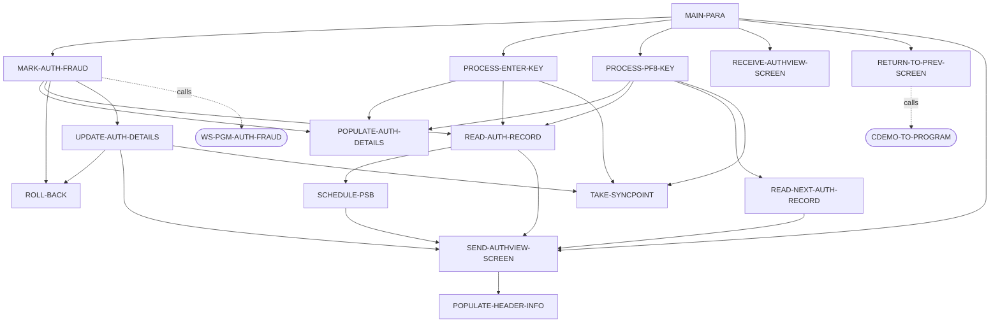
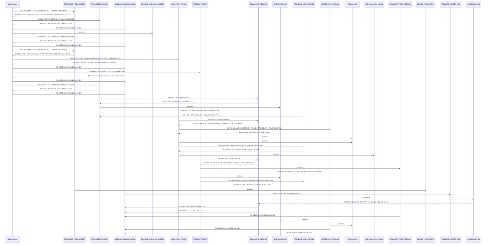

# COPAUS1C

**File**: `cbl/COPAUS1C.cbl`
**Type**: FileType.COBOL
**Analyzed**: 2026-02-03 21:21:07.310002

## Purpose

This CICS COBOL program, COPAUS1C, displays detailed information about a selected authorization record. It retrieves authorization details from an IMS database, allows marking authorizations as fraudulent, and links to another program to update fraud status. It is part of the CardDemo application's authorization module.

**Business Context**: This program is used to view and manage authorization details within the CardDemo application, likely for customer service or fraud investigation purposes.

## Inputs

| Name | Type | Description |
|------|------|-------------|
| CARDDEMO-COMMAREA | IOType.CICS_COMMAREA | Communication area passed between CICS programs, containing account ID, selected authorization key, and other context data. |
| PAUTSUM0 | IOType.IMS_SEGMENT | Pending Authorization Summary segment from IMS database, containing summary information about the authorization. |
| PAUTDTL1 | IOType.IMS_SEGMENT | Pending Authorization Details segment from IMS database, containing detailed information about the authorization. |
| COPAU1AI | IOType.CICS_MAP | Input map for the COPAU1A screen, used to receive data entered by the user. |

## Outputs

| Name | Type | Description |
|------|------|-------------|
| COPAU1AO | IOType.CICS_MAP | Output map for the COPAU1A screen, used to display authorization details and messages to the user. |

## Called Programs

| Program | Call Type | Purpose |
|---------|-----------|---------|
| COPAUS0C | CallType.STATIC_CALL | Returns to the authorization summary screen. |
| COPAUS2C | CallType.CICS_LINK | Updates the fraud status of an authorization record. |

## Business Rules

- **BR001**: If the account ID is numeric and an authorization is selected, read the authorization record from the IMS database.
- **BR002**: Determine the fraud status of an authorization and set the appropriate flag.

## Paragraphs/Procedures

### MAIN-PARA
This is the main paragraph that controls the overall program flow. It first initializes flags and variables, then checks if the program is being called for the first time (EIBCALEN = 0). If it's the first time, it initializes the CARDDEMO-COMMAREA and calls RETURN-TO-PREV-SCREEN to return to the authorization summary screen. If it's a re-entry, it moves the DFHCOMMAREA to CARDDEMO-COMMAREA and processes the user's input based on the EIBAID. Depending on the AID, it performs different actions such as processing the ENTER key, returning to the previous screen (PF3), marking authorization as fraud (PF5), or processing PF8 to read the next authorization record. If an invalid key is pressed, it displays an error message. Finally, it returns to CICS with the updated COMMAREA.

### PROCESS-ENTER-KEY
This paragraph handles the processing when the user presses the ENTER key. It initializes the COPAU1AO map and checks if the account ID is numeric and an authorization is selected. If both conditions are met, it moves the account ID and authorization key to working storage variables and calls READ-AUTH-RECORD to retrieve the authorization details from the IMS database. If the PSB is scheduled, it takes a syncpoint. If the account ID is not numeric or no authorization is selected, it sets the error flag. Finally, it calls POPULATE-AUTH-DETAILS to populate the screen fields with the retrieved data.

### MARK-AUTH-FRAUD
This paragraph handles the process of marking or unmarking an authorization record as fraudulent. It moves the account ID and authorization key to working storage. It then calls READ-AUTH-RECORD to retrieve the authorization details. If the authorization is already marked as fraud, it removes the fraud flag (PA-FRAUD-REMOVED); otherwise, it sets the fraud flag (PA-FRAUD-CONFIRMED). It then moves the PENDING-AUTH-DETAILS to WS-FRAUD-AUTH-RECORD, the account ID to WS-FRD-ACCT-ID, and the customer ID to WS-FRD-CUST-ID. It then links to the COPAUS2C program to update the fraud status. If the link is successful and the update is successful, it calls UPDATE-AUTH-DETAILS. Otherwise, it displays an error message and performs a rollback. Finally, it populates the authorization details on the screen.

### PROCESS-PF8-KEY
This paragraph handles the processing when the user presses the PF8 key to view the next authorization record. It moves the account ID and authorization key to working storage variables and calls READ-AUTH-RECORD to retrieve the current authorization details. It then calls READ-NEXT-AUTH-RECORD to retrieve the next authorization record. If the PSB is scheduled, it takes a syncpoint. If there are no more authorization records (AUTHS-EOF), it sets a flag to prevent erasing the screen and displays a message indicating that the user is already at the last authorization. Otherwise, it moves the authorization key of the next record to CDEMO-CPVD-PAU-SELECTED and calls POPULATE-AUTH-DETAILS to display the details of the next authorization record.

### POPULATE-AUTH-DETAILS
This paragraph populates the authorization details on the screen (COPAU1AO) with data from the PENDING-AUTH-DETAILS segment. It moves various fields from the PENDING-AUTH-DETAILS segment to the corresponding output fields in the COPAU1AO map, formatting the date, time, and amount as needed. It determines the authorization response status (approved or declined) and sets the corresponding indicator and color. It searches the WS-DECLINE-REASON-TAB table to find the description of the decline reason code and displays it on the screen. It also handles the display of fraud information, displaying the fraud report date if the authorization is marked as fraudulent.

### RETURN-TO-PREV-SCREEN
This paragraph prepares the COMMAREA for returning to the previous screen (authorization summary). It moves the CICS transaction ID and the current program ID to the CARDDEMO-COMMAREA. It sets the program context to zero and sets the program enter flag to true. Finally, it performs a CICS XCTL to the program specified in CDEMO-TO-PROGRAM, passing the CARDDEMO-COMMAREA.

### SEND-AUTHVIEW-SCREEN
This paragraph sends the authorization detail view screen (COPAU1A) to the terminal. It first calls POPULATE-HEADER-INFO to populate the header information on the screen. It then moves any error messages to the ERRMSGO field in the COPAU1AO map. If the SEND-ERASE-YES flag is set, it sends the map with the ERASE option, clearing the screen before displaying the data. Otherwise, it sends the map without the ERASE option, overlaying the new data on the existing screen content. In both cases, the CURSOR option is used to position the cursor on the screen.

### RECEIVE-AUTHVIEW-SCREEN
This paragraph receives data from the COPAU1A screen. It executes a CICS RECEIVE command to receive the data entered by the user into the COPAU1AI map. The NOHANDLE option is specified to prevent CICS from handling any errors that occur during the receive operation; the program will handle any errors itself.

### POPULATE-HEADER-INFO
This paragraph populates the header information on the screen. It moves the current date and time to working storage variables. It then moves the title strings, transaction ID, and program ID to the corresponding output fields in the COPAU1AO map. It formats the current date and time and moves them to the CURDATEO and CURTIMEO fields in the COPAU1AO map.

### READ-AUTH-RECORD
This paragraph reads the authorization record from the IMS database. It first calls SCHEDULE-PSB to schedule the PSB. It then moves the account ID and authorization key from working storage to the PA-ACCT-ID and PA-AUTHORIZATION-KEY fields. It then executes a DLI GU (Get Unique) command to retrieve the PENDING-AUTH-SUMMARY segment from the IMS database, using the account ID as the search key. If the segment is found, it executes a DLI GNP (Get Next within Parent) command to retrieve the PENDING-AUTH-DETAILS segment, using the authorization key as the search key. If any errors occur during the read operation, it sets the error flag and displays an error message.

### READ-NEXT-AUTH-RECORD
This paragraph reads the next authorization detail record from the IMS database. It executes a DLI GNP (Get Next within Parent) command to retrieve the next PENDING-AUTH-DETAILS segment. It checks the IMS return code (DIBSTAT) to determine if the read was successful. If the read is successful, it sets the AUTHS-NOT-EOF flag to true. If the end of the database is reached, it sets the AUTHS-EOF flag to true. If any other error occurs, it sets the error flag and displays an error message.

### UPDATE-AUTH-DETAILS
This paragraph updates the authorization details in the IMS database. It moves the WS-FRAUD-AUTH-RECORD to the PENDING-AUTH-DETAILS segment. It then executes a DLI REPL (Replace) command to update the PENDING-AUTH-DETAILS segment in the IMS database. It checks the IMS return code (DIBSTAT) to determine if the update was successful. If the update is successful, it performs a syncpoint and displays a message indicating whether the authorization was marked or removed as fraud. If the update fails, it performs a rollback and displays an error message.

### TAKE-SYNCPOINT
This paragraph takes a syncpoint, which commits the changes made to the database. It executes a CICS SYNCPOINT command to commit the changes.

### ROLL-BACK
This paragraph rolls back the database changes. It executes a CICS SYNCPOINT ROLLBACK command to undo any changes made to the database since the last syncpoint.

### SCHEDULE-PSB
This paragraph schedules the PSB (Program Specification Block) for IMS database access. It executes a DLI SCHD (Schedule) command to schedule the PSB specified in PSB-NAME. If the PSB is already scheduled, it terminates the current PSB and schedules it again. It checks the IMS return code (DIBSTAT) to determine if the scheduling was successful. If the scheduling is successful, it sets the IMS-PSB-SCHD flag to true. If the scheduling fails, it sets the error flag and displays an error message.

## Control Flow

## Open Questions

- ? What is the exact format and content of the COPAU1A BMS map?
  - Context: The copybook COPAU01 is included, but the actual BMS definition is not available.
- ? What is the purpose of the CDEMO-PGM-CONTEXT field in the CARDDEMO-COMMAREA?
  - Context: It is moved ZEROS to this field in RETURN-TO-PREV-SCREEN, but its purpose is not clear from this program.

## Sequence Diagram

