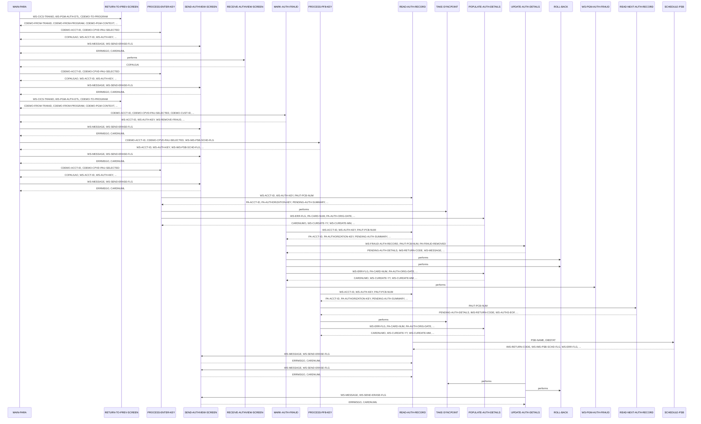

# COPAUS1C

**File**: `cbl/COPAUS1C.cbl`
**Type**: FileType.COBOL
**Analyzed**: 2026-01-30 19:50:53.258245

## Purpose

This program provides a detailed view of a specific pending authorization message within the CardDemo application. It allows users to view transaction details, navigate to the next authorization record, and toggle the fraud status of a transaction.

**Business Context**: CardDemo Authorization Module - enables administrators or investigators to review flagged or pending credit card authorizations for potential fraud.

## Inputs

| Name | Type | Description |
|------|------|-------------|
| DFHCOMMAREA | IOType.CICS_COMMAREA | Contains session data including account ID and the selected authorization key from the summary screen. |
| PAUTSUM0 | IOType.IMS_SEGMENT | Pending Authorization Summary root segment, accessed by Account ID. |
| PAUTDTL1 | IOType.IMS_SEGMENT | Pending Authorization Details child segment, containing specific transaction data. |

## Outputs

| Name | Type | Description |
|------|------|-------------|
| COPAU1A | IOType.CICS_MAP | The Detail View screen displaying authorization details like card number, amount, merchant info, and fraud status. |
| PAUTDTL1 | IOType.IMS_SEGMENT | Updated detail segment when fraud status is toggled. |

## Called Programs

| Program | Call Type | Purpose |
|---------|-----------|---------|
| COPAUS2C | CallType.CICS_LINK | Handles fraud reporting logic and validation. |
| CDEMO-TO-PROGRAM | CallType.STATIC_CALL | XCTL to the previous screen (usually COPAUS0C). |

## Business Rules

- **BR001**: Fraud Status Toggle
- **BR002**: Authorization Response Mapping

## Paragraphs/Procedures

### MAIN-PARA
This is the primary orchestration paragraph for the CICS program. It initializes program flags and checks the EIBCALEN to determine if the program was started fresh or re-entered. If the COMMAREA is empty, it redirects to the summary screen. If valid data exists, it evaluates the user's input (EIBAID) to determine whether to process the Enter key (view details), PF3 (return), PF5 (mark fraud), or PF8 (next record). It ensures the CICS session is maintained by returning with the transaction ID and COMMAREA.

### PROCESS-ENTER-KEY
This paragraph handles the logic when the Enter key is pressed or when the program is first entered with a selection. It clears the output map and validates that the Account ID and Authorization Key are present in the COMMAREA. If valid, it calls READ-AUTH-RECORD to fetch data from the IMS database. It manages the IMS PSB state by checking if it was scheduled and then taking a syncpoint to release resources. Finally, it calls POPULATE-AUTH-DETAILS to prepare the data for the screen.

### MARK-AUTH-FRAUD
This paragraph implements the business logic for toggling the fraud status of a transaction. It retrieves the current record from the database and checks the existing fraud flag. It then flips the flag (Confirmed to Removed or vice versa) and prepares the WS-FRAUD-DATA structure. It performs a CICS LINK to COPAUS2C to process the fraud update logic. If the link is successful and the update succeeds, it calls UPDATE-AUTH-DETAILS to commit the change to the IMS database; otherwise, it performs a rollback.

### PROCESS-PF8-KEY
This paragraph facilitates sequential navigation through authorization records for a specific account. It first reads the current record to establish position in the IMS database and then calls READ-NEXT-AUTH-RECORD to fetch the subsequent child segment. If the end of the database is reached, it sets a message for the user. If a record is found, it updates the selection key in the COMMAREA and calls POPULATE-AUTH-DETAILS to refresh the screen with the new record's data.

### POPULATE-AUTH-DETAILS
This paragraph maps the raw data from the IMS PENDING-AUTH-DETAILS segment into the BMS map fields for display. It performs several data transformations, including formatting dates (YYMMDD to MM/DD/YY) and times (HHMMSS to HH:MM:SS). It also includes logic to set screen attributes, such as coloring the response code green for approvals and red for declines. It uses a SEARCH ALL statement against a hardcoded reason table to translate numeric decline codes into human-readable descriptions.

### READ-AUTH-RECORD
This paragraph performs the physical I/O to the IMS database to retrieve a specific authorization. It first ensures the PSB is scheduled. It then issues a 'GU' (Get Unique) call to the root segment (PAUTSUM0) using the Account ID. If the root is found, it issues a 'GNP' (Get Next within Parent) call to find the specific child segment (PAUTDTL1) matching the Authorization Key. It handles various IMS status codes, setting EOF flags or error messages as appropriate.

### UPDATE-AUTH-DETAILS
This paragraph updates an existing authorization record in the IMS database. It moves the updated fraud information into the segment layout and issues an IMS 'REPL' (Replace) command for the PAUTDTL1 segment. If the update is successful, it calls TAKE-SYNCPOINT to commit the transaction and sets a success message. If the update fails for any reason, it triggers a ROLL-BACK to ensure data integrity and reports the system error to the user.

## Control Flow

## Sequence Diagram

