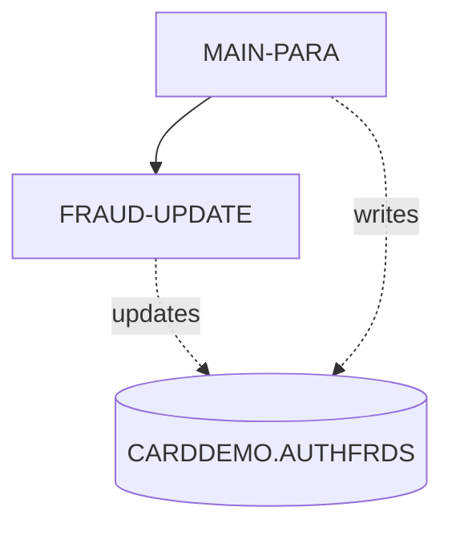
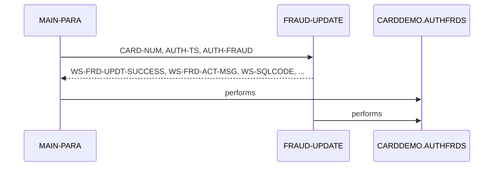

# COPAUS2C

**File**: `cbl/COPAUS2C.cbl`
**Type**: FileType.COBOL
**Analyzed**: 2026-02-03 21:06:56.976223

## Purpose

This CICS COBOL program, COPAUS2C, marks an authorization message as fraudulent by inserting a record into the CARDDEMO.AUTHFRDS table. If a record with the same key already exists, it updates the existing record to mark it as fraudulent. The program receives input via the CICS COMMAREA.

**Business Context**: This program is part of a card authorization system and is used to flag potentially fraudulent transactions.

## Inputs

| Name | Type | Description |
|------|------|-------------|
| DFHCOMMAREA | IOType.CICS_COMMAREA | Contains the account ID (WS-ACCT-ID), customer ID (WS-CUST-ID), and fraud authorization record (WS-FRAUD-AUTH-RECORD) which includes authorization details. Also contains the fraud status record (WS-FRAUD-STATUS-RECORD) indicating the action to take (report or remove fraud). |
| CARDDEMO.AUTHFRDS | IOType.DB2_TABLE | This is the DB2 table where fraudulent authorization records are stored. The program either inserts a new record or updates an existing one. |

## Outputs

| Name | Type | Description |
|------|------|-------------|
| CARDDEMO.AUTHFRDS | IOType.DB2_TABLE | The program inserts or updates records in this table to mark authorization messages as fraudulent. |
| DFHCOMMAREA | IOType.CICS_COMMAREA | The COMMAREA is updated with a status message (WS-FRD-ACT-MSG) indicating whether the fraud update was successful or failed. |

## Business Rules

- **BR001**: If a record with the same key (CARD_NUM and AUTH_TS) already exists in the AUTHFRDS table, update the AUTH_FRAUD and FRAUD_RPT_DATE columns instead of inserting a new record.

## Paragraphs/Procedures

### MAIN-PARA
This is the main paragraph of the COPAUS2C program. It begins by retrieving the current date and time using CICS ASKTIME and FORMATTIME commands and storing them in WS-ABS-TIME and WS-CUR-DATE respectively. The current date is then moved to PA-FRAUD-RPT-DATE. The authorization date and time from the input COMMAREA (PA-AUTH-ORIG-DATE and PA-AUTH-TIME-9C) are transformed and moved to WS-AUTH-TS. The program then moves data from the input COMMAREA (WS-FRAUD-AUTH-RECORD) to corresponding fields used in the SQL INSERT statement. The program attempts to insert a new record into the CARDDEMO.AUTHFRDS table with the provided information. If the insert is successful (SQLCODE = ZERO), it sets WS-FRD-UPDT-SUCCESS to TRUE and moves 'ADD SUCCESS' to WS-FRD-ACT-MSG. If the insert fails due to a duplicate key (SQLCODE = -803), the program calls the FRAUD-UPDATE paragraph to update the existing record. If any other SQL error occurs, the program sets WS-FRD-UPDT-FAILED to TRUE, moves the SQLCODE and SQLSTATE to WS-SQLCODE and WS-SQLSTATE, and constructs an error message in WS-FRD-ACT-MSG. Finally, the program returns to the calling program using EXEC CICS RETURN.

### FRAUD-UPDATE
This paragraph updates an existing record in the CARDDEMO.AUTHFRDS table. It sets the AUTH_FRAUD and FRAUD_RPT_DATE columns for the record matching the CARD_NUM and AUTH_TS from the input COMMAREA. The AUTH_TS is formatted using TIMESTAMP_FORMAT. If the update is successful (SQLCODE = ZERO), it sets WS-FRD-UPDT-SUCCESS to TRUE and moves 'UPDT SUCCESS' to WS-FRD-ACT-MSG. If the update fails, it sets WS-FRD-UPDT-FAILED to TRUE, moves the SQLCODE and SQLSTATE to WS-SQLCODE and WS-SQLSTATE, and constructs an error message in WS-FRD-ACT-MSG. This paragraph is called by MAIN-PARA when an INSERT statement fails due to a duplicate key.

## Control Flow

## Open Questions

- ? What is the structure of the CIPAUDTY copybook?
  - Context: The copybook is used to define the WS-FRAUD-AUTH-RECORD, but the contents are not available in the provided code.

## Sequence Diagram

