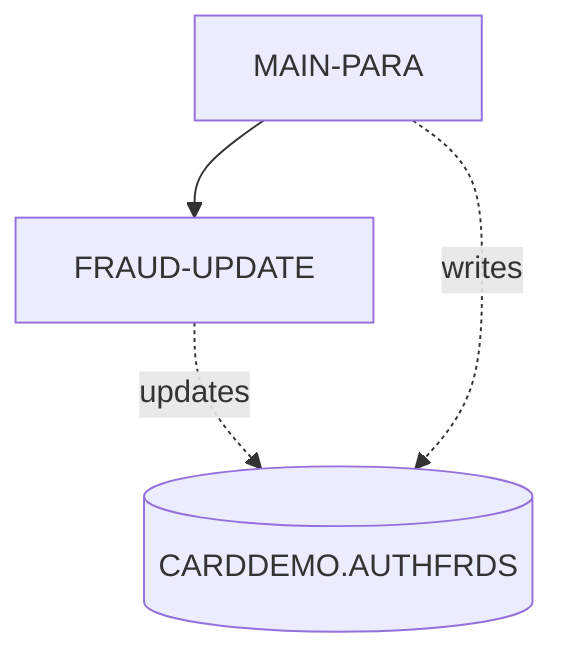

# COPAUS2C

**File**: `cbl/COPAUS2C.cbl`
**Type**: FileType.COBOL
**Analyzed**: 2026-01-30 19:28:37.160519

## Purpose

This CICS COBOL program marks an authorization message as fraud by inserting a record into the CARDDEMO.AUTHFRDS DB2 table using data from the commarea. If the insert fails due to a duplicate key error (SQLCODE -803), it performs an update on the existing record to set the fraud flag and report date. Upon completion, it sets status messages in the commarea and returns to CICS.

**Business Context**: CardDemo Authorization Module: Handles fraud reporting for authorization transactions by logging or updating fraud indicators in the AUTHFRDS table.

## Inputs

| Name | Type | Description |
|------|------|-------------|
| DFHCOMMAREA | IOType.CICS_COMMAREA | Contains WS-ACCT-ID, WS-CUST-ID, WS-FRAUD-AUTH-RECORD (from CIPAUDTY copybook with PA- fields like PA-AUTH-ORIG-DATE, PA-CARD-NUM), and WS-FRAUD-STATUS-RECORD (WS-FRD-ACTION, etc.) providing authorization details and fraud action flag. |
| SQLCA | IOType.OTHER | SQL communication area for DB2 error codes and states (SQLCODE, SQLSTATE). |

## Outputs

| Name | Type | Description |
|------|------|-------------|
| DFHCOMMAREA | IOType.CICS_COMMAREA | Updated with WS-FRD-UPDT-SUCCESS/FAILED flags and WS-FRD-ACT-MSG status message before CICS RETURN. |
| CARDDEMO.AUTHFRDS | IOType.DB2_TABLE | Fraud authorization records inserted or updated with fields like CARD_NUM, AUTH_TS, AUTH_FRAUD='F', FRAUD_RPT_DATE. |

## Business Rules

- **BR001**: If fraud action is to report fraud (WS-FRD-ACTION='F'), insert new record into AUTHFRDS; if duplicate (-803), update existing record to set AUTH_FRAUD='F' and current FRAUD_RPT_DATE.
- **BR002**: On SQL error not zero or -803 (insert) or not zero (update), set failure flag and build error message with SQLCODE/SQLSTATE.

## Paragraphs/Procedures

### COPAUS2C
This is the program entry point defined by PROGRAM-ID, serving as the CICS transaction entry for the fraud marking function. It has no explicit code body visible, implying direct flow to MAIN-PARA as the primary procedure division start. No inputs are consumed directly here; control passes to MAIN-PARA which reads from DFHCOMMAREA linkage. No outputs produced directly; defers to MAIN-PARA for DB2 operations and commarea updates. No business logic or decisions implemented in this single line. No error handling performed. It effectively calls or transfers to MAIN-PARA implicitly in standard COBOL CICS structure, and static analysis notes includes like CIPAUDTY, SQLCA, AUTHFRDS which are loaded at compile time.

### MAIN-PARA
This is the main orchestration paragraph controlling the entire program flow for marking authorization as fraud. It begins by consuming CICS ABSTIME via ASKTIME and formatting current date into WS-CUR-DATE using FORMATTIME, then moves it to PA-FRAUD-RPT-DATE (91-101). It reads PA- fields from WS-FRAUD-AUTH-RECORD in linkage (e.g., PA-AUTH-ORIG-DATE, PA-CARD-NUM) and transforms date/time: substrings to WS-AUTH-YY/MM/DD and computes WS-AUTH-TIME as 999999999 minus PA-AUTH-TIME-9C, parsing to WS-AUTH-TS (103-111). It then moves ~25 fields from PA- linkage to SQL host variables (e.g., CARD-NUM, AUTH-TS, AUTH-FRAUD from WS-FRD-ACTION) (113-139). The core business logic is EXEC SQL INSERT into CARDDEMO.AUTHFRDS with fraud details and CURRENT DATE for FRAUD_RPT_DATE (141-198). It checks SQLCODE: if 0, sets success and 'ADD SUCCESS' message; if -803 (duplicate), PERFORM FRAUD-UPDATE; else sets failure, builds error string with SQLCODE/SQLSTATE into WS-FRD-ACT-MSG (199-216). Error handling uses NOHANDLE on CICS calls and SQLCODE checks with abend avoidance via status messages. Finally, EXEC CICS RETURN with updated commarea (218). No loops; linear flow with 4 decision points on SQLCODE.

### FRAUD-UPDATE
This paragraph handles the fallback update for existing fraud records when INSERT detects duplicate key (SQLCODE -803). It consumes host variables set in MAIN-PARA: AUTH-FRAUD ('F' from WS-FRD-ACTION), CARD-NUM, AUTH-TS for WHERE clause. It produces an UPDATE to CARDDEMO.AUTHFRDS setting AUTH_FRAUD = :AUTH-FRAUD and FRAUD_RPT_DATE = CURRENT DATE, matching on CARD_NUM and AUTH_TS (222-229). Business logic targets precise record update without affecting others. It checks SQLCODE post-update: if 0, sets WS-FRD-UPDT-SUCCESS and 'UPDT SUCCESS' in WS-FRD-ACT-MSG; else sets failure and builds error string with SQLCODE/SQLSTATE (230-243). Error handling mirrors MAIN-PARA: status flags and messages, no abend. Called only from MAIN-PARA on duplicate error. Returns control to caller after update attempt.

## Control Flow

## Open Questions

- ? Definition of PA-AUTH-TIME-9C and other PA- fields not visible.
  - Context: Used in COMPUTE at line 107 and moves (e.g., 113), but defined in unshown CIPAUDTY copybook.
- ? Transaction ID invoking this program.
  - Context: Entry point COPAUS2C, but no explicit transaction ID in code.

## Sequence Diagram

