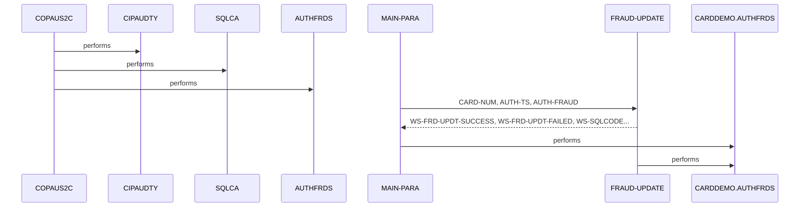

# COPAUS2C

**File:** cbl/COPAUS2C.cbl
**Type:** COBOL
**Status:** In Progress
**Iterations:** 1
**Analyzed:** 2026-01-30 19:28:37.160519

## Purpose

This CICS COBOL program marks an authorization message as fraud by inserting a record into the CARDDEMO.AUTHFRDS DB2 table using data from the commarea. If the insert fails due to a duplicate key error (SQLCODE -803), it performs an update on the existing record to set the fraud flag and report date. Upon completion, it sets status messages in the commarea and returns to CICS.

**Business Context:** CardDemo Authorization Module: Handles fraud reporting for authorization transactions by logging or updating fraud indicators in the AUTHFRDS table.
**Program Type:** ONLINE_CICS
**Citations:** Lines 3, 4, 5, 89, 218

## Calling Context

**Entry Points:** COPAUS2C
**Linkage Section:** DFHCOMMAREA, WS-ACCT-ID, WS-CUST-ID, WS-FRAUD-AUTH-RECORD, WS-FRD-ACTION, WS-FRD-ACT-MSG

## Inputs

### DFHCOMMAREA
- **Type:** CICS_COMMAREA
- **Description:** Contains WS-ACCT-ID, WS-CUST-ID, WS-FRAUD-AUTH-RECORD (from CIPAUDTY copybook with PA- fields like PA-AUTH-ORIG-DATE, PA-CARD-NUM), and WS-FRAUD-STATUS-RECORD (WS-FRD-ACTION, etc.) providing authorization details and fraud action flag.
- **Copybook:** [CIPAUDTY](../copybooks/CIPAUDTY.cpy.md)
- **Lines:** 74, 75, 76, 77, 78, 80, 137, 138, 139

### SQLCA
- **Type:** OTHER
- **Description:** SQL communication area for DB2 error codes and states (SQLCODE, SQLSTATE).
- **Lines:** 65, 66, 199, 230

## Outputs

### DFHCOMMAREA
- **Type:** CICS_COMMAREA
- **Description:** Updated with WS-FRD-UPDT-SUCCESS/FAILED flags and WS-FRD-ACT-MSG status message before CICS RETURN.
- **Lines:** 84, 85, 86, 200, 201, 212, 232, 241

### CARDDEMO.AUTHFRDS
- **Type:** DB2_TABLE
- **Description:** Fraud authorization records inserted or updated with fields like CARD_NUM, AUTH_TS, AUTH_FRAUD='F', FRAUD_RPT_DATE.
- **Copybook:** [AUTHFRDS](../copybooks/AUTHFRDS.cpy.md)
- **Lines:** 142, 223

## Business Rules

### BR001: If fraud action is to report fraud (WS-FRD-ACTION='F'), insert new record into AUTHFRDS; if duplicate (-803), update existing record to set AUTH_FRAUD='F' and current FRAUD_RPT_DATE.
**Logic:** MOVE WS-FRD-ACTION TO AUTH-FRAUD then INSERT; on SQLCODE=-803 PERFORM FRAUD-UPDATE which does targeted UPDATE on CARD_NUM and AUTH_TS.
**Conditions:** IF SQLCODE = ZERO, IF SQLCODE = -803
**Lines:** 137, 194, 199, 203, 224

### BR002: On SQL error not zero or -803 (insert) or not zero (update), set failure flag and build error message with SQLCODE/SQLSTATE.
**Logic:** SET WS-FRD-UPDT-FAILED TRUE and STRING error into WS-FRD-ACT-MSG.
**Conditions:** IF SQLCODE NOT = ZERO, IF SQLCODE NOT = -803
**Lines:** 206, 230, 233

## Copybooks Used

| Copybook | Location | Purpose | Line |
|----------|----------|---------|------|
| [CIPAUDTY](../copybooks/CIPAUDTY.cpy.md) | LINKAGE | Defines WS-FRAUD-AUTH-RECORD structure with PA- fields (e.g., PA-CARD-NUM, PA-AUTH-ORIG-DATE, PA-AUTH-TYPE) for authorization data from commarea. | 78 |
| [AUTHFRDS](../copybooks/AUTHFRDS.cpy.md) | WORKING_STORAGE | SQL INCLUDE defining host variables (e.g., CARD-NUM, AUTH-TS) matching CARDDEMO.AUTHFRDS table columns. | 69 |
| [DFHBMSCA](../copybooks/DFHBMSCA.cpy.md) | WORKING_STORAGE | CICS BMS symbolic map copybook, unused in visible code. | 61 |
| [SQLCA](../copybooks/SQLCA.cpy.md) | WORKING_STORAGE | SQL communication area for error handling (SQLCODE, SQLSTATE). | 66 |

## Data Flow

### Reads From
- **DFHCOMMAREA**: WS-FRD-ACTION, WS-ACCT-ID, WS-CUST-ID, PA-AUTH-ORIG-DATE, PA-CARD-NUM, PA-AUTH-TYPE
  (Lines: 80, 137, 138, 103, 113, 115)

### Writes To
- **CARDDEMO.AUTHFRDS**: AUTH_FRAUD, FRAUD_RPT_DATE, CARD_NUM, AUTH_TS
  (Lines: 142, 165, 166, 224)
- **DFHCOMMAREA**: WS-FRD-ACT-MSG, WS-FRD-UPDT-SUCCESS, WS-FRD-UPDT-FAILED
  (Lines: 201, 212, 232)

### Transformations
- **WS-ABS-TIME** → **WS-CUR-DATE**: CICS FORMATTIME converts ABSTIME to MMDDYY format in WS-CUR-DATE, then moved to PA-FRAUD-RPT-DATE.
  (Lines: 91, 96, 101)
- **PA-AUTH-TIME-9C** → **WS-AUTH-TIME**: COMPUTE WS-AUTH-TIME = 999999999 - PA-AUTH-TIME-9C, then parse to WS-AUTH-TS components (YY-MM-DD HH:MI:SSSSS).
  (Lines: 107)
- **PA-AUTH-ORIG-DATE** → **WS-AUTH-YY, WS-AUTH-MM, WS-AUTH-DD**: Substring moves: (1:2) to YY, (3:2) MM, (5:2) DD.
  (Lines: 103, 104, 105)

## Key Paragraphs

### COPAUS2C
**Purpose:** This is the program entry point defined by PROGRAM-ID, serving as the CICS transaction entry for the fraud marking function. It has no explicit code body visible, implying direct flow to MAIN-PARA as the primary procedure division start. No inputs are consumed directly here; control passes to MAIN-PARA which reads from DFHCOMMAREA linkage. No outputs produced directly; defers to MAIN-PARA for DB2 operations and commarea updates. No business logic or decisions implemented in this single line. No error handling performed. It effectively calls or transfers to MAIN-PARA implicitly in standard COBOL CICS structure, and static analysis notes includes like CIPAUDTY, SQLCA, AUTHFRDS which are loaded at compile time.
- Calls: MAIN-PARA
- Lines: 23-23

### MAIN-PARA
**Purpose:** This is the main orchestration paragraph controlling the entire program flow for marking authorization as fraud. It begins by consuming CICS ABSTIME via ASKTIME and formatting current date into WS-CUR-DATE using FORMATTIME, then moves it to PA-FRAUD-RPT-DATE (91-101). It reads PA- fields from WS-FRAUD-AUTH-RECORD in linkage (e.g., PA-AUTH-ORIG-DATE, PA-CARD-NUM) and transforms date/time: substrings to WS-AUTH-YY/MM/DD and computes WS-AUTH-TIME as 999999999 minus PA-AUTH-TIME-9C, parsing to WS-AUTH-TS (103-111). It then moves ~25 fields from PA- linkage to SQL host variables (e.g., CARD-NUM, AUTH-TS, AUTH-FRAUD from WS-FRD-ACTION) (113-139). The core business logic is EXEC SQL INSERT into CARDDEMO.AUTHFRDS with fraud details and CURRENT DATE for FRAUD_RPT_DATE (141-198). It checks SQLCODE: if 0, sets success and 'ADD SUCCESS' message; if -803 (duplicate), PERFORM FRAUD-UPDATE; else sets failure, builds error string with SQLCODE/SQLSTATE into WS-FRD-ACT-MSG (199-216). Error handling uses NOHANDLE on CICS calls and SQLCODE checks with abend avoidance via status messages. Finally, EXEC CICS RETURN with updated commarea (218). No loops; linear flow with 4 decision points on SQLCODE.
- Called by: COPAUS2C
- Calls: FRAUD-UPDATE
- Lines: 89-220

### FRAUD-UPDATE
**Purpose:** This paragraph handles the fallback update for existing fraud records when INSERT detects duplicate key (SQLCODE -803). It consumes host variables set in MAIN-PARA: AUTH-FRAUD ('F' from WS-FRD-ACTION), CARD-NUM, AUTH-TS for WHERE clause. It produces an UPDATE to CARDDEMO.AUTHFRDS setting AUTH_FRAUD = :AUTH-FRAUD and FRAUD_RPT_DATE = CURRENT DATE, matching on CARD_NUM and AUTH_TS (222-229). Business logic targets precise record update without affecting others. It checks SQLCODE post-update: if 0, sets WS-FRD-UPDT-SUCCESS and 'UPDT SUCCESS' in WS-FRD-ACT-MSG; else sets failure and builds error string with SQLCODE/SQLSTATE (230-243). Error handling mirrors MAIN-PARA: status flags and messages, no abend. Called only from MAIN-PARA on duplicate error. Returns control to caller after update attempt.
- Called by: MAIN-PARA
- Lines: 221-244

## Inter-Paragraph Data Flow

| Caller | Callee | Inputs | Outputs | Purpose |
|--------|--------|--------|---------|---------|
| MAIN-PARA | FRAUD-UPDATE | CARD-NUM, AUTH-TS, AUTH-FRAUD | WS-FRD-UPDT-SUCCESS, WS-FRD-UPDT-FAILED, WS-SQLCODE, WS-SQLSTATE, WS-FRD-ACT-MSG | Updates the AUTH_FRAUD and FRAUD_RPT_DATE fields in the CARDDEMO.AUTHFRDS table for the record matching CARD_NUM and AUTH_TS when the prior INSERT fails with duplicate key error. |

## Error Handling

- **SQLCODE NOT = ZERO after INSERT:** If SQLCODE = -803, PERFORM FRAUD-UPDATE; else SET WS-FRD-UPDT-FAILED TRUE and STRING 'SYSTEM ERROR DB2: CODE:nnn, STATE: nnn' into WS-FRD-ACT-MSG.
  (Lines: 199, 203, 206)
- **SQLCODE NOT = ZERO after UPDATE:** SET WS-FRD-UPDT-FAILED TRUE and STRING 'UPDT ERROR DB2: CODE:nnn, STATE: nnn' into WS-FRD-ACT-MSG.
  (Lines: 230, 233)
- **CICS ASKTIME/FORMATTIME errors:** NOHANDLE suppresses errors, program continues.
  (Lines: 92, 99)

## SQL Operations

| Operation | Table | Purpose | Line |
|-----------|-------|---------|------|
| INSERT | CARDDEMO.AUTHFRDS | Insert new fraud authorization record with all details from commarea, setting AUTH_FRAUD='F' and FRAUD_RPT_DATE=CURRENT DATE. | 142 |
| UPDATE | CARDDEMO.AUTHFRDS | Update existing record to mark as fraud (AUTH_FRAUD='F', FRAUD_RPT_DATE=CURRENT DATE) matching CARD_NUM and AUTH_TS on duplicate key error. | 223 |

## CICS Operations

| Command | Resource | Purpose | Line |
|---------|----------|---------|------|
| ASKTIME | ABSTIME(WS-ABS-TIME) | Retrieve current absolute time for date formatting. | 91 |
| FORMATTIME | ABSTIME(WS-ABS-TIME) | Format ABSTIME to MMDDYY in WS-CUR-DATE for fraud report date. | 95 |
| RETURN |  | Return control to CICS with updated DFHCOMMAREA. | 218 |

## Open Questions

- **Definition of PA-AUTH-TIME-9C and other PA- fields not visible.**
  - Context: Used in COMPUTE at line 107 and moves (e.g., 113), but defined in unshown CIPAUDTY copybook.
  - Suggestion: Analyze CIPAUDTY copybook for field layouts.
- **Transaction ID invoking this program.**
  - Context: Entry point COPAUS2C, but no explicit transaction ID in code.
  - Suggestion: Check CICS definitions or caller.

## Sequence Diagram

---
*Generated by War Rig WAR_RIG*