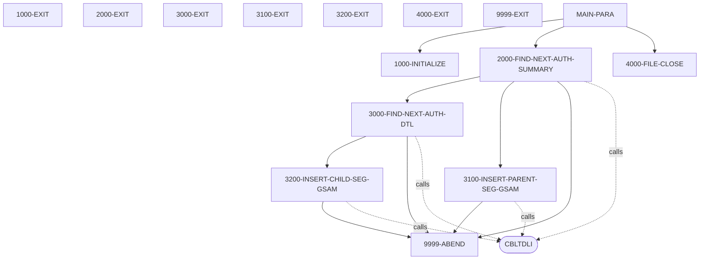
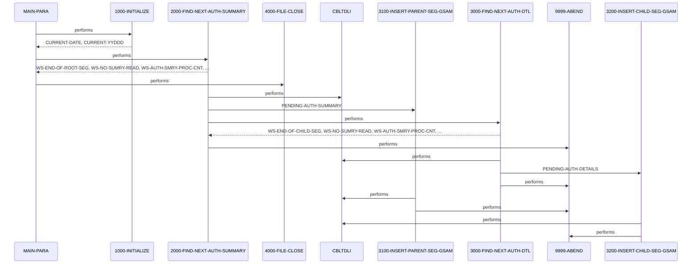

# DBUNLDGS

**File**: `cbl/DBUNLDGS.CBL`
**Type**: FileType.COBOL
**Analyzed**: 2026-02-03 21:06:22.841712

## Purpose

The COBOL program DBUNLDGS unloads pending authorization summary and detail segments from an IMS database and writes them to output files. It retrieves pending authorization summary records and their associated detail records, then inserts them into GSAM files.

**Business Context**: UNKNOWN

## Inputs

| Name | Type | Description |
|------|------|-------------|
| IMS Database (PAUTBPCB) | IOType.IMS_SEGMENT | Pending authorization summary and detail segments are read from the IMS database. |
| SYSIN | IOType.PARAMETER | Input parameters, specifically P-EXPIRY-DAYS, P-CHKP-FREQ, P-CHKP-DIS-FREQ, and P-DEBUG-FLAG, are expected from SYSIN (commented out). |

## Outputs

| Name | Type | Description |
|------|------|-------------|
| OPFILE1 | IOType.FILE_SEQUENTIAL | Pending Authorization Summary records are written to this file. |
| OPFILE2 | IOType.FILE_SEQUENTIAL | Pending Authorization Detail records are written to this file. |

## Called Programs

| Program | Call Type | Purpose |
|---------|-----------|---------|
| CBLTDLI | CallType.STATIC_CALL | Interface with IMS DL/I to retrieve and insert database segments. |
| CBLTDLI | CallType.STATIC_CALL | Interface with IMS DL/I to retrieve the next child segment. |
| CBLTDLI | CallType.STATIC_CALL | Interface with IMS DL/I to insert the parent segment into the GSAM file. |
| CBLTDLI | CallType.STATIC_CALL | Interface with IMS DL/I to insert the child segment into the GSAM file. |

## Business Rules

- **BR001**: If the account ID (PA-ACCT-ID) is numeric, the program proceeds to write the summary and detail records to the output files.
- **BR002**: The program reads the next pending authorization summary segment until the end of the database is reached.
- **BR003**: The program reads the next pending authorization detail segment until no more detail segments are found for the current summary segment.

## Paragraphs/Procedures

### MAIN-PARA
The MAIN-PARA is the entry point of the program. It orchestrates the overall process of unloading data from the IMS database and writing it to output files. First, it calls 1000-INITIALIZE to perform initialization tasks such as accepting the current date. Then, it enters a loop, controlled by the WS-END-OF-ROOT-SEG flag, that repeatedly calls 2000-FIND-NEXT-AUTH-SUMMARY to retrieve pending authorization summary records.  The 2000-FIND-NEXT-AUTH-SUMMARY paragraph retrieves the summary record and then calls 3000-FIND-NEXT-AUTH-DTL to retrieve the associated detail records. After processing all summary and detail records, the MAIN-PARA calls 4000-FILE-CLOSE to close the output files. Finally, the program terminates using the GOBACK statement. The linkage section defines the PCBs used to interface with IMS.

### 1000-INITIALIZE
The 1000-INITIALIZE paragraph performs initialization tasks required before the main processing loop. It accepts the current date and day from the system. It also displays messages to the console indicating the start of the program and the current date. The paragraph includes commented-out code to accept parameters from SYSIN, which would include the expiry days, checkpoint frequency, checkpoint display frequency, and debug flag. The paragraph also contains commented-out code to open the output files OPFILE1 and OPFILE2, checking the file status after each open. If the file status is not spaces or '00', an error message is displayed, and the program abends via 9999-ABEND. This paragraph does not consume any input files, but it initializes working storage variables. It displays output to the console and potentially sets up the output files for writing (currently commented out).

### 2000-FIND-NEXT-AUTH-SUMMARY
The 2000-FIND-NEXT-AUTH-SUMMARY paragraph retrieves the next pending authorization summary record from the IMS database. It initializes the PAUT-PCB-STATUS and then calls the CBLTDLI routine with the FUNC-GN (Get Next) function code to retrieve the next summary segment. The program uses the PAUTBPCB PCB, the PENDING-AUTH-SUMMARY segment layout, and the ROOT-UNQUAL-SSA. If the PAUT-PCB-STATUS is spaces, indicating a successful read, the program increments counters WS-NO-SUMRY-READ and WS-AUTH-SMRY-PROC-CNT. It then moves the PENDING-AUTH-SUMMARY data to the OPFIL1-REC and initializes ROOT-SEG-KEY and CHILD-SEG-REC. The PA-ACCT-ID is moved to ROOT-SEG-KEY. If the PA-ACCT-ID is numeric, the program calls 3100-INSERT-PARENT-SEG-GSAM to write the parent segment to the GSAM file and then calls 3000-FIND-NEXT-AUTH-DTL to retrieve the associated detail records. If the PAUT-PCB-STATUS is 'GB' (end of database), the WS-END-OF-ROOT-SEG flag is set to 'Y'. If the PAUT-PCB-STATUS is not spaces or 'GB', an error message is displayed, and the program abends. The paragraph consumes data from the IMS database and writes to OPFIL1-REC and potentially OPFILE1. It calls CBLTDLI to read the database and 3000-FIND-NEXT-AUTH-DTL to process detail records.

### 3000-FIND-NEXT-AUTH-DTL
The 3000-FIND-NEXT-AUTH-DTL paragraph retrieves the next pending authorization detail record associated with the current summary record. It calls the CBLTDLI routine with the FUNC-GNP (Get Next within Parent) function code to retrieve the next detail segment. The program uses the PAUTBPCB PCB, the PENDING-AUTH-DETAILS segment layout, and the CHILD-UNQUAL-SSA. If the PAUT-PCB-STATUS is spaces, indicating a successful read, the MORE-AUTHS flag is set to TRUE, and counters WS-NO-SUMRY-READ and WS-AUTH-SMRY-PROC-CNT are incremented. The PENDING-AUTH-DETAILS data is moved to CHILD-SEG-REC, and 3200-INSERT-CHILD-SEG-GSAM is called to write the child segment to the GSAM file. If the PAUT-PCB-STATUS is 'GE' (end of segment), the WS-END-OF-CHILD-SEG flag is set to 'Y'. If the PAUT-PCB-STATUS is not spaces or 'GE', an error message is displayed, and the program abends. The paragraph consumes data from the IMS database and writes to CHILD-SEG-REC and potentially OPFILE2. It calls CBLTDLI to read the database and 3200-INSERT-CHILD-SEG-GSAM to write to the GSAM file.

### 3100-INSERT-PARENT-SEG-GSAM
The 3100-INSERT-PARENT-SEG-GSAM paragraph inserts the parent segment (PENDING-AUTH-SUMMARY) into the GSAM file. It calls CBLTDLI with FUNC-ISRT to perform the insert operation, using PASFLPCB as the PCB. If the PASFL-PCB-STATUS is not equal to spaces, indicating an error, an error message is displayed, and the program abends. This paragraph receives data from PENDING-AUTH-SUMMARY and writes to the GSAM file defined by PASFLPCB. It calls CBLTDLI to perform the insert operation and checks the PCB status for errors.

### 3200-INSERT-CHILD-SEG-GSAM
The 3200-INSERT-CHILD-SEG-GSAM paragraph inserts the child segment (PENDING-AUTH-DETAILS) into the GSAM file. It calls CBLTDLI with FUNC-ISRT to perform the insert operation, using PADFLPCB as the PCB. If the PADFL-PCB-STATUS is not equal to spaces, indicating an error, an error message is displayed, and the program abends. This paragraph receives data from PENDING-AUTH-DETAILS and writes to the GSAM file defined by PADFLPCB. It calls CBLTDLI to perform the insert operation and checks the PCB status for errors.

### 4000-FILE-CLOSE
The 4000-FILE-CLOSE paragraph closes the output files. It displays a message to the console indicating that the files are being closed. The code to actually close the files (OPFILE1 and OPFILE2) is commented out. The commented-out code also includes checks for the file status after closing each file, displaying an error message if the close operation fails. This paragraph does not consume any input files, but it displays output to the console. It would normally close the output files and check their status, but this functionality is currently commented out.

### 9999-ABEND
The 9999-ABEND paragraph handles program termination due to an error condition. It displays a message to the console indicating that the program is abending. It then sets the RETURN-CODE to 16 and terminates the program using the GOBACK statement. This paragraph does not consume any input files, but it sets the return code. It displays output to the console and terminates the program.

## Control Flow

## Open Questions

- ? What is the purpose of the commented-out ACCEPT PRM-INFO FROM SYSIN statement?
  - Context: The program attempts to accept parameters from SYSIN, but the code is commented out. It's unclear what these parameters are used for and how they would affect the program's execution.
- ? What is the exact structure and purpose of the GSAM files that the program writes to?
  - Context: The program inserts parent and child segments into GSAM files, but the file definitions (FD entries) are commented out. Without knowing the file structure, it's difficult to fully understand the program's output.

## Sequence Diagram

