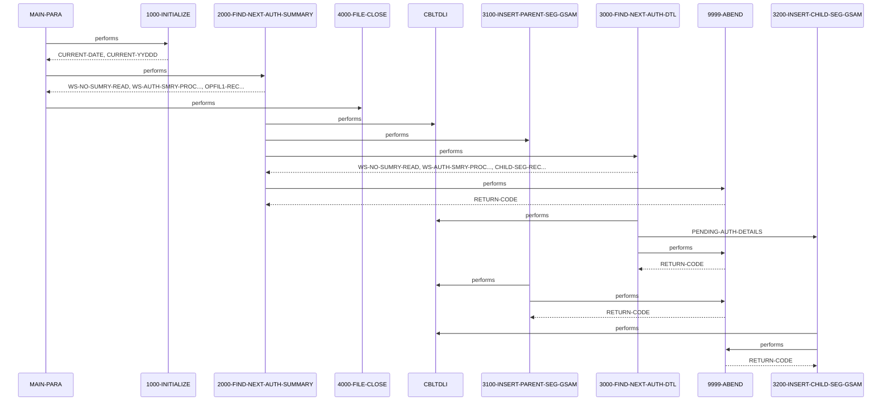

# DBUNLDGS

**File:** cbl/DBUNLDGS.CBL
**Type:** COBOL
**Status:** In Progress
**Iterations:** 1
**Analyzed:** 2026-01-30 19:47:20.866610

## Purpose

DBUNLDGS is an IMS batch utility that browses and unloads root Pending Authorization Summary segments (PAUTSUM0) and their child Pending Authorization Detail segments (PAUTDTL1) from the PAUT IMS database using unqualified SSAs via the PAUTBPCB. For each root segment retrieved via GN call, it inserts a copy into a GSAM database using PASFLPCB and then retrieves all children via GNP calls, inserting each into another GSAM via PADFLPCB. It continues until end of database (GB status), increments counters, and abends on errors.

**Business Context:** Supports unloading of pending authorization data from IMS for potential archiving, migration, or reporting in a financial authorization system.
**Program Type:** BATCH
**Citations:** Lines 18, 164, 170, 172, 222, 268, 303, 321

## Calling Context

**Entry Points:** DLITCBL
**Linkage Section:** PAUTBPCB, PASFLPCB, PADFLPCB

## Inputs

### PAUT IMS Database
- **Type:** IMS_SEGMENT
- **Description:** Root PAUTSUM0 summary segments and child PAUTDTL1 detail segments accessed via PAUTBPCB browse PCB
- **Copybook:** [CIPAUSMY, CIPAUDTY](../copybooks/CIPAUSMY, CIPAUDTY.cpy.md)
- **Lines:** 222, 268

## Outputs

### PASFL GSAM
- **Type:** IMS_SEGMENT
- **Description:** Copies of unloaded PAUTSUM0 root summary segments inserted via PASFLPCB
- **Copybook:** [CIPAUSMY](../copybooks/CIPAUSMY.cpy.md)
- **Lines:** 303

### PADFL GSAM
- **Type:** IMS_SEGMENT
- **Description:** Copies of unloaded PAUTDTL1 child detail segments inserted via PADFLPCB
- **Copybook:** [CIPAUDTY](../copybooks/CIPAUDTY.cpy.md)
- **Lines:** 321

## Business Rules

### BR001: Process only valid root segments with numeric PA-ACCT-ID before handling children
**Logic:** Check PA-ACCT-ID numeric after GN, skip if not
**Conditions:** PA-ACCT-ID IS NUMERIC
**Lines:** 241

### BR002: End root processing on GB status from PAUTBPCB
**Logic:** Set end flags and exit loop
**Conditions:** PAUT-PCB-STATUS = 'GB'
**Lines:** 249

### BR003: End child processing on GE status from PAUTBPCB
**Logic:** Set child end flag after no more children
**Conditions:** PAUT-PCB-STATUS = 'GE'
**Lines:** 284

## Copybooks Used

| Copybook | Location | Purpose | Line |
|----------|----------|---------|------|
| [IMSFUNCS](../copybooks/IMSFUNCS.cpy.md) | WORKING_STORAGE | Defines IMS DL/I function codes like FUNC-GN, FUNC-GNP, FUNC-ISRT | 136 |
| [CIPAUSMY](../copybooks/CIPAUSMY.cpy.md) | WORKING_STORAGE | Defines layout of PENDING-AUTH-SUMMARY root segment including PA-ACCT-ID | 143 |
| [CIPAUDTY](../copybooks/CIPAUDTY.cpy.md) | WORKING_STORAGE | Defines layout of PENDING-AUTH-DETAILS child segment | 147 |
| [PAUTBPCB](../copybooks/PAUTBPCB.cpy.md) | LINKAGE | PCB mask for browsing PAUT IMS database (PAUTSUM0/PAUTDTL1) | 154 |
| [PASFLPCB](../copybooks/PASFLPCB.cpy.md) | LINKAGE | PCB mask for inserting into summary GSAM database | 155 |
| [PADFLPCB](../copybooks/PADFLPCB.cpy.md) | LINKAGE | PCB mask for inserting into details GSAM database | 156 |

## Data Flow

### Reads From
- **PAUTBPCB (PAUTSUM0 root)**: PA-ACCT-ID
  (Lines: 239)
- **PAUTBPCB (PAUTDTL1 child)**: PENDING-AUTH-DETAILS
  (Lines: 280)

### Writes To
- **PASFLPCB GSAM**: PENDING-AUTH-SUMMARY
  (Lines: 304)
- **PADFLPCB GSAM**: PENDING-AUTH-DETAILS
  (Lines: 322)

### Transformations
- **PA-ACCT-ID** → **ROOT-SEG-KEY**: Move account ID from summary segment to GSAM root key field
  (Lines: 239)
- **PENDING-AUTH-DETAILS** → **CHILD-SEG-REC**: Direct move of detail segment to GSAM child record
  (Lines: 280)

## Key Paragraphs

### MAIN-PARA
**Purpose:** This is the primary entry point and orchestration paragraph for the entire program flow, labeled MAIN-PARA with an ENTRY 'DLITCBL' for potential dynamic invocation. It receives IMS PCBs (PAUTBPCB, PASFLPCB, PADFLPCB) via linkage section as inputs for database access. It first performs 1000-INITIALIZE to set up dates and display startup information. Then it enters a loop performing 2000-FIND-NEXT-AUTH-SUMMARY until WS-END-OF-ROOT-SEG is 'Y', handling each root segment and its children. After the loop, it performs 4000-FILE-CLOSE to log closure, though file operations are commented out. No direct business logic decisions here beyond loop control based on end flag from 2000. No explicit error handling; relies on abends from subordinates. It calls 1000-INITIALIZE for init, 2000-FIND-NEXT-AUTH-SUMMARY repeatedly for core unloading, and 4000-FILE-CLOSE for termination. Upon completion, it executes GOBACK to end the program.
- Calls: 1000-INITIALIZE, 2000-FIND-NEXT-AUTH-SUMMARY, 4000-FILE-CLOSE
- Lines: 164-179

### 1000-INITIALIZE
**Purpose:** This initialization paragraph sets up runtime variables and logs program start. It consumes system date via ACCEPT from DATE and DAY into CURRENT-DATE and CURRENT-YYDDD. It displays program start message, date, and decorative lines for audit trail. Commented code for parameter acceptance from SYSIN and sequential file opens with status checks is present but inactive. No outputs produced beyond displays and variable initialization. No business logic conditions or validations performed. No error handling implemented here. No calls to other paragraphs or programs. Control passes to 1000-EXIT upon completion.
- Called by: MAIN-PARA
- Lines: 182-212

### 2000-FIND-NEXT-AUTH-SUMMARY
**Purpose:** This paragraph handles retrieval and processing of each root Pending Auth Summary segment, serving as the outer loop driver for unloading. It consumes the PAUTBPCB for IMS GN call with ROOT-UNQUAL-SSA to get next unqualified root segment into PENDING-AUTH-SUMMARY. If status is spaces (success), it increments read counters WS-NO-SUMRY-READ and WS-AUTH-SMRY-PROC-CNT, moves data to OPFIL1-REC (commented write), sets ROOT-SEG-KEY from PA-ACCT-ID if numeric, performs 3100-INSERT-PARENT-SEG-GSAM to write to GSAM, resets child end flag, and loops 3000-FIND-NEXT-AUTH-DTL until no more children. On 'GB' status, sets end of root flag to exit main loop. On other errors, displays status/feedback and abends via 9999-ABEND. Business logic includes numeric check on PA-ACCT-ID to qualify processing and status-based decisions for continue/end/abend. Error handling covers non-success statuses with abend.
- Called by: MAIN-PARA
- Calls: 3100-INSERT-PARENT-SEG-GSAM, 3000-FIND-NEXT-AUTH-DTL, 9999-ABEND
- Lines: 216-258

### 3000-FIND-NEXT-AUTH-DTL
**Purpose:** This paragraph retrieves and processes child Pending Auth Detail segments under the current root, invoked in loop from 2000. It consumes PAUTBPCB for IMS GNP call with CHILD-UNQUAL-SSA to get next parent-qualified child into PENDING-AUTH-DETAILS. On spaces status (success), sets MORE-AUTHS flag (unused), increments counters (note: uses sumry counters erroneously?), moves to CHILD-SEG-REC, and performs 3200-INSERT-CHILD-SEG-GSAM. On 'GE' status, sets WS-END-OF-CHILD-SEG to 'Y' to exit child loop and displays flag. On other statuses, displays error/feedback and abends. Logic decisions based on PCB status for process/end/abend. Error handling abends on failures. Initializes status after call. No direct outputs beyond inserts via call.
- Called by: 2000-FIND-NEXT-AUTH-SUMMARY
- Calls: 3200-INSERT-CHILD-SEG-GSAM, 9999-ABEND
- Lines: 263-297

### 3100-INSERT-PARENT-SEG-GSAM
**Purpose:** This utility paragraph inserts the current root summary segment into the target GSAM database. It consumes PENDING-AUTH-SUMMARY and PASFLPCB for IMS ISRT call. On non-spaces status, displays error/KEYFB and abends via 9999-ABEND. No other inputs, outputs, or logic; purely I/O with error check. Business logic is strict success requirement for continuation. Error handling immediate abend on failure.
- Called by: 2000-FIND-NEXT-AUTH-SUMMARY
- Calls: 9999-ABEND
- Lines: 300-316

### 3200-INSERT-CHILD-SEG-GSAM
**Purpose:** This utility paragraph inserts the current child detail segment into the target GSAM database. It consumes PENDING-AUTH-DETAILS and PADFLPCB for IMS ISRT call. On non-spaces status, displays error/KEYFB and abends via 9999-ABEND. No other inputs, outputs, or logic; purely I/O with error check. Business logic enforces successful insert for each child. Error handling immediate abend on failure.
- Called by: 3000-FIND-NEXT-AUTH-DTL
- Calls: 9999-ABEND
- Lines: 319-335

### 4000-FILE-CLOSE
**Purpose:** This termination paragraph logs file closure, though actual CLOSE statements for OPFILE1/2 are commented out. It consumes no data, displays 'CLOSING THE FILE'. Commented status checks and error displays. No business logic or conditions. No error handling active. No calls. Prepares for program end.
- Called by: MAIN-PARA
- Lines: 338-354

### 9999-ABEND
**Purpose:** This error termination paragraph handles all program abends. It consumes no specific inputs, displays 'DBUNLDGS ABENDING ...' message. Sets RETURN-CODE to 16 and executes GOBACK to terminate abnormally. No validations or conditions. Called from multiple error points throughout the program. No further calls.
- Called by: 2000-FIND-NEXT-AUTH-SUMMARY, 3000-FIND-NEXT-AUTH-DTL, 3100-INSERT-PARENT-SEG-GSAM, 3200-INSERT-CHILD-SEG-GSAM
- Lines: 357-364

### 9999-EXIT
**Purpose:** This is a minimal exit label within the abend routine, containing only an EXIT statement. It consumes no data and produces no outputs. No logic, conditions, error handling, or calls. Serves as a potential THRU exit point though not used. Provides structured exit from 9999-ABEND if needed.
- Lines: 365-366

## Inter-Paragraph Data Flow

| Caller | Callee | Inputs | Outputs | Purpose |
|--------|--------|--------|---------|---------|
| MAIN-PARA | 1000-INITIALIZE | - | CURRENT-DATE, CURRENT-YYDDD | Initializes current date and Julian date variables and displays program startup information. |
| MAIN-PARA | 2000-FIND-NEXT-AUTH-SUMMARY | - | WS-NO-SUMRY-READ, WS-AUTH-SMRY-PROC-CNT, OPFIL1-REC, ROOT-SEG-KEY, CHILD-SEG-REC, WS-END-OF-CHILD-SEG, WS-END-OF-ROOT-SEG | Retrieves the next root authorization summary segment from IMS and processes its parent insertion and child details. |
| MAIN-PARA | 4000-FILE-CLOSE | - | - | Displays a message indicating that files are being closed. |
| 2000-FIND-NEXT-AUTH-SUMMARY | 3100-INSERT-PARENT-SEG-GSAM | - | - | Inserts the pending authorization summary record into the GSAM parent database via IMS call. |
| 2000-FIND-NEXT-AUTH-SUMMARY | 3000-FIND-NEXT-AUTH-DTL | - | WS-NO-SUMRY-READ, WS-AUTH-SMRY-PROC-CNT, CHILD-SEG-REC, WS-END-OF-CHILD-SEG | Retrieves the next child authorization detail segment from IMS using parent-child navigation and inserts it into GSAM. |
| 2000-FIND-NEXT-AUTH-SUMMARY | 9999-ABEND | - | RETURN-CODE | Abends the program due to failure in the IMS GN call for the authorization summary root segment. |
| 3000-FIND-NEXT-AUTH-DTL | 3200-INSERT-CHILD-SEG-GSAM | PENDING-AUTH-DETAILS | - | Performs IMS insert of the authorization details as a child segment into the GSAM database. |
| 3000-FIND-NEXT-AUTH-DTL | 9999-ABEND | - | RETURN-CODE | Abends the program due to failure in the IMS GNP call for the authorization detail child segment. |
| 3100-INSERT-PARENT-SEG-GSAM | 9999-ABEND | - | RETURN-CODE | Abends the program due to failure in the IMS ISRT call for the parent segment in GSAM. |
| 3200-INSERT-CHILD-SEG-GSAM | 9999-ABEND | - | RETURN-CODE | Abends the program due to failure in the IMS ISRT call for the child segment in GSAM. |

## Error Handling

- **PAUT-PCB-STATUS NOT SPACES AND NOT 'GB' after GN:** Display status/KEYFB and PERFORM 9999-ABEND
  (Lines: 253)
- **PAUT-PCB-STATUS NOT SPACES AND NOT 'GE' after GNP:** Display status/KEYFB and PERFORM 9999-ABEND
  (Lines: 290)
- **PASFL-PCB-STATUS NOT SPACES after ISRT:** Display status/KEYFB and PERFORM 9999-ABEND
  (Lines: 311)
- **PADFL-PCB-STATUS NOT SPACES after ISRT:** Display status/KEYFB and PERFORM 9999-ABEND
  (Lines: 330)
- **Any abend condition:** Set RETURN-CODE 16 and GOBACK
  (Lines: 362)

## Open Questions

- **Exact field layouts and keys in CIPAUSMY and CIPAUDTY copybooks**
  - Context: Copybooks referenced but contents not in source; limits field-level data flow details
  - Suggestion: Analyze referenced copybook files
- **Purpose and current status of heavily commented sequential file code (OPFILE1/2)**
  - Context: Lines 26-47, 195-209, 340-353 suggest original file unload replaced by GSAM inserts
  - Suggestion: Check version history or related LISTING files

## Sequence Diagram

---
*Generated by War Rig WAR_RIG*