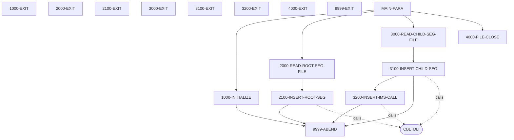
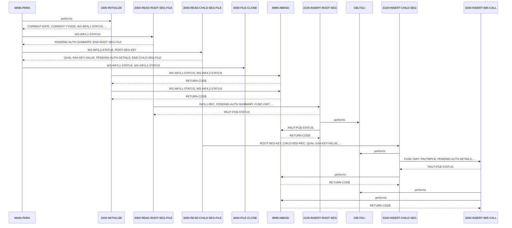

# PAUDBLOD

**File**: `cbl/PAUDBLOD.CBL`
**Type**: FileType.COBOL
**Analyzed**: 2026-02-03 21:06:31.699741

## Purpose

The COBOL program PAUDBLOD reads two sequential input files, INFILE1 and INFILE2, and loads data from them into an IMS database. INFILE1 contains root segment data for 'PAUTSUM0' and INFILE2 contains child segment data for 'PAUTDTL1'; the program uses CBLTDLI calls to insert these segments into the IMS database.

**Business Context**: UNKNOWN

## Inputs

| Name | Type | Description |
|------|------|-------------|
| INFILE1 | IOType.FILE_SEQUENTIAL | Contains root segment data for the 'PAUTSUM0' segment to be loaded into the IMS database. |
| INFILE2 | IOType.FILE_SEQUENTIAL | Contains child segment data for the 'PAUTDTL1' segment to be loaded into the IMS database.  The ROOT-SEG-KEY is used to relate the child segment to the root segment. |
| IO-PCB-MASK | IOType.PARAMETER | IO PCB Mask from Linkage Section |
| PAUTBPCB | IOType.PARAMETER | PAUTBPCB from Linkage Section |

## Called Programs

| Program | Call Type | Purpose |
|---------|-----------|---------|
| CBLTDLI | CallType.STATIC_CALL | Called to perform IMS database operations such as inserting root and child segments. |
| CBLTDLI | CallType.STATIC_CALL | Called to retrieve the root segment before inserting the child segment. |
| CBLTDLI | CallType.STATIC_CALL | Called to insert the child segment into the IMS database. |

## Paragraphs/Procedures

### MAIN-PARA
This is the main control paragraph of the PAUDBLOD program. It orchestrates the overall process of reading root and child segment data from input files and loading them into an IMS database. The paragraph first performs 1000-INITIALIZE to open the input files (INFILE1 and INFILE2) and initialize variables. Then, it enters a loop, performing 2000-READ-ROOT-SEG-FILE to read root segment records from INFILE1 until the end of the file is reached. Subsequently, it enters another loop, performing 3000-READ-CHILD-SEG-FILE to read child segment records from INFILE2 until its end. Finally, it performs 4000-FILE-CLOSE to close the input files before terminating the program with a GOBACK statement. The paragraph uses flags END-ROOT-SEG-FILE and END-CHILD-SEG-FILE to control the read loops. It also calls the ENTRY 'DLITCBL' to set up the PCB.

### 1000-INITIALIZE
This paragraph initializes the program by accepting the current date and opening the input files INFILE1 and INFILE2. It retrieves the current date from the system using ACCEPT and stores it in CURRENT-DATE and CURRENT-YYDDD. It then attempts to open INFILE1 and INFILE2 in INPUT mode. The file status codes (WS-INFIL1-STATUS and WS-INFIL2-STATUS) are checked after each OPEN. If the file status is not spaces or '00', an error message is displayed indicating the file opening failure, and the program abends by performing 9999-ABEND. Otherwise, the program continues. This paragraph ensures that the necessary input files are accessible before the main processing begins. There is no specific business logic implemented in this paragraph, other than ensuring the input files are available.

### 2000-READ-ROOT-SEG-FILE
This paragraph reads records from INFILE1, which contains the root segment data. It reads one record at a time using the READ statement. After each read, the file status (WS-INFIL1-STATUS) is checked. If the read is successful (status is spaces or '00'), the input record (INFIL1-REC) is moved to the PENDING-AUTH-SUMMARY area, and the 2100-INSERT-ROOT-SEG paragraph is performed to insert the root segment into the IMS database. If the end of the file is reached (status is '10'), the END-ROOT-SEG-FILE flag is set to 'Y'. If any other error occurs during the read, an error message is displayed. This paragraph controls the flow of root segment data from the input file to the IMS database insertion process. The paragraph relies on the 2100-INSERT-ROOT-SEG paragraph to handle the actual database insertion.

### 2100-INSERT-ROOT-SEG
This paragraph inserts the root segment (PENDING-AUTH-SUMMARY) into the IMS database using a CBLTDLI call. It calls the CBLTDLI routine with the FUNC-ISRT function code, along with the PAUTBPCB, PENDING-AUTH-SUMMARY, and ROOT-UNQUAL-SSA. After the call, it checks the PAUT-PCB-STATUS to determine the success or failure of the insertion. If the status is spaces, it displays a message indicating successful insertion. If the status is 'II', it indicates that the segment already exists in the database. If the status is anything else, it displays an error message and abends the program by performing 9999-ABEND. This paragraph is responsible for the actual interaction with the IMS database to insert the root segment. The ROOT-UNQUAL-SSA is used to specify the segment to be inserted.

### 3000-READ-CHILD-SEG-FILE
This paragraph reads records from INFILE2, which contains the child segment data. It reads one record at a time using the READ statement. After each read, the file status (WS-INFIL2-STATUS) is checked. If the read is successful (status is spaces or '00'), it checks if ROOT-SEG-KEY is numeric, then moves the ROOT-SEG-KEY to QUAL-SSA-KEY-VALUE and the CHILD-SEG-REC to PENDING-AUTH-DETAILS, and performs the 3100-INSERT-CHILD-SEG paragraph to insert the child segment into the IMS database. If the end of the file is reached (status is '10'), the END-CHILD-SEG-FILE flag is set to 'Y'. If any other error occurs during the read, an error message is displayed. This paragraph controls the flow of child segment data from the input file to the IMS database insertion process. The paragraph relies on the 3100-INSERT-CHILD-SEG paragraph to handle the actual database insertion.

### 3100-INSERT-CHILD-SEG
This paragraph retrieves the root segment using a Get Unique (GU) call to CBLTDLI, then inserts the child segment (PENDING-AUTH-DETAILS) into the IMS database. It first initializes PAUT-PCB-STATUS. It calls CBLTDLI with FUNC-GU, PAUTBPCB, PENDING-AUTH-SUMMARY, and ROOT-QUAL-SSA to retrieve the root segment. It checks PAUT-PCB-STATUS; if successful (spaces), it performs 3200-INSERT-IMS-CALL to insert the child segment. If the GU call fails (status not spaces or 'II'), it displays an error message and the KFB area, then abends the program using 9999-ABEND. This paragraph ensures the root segment exists before attempting to insert the child. The ROOT-QUAL-SSA provides the key for the root segment retrieval.

### 3200-INSERT-IMS-CALL
This paragraph inserts the child segment (PENDING-AUTH-DETAILS) into the IMS database using a CBLTDLI call. It calls the CBLTDLI routine with the FUNC-ISRT function code, along with the PAUTBPCB, PENDING-AUTH-DETAILS, and CHILD-UNQUAL-SSA. After the call, it checks the PAUT-PCB-STATUS to determine the success or failure of the insertion. If the status is spaces, it displays a message indicating successful insertion. If the status is 'II', it indicates that the segment already exists in the database. If the status is anything else, it displays an error message and abends the program by performing 9999-ABEND. This paragraph is responsible for the actual interaction with the IMS database to insert the child segment. The CHILD-UNQUAL-SSA is used to specify the segment to be inserted.

### 4000-FILE-CLOSE
This paragraph closes the input files INFILE1 and INFILE2. It displays a message indicating that the files are being closed. It then attempts to close INFILE1 and INFILE2 using the CLOSE statement. After each CLOSE, the file status codes (WS-INFIL1-STATUS and WS-INFIL2-STATUS) are checked. If the file status is not spaces or '00', an error message is displayed indicating the file closing failure. This paragraph ensures that the input files are properly closed after processing is complete. There is no specific business logic implemented in this paragraph, other than ensuring the files are closed without errors.

### 9999-ABEND
This paragraph handles program termination due to an error condition. It displays a message indicating that the IMS load is abending. It then sets the RETURN-CODE to 16, which signals an abnormal termination to the operating system or calling program. Finally, it terminates the program using the GOBACK statement. This paragraph serves as a central error handling routine, ensuring a consistent termination process when errors are encountered during program execution. The setting of the RETURN-CODE allows for external monitoring of program success or failure.

## Control Flow

## Open Questions

- ? What is the business context of this program?
  - Context: The code does not provide any information about the business process it serves.
- ? What is the purpose of the parameters in the LINKAGE SECTION?
  - Context: The code uses parameters in the linkage section, but their specific purpose is not clear from the code itself.

## Sequence Diagram

