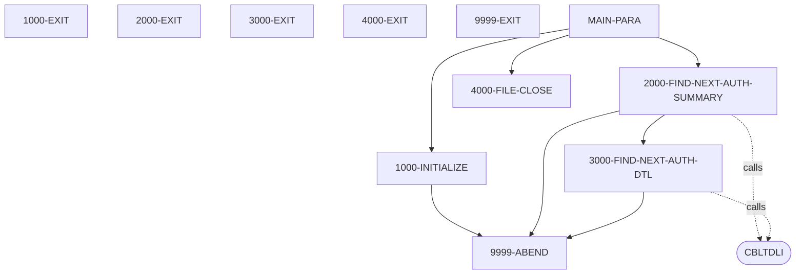
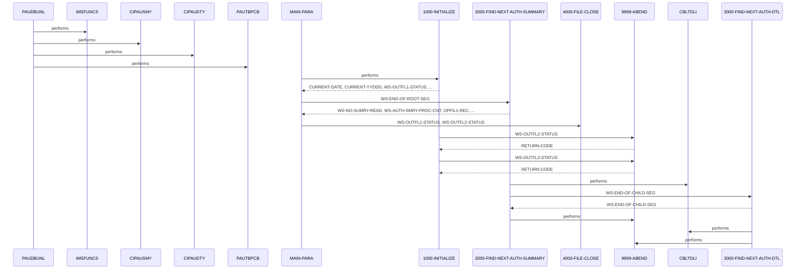

# PAUDBUNL

**File**: `cbl/PAUDBUNL.CBL`
**Type**: FileType.COBOL
**Analyzed**: 2026-02-03 21:02:07.147899

## Purpose

The COBOL program PAUDBUNL extracts authorization summary and detail information from an IMS database and writes it to two sequential output files. It reads authorization summary records and related detail records, writing each to a separate output file.

**Business Context**: UNKNOWN

## Inputs

| Name | Type | Description |
|------|------|-------------|
| PAUTBPCB | IOType.IMS_SEGMENT | IMS PCB used to access the authorization summary and detail segments. |
| PENDING-AUTH-SUMMARY | IOType.IMS_SEGMENT | Authorization summary segment read from the IMS database. |
| PENDING-AUTH-DETAILS | IOType.IMS_SEGMENT | Authorization detail segment read from the IMS database. |

## Outputs

| Name | Type | Description |
|------|------|-------------|
| OPFILE1 | IOType.FILE_SEQUENTIAL | Sequential file containing authorization summary records. |
| OPFILE2 | IOType.FILE_SEQUENTIAL | Sequential file containing authorization detail records. |

## Called Programs

| Program | Call Type | Purpose |
|---------|-----------|---------|
| CBLTDLI | CallType.STATIC_CALL | Issue IMS database calls to retrieve authorization summary and detail segments. |
| CBLTDLI | CallType.STATIC_CALL | Issue IMS database calls to retrieve authorization summary and detail segments. |

## Paragraphs/Procedures

### PAUDBUNL
This paragraph serves as the program entry point. It is invoked using the 'DLITCBL' entry point and receives the PAUTBPCB as input via the USING clause. It then calls other subroutines to perform the main logic of the program, namely IMSFUNCS, CIPAUSMY, CIPAUDTY, and PAUTBPCB. The purpose of these calls is currently unknown due to lack of information. The paragraph itself does not directly process any data or perform any business logic, but rather acts as a high-level orchestrator.

### MAIN-PARA
This paragraph is the main control loop of the program. It is entered via the ENTRY 'DLITCBL' statement, receiving the PAUTBPCB as input. It first calls 1000-INITIALIZE to perform program initialization, such as opening files and accepting the current date. After initialization, it repeatedly calls 2000-FIND-NEXT-AUTH-SUMMARY until WS-END-OF-ROOT-SEG is set to 'Y', indicating that all authorization summary records have been processed. Finally, it calls 4000-FILE-CLOSE to close the output files before terminating the program with a GOBACK statement. This paragraph orchestrates the overall flow of the program, managing initialization, data processing, and termination.

### 1000-INITIALIZE
This paragraph performs initialization tasks for the program. It accepts the current date and day from the system. It then opens OPFILE1 and OPFILE2 for output. If either OPEN operation fails (WS-OUTFL1-STATUS or WS-OUTFL2-STATUS is not equal to SPACES or '00'), it displays an error message and calls 9999-ABEND to terminate the program. The purpose of accepting PRM-INFO from SYSIN is unknown. This paragraph ensures that the output files are ready for writing and that the program has access to the current date before processing any data.

### 1000-EXIT
This paragraph simply contains an EXIT statement, providing a common exit point for the 1000-INITIALIZE paragraph. It does not perform any data manipulation or business logic. It is used to define the end of the PERFORM THRU range in the calling paragraph.

### 2000-FIND-NEXT-AUTH-SUMMARY
This paragraph retrieves the next authorization summary record from the IMS database. It first initializes PAUT-PCB-STATUS. It then calls CBLTDLI with FUNC-GN to retrieve the next summary segment using the PAUTBPCB and ROOT-UNQUAL-SSA. If the call is successful (PAUT-PCB-STATUS is SPACES), it increments WS-NO-SUMRY-READ and WS-AUTH-SMRY-PROC-CNT, moves the PENDING-AUTH-SUMMARY to OPFIL1-REC, initializes ROOT-SEG-KEY and CHILD-SEG-REC, moves PA-ACCT-ID to ROOT-SEG-KEY, and writes OPFIL1-REC to OPFILE1 if PA-ACCT-ID is numeric. After writing the summary record, it calls 3000-FIND-NEXT-AUTH-DTL repeatedly until WS-END-OF-CHILD-SEG is set to 'Y', indicating that all detail records for the current summary record have been processed. If PAUT-PCB-STATUS is 'GB', it sets WS-END-OF-ROOT-SEG to 'Y' to indicate the end of the authorization database. If PAUT-PCB-STATUS is neither SPACES nor 'GB', it displays an error message and calls 9999-ABEND. This paragraph retrieves and processes authorization summary records and their associated detail records.

### 2000-EXIT
This paragraph simply contains an EXIT statement, providing a common exit point for the 2000-FIND-NEXT-AUTH-SUMMARY paragraph. It does not perform any data manipulation or business logic. It is used to define the end of the PERFORM THRU range in the calling paragraph.

### 3000-FIND-NEXT-AUTH-DTL
This paragraph retrieves the next authorization detail record from the IMS database for the current authorization summary record. It calls CBLTDLI with FUNC-GNP to retrieve the next detail segment using the PAUTBPCB and CHILD-UNQUAL-SSA. If the call is successful (PAUT-PCB-STATUS is SPACES), it sets MORE-AUTHS to TRUE, increments WS-NO-SUMRY-READ and WS-AUTH-SMRY-PROC-CNT, moves the PENDING-AUTH-DETAILS to CHILD-SEG-REC, and writes CHILD-SEG-REC to OPFILE2. If PAUT-PCB-STATUS is 'GE', it sets WS-END-OF-CHILD-SEG to 'Y' to indicate that there are no more detail records for the current summary record. If PAUT-PCB-STATUS is neither SPACES nor 'GE', it displays an error message and calls 9999-ABEND. Finally, it initializes PAUT-PCB-STATUS. This paragraph retrieves and processes authorization detail records associated with a summary record.

### 3000-EXIT
This paragraph simply contains an EXIT statement, providing a common exit point for the 3000-FIND-NEXT-AUTH-DTL paragraph. It does not perform any data manipulation or business logic. It is used to define the end of the PERFORM THRU range in the calling paragraph.

### 4000-FILE-CLOSE
This paragraph closes the output files OPFILE1 and OPFILE2. It first displays a message indicating that the files are being closed. It then closes OPFILE1 and checks WS-OUTFL1-STATUS. If the close operation fails (WS-OUTFL1-STATUS is not equal to SPACES or '00'), it displays an error message. It repeats the same process for OPFILE2 and WS-OUTFL2-STATUS. This paragraph ensures that the output files are properly closed after all data has been processed.

### 4000-EXIT
This paragraph simply contains an EXIT statement, providing a common exit point for the 4000-FILE-CLOSE paragraph. It does not perform any data manipulation or business logic. It is used to define the end of the PERFORM THRU range in the calling paragraph.

### 9999-ABEND
The 9999-ABEND paragraph is responsible for handling abnormal termination of the program. Its primary purpose is to display a message indicating that the program is abending and then set a non-zero return code before terminating the program. This paragraph does not consume any input files or data directly, but it is likely called from other parts of the program when an unrecoverable error condition is encountered. It produces output by displaying the message 'IMSUNLOD ABENDING ...' to the console (line 4). It sets the RETURN-CODE to 16 (line 6), indicating an error condition to the calling environment. The paragraph then terminates the program using the GOBACK statement (line 7). This paragraph does not call any other paragraphs or programs.

### 9999-EXIT
The 9999-EXIT paragraph provides a standard exit point for the program. Its primary purpose is to simply exit the current execution path. It does not consume any input data or files, nor does it produce any output. It is likely called as the final step in a normal program termination sequence. This paragraph does not perform any business logic or error handling. It simply executes the EXIT statement (line 10), which returns control to the calling paragraph or program. This paragraph does not call any other paragraphs or programs.

## Control Flow

## Open Questions

- ? What is the purpose of the IMSFUNCS, CIPAUSMY, CIPAUDTY, and PAUTBPCB calls within the PAUDBUNL paragraph?
  - Context: The code calls these subroutines, but their functionality cannot be determined from the provided code snippet.
- ? What is the purpose of accepting PRM-INFO from SYSIN?
  - Context: The code includes a commented-out line that accepts PRM-INFO from SYSIN, but its purpose is unclear.

## Sequence Diagram

