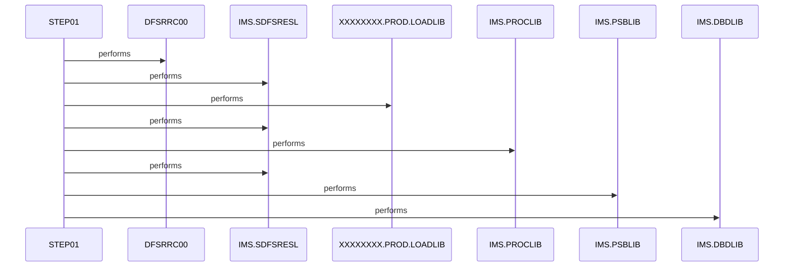

# CBPAUP0J

**File:** jcl/CBPAUP0J.jcl
**Type:** JCL
**Status:** In Progress
**Iterations:** 1
**Analyzed:** 2026-01-30 19:38:54.677425

## Purpose

This JCL job CBPAUP0J executes the IMS batch message processing (BMP) program CBPAUP0C via the DFSRRC00 region controller to delete expired authorizations. It configures IMS libraries, PSB/DBD libraries, and provides inline SYSIN parameters. Standard IMS batch DD statements are defined for inputs, outputs, and dumps.

**Business Context:** Manages authorizations in the CARDDEMO system by deleting expired entries from an IMS database using PSBPAUTB.
**Program Type:** BATCH
**Citations:** Lines 1, 21, 24, 25

## Inputs

### SYSIN
- **Type:** PARAMETER
- **Description:** Inline control parameters '00,00001,00001,Y' passed to DFSRRC00 for IMS program execution (likely PCB/segment/position flags).
- **Lines:** 36, 37

### IMS.PSBLIB
- **Type:** OTHER
- **Description:** IMS PSB library containing PSBPAUTB definition.
- **Lines:** 33

### IMS.DBDLIB
- **Type:** OTHER
- **Description:** IMS DBD library for database definitions accessed via PSBPAUTB.
- **Lines:** 34

## Outputs

### SYSPRINT
- **Type:** REPORT
- **Description:** Standard print output from DFSRRC00 and CBPAUP0C execution.
- **Lines:** 45

### SYSUDUMP
- **Type:** REPORT
- **Description:** System dump output on program abend.
- **Lines:** 46

### SYSOUT
- **Type:** REPORT
- **Description:** General job and IMS output listings.
- **Lines:** 39, 40

## Called Programs

| Program | Call Type | Purpose | Line |
|---------|-----------|---------|------|
| [DFSRRC00](./DFSRRC00.cbl.md) | STATIC_CALL | IMS region controller to execute CBPAUP0C in BMP mode. | 24 |
| [CBPAUP0C](./CBPAUP0C.cbl.md) | DYNAMIC_CALL | Application program to delete expired authorizations using PSBPAUTB. | 25 |

## Data Flow

### Reads From
- **SYSIN**: 00, 00001, 00001, Y
  (Lines: 37)

### Writes To
- **SYSPRINT**: Execution logs and messages
  (Lines: 45)
- **SYSUDUMP**: Abend dumps
  (Lines: 46)

## Key Paragraphs

### CBPAUP0J
**Purpose:** This paragraph corresponds to the JOB statement defining the batch job CBPAUP0J. Its primary purpose is to specify job-level parameters including jobname 'CBPAUP0J', account 'CARDDEMO', CLASS=A for scheduling, MSGCLASS=H for messages, MSGLEVEL=(1,1) for detail, REGION=0M for memory, and NOTIFY=&SYSUID for completion notification. It orchestrates the overall execution environment for deleting expired authorizations via IMS. It consumes no direct data inputs but sets the context for DD allocations in subordinate steps. It produces job logs, SMF records, and notifications as standard JCL outputs. No business logic or conditions are implemented at the JOB level; execution proceeds unconditionally to defined steps if submitted successfully. Error handling is implicit via JCL (e.g., job failure if no steps complete). It contains or 'calls' the STEP01 processing step. No validations or external program calls occur here. The job relies on STEP01 for all processing.
- Calls: STEP01
- Lines: 1-2

### STEP01
**Purpose:** This is the sole processing step named STEP01 in the job, responsible for executing the IMS batch region controller DFSRRC00. Its primary role is to invoke CBPAUP0C in BMP mode with PSBPAUTB to perform deletion of expired authorizations. It consumes inputs from SYSIN parameters (00,00001,00001,Y), STEPLIB/DFSRESLB for load modules, PROCLIB/DFSSEL for procedures, and IMS/PSBLIB/DBDLIB for metadata. It produces outputs to multiple SYSOUT datasets including SYSOUX, SYSOUT, SYSABOUT, ABENDAID, SYSPRINT, SYSUDUMP, and IMSERR for logs, prints, and dumps. Business logic is delegated to CBPAUP0C; no decisions in JCL itself. Error handling includes DUMMY for IEFRDER/IMSLOGR, ABENDAID for abend aid, and SYSUDUMP for diagnostics on failures. It statically executes DFSRRC00 and dynamically loads CBPAUP0C via PARM. No subordinate paragraphs exist as this is JCL. File statuses are handled by IMS via dumps/prints. Control flow is linear: EXEC followed by DD definitions.
- Called by: CBPAUP0J
- Calls: DFSRRC00
- Lines: 24-47

## Error Handling

- **Program abend or IMS error:** Generate dumps to SYSUDUMP, ABENDAID, IMSERR; prints to SYSPRINT/SYSOUT
  (Lines: 42, 46, 47)

## Open Questions

- **What is the exact meaning of SYSIN parameters '00,00001,00001,Y'?**
  - Context: Parameters passed to DFSRRC00 but not explained in JCL comments.
  - Suggestion: Consult IMS DFSRRC00 documentation or CBPAUP0C source code.
- **PSB name known but database definitions not in JCL.**
  - Suggestion: Analyze PSBPAUTB in IMS.PSBLIB or CBPAUP0C code.

## Sequence Diagram

---
*Generated by War Rig Scribe*