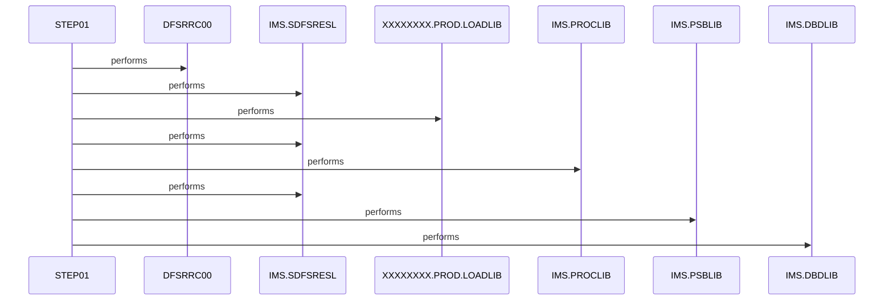

# CBPAUP0J

**File**: `jcl/CBPAUP0J.jcl`
**Type**: FileType.JCL
**Analyzed**: 2026-02-03 21:08:27.651625

## Purpose

This JCL executes the IMS program DFSRRC00 to delete expired authorizations using the BMP region controller. It specifies CBPAUP0C as the application program and PSBPAUTB as the PSB (Program Specification Block).

**Business Context**: UNKNOWN

## Inputs

| Name | Type | Description |
|------|------|-------------|
| SYSIN | IOType.FILE_SEQUENTIAL | Control statements for the IMS program. In this case, it contains parameters '00,00001,00001,Y'. |

## Outputs

| Name | Type | Description |
|------|------|-------------|
| SYSOUX | IOType.REPORT | System output. |
| SYSOUT | IOType.REPORT | System output. |
| SYSABOUT | IOType.REPORT | System output for ABEND information. |
| ABENDAID | IOType.REPORT | System output for ABEND aid. |
| SYSPRINT | IOType.REPORT | System print output. |
| SYSUDUMP | IOType.REPORT | System user dump output. |
| IMSERR | IOType.REPORT | IMS error output. |

## Called Programs

| Program | Call Type | Purpose |
|---------|-----------|---------|
| DFSRRC00 | CallType.STATIC_CALL | Executes the IMS program CBPAUP0C to delete expired authorizations. |

## Paragraphs/Procedures

### STEP01
This JCL step executes the IMS program DFSRRC00. It is the primary execution unit of the JCL. The purpose of this step is to initiate the execution of an IMS Batch Message Processing (BMP) region to delete expired authorizations. It reads the program name (CBPAUP0C) and PSB name (PSBPAUTB) from the PARM parameter. The program DFSRRC00 uses these parameters to initialize the IMS environment and execute the specified application program. The input to the program CBPAUP0C comes from the IMS database and control statements provided via SYSIN. The output includes system messages, diagnostic information, and any updates to the IMS database. It calls the IMS program DFSRRC00.

## Open Questions

- ? What is the purpose of the parameters passed in the SYSIN DD statement?
  - Context: The meaning of '00,00001,00001,Y' is unclear without further information about the CBPAUP0C program.

## Sequence Diagram

