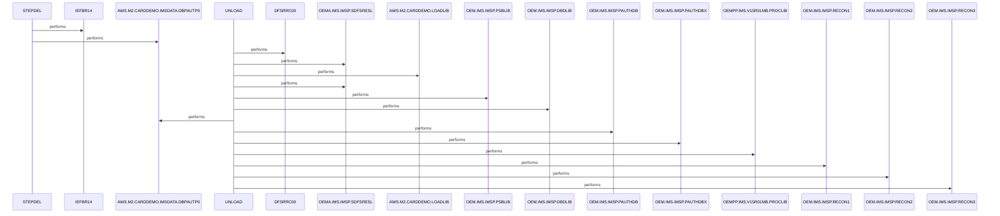

# DBPAUTP0

**File:** jcl/DBPAUTP0.jcl
**Type:** JCL
**Status:** In Progress
**Iterations:** 1
**Analyzed:** 2026-01-30 19:45:19.057101

## Purpose

This JCL job first deletes any existing unload dataset AWS.M2.CARDDEMO.IMSDATA.DBPAUTP0 using IEFBR14 in STEPDEL, then unloads the IMS database DBPAUTP0 using DFSRRC00 utility with PARM=(ULU,DFSURGU0,DBPAUTP0) into a new sequential VB dataset. It supports IMS database export for backup or processing in the CardDemo environment.

**Business Context:** IMS database management for CardDemo application, unloading DBPAUTP0 (authorization database PAUTHDB) to flat file.
**Program Type:** BATCH
**Citations:** Lines 1, 7, 15

## Inputs

### PARM
- **Type:** PARAMETER
- **Description:** Parameters directing IMS unload: ULU (unload), DFSURGU0 (user routine), DBPAUTP0 (database DBD name)
- **Lines:** 16

### DDPAUTP0
- **Type:** IMS_SEGMENT
- **Description:** Primary IMS PAUTHDB dataset for DBPAUTP0 unload
- **Lines:** 31

### DDPAUTX0
- **Type:** IMS_SEGMENT
- **Description:** Secondary IMS PAUTHDBX dataset for DBPAUTP0 unload
- **Lines:** 32

### DFSVSAMP
- **Type:** OTHER
- **Description:** IMS sample proclib macro DFSVSMDB for database definition
- **Lines:** 33

### DFSCTL
- **Type:** OTHER
- **Description:** Control statements for IMS utility including SBPARM ACTIV=COND
- **Lines:** 34

## Outputs

### DFSURGU1
- **Type:** FILE_SEQUENTIAL
- **Description:** Sequential VB unload file containing all DBPAUTP0 database segments
- **Lines:** 25

### SYSUT1
- **Type:** FILE_SEQUENTIAL
- **Description:** Target dataset for deletion (same DSN as DFSURGU1)
- **Lines:** 9

## Called Programs

| Program | Call Type | Purpose | Line |
|---------|-----------|---------|------|
| [IEFBR14](./IEFBR14.cbl.md) | STATIC_CALL | Delete existing output dataset prior to unload | 7 |
| [DFSRRC00](./DFSRRC00.cbl.md) | STATIC_CALL | Execute IMS unload utility for DBPAUTP0 database | 15 |

## Business Rules

### BR001: Perform database unload only under conditional activation
**Logic:** IMS utility governed by SBPARM ACTIV=COND
**Conditions:** ACTIV=COND
**Lines:** 35

## Data Flow

### Reads From
- **DDPAUTP0**: All database segments
  (Lines: 31)
- **DDPAUTX0**: All database segments
  (Lines: 32)

### Writes To
- **DFSURGU1**: Unloaded database records
  (Lines: 25)

### Transformations
- **IMS DBPAUTP0 segments** → **Sequential VB records**: Direct unload of IMS hierarchical database to flat sequential file via DFSRRC00 ULU
  (Lines: 15)

## Key Paragraphs

### STEPDEL
**Purpose:** The STEPDEL step is the first execution unit in the DBPAUTP0 job, defined by EXEC PGM=IEFBR14 on line 7. Its primary purpose is to unconditionally delete any existing cataloged dataset AWS.M2.CARDDEMO.IMSDATA.DBPAUTP0 via SYSUT1 DD with DISP=(MOD,DELETE) to prepare a clean output for the subsequent unload step (lines 9-10). It consumes no business data inputs, only referencing the target dataset DSN in SYSUT1. It produces minimal output limited to SYSPRINT DD SYSOUT=* for any JCL messages (line 8). There is no business logic, validations, or conditional processing; it performs a standard delete operation. Error handling relies on default JCL behavior, such as abend if the delete fails due to authority or locks. This step calls no subordinate paragraphs or programs. Completion transfers control sequentially to the UNLOAD step with no intervening COND parameters.
- Lines: 7-10

### UNLOAD
**Purpose:** The UNLOAD step is the core processing unit, executing DFSRRC00 IMS utility on line 15 with PARM=(ULU,DFSURGU0,DBPAUTP0) to unload the entire DBPAUTP0 database. Its primary role is to read all segments from input IMS datasets (DDPAUTP0, DDPAUTX0, etc.) and serialize them into the output DFSURGU1 sequential file (lines 25-29). It consumes libraries via STEPLIB/DFSRESLB/IMS (18-22), database datasets (31-33), recon files (40-42), and inline control DFSCTL with SBPARM ACTIV=COND for conditional execution (34-35). Outputs include the unload dataset, SYSPRINT for logs (23), and SYSUDUMP for diagnostics (36-38). Business logic is encapsulated in the IMS utility, enforcing conditional activation and user routine DFSURGU0 processing. Errors trigger standard IMS abends with dumps; dummy DDs handle optional sort/work (44-45). No subordinate paragraphs are called; all logic is utility-driven. This step completes the job after STEPDEL, producing the final unload file.
- Lines: 15-45

## Error Handling

- **Prior output dataset exists:** Delete via IEFBR14 in STEPDEL
  (Lines: 7)
- **IMS unload failure or exception:** Utility abend with SYSUDUMP capture
  (Lines: 36)
- **Unload activation not met:** Skip processing per SBPARM ACTIV=COND
  (Lines: 35)

## Sequence Diagram

---
*Generated by War Rig WAR_RIG*