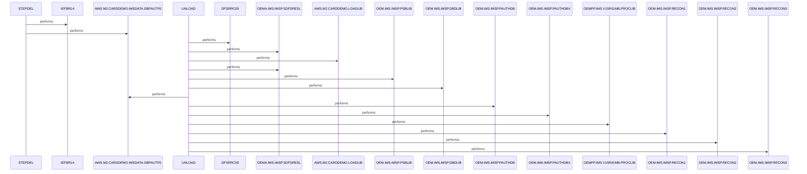

# DBPAUTP0

**File**: `jcl/DBPAUTP0.jcl`
**Type**: FileType.JCL
**Analyzed**: 2026-01-30 19:45:19.057101

## Purpose

This JCL job first deletes any existing unload dataset AWS.M2.CARDDEMO.IMSDATA.DBPAUTP0 using IEFBR14 in STEPDEL, then unloads the IMS database DBPAUTP0 using DFSRRC00 utility with PARM=(ULU,DFSURGU0,DBPAUTP0) into a new sequential VB dataset. It supports IMS database export for backup or processing in the CardDemo environment.

**Business Context**: IMS database management for CardDemo application, unloading DBPAUTP0 (authorization database PAUTHDB) to flat file.

## Inputs

| Name | Type | Description |
|------|------|-------------|
| PARM | IOType.PARAMETER | Parameters directing IMS unload: ULU (unload), DFSURGU0 (user routine), DBPAUTP0 (database DBD name) |
| DDPAUTP0 | IOType.IMS_SEGMENT | Primary IMS PAUTHDB dataset for DBPAUTP0 unload |
| DDPAUTX0 | IOType.IMS_SEGMENT | Secondary IMS PAUTHDBX dataset for DBPAUTP0 unload |
| DFSVSAMP | IOType.OTHER | IMS sample proclib macro DFSVSMDB for database definition |
| DFSCTL | IOType.OTHER | Control statements for IMS utility including SBPARM ACTIV=COND |

## Outputs

| Name | Type | Description |
|------|------|-------------|
| DFSURGU1 | IOType.FILE_SEQUENTIAL | Sequential VB unload file containing all DBPAUTP0 database segments |
| SYSUT1 | IOType.FILE_SEQUENTIAL | Target dataset for deletion (same DSN as DFSURGU1) |

## Called Programs

| Program | Call Type | Purpose |
|---------|-----------|---------|
| IEFBR14 | CallType.STATIC_CALL | Delete existing output dataset prior to unload |
| DFSRRC00 | CallType.STATIC_CALL | Execute IMS unload utility for DBPAUTP0 database |

## Business Rules

- **BR001**: Perform database unload only under conditional activation

## Paragraphs/Procedures

### STEPDEL
The STEPDEL step is the first execution unit in the DBPAUTP0 job, defined by EXEC PGM=IEFBR14 on line 7. Its primary purpose is to unconditionally delete any existing cataloged dataset AWS.M2.CARDDEMO.IMSDATA.DBPAUTP0 via SYSUT1 DD with DISP=(MOD,DELETE) to prepare a clean output for the subsequent unload step (lines 9-10). It consumes no business data inputs, only referencing the target dataset DSN in SYSUT1. It produces minimal output limited to SYSPRINT DD SYSOUT=* for any JCL messages (line 8). There is no business logic, validations, or conditional processing; it performs a standard delete operation. Error handling relies on default JCL behavior, such as abend if the delete fails due to authority or locks. This step calls no subordinate paragraphs or programs. Completion transfers control sequentially to the UNLOAD step with no intervening COND parameters.

### ~~UNLOAD~~ (Dead Code)
*Paragraph 'UNLOAD' is never PERFORMed or referenced by any other paragraph or program*

## Dead Code

The following artifacts were identified as dead code by static analysis:

| Artifact | Type | Line | Reason |
|----------|------|------|--------|
| UNLOAD | paragraph | 15 | Paragraph 'UNLOAD' is never PERFORMed or referenced by any other paragraph or program |

## Sequence Diagram

