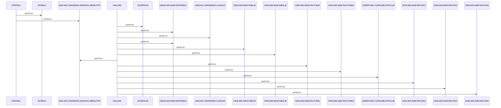

# DBPAUTP0

**File**: `jcl/DBPAUTP0.jcl`
**Type**: FileType.JCL
**Analyzed**: 2026-02-03 21:08:28.703859

## Purpose

This JCL job unloads the DBD DBPAUTP0 from an IMS database. It first deletes the output dataset if it exists, then executes the IMS Database Image Copy utility (DFSRRC00) to unload the DBD to a sequential dataset.

**Business Context**: UNKNOWN

## Inputs

| Name | Type | Description |
|------|------|-------------|
| AWS.M2.CARDDEMO.IMSDATA.DBPAUTP0 | IOType.FILE_SEQUENTIAL | Output dataset that will be deleted if it exists. |
| OEMA.IMS.IMSP.SDFSRESL | IOType.FILE_SEQUENTIAL | IMS RESLIB |
| AWS.M2.CARDDEMO.LOADLIB | IOType.FILE_SEQUENTIAL | Load library. |
| OEM.IMS.IMSP.PSBLIB | IOType.FILE_SEQUENTIAL | IMS PSBLIB |
| OEM.IMS.IMSP.DBDLIB | IOType.FILE_SEQUENTIAL | IMS DBDLIB |
| OEM.IMS.IMSP.PAUTHDB | IOType.FILE_SEQUENTIAL | PAUTHDB dataset |
| OEM.IMS.IMSP.PAUTHDBX | IOType.FILE_SEQUENTIAL | PAUTHDBX dataset |
| OEMPP.IMS.V15R01MB.PROCLIB(DFSVSMDB) | IOType.FILE_SEQUENTIAL | DFSVSMDB proc |
| OEM.IMS.IMSP.RECON1 | IOType.FILE_SEQUENTIAL | RECON1 dataset |
| OEM.IMS.IMSP.RECON2 | IOType.FILE_SEQUENTIAL | RECON2 dataset |
| OEM.IMS.IMSP.RECON3 | IOType.FILE_SEQUENTIAL | RECON3 dataset |

## Outputs

| Name | Type | Description |
|------|------|-------------|
| AWS.M2.CARDDEMO.IMSDATA.DBPAUTP0 | IOType.FILE_SEQUENTIAL | Output dataset containing the unloaded DBD DBPAUTP0. |
| SYSPRINT | IOType.REPORT | System print output for job execution messages and utility output. |
| SYSUDUMP | IOType.REPORT | System dump output. |

## Called Programs

| Program | Call Type | Purpose |
|---------|-----------|---------|
| IEFBR14 | CallType.STATIC_CALL | Deletes the output dataset AWS.M2.CARDDEMO.IMSDATA.DBPAUTP0 if it exists. |
| DFSRRC00 | CallType.STATIC_CALL | Unloads the DBD DBPAUTP0. |

## Paragraphs/Procedures

### STEPDEL
This step deletes the output dataset AWS.M2.CARDDEMO.IMSDATA.DBPAUTP0 before the unload process to ensure a clean execution. It uses the IEFBR14 program, a standard IBM utility for dataset management, to perform the deletion. The step defines the dataset to be deleted in the SYSUT1 DD statement, specifying DISP=(MOD,DELETE) to delete the dataset if it exists. SYSPRINT DD defines the output for system messages related to the deletion process. This step ensures that any previous versions of the output dataset are removed, preventing potential conflicts or errors during the subsequent unload operation. No specific business logic or error handling is implemented in this step, as IEFBR14 handles the dataset deletion process internally. The step does not call any other programs or paragraphs.

### ~~UNLOAD~~ (Dead Code)
*Paragraph 'UNLOAD' is never PERFORMed or referenced by any other paragraph or program*

## Dead Code

The following artifacts were identified as dead code by static analysis:

| Artifact | Type | Line | Reason |
|----------|------|------|--------|
| UNLOAD | paragraph | 15 | Paragraph 'UNLOAD' is never PERFORMed or referenced by any other paragraph or program |

## Sequence Diagram

