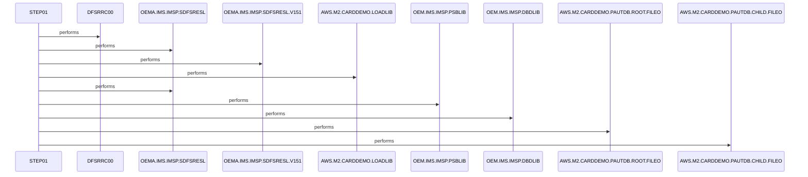

# LOADPADB

**File**: `jcl/LOADPADB.JCL`
**Type**: FileType.JCL
**Analyzed**: 2026-01-30 19:44:41.801435

## Purpose

This JCL job executes the IMS utility program DFSRRC00 in BMP mode to load the PAUTDB IMS database using PSBPAUTB and database reference PAUDBLOD. It reads root and child segment data from sequential input files INFILE1 and INFILE2. Standard IMS libraries and control datasets are referenced for execution.

**Business Context**: Loads data into the PAUTDB IMS database as part of the AWS M2 Card Demo application

## Inputs

| Name | Type | Description |
|------|------|-------------|
| INFILE1 | IOType.FILE_SEQUENTIAL | Root segment unload file for PAUTDB database load |
| INFILE2 | IOType.FILE_SEQUENTIAL | Child segment unload file for PAUTDB database load |
| IMS | IOType.OTHER | IMS PSBLIB and DBDLIB for PSB and DBD definitions |
| STEPLIB | IOType.OTHER | Load libraries including IMS SDFSRESL and application LOADLIB |

## Outputs

| Name | Type | Description |
|------|------|-------------|
| SYSPRINT | IOType.REPORT | Standard print output for job logs |
| SYSUDUMP | IOType.REPORT | System dump output for abends |
| IMSERR | IOType.REPORT | IMS error output |
| PAUTDB | IOType.IMS_SEGMENT | Target IMS database loaded with root and child segments (inferred from PARM and inputs) |

## Called Programs

| Program | Call Type | Purpose |
|---------|-----------|---------|
| DFSRRC00 | CallType.STATIC_CALL | IMS utility to load PAUTDB database in BMP mode using PSBPAUTB |

## Paragraphs/Procedures

### LOADPADB
The 'LOADPADB' paragraph represents the job header statement that defines the overall job execution parameters, including job name, class A, message class H, message level (1,1), region 0M, notify to &SYSUID, and maximum time of 1440 minutes. It consumes no direct data inputs but establishes the runtime environment for the subsequent step. It produces the job execution context, enabling the single step STEP01 to run. Embedded within it are copyright notices and Apache License 2.0 details, indicating proprietary Amazon development for the M2 application. No business logic or conditional decisions are implemented here, as it is structural JCL. Error handling is implicit via system parameters leading to dumps on failure. It orchestrates the flow to STEP01, which executes DFSRRC00, without calling other paragraphs. The primary role is to schedule and resource the IMS database load job. Commented sections include potential library overrides and output DDs for the target database. This setup ensures all necessary IMS libraries and input files are accessible for the load process.

### STEP01
The STEP01 paragraph executes the IMS utility DFSRRC00 with PARM='BMP,PAUDBLOD,PSBPAUTB' to perform the database load operation. It consumes input data from DD INFILE1 (root segments) and INFILE2 (child segments), along with STEPLIB datasets and IMS control libraries for PSBs and DBDs. Outputs are directed to SYSPRINT for logs, SYSUDUMP for abends, IMSERR for errors, and implicitly to the PAUTDB IMS database segments. No explicit business rules or validations are visible in the JCL, as logic resides in the called program DFSRRC00. Error conditions trigger standard z/OS abend processing with dumps to SYSUDUMP. This step is called implicitly by the job scheduler upon job submission. It does not call other paragraphs or programs, serving as the sole executable step. The purpose is to reload hierarchical data into the IMS PAUTDB database from sequential unload files. Dummy DDs like IMSLOGR and IEFRDER suppress unnecessary logging. Commented DDs suggest optional direct database access for verification.

## Open Questions

- ? Exact function of DFSRRC00 with PARM='BMP,PAUDBLOD,PSBPAUTB'
  - Context: Not standard documented IMS utility name; inferred as DB load from inputs/DSNs
- ? Field-level details in INFILE1/INFILE2
  - Context: JCL provides no record layouts

## Sequence Diagram

