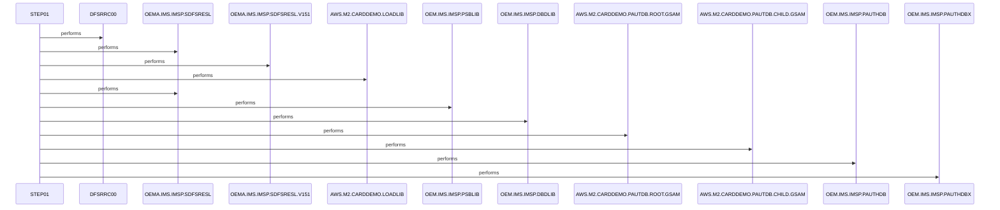

# UNLDGSAM

**File**: `jcl/UNLDGSAM.JCL`
**Type**: FileType.JCL
**Analyzed**: 2026-02-03 21:08:12.299290

## Purpose

This JCL job unloads a GSAM database using the IMS program DFSRRC00. It specifies the program to execute, the libraries needed, and the input and output datasets for the GSAM database unload process.

## Inputs

| Name | Type | Description |
|------|------|-------------|
| AWS.M2.CARDDEMO.PAUTDB.ROOT.GSAM | IOType.FILE_SEQUENTIAL | Input GSAM database root segment to be unloaded. |
| AWS.M2.CARDDEMO.PAUTDB.CHILD.GSAM | IOType.FILE_SEQUENTIAL | Input GSAM database child segment to be unloaded. |
| OEMA.IMS.IMSP.PAUTHDB | IOType.FILE_SEQUENTIAL | Input dataset. Purpose unknown. |
| OEMA.IMS.IMSP.PAUTHDBX | IOType.FILE_SEQUENTIAL | Input dataset. Purpose unknown. |
| OEMPP.IMS.V15R01MB.PROCLIB(DFSVSMDB) | IOType.FILE_SEQUENTIAL | DFSVSMDB member in PROCLIB. Purpose unknown. |

## Outputs

| Name | Type | Description |
|------|------|-------------|
| SYSPRINT | IOType.REPORT | System print output for job execution messages. |
| SYSUDUMP | IOType.REPORT | System dump output for debugging purposes. |
| IMSERR | IOType.REPORT | IMS error messages output. |

## Called Programs

| Program | Call Type | Purpose |
|---------|-----------|---------|
| DFSRRC00 | CallType.STATIC_CALL | Executes the IMS database unload utility. |

## Paragraphs/Procedures

### STEP01
This step executes the IMS program DFSRRC00 to unload a GSAM database. It specifies the program name, parameters, and required libraries. The PARM parameter defines the execution environment for the IMS program, including the database unload function (DBUNLDGS) and other relevant options. The STEPLIB DD statements define the libraries required to execute the IMS program, including the IMS SDFSRESL library and the application load library. The DFSRESLB DD statement specifies the IMS resident library. The IMS DD statements define the PSBLIB and DBDLIB libraries, which contain the program specification blocks and database description blocks, respectively. The PASFILOP and PADFILOP DD statements define the input GSAM database datasets to be unloaded. The DDPAUTP0 and DDPAUTX0 DD statements define additional input datasets, but their specific purpose is unknown. The DFSVSAMP DD statement specifies the DFSVSMDB member in PROCLIB, which likely contains buffer pool parameters. The IMSLOGR and IEFRDER DD statements are dummy datasets, possibly related to logging. Finally, SYSPRINT, SYSUDUMP, and IMSERR DD statements define the output datasets for system messages, dumps, and IMS error messages, respectively.

## Open Questions

- ? What is the purpose of DDPAUTP0 and DDPAUTX0 datasets?
  - Context: The JCL includes these datasets, but their function is not clear from the context.
- ? What is the purpose of the DFSVSAMP DD statement and the DFSVSMDB member?
  - Context: The JCL includes this DD statement, but its function is not clear from the context.
- ? What is the purpose of the IMSLOGR and IEFRDER DD DUMMY statements?
  - Context: The JCL includes these DD DUMMY statements, but their function is not clear from the context.

## Sequence Diagram

