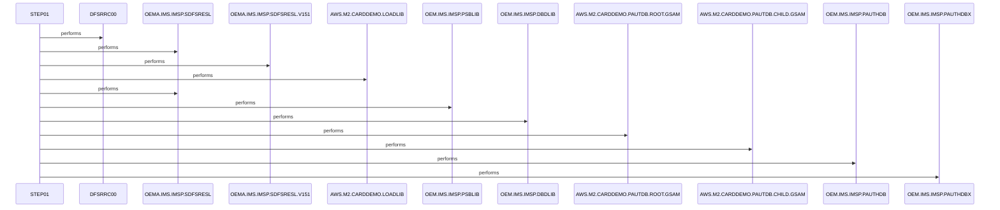

# UNLDGSAM

**File:** jcl/UNLDGSAM.JCL
**Type:** JCL
**Status:** In Progress
**Iterations:** 1
**Analyzed:** 2026-01-30 19:44:54.523060

## Purpose

This JCL submits a batch job to execute the IMS database reorganization utility DFSRRC00 in unload mode for the GSAM database DBUNLDGS using DLI access method and PSB DLIGSAMP. It provides access to required IMS libraries, PSB/DBD libraries, PAUTDB GSAM datasets (root and child), and directs utility output to SYSOUT datasets. The job is part of the AWS M2 Card Demo application dataset maintenance.

**Business Context:** Unloading IMS PAUTDB GSAM databases (root and child) for the AWS M2 Card Demo application, likely for backup, reorg preparation, or data extraction.
**Program Type:** BATCH
**Citations:** Lines 26, 27, 36, 39

## Inputs

### PARM
- **Type:** PARAMETER
- **Description:** IMS utility control parameters specifying DLI access mode, database name DBUNLDGS, PSB name DLIGSAMP, and additional flags
- **Lines:** 27

### PASFILOP
- **Type:** IMS_SEGMENT
- **Description:** Input GSAM dataset for PAUTDB.ROOT containing IMS database segments to unload
- **Lines:** 36

### PADFILOP
- **Type:** IMS_SEGMENT
- **Description:** Input GSAM dataset for PAUTDB.CHILD containing IMS database segments to unload
- **Lines:** 39

### IMS
- **Type:** OTHER
- **Description:** IMS PSBLIB and DBDLIB for program specification block and database description library
- **Lines:** 33

### DDPAUTP0
- **Type:** OTHER
- **Description:** IMS PAUTHDB library reference
- **Lines:** 42

### DDPAUTX0
- **Type:** OTHER
- **Description:** IMS PAUTHDBX library reference
- **Lines:** 43

### DFSVSAMP
- **Type:** OTHER
- **Description:** IMS proclib member DFSVSMDB for VSAM support
- **Lines:** 46

## Outputs

### SYSPRINT
- **Type:** REPORT
- **Description:** Utility execution reports and listings
- **Lines:** 50

### SYSUDUMP
- **Type:** REPORT
- **Description:** System dump output on abends
- **Lines:** 51

### IMSERR
- **Type:** REPORT
- **Description:** IMS-specific error messages
- **Lines:** 52

## Called Programs

| Program | Call Type | Purpose | Line |
|---------|-----------|---------|------|
| [DFSRRC00](./DFSRRC00.cbl.md) | STATIC_CALL | Performs IMS database unload operation on GSAM database | 26 |

## Business Rules

### BR001: Executes IMS database unload using DLI access method on target database DBUNLDGS with PSB DLIGSAMP and specific utility flags
**Logic:** PARM parameter enforces access mode (DLI position 1), database name (DBUNLDGS position 2), PSB name (DLIGSAMP position 3), and control flags (last N suppresses something per IMS docs)
**Conditions:** DLI access required, DBUNLDGS database, DLIGSAMP PSB, Final flag N
**Lines:** 27

## Data Flow

### Reads From
- **PASFILOP**: IMS database segments (unknown structure)
  (Lines: 36)
- **PADFILOP**: IMS database segments (unknown structure)
  (Lines: 39)

### Writes To
- **SYSPRINT**: Unload reports and statistics
  (Lines: 50)
- **IMSERR**: Error details
  (Lines: 52)

## Key Paragraphs

### STEP01
**Purpose:** This is the primary and only execution step in the JCL job, orchestrating the invocation of the IMS database reorganization utility DFSRRC00 specifically for unloading GSAM database segments. It consumes the inline PARM parameter on line 27 ('DLI,DBUNLDGS,DLIGSAMP,,,,,,,,,,,N') which dictates the DLI access method, targets the DBUNLDGS database using PSB DLIGSAMP, and sets various control flags including a final 'N' flag. Input datasets are read from PASFILOP (PAUTDB.ROOT.GSAM) and PADFILOP (PAUTDB.CHILD.GSAM) as primary IMS segment sources with DISP=(OLD,KEEP,KEEP) to preserve them post-processing, supplemented by STEPLIB datasets for IMS and application loads (lines 28-30), DFSRESLB (31), IMS PSBLIB/DBDLIB (33-34), DDPAUTP0/ DDPAUTX0 (42-43), and DFSVSAMP proclib (46-47). No persistent data files are written; outputs are produced to ephemeral SYSOUT destinations: SYSPRINT for reports (50), SYSUDUMP for abend dumps (51), and IMSERR for errors (52), while IMSLOGR and IEFRDER are DUMMY (48-49) to suppress logging. Business logic is delegated to DFSRRC00 controlled by PARM, implementing the unload without full IMS logging or reader intervention. Error handling relies on the utility's internal logic, routing dumps to SYSUDUMP and errors to IMSERR/SYSPRINT, with job-level protections like TIME=1440 (line 2) and REGION=0M. This step does not invoke subordinate steps, programs, or paragraphs; it solely executes DFSRRC00 statically via EXEC PGM=. Upon completion, the job notifies the submitter (&SYSUID) and ends.
- Lines: 26-53

## Error Handling

- **IMS utility abend or error:** Dumps to SYSUDUMP, errors to IMSERR and SYSPRINT
  (Lines: 51, 52)
- **Resource contention or timeout:** Job timeout after 1440 minutes, notify submitter
  (Lines: 2)

## Open Questions

- **What is the exact output format and destination of the unloaded database data?**
  - Context: No explicit UNLOAD DD dataset defined; output appears limited to SYSOUT reports
  - Suggestion: Consult IMS DFSRRC00 documentation for UNLOAD function with this PARM to confirm if data unload is printed or requires additional DD
- **What specific segments or fields are unloaded from PASFILOP and PADFILOP?**
  - Context: No copybooks or segment layouts provided in JCL
  - Suggestion: Analyze referenced PSB DLIGSAMP and DBD DBUNLDGS definitions

## Sequence Diagram

---
*Generated by War Rig WAR_RIG*