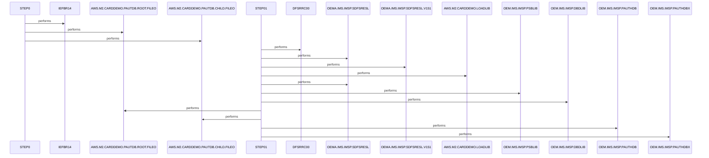

# UNLDPADB

**File**: `jcl/UNLDPADB.JCL`
**Type**: FileType.JCL
**Analyzed**: 2026-02-03 21:08:15.984129

## Purpose

This JCL job unloads an IMS database (PAUTDB) using the IMS Database Utility (DFSRRC00). It deletes the existing database files, executes the unload utility with the specified PSB (PAUTBUNL), and then recreates the database files.

## Inputs

| Name | Type | Description |
|------|------|-------------|
| OEM.IMS.IMSP.SDFSRESL | IOType.FILE_SEQUENTIAL | IMS RESLIB library containing the IMS nucleus and required modules. |
| OEMA.IMS.IMSP.SDFSRESL.V151 | IOType.FILE_SEQUENTIAL | An alternate IMS RESLIB library, possibly a specific version. |
| AWS.M2.CARDDEMO.LOADLIB | IOType.FILE_SEQUENTIAL | Application load library containing the required modules. |
| OEM.IMS.IMSP.PSBLIB | IOType.FILE_SEQUENTIAL | IMS PSB library containing the program control blocks. |
| OEM.IMS.IMSP.DBDLIB | IOType.FILE_SEQUENTIAL | IMS DBD library containing the database descriptions. |
| OEM.IMS.IMSP.PAUTHDB | IOType.FILE_SEQUENTIAL | Input IMS database to be unloaded (PAUTHDB). |
| OEM.IMS.IMSP.PAUTHDBX | IOType.FILE_SEQUENTIAL | Input IMS index database (PAUTHDBX). |
| OEMPP.IMS.V15R01MB.PROCLIB(DFSVSMDB) | IOType.FILE_SEQUENTIAL | IMS VSAM definition parameters. |

## Outputs

| Name | Type | Description |
|------|------|-------------|
| AWS.M2.CARDDEMO.PAUTDB.ROOT.FILEO | IOType.FILE_SEQUENTIAL | Output file for the unloaded root segment of the PAUTDB database. |
| AWS.M2.CARDDEMO.PAUTDB.CHILD.FILEO | IOType.FILE_SEQUENTIAL | Output file for the unloaded child segment of the PAUTDB database. |

## Called Programs

| Program | Call Type | Purpose |
|---------|-----------|---------|
| IEFBR14 | CallType.STATIC_CALL | Dummy program used to delete the existing database files. |
| DFSRRC00 | CallType.STATIC_CALL | IMS Database utility used to unload the database. |

## Paragraphs/Procedures

### STEP0
This step executes the IEFBR14 program, which is a dummy program that performs no actual processing.  It's used here to delete the existing database files AWS.M2.CARDDEMO.PAUTDB.ROOT.FILEO and AWS.M2.CARDDEMO.PAUTDB.CHILD.FILEO before the unload process begins. The DD1 and DD2 DD statements define these files with a DISP=(OLD,DELETE,DELETE) disposition, ensuring they are deleted regardless of the step's success or failure. This step ensures that the subsequent unload process creates new, empty files for the unloaded data. No data is read or written in this step, and no other programs or paragraphs are called. The primary purpose is file deletion to prepare for the database unload.

### STEP01
This step executes the IMS Database utility DFSRRC00 to unload the PAUTDB database. The PARM parameter specifies the execution environment ('DLI'), the utility to be run ('PAUDBUNL' - Database Unload), the PSB name ('PAUTBUNL'), and other control options. The STEPLIB DD statements define the libraries containing the necessary IMS modules, including the IMS nucleus and application-specific modules. The DFSRESLB DD statement specifies the IMS RESLIB. The IMS DD statement defines the PSBLIB and DBDLIB, which contain the program and database definitions. OUTFIL1 and OUTFIL2 DD statements define the output files where the unloaded data will be written. DDPAUTP0 and DDPAUTX0 define the input database. DFSVSAMP defines VSAM parameters. This step reads data from the IMS database (PAUTHDB, PAUTHDBX) and writes the unloaded data to sequential files (AWS.M2.CARDDEMO.PAUTDB.ROOT.FILEO, AWS.M2.CARDDEMO.PAUTDB.CHILD.FILEO). No error handling is explicitly defined in the JCL, but IMS will handle errors internally. No other programs or paragraphs are called directly from this step.

## Open Questions

- ? What is the exact purpose of the 'N' parameter in the PARM field of STEP01?
  - Context: The meaning of the 'N' parameter is unclear without access to the IMS documentation for DFSRRC00.

## Sequence Diagram

