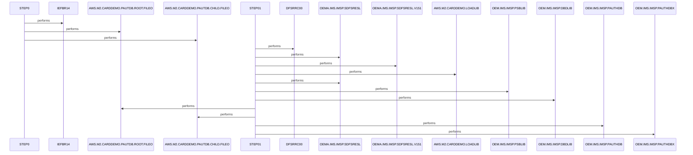

# UNLDPADB

**File**: `jcl/UNLDPADB.JCL`
**Type**: FileType.JCL
**Analyzed**: 2026-01-30 19:44:58.994672

## Purpose

This JCL job first deletes any existing sequential output files from prior runs using IEFBR14, then executes the IMS Database Unload utility DFSRRC00 to unload the PAUTHDB and PAUTHDBX IMS databases into sequential files ROOT.FILEO and CHILD.FILEO. The unload targets root and child segments based on output file naming and PARM specifications (PAUDBUNL, PAUTBUNL). It supports the CARDDEMO application by creating flat files from the hierarchical IMS database.

**Business Context**: Unloading IMS PAUTDB/PAUTHDB database for backup, migration, or processing in the AWS.M2.CARDDEMO application

## Inputs

| Name | Type | Description |
|------|------|-------------|
| DDPAUTP0 | IOType.IMS_SEGMENT | IMS PAUTHDB database (primary/root segments for unload) |
| DDPAUTX0 | IOType.IMS_SEGMENT | IMS PAUTHDBX database (secondary/child segments for unload) |
| DD1 | IOType.FILE_SEQUENTIAL | Prior ROOT.FILEO for deletion if exists |
| DD2 | IOType.FILE_SEQUENTIAL | Prior CHILD.FILEO for deletion if exists |

## Outputs

| Name | Type | Description |
|------|------|-------------|
| OUTFIL1 | IOType.FILE_SEQUENTIAL | Unloaded root segments from PAUTHDB in fixed-block format (LRECL=100) |
| OUTFIL2 | IOType.FILE_SEQUENTIAL | Unloaded child segments from PAUTHDBX in fixed-block format (LRECL=206) |

## Called Programs

| Program | Call Type | Purpose |
|---------|-----------|---------|
| IEFBR14 | CallType.STATIC_CALL | Trigger deletion of prior output files via DISP parameters |
| DFSRRC00 | CallType.STATIC_CALL | IMS Database Unload utility to extract segments to sequential files |

## Paragraphs/Procedures

### STEP0
This step serves as a cleanup procedure to ensure no residual output files from previous job executions interfere with the current run. It executes the no-op utility IEFBR14, which triggers file deletions based on DISP=(OLD,DELETE,DELETE) parameters for DD1 and DD2. Inputs are references to potential existing files AWS.M2.CARDDEMO.PAUTDB.ROOT.FILEO and AWS.M2.CARDDEMO.PAUTDB.CHILD.FILEO; if present, they are deleted, otherwise the step succeeds without action. No data is read or processed beyond existence checks implicit in DISP processing. Outputs are the deletion of those files to provide a clean slate. There are no business decisions, conditions, or validations explicitly coded; it relies on standard JCL file disposition behavior. No subordinate calls or error branches are present. Logging is directed to SYSPRINT, SYSOUT, and SYSDUMP on SYSOUT* for any issues. This step prevents catalog conflicts or overwrites in the subsequent unload step.

### ~~STEP01~~ (Dead Code)
*Paragraph 'STEP01' is never PERFORMed or referenced by any other paragraph or program*

## Dead Code

The following artifacts were identified as dead code by static analysis:

| Artifact | Type | Line | Reason |
|----------|------|------|--------|
| STEP01 | paragraph | 38 | Paragraph 'STEP01' is never PERFORMed or referenced by any other paragraph or program |

## Sequence Diagram

