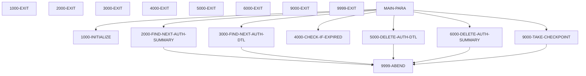

# CBPAUP0C

**File**: `cbl/CBPAUP0C.cbl`
**Type**: FileType.COBOL
**Analyzed**: 2026-01-28 14:54:28.819625

## Purpose

This batch COBOL IMS program deletes expired pending authorization messages from the IMS database. It reads pending authorization summary and detail segments, checks if they are expired based on a configurable expiry period, and deletes the expired detail segments. It also deletes the summary segment if all its detail segments have been deleted. [2, 5]

**Business Context**: CardDemo - Authorization Module [3]

## Inputs

| Name | Type | Description |
|------|------|-------------|
| SYSIN | IOType.PARAMETER | Contains parameters for expiry days, checkpoint frequency, checkpoint display frequency, and debug flag. [98-108, 189] |
| IMS Database - PAUTSUM0 (Pending Authorization Summary) | IOType.IMS_SEGMENT | Contains summary information about pending authorizations. [116, 224] |
| IMS Database - PAUTDTL1 (Pending Authorization Details) | IOType.IMS_SEGMENT | Contains detailed information about pending authorizations. [120, 256] |

## Outputs

| Name | Type | Description |
|------|------|-------------|
| DISPLAY | IOType.REPORT | Displays program start message, parameter values, date, summary counts (read, deleted), and checkpoint messages. [171-178, 190-194, 362-363, 366-368] |
| IMS Database - PAUTSUM0 (Pending Authorization Summary) | IOType.IMS_SEGMENT | Pending Authorization Summary segment is deleted if all detail segments are deleted. [156-158, 335-338] |
| IMS Database - PAUTDTL1 (Pending Authorization Details) | IOType.IMS_SEGMENT | Pending Authorization Detail segment is deleted if it is expired. [149-151, 310-313] |
| RETURN-CODE | IOType.RETURN_CODE | Set to 16 if the program abends. [382] |

## Business Rules

- **BR001**: Determine if a pending authorization detail is expired. If the difference between the current date and the authorization date is greater than or equal to the expiry days, the authorization is considered expired.
- **BR002**: Adjust approved/declined authorization counts and amounts based on authorization response code before deleting an expired authorization detail.
- **BR003**: Delete the authorization summary if both approved and declined authorization counts are zero. [156]

## Paragraphs/Procedures

### MAIN-PARA
This is the main control paragraph of the program. It orchestrates the process of finding and deleting expired pending authorization messages. It first calls 1000-INITIALIZE to initialize variables and read parameters. Then, it enters a loop to process each authorization summary record. Inside this loop, it calls 3000-FIND-NEXT-AUTH-DTL to retrieve authorization details and then enters another loop to check each detail for expiry using 4000-CHECK-IF-EXPIRED. If a detail is expired, 5000-DELETE-AUTH-DTL is called to delete it. After processing all details for a summary, 6000-DELETE-AUTH-SUMMARY is called if the summary has no remaining approved or declined authorizations. Checkpoints are taken periodically using 9000-TAKE-CHECKPOINT. The program terminates after processing all authorization summary records. [136-170]

### 1000-INITIALIZE
This paragraph initializes program variables and reads input parameters. It accepts the current date and day from the system. It reads parameters from SYSIN into PRM-INFO, including expiry days, checkpoint frequency, checkpoint display frequency, and debug flag. It displays the starting program message, the parameters received, and today's date. It validates the input parameters, setting default values if they are invalid. Specifically, it sets WS-EXPIRY-DAYS to 5 if P-EXPIRY-DAYS is not numeric, P-CHKP-FREQ to 5 if it's spaces, 0, or LOW-VALUES, P-CHKP-DIS-FREQ to 10 if it's spaces, 0, or LOW-VALUES, and P-DEBUG-FLAG to 'N' if it's not 'Y'. [183-210]

### 2000-FIND-NEXT-AUTH-SUMMARY
This paragraph reads the next pending authorization summary segment from the IMS database. It uses the GN (Get Next) DLI call to retrieve the PAUTSUM0 segment into the PENDING-AUTH-SUMMARY area. If the DEBUG-ON flag is set, it displays the number of summary records read. It evaluates the DIBSTAT return code to determine the status of the read operation. If the status is '  ', it sets NOT-END-OF-AUTHDB to TRUE, increments the summary read count (WS-NO-SUMRY-READ) and the summary processed count (WS-AUTH-SMRY-PROC-CNT), and moves the account ID (PA-ACCT-ID) to WS-CURR-APP-ID. If the status is 'GB', it sets END-OF-AUTHDB to TRUE. If any other status is returned, it displays an error message and abends the program. [216-242]

### 3000-FIND-NEXT-AUTH-DTL
This paragraph reads the next pending authorization detail segment from the IMS database. It uses the GNP (Get Next within Parent) DLI call to retrieve the PAUTDTL1 segment into the PENDING-AUTH-DETAILS area. If the DEBUG-ON flag is set, it displays the number of detail records read. It evaluates the DIBSTAT return code to determine the status of the read operation. If the status is '  ', it sets MORE-AUTHS to TRUE and increments the detail read count (WS-NO-DTL-READ). If the status is 'GE' or 'GB', it sets NO-MORE-AUTHS to TRUE. If any other status is returned, it displays an error message, the summary account ID, and the number of detail records read before the error, and then abends the program. [248-271]

### 4000-CHECK-IF-EXPIRED
This paragraph checks if a pending authorization detail record is expired. It calculates the authorization date (WS-AUTH-DATE) by subtracting the PA-AUTH-DATE-9C from 99999. It then calculates the difference (WS-DAY-DIFF) between the current year and day (CURRENT-YYDDD) and the calculated authorization date. If the difference is greater than or equal to the expiry days (WS-EXPIRY-DAYS), it sets QUALIFIED-FOR-DELETE to TRUE. It then adjusts the approved or declined authorization counts and amounts in the summary record based on the authorization response code (PA-AUTH-RESP-CODE). If the response code is '00', it subtracts 1 from PA-APPROVED-AUTH-CNT and subtracts PA-APPROVED-AMT. Otherwise, it subtracts 1 from PA-DECLINED-AUTH-CNT and subtracts PA-TRANSACTION-AMT. If the detail is not expired, it sets NOT-QUALIFIED-FOR-DELETE to TRUE. [277-297]

### 5000-DELETE-AUTH-DTL
This paragraph deletes a pending authorization detail segment from the IMS database. It uses the DLET (Delete) DLI call to delete the PAUTDTL1 segment. If the DEBUG-ON flag is set, it displays the account ID of the detail being deleted. It checks the DIBSTAT return code. If the status is SPACES, it increments the detail deleted count (WS-NO-DTL-DELETED). If any other status is returned, it displays an error message with the account ID and abends the program. [303-321]

### 6000-DELETE-AUTH-SUMMARY
This paragraph deletes a pending authorization summary segment from the IMS database. It uses the DLET (Delete) DLI call to delete the PAUTSUM0 segment. If the DEBUG-ON flag is set, it displays the account ID of the summary being deleted. It checks the DIBSTAT return code. If the status is SPACES, it increments the summary deleted count (WS-NO-SUMRY-DELETED). If any other status is returned, it displays an error message with the account ID and abends the program. [328-346]

### 9000-TAKE-CHECKPOINT
This paragraph takes an IMS checkpoint. It issues a CHKP (Checkpoint) DLI call with a unique checkpoint ID (WK-CHKPT-ID). It then checks the DIBSTAT return code. If the status is SPACES, it increments the checkpoint count (WS-NO-CHKP). If the checkpoint count reaches the checkpoint display frequency (P-CHKP-DIS-FREQ), it resets the checkpoint count and displays a success message with the authorization count and application ID. If the DIBSTAT is not SPACES, it displays a failure message with the DIBSTAT, record count, and application ID, and then abends the program. [352-370]

### 9999-ABEND
This paragraph handles program abends. It displays a message indicating that the program is abending. It sets the RETURN-CODE to 16 and then terminates the program using GOBACK. [377-383]

## Dead Code

The following artifacts were identified as dead code by static analysis:

| Artifact | Type | Line | Reason |
|----------|------|------|--------|
| 9999-EXIT | paragraph | 384 | Paragraph '9999-EXIT' is never PERFORMed or referenced by any other paragraph or program |

## Control Flow

