# COPAUA0C

**File**: `cbl/COPAUA0C.cbl`
**Type**: FileType.COBOL
**Analyzed**: 2026-01-28 14:56:29.552612

## Purpose

This COBOL program processes authorization requests, retrieves account and customer information, makes authorization decisions based on available credit and transaction amount, and sends a response. It reads card details, retrieves account and customer data from CICS files and IMS database, and updates the pending authorization summary in IMS. The program also logs errors and warnings to an error log.

**Business Context**: This program is likely part of a credit card authorization system, responsible for validating transactions and updating account information.

## Inputs

| Name | Type | Description |
|------|------|-------------|
| W01-GET-BUFFER | IOType.CICS_QUEUE | Contains the authorization request message received from the MQ queue. |
| WS-CCXREF-FILE | IOType.FILE_VSAM | Card Cross-Reference file, used to retrieve account and customer IDs based on the card number. |
| WS-ACCTFILENAME | IOType.FILE_VSAM | Account master file, used to retrieve account details such as credit limit and current balance. |
| WS-CUSTFILENAME | IOType.FILE_VSAM | Customer master file, used to retrieve customer details. |
| PENDING-AUTH-SUMMARY | IOType.IMS_SEGMENT | IMS segment PAUTSUM0 containing pending authorization summary data. |
| PA-RQ-CARD-NUM | IOType.CICS_COMMAREA | Card number from the request. |
| PA-RQ-TRANSACTION-AMT | IOType.CICS_COMMAREA | Transaction amount from the request. |

## Outputs

| Name | Type | Description |
|------|------|-------------|
| W02-PUT-BUFFER | IOType.CICS_QUEUE | Contains the authorization response message sent to the MQ queue. |
| PENDING-AUTH-SUMMARY | IOType.IMS_SEGMENT | Updated pending authorization summary segment in IMS. |

## Called Programs

| Program | Call Type | Purpose |
|---------|-----------|---------|
| MQGET | CallType.STATIC_CALL | Retrieves a message from the MQ queue. |
| MQPUT1 | CallType.STATIC_CALL | Sends a response message to the MQ queue. |

## Business Rules

- **BR001**: Decline authorization if the transaction amount exceeds the available credit.
- **BR002**: If no authorization summary is found, use account data to determine available credit.

## Paragraphs/Procedures

### 5000-PROCESS-AUTH
This paragraph is the main processing unit for authorizing a transaction. It orchestrates the retrieval of necessary data, makes an authorization decision, sends a response, and writes the authorization to the database. It starts by scheduling a PSB (Program Specification Block) for IMS access using 1200-SCHEDULE-PSB. Then, it attempts to read the card cross-reference record using 5100-READ-XREF-RECORD. If the card is found in the cross-reference, it reads the account record using 5200-READ-ACCT-RECORD, the customer record using 5300-READ-CUST-RECORD, the authorization summary using 5500-READ-AUTH-SUMMRY, and the profile data using 5600-READ-PROFILE-DATA. After retrieving the data, it calls 6000-MAKE-DECISION to determine whether to approve or decline the authorization. Finally, it sends the response using 7100-SEND-RESPONSE and writes the authorization to the database using 8000-WRITE-AUTH-TO-DB if the card was found in the cross-reference file. Error handling is performed within the called paragraphs, and flags are set to indicate whether records were found or not found.

### 5100-READ-XREF-RECORD
This paragraph reads the card cross-reference record from the VSAM file WS-CCXREF-FILE. It moves the card number from the request (PA-RQ-CARD-NUM) to the key field (XREF-CARD-NUM) and then executes a CICS READ command to retrieve the CARD-XREF-RECORD. The paragraph checks the CICS response code (WS-RESP-CD) to determine the outcome of the read operation. If the record is found (DFHRESP(NORMAL)), it sets CARD-FOUND-XREF to TRUE. If the record is not found (DFHRESP(NOTFND)), it sets CARD-NFOUND-XREF and NFOUND-ACCT-IN-MSTR to TRUE and logs a warning message. If any other error occurs, it logs a critical error message with the CICS response codes. The paragraph uses EVALUATE statement for error handling based on the CICS response code. The error logging is done by calling 9500-LOG-ERROR.

### 5200-READ-ACCT-RECORD
This paragraph reads the account record from the VSAM file WS-ACCTFILENAME. It moves the account ID from the cross-reference record (XREF-ACCT-ID) to the key field (WS-CARD-RID-ACCT-ID) and then executes a CICS READ command to retrieve the ACCOUNT-RECORD. The paragraph checks the CICS response code (WS-RESP-CD) to determine the outcome of the read operation. If the record is found (DFHRESP(NORMAL)), it sets FOUND-ACCT-IN-MSTR to TRUE. If the record is not found (DFHRESP(NOTFND)), it sets NFOUND-ACCT-IN-MSTR to TRUE and logs a warning message. If any other error occurs, it logs a critical error message with the CICS response codes. The paragraph uses EVALUATE statement for error handling based on the CICS response code. The error logging is done by calling 9500-LOG-ERROR.

### 5300-READ-CUST-RECORD
This paragraph reads the customer record from the VSAM file WS-CUSTFILENAME. It moves the customer ID from the cross-reference record (XREF-CUST-ID) to the key field (WS-CARD-RID-CUST-ID) and then executes a CICS READ command to retrieve the CUSTOMER-RECORD. The paragraph checks the CICS response code (WS-RESP-CD) to determine the outcome of the read operation. If the record is found (DFHRESP(NORMAL)), it sets FOUND-CUST-IN-MSTR to TRUE. If the record is not found (DFHRESP(NOTFND)), it sets NFOUND-CUST-IN-MSTR to TRUE and logs a warning message. If any other error occurs, it logs a critical error message with the CICS response codes. The paragraph uses EVALUATE statement for error handling based on the CICS response code. The error logging is done by calling 9500-LOG-ERROR.

### 5500-READ-AUTH-SUMMRY
This paragraph reads the pending authorization summary segment (PAUTSUM0) from the IMS database. It moves the account ID from the cross-reference record (XREF-ACCT-ID) to the PA-ACCT-ID field and then executes an IMS DLI GU (Get Unique) command to retrieve the segment. The paragraph checks the IMS return code (DIBSTAT) to determine the outcome of the read operation. If the segment is found (STATUS-OK), it sets FOUND-PAUT-SMRY-SEG to TRUE. If the segment is not found (SEGMENT-NOT-FOUND), it sets NFOUND-PAUT-SMRY-SEG to TRUE. If any other error occurs, it logs a critical error message with the IMS return code. The paragraph uses EVALUATE statement for error handling based on the IMS return code. The error logging is done by calling 9500-LOG-ERROR.

### 5600-READ-PROFILE-DATA
This paragraph is a placeholder and currently contains only a CONTINUE statement. It does not perform any specific action. It is called by 5000-PROCESS-AUTH. It might be intended for future implementation to read profile data, but currently, it serves as a no-op. There is no error handling or data manipulation performed in this paragraph.

### 6000-MAKE-DECISION
This paragraph determines whether to approve or decline the authorization request based on the available credit and the transaction amount. It first moves the request data to the response fields. If a pending authorization summary segment is found (FOUND-PAUT-SMRY-SEG), it calculates the available amount based on the credit limit and balance from the summary. Otherwise, if an account record is found (FOUND-ACCT-IN-MSTR), it calculates the available amount based on the credit limit and balance from the account record. If neither is found, the authorization is declined. If the transaction amount exceeds the available amount, the authorization is declined and INSUFFICIENT-FUND is set to TRUE. Based on the decision, the appropriate authorization response code and amount are moved to the response fields. Finally, it sets the authorization response reason based on various conditions such as card not found, insufficient funds, or other errors. The paragraph constructs the response message to be sent back.

### 7100-SEND-RESPONSE
This paragraph sends the authorization response message to the MQ queue. It first sets the MQ object descriptor (MQOD) and message descriptor (MQMD) fields with the appropriate values, including the reply queue name and correlation ID. It then computes the MQPMO-OPTIONS for the MQPUT1 call. The paragraph moves the response length to W02-BUFFLEN and calls the MQPUT1 program to send the message. If the MQPUT1 call fails, it logs a critical error message with the MQ completion and reason codes. The paragraph uses an IF statement to check the MQ completion code and perform error handling. The error logging is done by calling 9500-LOG-ERROR.

### 8000-WRITE-AUTH-TO-DB
This paragraph writes the authorization information to the database. It calls 8400-UPDATE-SUMMARY to update the pending authorization summary in IMS and 8500-INSERT-AUTH to insert the authorization details. This paragraph is called only if the card is found in the cross-reference file. It orchestrates the update of the IMS summary and the insertion of the authorization record. No specific error handling is done in this paragraph; it relies on the called paragraphs to handle errors.

### 8400-UPDATE-SUMMARY
This paragraph updates the pending authorization summary in the IMS database. If a summary segment is not found (NFOUND-PAUT-SMRY-SEG), it initializes the PENDING-AUTH-SUMMARY and moves the account and customer IDs from the cross-reference record. It then moves the account credit limits. If the authorization is approved (AUTH-RESP-APPROVED), it increments the approved authorization count and amount and updates the credit balance. Otherwise, it increments the declined authorization count and amount. Finally, it either replaces the existing segment (EXEC DLI REPL) if a summary segment was found or inserts a new segment (EXEC DLI ISRT) if a summary segment was not found. The paragraph checks the IMS return code (DIBSTAT) and logs an error if the update fails. The error logging is done by calling 9500-LOG-ERROR.

### 8500-INSERT-AUTH
This paragraph inserts the authorization details into the database. It retrieves the current date and time using CICS ASKTIME and FORMATTIME commands. It then calculates the authorization date and time as 9C packed decimal values. The paragraph moves the request data to the authorization record fields. This paragraph prepares the data and inserts the authorization record. No specific error handling is done in this paragraph.

## Dead Code

The following artifacts were identified as dead code by static analysis:

| Artifact | Type | Line | Reason |
|----------|------|------|--------|
| 9500-EXIT | paragraph | 1012 | Paragraph '9500-EXIT' is never PERFORMed or referenced by any other paragraph or program |
| 9990-EXIT | paragraph | 1024 | Paragraph '9990-EXIT' is never PERFORMed or referenced by any other paragraph or program |

## Control Flow

```mermaid
flowchart TD
    %% Title: COPAUA0C.cbl
    1000_EXIT["1000-EXIT"]
    1000_INITIALIZE["1000-INITIALIZE"]
    1100_OPEN_REQUEST_QUEUE["1100-OPEN-REQUEST-QUEUE"]
    3100_READ_REQUEST_MQ["3100-READ-REQUEST-MQ"]
    1100_EXIT["1100-EXIT"]
    9500_LOG_ERROR["9500-LOG-ERROR"]
    MQOPEN__ext(["MQOPEN"])
    1200_EXIT["1200-EXIT"]
    1200_SCHEDULE_PSB["1200-SCHEDULE-PSB"]
    2000_EXIT["2000-EXIT"]
    2000_MAIN_PROCESS["2000-MAIN-PROCESS"]
    2100_EXTRACT_REQUEST_MSG["2100-EXTRACT-REQUEST-MSG"]
    5000_PROCESS_AUTH["5000-PROCESS-AUTH"]
    2100_EXIT["2100-EXIT"]
    3100_EXIT["3100-EXIT"]
    MQGET__ext(["MQGET"])
    5000_EXIT["5000-EXIT"]
    5100_READ_XREF_RECORD["5100-READ-XREF-RECORD"]
    5200_READ_ACCT_RECORD["5200-READ-ACCT-RECORD"]
    5300_READ_CUST_RECORD["5300-READ-CUST-RECORD"]
    5500_READ_AUTH_SUMMRY["5500-READ-AUTH-SUMMRY"]
    5600_READ_PROFILE_DATA["5600-READ-PROFILE-DATA"]
    6000_MAKE_DECISION["6000-MAKE-DECISION"]
    7100_SEND_RESPONSE["7100-SEND-RESPONSE"]
    8000_WRITE_AUTH_TO_DB["8000-WRITE-AUTH-TO-DB"]
    5100_EXIT["5100-EXIT"]
    WS_CCXREF_FILE__ext[("WS-CCXREF-FILE")]
    5200_EXIT["5200-EXIT"]
    WS_ACCTFILENAME__ext[("WS-ACCTFILENAME")]
    5300_EXIT["5300-EXIT"]
    WS_CUSTFILENAME__ext[("WS-CUSTFILENAME")]
    5500_EXIT["5500-EXIT"]
    5600_EXIT["5600-EXIT"]
    6000_EXIT["6000-EXIT"]
    7100_EXIT["7100-EXIT"]
    MQPUT1__ext(["MQPUT1"])
    8000_EXIT["8000-EXIT"]
    8400_UPDATE_SUMMARY["8400-UPDATE-SUMMARY"]
    8500_INSERT_AUTH["8500-INSERT-AUTH"]
    8400_EXIT["8400-EXIT"]
    8500_EXIT["8500-EXIT"]
    9000_EXIT["9000-EXIT"]
    9000_TERMINATE["9000-TERMINATE"]
    9100_CLOSE_REQUEST_QUEUE["9100-CLOSE-REQUEST-QUEUE"]
    MQCLOSE__ext(["MQCLOSE"])
    9100_EXIT["9100-EXIT"]
    9500_EXIT["9500-EXIT"]
    9990_END_ROUTINE["9990-END-ROUTINE"]
    9990_EXIT["9990-EXIT"]
    MAIN_PARA["MAIN-PARA"]
    1000_INITIALIZE --> 1100_OPEN_REQUEST_QUEUE
    1000_INITIALIZE --> 3100_READ_REQUEST_MQ
    1100_OPEN_REQUEST_QUEUE --> 9500_LOG_ERROR
    1100_OPEN_REQUEST_QUEUE -.->|calls| MQOPEN__ext
    1200_SCHEDULE_PSB --> 9500_LOG_ERROR
    2000_MAIN_PROCESS --> 2100_EXTRACT_REQUEST_MSG
    2000_MAIN_PROCESS --> 3100_READ_REQUEST_MQ
    2000_MAIN_PROCESS --> 5000_PROCESS_AUTH
    3100_READ_REQUEST_MQ --> 9500_LOG_ERROR
    3100_READ_REQUEST_MQ -.->|calls| MQGET__ext
    5000_PROCESS_AUTH --> 1200_SCHEDULE_PSB
    5000_PROCESS_AUTH --> 5100_READ_XREF_RECORD
    5000_PROCESS_AUTH --> 5200_READ_ACCT_RECORD
    5000_PROCESS_AUTH --> 5300_READ_CUST_RECORD
    5000_PROCESS_AUTH --> 5500_READ_AUTH_SUMMRY
    5000_PROCESS_AUTH --> 5600_READ_PROFILE_DATA
    5000_PROCESS_AUTH --> 6000_MAKE_DECISION
    5000_PROCESS_AUTH --> 7100_SEND_RESPONSE
    5000_PROCESS_AUTH --> 8000_WRITE_AUTH_TO_DB
    5100_READ_XREF_RECORD --> 9500_LOG_ERROR
    5100_READ_XREF_RECORD -.->|reads| WS_CCXREF_FILE__ext
    5200_READ_ACCT_RECORD --> 9500_LOG_ERROR
    5200_READ_ACCT_RECORD -.->|reads| WS_ACCTFILENAME__ext
    5300_READ_CUST_RECORD --> 9500_LOG_ERROR
    5300_READ_CUST_RECORD -.->|reads| WS_CUSTFILENAME__ext
    5500_READ_AUTH_SUMMRY --> 9500_LOG_ERROR
    7100_SEND_RESPONSE --> 9500_LOG_ERROR
    7100_SEND_RESPONSE -.->|calls| MQPUT1__ext
    8000_WRITE_AUTH_TO_DB --> 8400_UPDATE_SUMMARY
    8000_WRITE_AUTH_TO_DB --> 8500_INSERT_AUTH
    8400_UPDATE_SUMMARY --> 9500_LOG_ERROR
    8500_INSERT_AUTH --> 9500_LOG_ERROR
    9000_TERMINATE --> 9100_CLOSE_REQUEST_QUEUE
    9100_CLOSE_REQUEST_QUEUE --> 9500_LOG_ERROR
    9100_CLOSE_REQUEST_QUEUE -.->|calls| MQCLOSE__ext
    9500_LOG_ERROR --> 9990_END_ROUTINE
    9990_END_ROUTINE --> 9000_TERMINATE
    MAIN_PARA --> 1000_INITIALIZE
    MAIN_PARA --> 2000_MAIN_PROCESS
    MAIN_PARA --> 9000_TERMINATE
```

## Open Questions

- ? What is the purpose of the 1200-SCHEDULE-PSB paragraph?
  - Context: The code only shows a PERFORM THRU, but the contents of the paragraph are not included in the sample.
- ? What is the complete structure of the input and output messages (W01-GET-BUFFER and W02-PUT-BUFFER)?
  - Context: The code references these buffers but does not define their structure.
- ? What is the purpose of the 9500-LOG-ERROR paragraph?
  - Context: The code calls this paragraph for error logging, but the implementation is not included in the sample.
