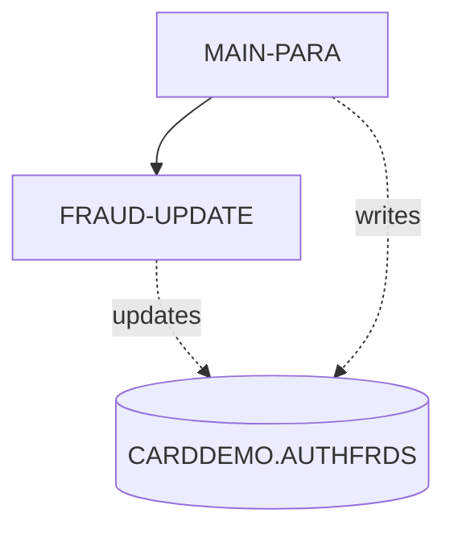

# COPAUS2C

**File**: `cbl/COPAUS2C.cbl`
**Type**: FileType.COBOL
**Analyzed**: 2026-01-28 14:54:08.127541

## Purpose

The COPAUS2C program is a CICS COBOL program that marks an authorization message as fraudulent by inserting or updating a record in the CARDDEMO.AUTHFRDS table. It receives transaction details via the CICS COMMAREA and uses this data to populate the AUTHFRDS table with information about the potentially fraudulent transaction.

**Business Context**: This program is part of an authorization module within the CardDemo application, likely used to flag suspicious transactions for further investigation and prevent future fraudulent activities. 

## Inputs

| Name | Type | Description |
|------|------|-------------|
| DFHCOMMAREA | IOType.CICS_COMMAREA | Contains transaction details including account ID (WS-ACCT-ID), customer ID (WS-CUST-ID), and fraud report data (WS-FRAUD-AUTH-RECORD) based on CIPAUDTY copybook, and fraud status record (WS-FRAUD-STATUS-RECORD). |

## Business Rules

- **BR001**: If a record with the same CARD_NUM and AUTH_TS already exists in the AUTHFRDS table, update the AUTH_FRAUD and FRAUD_RPT_DATE columns. Otherwise, insert a new record.

## Paragraphs/Procedures

### MAIN-PARA
The MAIN-PARA paragraph is the primary control flow for the COPAUS2C program. It begins by retrieving the current date and time using CICS ASKTIME and FORMATTIME commands and storing the current date in WS-CUR-DATE, which is then moved to PA-FRAUD-RPT-DATE. The paragraph then extracts date and time components from the input COMMAREA (PA-AUTH-ORIG-DATE and PA-AUTH-TIME-9C) and transforms them into a timestamp format suitable for insertion into the AUTHFRDS table. It moves data from the COMMAREA into corresponding fields defined in the AUTHFRDS copybook. The paragraph then executes an SQL INSERT statement to add a new record to the CARDDEMO.AUTHFRDS table with the provided transaction details, marking it as potentially fraudulent. If the insert fails due to a duplicate key, the FRAUD-UPDATE paragraph is performed to update the existing record. Finally, the program returns control to CICS.

### FRAUD-UPDATE
The FRAUD-UPDATE paragraph is executed when the initial INSERT statement in MAIN-PARA fails due to a duplicate key violation, indicating that a record with the same CARD_NUM and AUTH_TS already exists in the CARDDEMO.AUTHFRDS table. This paragraph constructs an SQL UPDATE statement to modify the existing record, setting the AUTH_FRAUD column to the value of WS-FRD-ACTION and updating the FRAUD_RPT_DATE to the current date. The WHERE clause ensures that only the record matching the CARD_NUM and AUTH_TS from the input COMMAREA is updated. After the update, the paragraph checks the SQLCODE to determine if the update was successful. If SQLCODE is ZERO, WS-FRD-UPDT-SUCCESS is set to TRUE, and a success message is moved to WS-FRD-ACT-MSG. Otherwise, WS-FRD-UPDT-FAILED is set to TRUE, and an error message containing the SQLCODE and SQLSTATE is constructed and moved to WS-FRD-ACT-MSG. This paragraph does not call any other paragraphs or programs.

## Control Flow

## Open Questions

- ? What is the structure of the CIPAUDTY copybook?
  - Context: The copybook is used to define WS-FRAUD-AUTH-RECORD, but its contents are not available in the provided code.
- ? What are the valid values for WS-FRD-ACTION?
  - Context: The code defines WS-REPORT-FRAUD and WS-REMOVE-FRAUD, but the exact meaning and usage of these values are unclear without further context.
