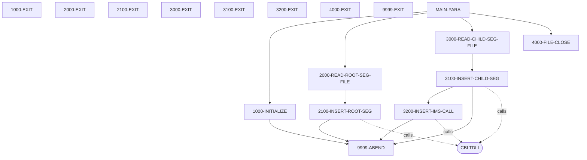

# PAUDBLOD

**File**: `cbl/PAUDBLOD.CBL`
**Type**: FileType.COBOL
**Analyzed**: 2026-01-28 14:53:50.617911

## Purpose

The COBOL program PAUDBLOD reads two sequential files, INFILE1 and INFILE2, and inserts data from these files into an IMS database. INFILE1 contains root segment data for 'PAUTSUM0', and INFILE2 contains child segment data for 'PAUTDTL1', related to pending authorizations. The program uses CBLTDLI calls to insert these segments into the IMS database.

**Business Context**: This program likely supports the process of loading or updating pending authorization information within an organization's IMS database, potentially for auditing or reporting purposes.

## Inputs

| Name | Type | Description |
|------|------|-------------|
| INFILE1 | IOType.FILE_SEQUENTIAL | Contains root segment data for 'PAUTSUM0' (Pending Authorization Summary) to be inserted into the IMS database. |
| INFILE2 | IOType.FILE_SEQUENTIAL | Contains child segment data for 'PAUTDTL1' (Pending Authorization Details) to be inserted into the IMS database. |
| IO-PCB-MASK | IOType.PARAMETER | IO PCB Mask from Linkage Section |
| PAUTBPCB | IOType.PARAMETER | PAUTBPCB from Linkage Section |

## Called Programs

| Program | Call Type | Purpose |
|---------|-----------|---------|
| CBLTDLI | CallType.STATIC_CALL | Performs IMS database operations such as inserting root and child segments. |
| CBLTDLI | CallType.STATIC_CALL | Retrieves a root segment from the IMS database before inserting a child segment. |
| CBLTDLI | CallType.STATIC_CALL | Inserts a child segment into the IMS database. |

## Paragraphs/Procedures

### MAIN-PARA
The MAIN-PARA is the main control paragraph of the PAUDBLOD program. It orchestrates the overall process of reading data from two input files (INFILE1 and INFILE2) and inserting it into an IMS database. It first calls 1000-INITIALIZE to perform necessary initializations, such as opening the input files and accepting the current date. Then, it enters a loop that reads records from INFILE1 (root segments) using 2000-READ-ROOT-SEG-FILE until the end of the file is reached. Subsequently, it enters another loop to read records from INFILE2 (child segments) using 3000-READ-CHILD-SEG-FILE until the end of that file is reached. Finally, it calls 4000-FILE-CLOSE to close the input files before terminating the program with a GOBACK statement. The paragraph uses flags END-ROOT-SEG-FILE and END-CHILD-SEG-FILE to control the read loops and calls subroutines to handle file I/O and IMS database operations.

### 1000-INITIALIZE
The 1000-INITIALIZE paragraph is responsible for initializing the program environment. It accepts the current date and day from the system and displays them on the console. It then opens INFILE1 and INFILE2 for input. It checks the file status after each OPEN statement. If the file status is not spaces or '00', indicating a successful open, it displays an error message and calls 9999-ABEND to terminate the program. This paragraph ensures that the input files are successfully opened before the program proceeds with data processing. It consumes no input data directly but sets up the environment for subsequent data reads. It produces no direct output other than display messages and sets file status variables.

### 2000-READ-ROOT-SEG-FILE
The 2000-READ-ROOT-SEG-FILE paragraph reads records from INFILE1, which contains root segment data. It reads a record using the READ statement and checks the file status. If the file status is spaces or '00', indicating a successful read, it moves the data from INFIL1-REC to PENDING-AUTH-SUMMARY and then calls 2100-INSERT-ROOT-SEG to insert the root segment into the IMS database. If the file status is '10', indicating the end of the file, it sets the END-ROOT-SEG-FILE flag to 'Y'. If any other error occurs during the read operation, it displays an error message. This paragraph consumes data from INFILE1 and prepares it for insertion into the IMS database. It produces no direct output other than potentially setting the END-ROOT-SEG-FILE flag or displaying an error message.

### 2100-INSERT-ROOT-SEG
The 2100-INSERT-ROOT-SEG paragraph is responsible for inserting the root segment (PENDING-AUTH-SUMMARY) into the IMS database. It calls the CBLTDLI routine with the FUNC-ISRT function code to perform the insert operation, using the PAUTBPCB, PENDING-AUTH-SUMMARY, and ROOT-UNQUAL-SSA. After the call, it checks the PAUT-PCB-STATUS to determine if the insert was successful. If the status is spaces, it displays a success message. If the status is 'II', it indicates that the root segment already exists in the database. If the status is anything else, it displays an error message and calls 9999-ABEND to terminate the program. This paragraph consumes the PENDING-AUTH-SUMMARY data and attempts to insert it into the IMS database, providing feedback on the success or failure of the operation.

### 3000-READ-CHILD-SEG-FILE
The 3000-READ-CHILD-SEG-FILE paragraph reads records from INFILE2, which contains child segment data. It reads a record using the READ statement and checks the file status. If the file status is spaces or '00', indicating a successful read, it checks if ROOT-SEG-KEY is numeric. If it is, it moves the ROOT-SEG-KEY to QUAL-SSA-KEY-VALUE and moves the CHILD-SEG-REC to PENDING-AUTH-DETAILS. Then, it calls 3100-INSERT-CHILD-SEG to insert the child segment into the IMS database. If the file status is '10', indicating the end of the file, it sets the END-CHILD-SEG-FILE flag to 'Y'. If any other error occurs during the read operation, it displays an error message. This paragraph consumes data from INFILE2 and prepares it for insertion into the IMS database, contingent on the ROOT-SEG-KEY being numeric.

### 3100-INSERT-CHILD-SEG
The 3100-INSERT-CHILD-SEG paragraph is responsible for inserting the child segment (PENDING-AUTH-DETAILS) into the IMS database. It first initializes PAUT-PCB-STATUS. It calls CBLTDLI with FUNC-GU to retrieve the root segment using ROOT-QUAL-SSA. If the root segment retrieval is successful (PAUT-PCB-STATUS = SPACES), it calls 3200-INSERT-IMS-CALL to insert the child segment. If the root segment retrieval fails (PAUT-PCB-STATUS is not SPACES or 'II'), it displays an error message and calls 9999-ABEND. This paragraph ensures that a parent root segment exists before attempting to insert the child segment. It consumes PENDING-AUTH-SUMMARY and ROOT-QUAL-SSA and conditionally calls 3200-INSERT-IMS-CALL based on the success of the root segment retrieval.

### 3200-INSERT-IMS-CALL
The 3200-INSERT-IMS-CALL paragraph performs the actual insertion of the child segment (PENDING-AUTH-DETAILS) into the IMS database. It calls CBLTDLI with FUNC-ISRT, using PAUTBPCB, PENDING-AUTH-DETAILS, and CHILD-UNQUAL-SSA. It then checks the PAUT-PCB-STATUS. If the status is spaces, it displays a success message. If the status is 'II', it indicates that the child segment already exists. If the status is anything else, it displays an error message and calls 9999-ABEND. This paragraph consumes PENDING-AUTH-DETAILS and attempts to insert it as a child segment, providing feedback on the success or failure of the operation.

### 4000-FILE-CLOSE
The 4000-FILE-CLOSE paragraph is responsible for closing the input files, INFILE1 and INFILE2. It closes each file using the CLOSE statement and checks the file status after each operation. If the file status is not spaces or '00', indicating a successful close, it displays an error message. This paragraph ensures that the input files are properly closed before the program terminates. It consumes no input data directly but relies on the file status variables to determine the success of the close operations. It produces no direct output other than display messages.

### 9999-ABEND
The 9999-ABEND paragraph is the error handling routine for the PAUDBLOD program. It displays a message indicating that the program is abending and sets the RETURN-CODE to 16. It then terminates the program using the GOBACK statement. This paragraph is called when a critical error occurs, such as a file open failure or an IMS database operation failure. It consumes no input data directly but relies on the error condition that triggered the call. It produces no direct output other than a display message and sets the return code.

## Control Flow

