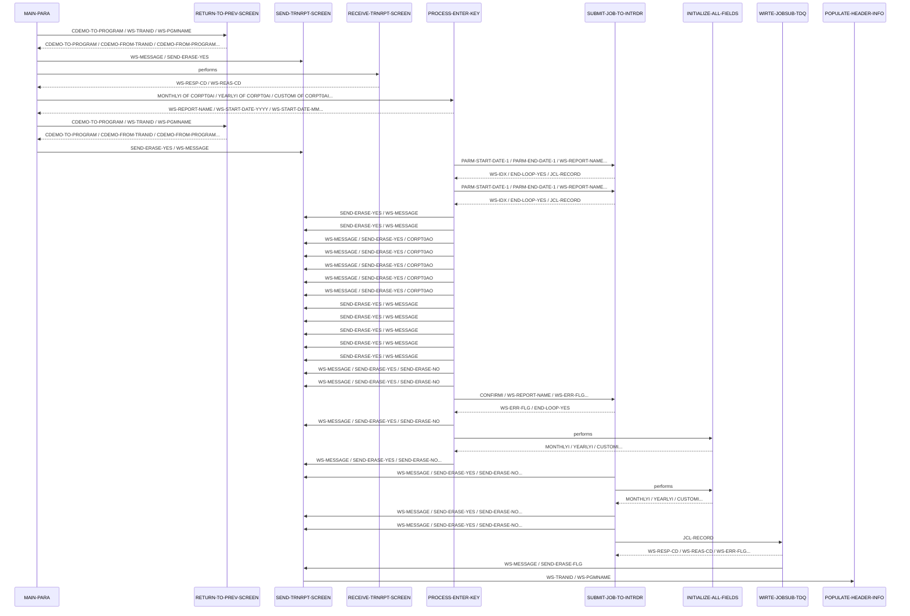

# CORPT00C

**File:** CORPT00C.cbl
**Type:** COBOL
**Status:** FinalStatus.WITNESSED
**Iterations:** 1
**Analyzed:** 2026-04-21 18:22:31.739372

## Purpose

This CICS COBOL program, CORPT00C, allows users to print transaction reports by submitting a batch job from an online CICS environment using an extrapartition transient data queue (TDQ). The program receives input from a CICS screen, validates the input, constructs a JCL job, writes the JCL to a TDQ, and then returns to the previous screen.

**Business Context:** This program is part of a card demo application and enables users to generate transaction reports without requiring immediate processing, offloading the report generation to a batch process.
**Program Type:** ONLINE_CICS
**Citations:** Lines 5, 6, 163

## Calling Context

**Entry Points:** CR00
**Linkage Section:** DFHCOMMAREA

## Inputs

### CORPT0AI
- **Type:** CICS_MAP
- **Description:** Input map containing fields for report type (Monthly, Yearly, Custom) and date ranges.
- **Copybook:** [CORPT00](../copybooks/CORPT00.cpy.md)
- **Lines:** 599, 601

### DFHCOMMAREA
- **Type:** CICS_COMMAREA
- **Description:** Communication area passed from the calling program, containing program context and data.
- **Lines:** 176, 201

## Outputs

### CORPT0AO
- **Type:** CICS_MAP
- **Description:** Output map sent to the CICS terminal, displaying the screen with populated data and error messages.
- **Copybook:** [CORPT00](../copybooks/CORPT00.cpy.md)
- **Lines:** 564, 573

### JOBS
- **Type:** CICS_QUEUE
- **Description:** Transient data queue (TDQ) to which the generated JCL is written for batch job submission.
- **Lines:** 518

## Called Programs

| Program | Call Type | Purpose | Line |
|---------|-----------|---------|------|
| [CSUTLDTC](./CSUTLDTC.cbl.md) | STATIC_CALL | Validates the input date format and if it is a valid date. | 392 |
| [CSUTLDTC](./CSUTLDTC.cbl.md) | STATIC_CALL | Validates the input date format and if it is a valid date. | 412 |
| [COSGN00C](./COSGN00C.cbl.md) | CICS_XCTL | Returns to the sign-on screen when EIBCALEN is 0. | 173 |
| [COMEN01C](./COMEN01C.cbl.md) | CICS_XCTL | Returns to the previous menu screen when PF3 is pressed. | 188 |

## Business Rules

### BR001: If the user selects the 'Monthly' report type, the program sets the start date to the first day of the current month and the end date to the last day of the current month.
**Logic:** The program uses FUNCTION CURRENT-DATE to get the current date, extracts the year and month, sets the day to '01' for the start date, and calculates the last day of the month for the end date.
**Conditions:** MONTHLYI OF CORPT0AI NOT = SPACES AND LOW-VALUES
**Lines:** 213, 215, 231

### BR002: If the user selects the 'Yearly' report type, the program sets the start date to January 1st of the current year and the end date to December 31st of the current year.
**Logic:** The program uses FUNCTION CURRENT-DATE to get the current year, sets the month and day to '01' for the start date, and sets the month to '12' and day to '31' for the end date.
**Conditions:** YEARLYI OF CORPT0AI NOT = SPACES AND LOW-VALUES
**Lines:** 239, 241, 251

### BR003: If the user selects the 'Custom' report type, the program validates that the start and end dates are not empty. If any of the date fields (month, day, year) are empty, an error message is displayed.
**Logic:** The program checks if SDTMMI, SDTDDI, SDTYYYYI, EDTMMI, EDTDDI, and EDTYYYYI are equal to SPACES or LOW-VALUES. If any of these conditions are true, an error message is moved to WS-MESSAGE, the WS-ERR-FLG is set to 'Y', and the corresponding field in the map is highlighted.
**Conditions:** CUSTOMI OF CORPT0AI NOT = SPACES AND LOW-VALUES
**Lines:** 256, 259, 300

### BR004: If the user selects the 'Custom' report type, the program validates that the start and end dates are numeric and within valid ranges. If any of the date fields (month, day, year) are non-numeric or outside the valid range, an error message is displayed.
**Logic:** The program checks if SDTMMI, SDTDDI, SDTYYYYI, EDTMMI, EDTDDI, and EDTYYYYI are numeric and within valid ranges (e.g., month <= 12, day <= 31). If any of these conditions are false, an error message is moved to WS-MESSAGE, the WS-ERR-FLG is set to 'Y', and the corresponding field in the map is highlighted.
**Conditions:** CUSTOMI OF CORPT0AI NOT = SPACES AND LOW-VALUES
**Lines:** 329, 378

### BR005: If the user selects the 'Custom' report type, the program validates that the start and end dates are valid dates using the CSUTLDTC subroutine.
**Logic:** The program calls the CSUTLDTC subroutine to validate the start and end dates. If the subroutine returns a non-zero severity code, an error message is displayed.
**Conditions:** CUSTOMI OF CORPT0AI NOT = SPACES AND LOW-VALUES
**Lines:** 388, 426

### BR006: The program requires confirmation from the user before submitting the job. If the confirmation field is empty, an error message is displayed.
**Logic:** The program checks if CONFIRMI OF CORPT0AI is equal to SPACES or LOW-VALUES. If this condition is true, an error message is moved to WS-MESSAGE, the WS-ERR-FLG is set to 'Y', and the CONFIRML field in the map is highlighted.
**Conditions:** CONFIRMI OF CORPT0AI = SPACES OR LOW-VALUES
**Lines:** 464, 473

### BR007: The program validates the confirmation input. If the input is 'Y' or 'y', the job is submitted. If the input is 'N' or 'n', the fields are initialized and the screen is redisplayed. If the input is anything else, an error message is displayed.
**Logic:** The program checks if CONFIRMI OF CORPT0AI is equal to 'Y', 'y', 'N', or 'n'. Based on the input, the program either continues with job submission, initializes fields and redisplays the screen, or displays an error message.
**Conditions:** CONFIRMI OF CORPT0AI = 'Y' OR 'y', CONFIRMI OF CORPT0AI = 'N' OR 'n'
**Lines:** 477, 494

## Copybooks Used

| Copybook | Location | Purpose | Line |
|----------|----------|---------|------|
| [COCOM01Y](../copybooks/COCOM01Y.cpy.md) | WORKING_STORAGE | Defines common data structures. | 138 |
| [CORPT00](../copybooks/CORPT00.cpy.md) | WORKING_STORAGE | Defines the input and output map structures for the CICS screen. | 140 |
| [COTTL01Y](../copybooks/COTTL01Y.cpy.md) | WORKING_STORAGE | Defines title related constants. | 142 |
| [CSDAT01Y](../copybooks/CSDAT01Y.cpy.md) | WORKING_STORAGE | Defines date related constants. | 143 |
| [CSMSG01Y](../copybooks/CSMSG01Y.cpy.md) | WORKING_STORAGE | Defines message related constants. | 144 |
| [CVTRA05Y](../copybooks/CVTRA05Y.cpy.md) | WORKING_STORAGE | Defines transaction related constants. | 146 |
| [DFHAID](../copybooks/DFHAID.cpy.md) | WORKING_STORAGE | Defines attention identifier constants for CICS. | 148 |
| [DFHBMSCA](../copybooks/DFHBMSCA.cpy.md) | WORKING_STORAGE | Defines BMS control area constants for CICS. | 149 |

## Data Flow

### Reads From
- **CORPT0AI**: MONTHLYI, YEARLYI, CUSTOMI, SDTMMI, SDTDDI, SDTYYYYI, EDTMMI, EDTDDI, EDTYYYYI, CONFIRMI
  (Lines: 213, 239, 256, 464, 478, 480)
- **WS-VARIABLES**: WS-TRANID, WS-PGMNAME
  (Lines: 545, 546)
- **JOB-DATA**: JOB-LINES
  (Lines: 501)

### Writes To
- **CORPT0AO**: TITLE01O, TITLE02O, TRNNAMEO, PGMNAMEO, CURDATEO, CURTIMEO, ERRMSGO
  (Lines: 613, 614, 615, 616, 622, 628, 560)
- **WS-MESSAGE**: WS-MESSAGE
  (Lines: 261, 268, 275, 282, 289, 296, 331, 340, 349, 357, 366, 374, 400, 420, 438, 465, 485, 531)
- **JOBS**: JCL-RECORD
  (Lines: 519)

### Transformations
- **SDTMMI OF CORPT0AI** → **WS-NUM-99**: Converts the start date month input field to a numeric value.
  (Lines: 305)
- **SDTDDI OF CORPT0AI** → **WS-NUM-99**: Converts the start date day input field to a numeric value.
  (Lines: 309)
- **SDTYYYYI OF CORPT0AI** → **WS-NUM-9999**: Converts the start date year input field to a numeric value.
  (Lines: 313)
- **EDTMMI OF CORPT0AI** → **WS-NUM-99**: Converts the end date month input field to a numeric value.
  (Lines: 317)
- **EDTDDI OF CORPT0AI** → **WS-NUM-99**: Converts the end date day input field to a numeric value.
  (Lines: 321)
- **EDTYYYYI OF CORPT0AI** → **WS-NUM-9999**: Converts the end date year input field to a numeric value.
  (Lines: 325)

## Key Paragraphs

### MAIN-PARA
**Purpose:** This is the main paragraph that controls the program flow. It first initializes flags and variables, then checks if the communication area (DFHCOMMAREA) is empty. If it is empty, it moves 'COSGN00C' to CDEMO-TO-PROGRAM and performs RETURN-TO-PREV-SCREEN to return to the sign-on screen. If the communication area is not empty, it moves the data from DFHCOMMAREA to CARDDEMO-COMMAREA. If it's the first time the program is entered, it initializes the screen and performs SEND-TRNRPT-SCREEN to display the initial screen. Otherwise, it performs RECEIVE-TRNRPT-SCREEN to receive input from the user, then evaluates the EIBAID to determine the action to take. If DFHENTER is pressed, it performs PROCESS-ENTER-KEY. If DFHPF3 is pressed, it moves 'COMEN01C' to CDEMO-TO-PROGRAM and performs RETURN-TO-PREV-SCREEN to return to the previous menu. If any other key is pressed, it sets an error flag, moves an error message to WS-MESSAGE, and performs SEND-TRNRPT-SCREEN to display the error message. Finally, it returns to CICS with the transaction ID and communication area.
- Calls: RETURN-TO-PREV-SCREEN, SEND-TRNRPT-SCREEN, RECEIVE-TRNRPT-SCREEN, PROCESS-ENTER-KEY
- Lines: 163-202

### PROCESS-ENTER-KEY
**Purpose:** This paragraph processes the user input after the ENTER key is pressed. It evaluates the input to determine which report type to process (Monthly, Yearly, or Custom). For 'Monthly', it calculates the start and end dates based on the current date and performs SUBMIT-JOB-TO-INTRDR to submit the job. For 'Yearly', it sets the start and end dates to the beginning and end of the current year and performs SUBMIT-JOB-TO-INTRDR. For 'Custom', it validates the start and end dates entered by the user, converting them to numeric values and checking for valid ranges. If any date is invalid, it sets an error message and redisplays the screen. If all dates are valid, it calls CSUTLDTC to validate the dates and then performs SUBMIT-JOB-TO-INTRDR. If no report type is selected, it displays an error message. After processing, it initializes the fields and displays a confirmation message.
- Called by: MAIN-PARA
- Calls: SUBMIT-JOB-TO-INTRDR, SEND-TRNRPT-SCREEN, INITIALIZE-ALL-FIELDS
- Lines: 208-456

### SUBMIT-JOB-TO-INTRDR
**Purpose:** This paragraph submits the generated JCL to the internal reader. It first checks if the user has confirmed the report submission. If the confirmation field is empty, it prompts the user for confirmation. If the user confirms ('Y' or 'y'), it iterates through the JOB-DATA lines, writing each line to the JOBS TDQ using the CICS WRITEQ TD command. The loop terminates when it encounters '/*EOF', spaces, or low-values in the JCL-RECORD, or if an error occurs. If the user does not confirm ('N' or 'n'), it initializes the fields and redisplays the screen. If the confirmation input is invalid, it displays an error message. The paragraph handles potential errors during the WRITEQ TD operation, setting an error flag and displaying an error message if the write fails.
- Called by: PROCESS-ENTER-KEY
- Calls: SEND-TRNRPT-SCREEN, INITIALIZE-ALL-FIELDS, WIRTE-JOBSUB-TDQ
- Lines: 462-510

### WIRTE-JOBSUB-TDQ
**Purpose:** This paragraph writes a single JCL record to the JOBS transient data queue (TDQ). It uses the CICS WRITEQ TD command to write the JCL-RECORD to the queue. It then evaluates the response code (WS-RESP-CD) from the WRITEQ TD command. If the response code is DFHRESP(NORMAL), it continues. Otherwise, it displays the response and reason codes, sets an error flag, moves an error message to WS-MESSAGE, and performs SEND-TRNRPT-SCREEN to display the error message.
- Called by: SUBMIT-JOB-TO-INTRDR
- Calls: SEND-TRNRPT-SCREEN
- Lines: 515-535

### RETURN-TO-PREV-SCREEN
**Purpose:** This paragraph returns control to the previous CICS screen. It checks if CDEMO-TO-PROGRAM is empty or contains spaces. If so, it defaults to 'COSGN00C'. It then moves the current transaction ID and program name to the CDEMO-FROM-TRANID and CDEMO-FROM-PROGRAM fields, respectively. Finally, it executes a CICS XCTL command to transfer control to the program specified in CDEMO-TO-PROGRAM, passing the CARDDEMO-COMMAREA.
- Called by: MAIN-PARA
- Lines: 540-555

### SEND-TRNRPT-SCREEN
**Purpose:** This paragraph sends the CORPT0A screen to the terminal. It first performs POPULATE-HEADER-INFO to populate the header information on the screen. It then moves the message in WS-MESSAGE to the ERRMSGO field in the output map. If the SEND-ERASE-YES flag is set, it executes a CICS SEND MAP command with the ERASE option to clear the screen before sending the map. Otherwise, it executes a CICS SEND MAP command without the ERASE option. Finally, it branches to RETURN-TO-CICS to return control to CICS.
- Called by: MAIN-PARA, PROCESS-ENTER-KEY, SUBMIT-JOB-TO-INTRDR, WIRTE-JOBSUB-TDQ, END-EXEC
- Calls: POPULATE-HEADER-INFO
- Lines: 556-578

### RETURN-TO-CICS
**Purpose:** This paragraph returns control to CICS. It executes a CICS RETURN command, specifying the transaction ID (WS-TRANID) and the communication area (CARDDEMO-COMMAREA). This command terminates the current task and returns control to CICS.
- Called by: SEND-TRNRPT-SCREEN
- Lines: 585-595

### RECEIVE-TRNRPT-SCREEN
**Purpose:** This paragraph receives data from the CORPT0A screen. It executes a CICS RECEIVE MAP command, receiving the data into the CORPT0AI input map. It also retrieves the response code (WS-RESP-CD) and reason code (WS-REAS-CD) from the RECEIVE command. This paragraph is responsible for capturing the user's input from the screen.
- Called by: MAIN-PARA
- Lines: 596-608

### POPULATE-HEADER-INFO
**Purpose:** This paragraph populates the header information on the CORPT0A screen. It moves the current date and time to the corresponding fields in the output map (CORPT0AO). It also moves the title, transaction ID, and program name to the appropriate fields in the output map. This paragraph ensures that the screen displays the correct header information.
- Called by: SEND-TRNRPT-SCREEN
- Lines: 609-632

### INITIALIZE-ALL-FIELDS
**Purpose:** This paragraph initializes the input fields on the CORPT0A screen. It moves -1 to MONTHLYL and initializes MONTHLYI, YEARLYI, CUSTOMI, SDTMMI, SDTDDI, SDTYYYYI, EDTMMI, EDTDDI, EDTYYYYI, CONFIRMI and WS-MESSAGE to spaces. This paragraph prepares the screen for new input by clearing the previous values.
- Called by: PROCESS-ENTER-KEY, SUBMIT-JOB-TO-INTRDR
- Lines: 633-645

## Inter-Paragraph Data Flow

| Caller | Callee | Inputs | Outputs | Purpose |
|--------|--------|--------|---------|---------|
| MAIN-PARA | RETURN-TO-PREV-SCREEN | CDEMO-TO-PROGRAM, WS-TRANID, WS-PGMNAME | CDEMO-TO-PROGRAM, CDEMO-FROM-TRANID, CDEMO-FROM-PROGRAM, CDEMO-PGM-CONTEXT | This call returns control to the previous screen by transferring control to the program specified in CDEMO-TO-PROGRAM. |
| MAIN-PARA | SEND-TRNRPT-SCREEN | WS-MESSAGE, SEND-ERASE-YES | - | This call sends the formatted screen to the user, displaying any error messages. |
| MAIN-PARA | RECEIVE-TRNRPT-SCREEN | - | WS-RESP-CD, WS-REAS-CD | This call receives data entered by the user from the screen. |
| MAIN-PARA | PROCESS-ENTER-KEY | MONTHLYI OF CORPT0AI, YEARLYI OF CORPT0AI, CUSTOMI OF CORPT0AI, SDTMMI OF CORPT0AI, SDTDDI OF CORPT0AI, SDTYYYYI OF CORPT0AI, EDTMMI OF CORPT0AI, EDTDDI OF CORPT0AI, EDTYYYYI OF CORPT0AI, ERR-FLG-ON | WS-REPORT-NAME, WS-START-DATE-YYYY, WS-START-DATE-MM, WS-START-DATE-DD, PARM-START-DATE-1, WS-END-DATE-YYYY, WS-END-DATE-MM, WS-END-DATE-DD, PARM-END-DATE-1, WS-MESSAGE, WS-ERR-FLG, SDTMML OF CORPT0AI, SDTDDL OF CORPT0AI, SDTYYYYL OF CORPT0AI, EDTMML OF CORPT0AI, EDTDDL OF CORPT0AI, EDTYYYYL OF CORPT0AI, SDTMMI OF CORPT0AI, SDTDDI OF CORPT0AI, SDTYYYYI OF CORPT0AI, EDTMMI OF CORPT0AI, EDTDDI OF CORPT0AI, EDTYYYYI OF CORPT0AI, CSUTLDTC-DATE, CSUTLDTC-DATE-FORMAT, CSUTLDTC-RESULT, MONTHLYL OF CORPT0AI | This call processes the user's input after pressing the Enter key, validating dates and submitting a job based on the selected report type. |
| MAIN-PARA | RETURN-TO-PREV-SCREEN | CDEMO-TO-PROGRAM, WS-TRANID, WS-PGMNAME | CDEMO-TO-PROGRAM, CDEMO-FROM-TRANID, CDEMO-FROM-PROGRAM, CDEMO-PGM-CONTEXT | This call returns control to the previous screen by transferring control to the program specified in CDEMO-TO-PROGRAM. |
| MAIN-PARA | SEND-TRNRPT-SCREEN | SEND-ERASE-YES, WS-MESSAGE | - | This call sends the transaction report screen to the user. |
| PROCESS-ENTER-KEY | SUBMIT-JOB-TO-INTRDR | PARM-START-DATE-1, PARM-END-DATE-1, WS-REPORT-NAME, ERR-FLG-ON, CONFIRMI | WS-IDX, END-LOOP-YES, JCL-RECORD | This call submits a job to the internal reader to generate a report. |
| PROCESS-ENTER-KEY | SUBMIT-JOB-TO-INTRDR | PARM-START-DATE-1, PARM-END-DATE-1, WS-REPORT-NAME, ERR-FLG-ON, CONFIRMI | WS-IDX, END-LOOP-YES, JCL-RECORD | This call submits a job to the internal reader to generate a report. |
| PROCESS-ENTER-KEY | SEND-TRNRPT-SCREEN | SEND-ERASE-YES, WS-MESSAGE | - | This call sends the transaction report screen to the user. |
| PROCESS-ENTER-KEY | SEND-TRNRPT-SCREEN | SEND-ERASE-YES, WS-MESSAGE | - | This call sends the transaction report screen to the user. |
| PROCESS-ENTER-KEY | SEND-TRNRPT-SCREEN | WS-MESSAGE, SEND-ERASE-YES, CORPT0AO | - | Sends the transaction report screen to the user, displaying any error messages. |
| PROCESS-ENTER-KEY | SEND-TRNRPT-SCREEN | WS-MESSAGE, SEND-ERASE-YES, CORPT0AO | - | Sends the transaction report screen to the user, displaying any error messages. |
| PROCESS-ENTER-KEY | SEND-TRNRPT-SCREEN | WS-MESSAGE, SEND-ERASE-YES, CORPT0AO | - | Sends the transaction report screen to the user, displaying any error messages. |
| PROCESS-ENTER-KEY | SEND-TRNRPT-SCREEN | WS-MESSAGE, SEND-ERASE-YES, CORPT0AO | - | Sends the transaction report screen to the user, displaying any error messages. |
| PROCESS-ENTER-KEY | SEND-TRNRPT-SCREEN | WS-MESSAGE, SEND-ERASE-YES, CORPT0AO | - | Sends the transaction report screen to the user, displaying any error messages. |
| PROCESS-ENTER-KEY | SEND-TRNRPT-SCREEN | SEND-ERASE-YES, WS-MESSAGE | - | Sends the transaction report screen to the user, displaying an error message if date validation fails. |
| PROCESS-ENTER-KEY | SEND-TRNRPT-SCREEN | SEND-ERASE-YES, WS-MESSAGE | - | Sends the transaction report screen to the user, displaying an error message if date validation fails. |
| PROCESS-ENTER-KEY | SEND-TRNRPT-SCREEN | SEND-ERASE-YES, WS-MESSAGE | - | Sends the transaction report screen to the user, displaying an error message if date validation fails. |
| PROCESS-ENTER-KEY | SEND-TRNRPT-SCREEN | SEND-ERASE-YES, WS-MESSAGE | - | Sends the transaction report screen to the user, displaying an error message if date validation fails. |
| PROCESS-ENTER-KEY | SEND-TRNRPT-SCREEN | SEND-ERASE-YES, WS-MESSAGE | - | Sends the transaction report screen to the user, displaying an error message if date validation fails. |
| PROCESS-ENTER-KEY | SEND-TRNRPT-SCREEN | WS-MESSAGE, SEND-ERASE-YES, SEND-ERASE-NO | - | Sends the formatted screen to the user, displaying any error messages. |
| PROCESS-ENTER-KEY | SEND-TRNRPT-SCREEN | WS-MESSAGE, SEND-ERASE-YES, SEND-ERASE-NO | - | Sends the formatted screen to the user, displaying any error messages. |
| PROCESS-ENTER-KEY | SUBMIT-JOB-TO-INTRDR | CONFIRMI, WS-REPORT-NAME, WS-ERR-FLG, JOB-LINES, JCL-RECORD, WS-IDX | WS-ERR-FLG, END-LOOP-YES | Submits a job to the internal reader after confirming with the user. |
| PROCESS-ENTER-KEY | SEND-TRNRPT-SCREEN | WS-MESSAGE, SEND-ERASE-YES, SEND-ERASE-NO | - | Sends the formatted screen to the user, displaying any error messages. |
| PROCESS-ENTER-KEY | INITIALIZE-ALL-FIELDS | - | MONTHLYI, YEARLYI, CUSTOMI, SDTMMI, SDTDDI, SDTYYYYI, EDTMMI, EDTDDI, EDTYYYYI, CONFIRMI, WS-MESSAGE | Initializes all input fields on the screen and the message field. |
| PROCESS-ENTER-KEY | SEND-TRNRPT-SCREEN | WS-MESSAGE, SEND-ERASE-YES, SEND-ERASE-NO, CORPT0AO | - | Sends the transaction report screen to the user. |
| SUBMIT-JOB-TO-INTRDR | SEND-TRNRPT-SCREEN | WS-MESSAGE, SEND-ERASE-YES, SEND-ERASE-NO, CORPT0AO | - | Sends the transaction report screen to the user. |
| SUBMIT-JOB-TO-INTRDR | INITIALIZE-ALL-FIELDS | - | MONTHLYI, YEARLYI, CUSTOMI, SDTMMI, SDTDDI, SDTYYYYI, EDTMMI, EDTDDI, EDTYYYYI, CONFIRMI, WS-MESSAGE, MONTHLYL | Initializes all input fields on the screen. |
| SUBMIT-JOB-TO-INTRDR | SEND-TRNRPT-SCREEN | WS-MESSAGE, SEND-ERASE-YES, SEND-ERASE-NO, CORPT0AO | - | Sends the transaction report screen to the user. |
| SUBMIT-JOB-TO-INTRDR | SEND-TRNRPT-SCREEN | WS-MESSAGE, SEND-ERASE-YES, SEND-ERASE-NO, CORPT0AO | - | Sends the transaction report screen to the user. |
| SUBMIT-JOB-TO-INTRDR | WIRTE-JOBSUB-TDQ | JCL-RECORD | WS-RESP-CD, WS-REAS-CD, WS-ERR-FLG, WS-MESSAGE | This call writes a JCL record to a temporary data queue for job submission. |
| WIRTE-JOBSUB-TDQ | SEND-TRNRPT-SCREEN | WS-MESSAGE, SEND-ERASE-FLG | - | This call sends an error message to the screen if writing to the temporary data queue fails. |
| SEND-TRNRPT-SCREEN | POPULATE-HEADER-INFO | WS-TRANID, WS-PGMNAME | - | This call populates the header information on the screen with current date, time, program name, and transaction ID. |

## Error Handling

- **SDTMMI OF CORPT0AI = SPACES OR LOW-VALUES:** Move error message to WS-MESSAGE, set WS-ERR-FLG to 'Y', and highlight SDTMML field.
  (Lines: 259, 265)
- **SDTDDI OF CORPT0AI = SPACES OR LOW-VALUES:** Move error message to WS-MESSAGE, set WS-ERR-FLG to 'Y', and highlight SDTDDL field.
  (Lines: 266, 272)
- **SDTYYYYI OF CORPT0AI = SPACES OR LOW-VALUES:** Move error message to WS-MESSAGE, set WS-ERR-FLG to 'Y', and highlight SDTYYYYL field.
  (Lines: 273, 279)
- **EDTMMI OF CORPT0AI = SPACES OR LOW-VALUES:** Move error message to WS-MESSAGE, set WS-ERR-FLG to 'Y', and highlight EDTMML field.
  (Lines: 280, 286)
- **EDTDDI OF CORPT0AI = SPACES OR LOW-VALUES:** Move error message to WS-MESSAGE, set WS-ERR-FLG to 'Y', and highlight EDTDDL field.
  (Lines: 287, 293)
- **EDTYYYYI OF CORPT0AI = SPACES OR LOW-VALUES:** Move error message to WS-MESSAGE, set WS-ERR-FLG to 'Y', and highlight EDTYYYYL field.
  (Lines: 294, 300)
- **SDTMMI OF CORPT0AI IS NOT NUMERIC OR SDTMMI OF CORPT0AI > '12':** Move error message to WS-MESSAGE, set WS-ERR-FLG to 'Y', and highlight SDTMML field.
  (Lines: 329, 335)
- **SDTDDI OF CORPT0AI IS NOT NUMERIC OR SDTDDI OF CORPT0AI > '31':** Move error message to WS-MESSAGE, set WS-ERR-FLG to 'Y', and highlight SDTDDL field.
  (Lines: 338, 344)
- **SDTYYYYI OF CORPT0AI IS NOT NUMERIC:** Move error message to WS-MESSAGE, set WS-ERR-FLG to 'Y', and highlight SDTYYYYL field.
  (Lines: 347, 352)
- **EDTMMI OF CORPT0AI IS NOT NUMERIC OR EDTMMI OF CORPT0AI > '12':** Move error message to WS-MESSAGE, set WS-ERR-FLG to 'Y', and highlight EDTMML field.
  (Lines: 355, 361)
- **EDTDDI OF CORPT0AI IS NOT NUMERIC OR EDTDDI OF CORPT0AI > '31':** Move error message to WS-MESSAGE, set WS-ERR-FLG to 'Y', and highlight EDTDDL field.
  (Lines: 364, 370)
- **EDTYYYYI OF CORPT0AI IS NOT NUMERIC:** Move error message to WS-MESSAGE, set WS-ERR-FLG to 'Y', and highlight EDTYYYYL field.
  (Lines: 373, 378)
- **CSUTLDTC-RESULT-SEV-CD not = '0000' and CSUTLDTC-RESULT-MSG-NUM not = '2513':** Move error message to WS-MESSAGE, set WS-ERR-FLG to 'Y', and highlight SDTMML field.
  (Lines: 396, 404)
- **CSUTLDTC-RESULT-SEV-CD not = '0000' and CSUTLDTC-RESULT-MSG-NUM not = '2513':** Move error message to WS-MESSAGE, set WS-ERR-FLG to 'Y', and highlight EDTMML field.
  (Lines: 416, 424)
- **CONFIRMI OF CORPT0AI = SPACES OR LOW-VALUES:** Move error message to WS-MESSAGE, set WS-ERR-FLG to 'Y', and highlight CONFIRML field.
  (Lines: 464, 473)
- **CONFIRMI OF CORPT0AI is not equal to 'Y', 'y', 'N', or 'n':** Move error message to WS-MESSAGE, set WS-ERR-FLG to 'Y', and highlight CONFIRML field.
  (Lines: 484, 493)
- **WS-RESP-CD not = DFHRESP(NORMAL):** Move error message to WS-MESSAGE, set WS-ERR-FLG to 'Y', and highlight MONTHLYL field.
  (Lines: 525, 534)

## CICS Operations

| Command | Resource | Purpose | Line |
|---------|----------|---------|------|
| RETURN |  | Returns control to CICS. | 199 |
| WRITEQ TD | JOBS | Writes a JCL record to the JOBS transient data queue. | 517 |
| SEND MAP | CORPT0A | Sends the CORPT0A map to the terminal. | 563 |
| SEND MAP | CORPT0A | Sends the CORPT0A map to the terminal. | 571 |
| RETURN |  | Returns control to CICS. | 587 |
| RECEIVE MAP | CORPT0A | Receives data from the CORPT0A map. | 598 |
| XCTL | CDEMO-TO-PROGRAM | Transfers control to another CICS program. | 549 |

## Sequence Diagram

---
*Generated by War Rig WAR_RIG*