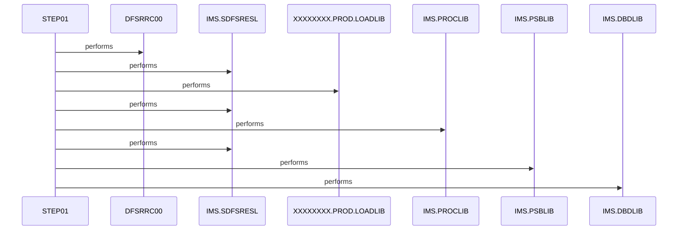

# CBPAUP0J

**File**: `jcl/CBPAUP0J.jcl`
**Type**: FileType.JCL
**Analyzed**: 2026-02-24 17:40:00.031945

## Purpose

This JCL executes an IMS program (CBPAUP0C) to delete expired authorizations. It defines the execution environment and necessary datasets for the IMS program to run as a BMP (Batch Message Processing) region.

## Inputs

| Name | Type | Description |
|------|------|-------------|
| IMS.SDFSRESL | IOType.FILE_SEQUENTIAL | IMS RESLIB library containing IMS modules. |
| XXXXXXXX.PROD.LOADLIB | IOType.FILE_SEQUENTIAL | Application load library containing the CBPAUP0C program. |
| IMS.PROCLIB | IOType.FILE_SEQUENTIAL | IMS procedure library. |
| IMS.PSBLIB | IOType.FILE_SEQUENTIAL | IMS PSB library containing PSBPAUTB. |
| IMS.DBDLIB | IOType.FILE_SEQUENTIAL | IMS DBD library. |
| SYSIN | IOType.FILE_SEQUENTIAL | Input control statements for the IMS program. Contains parameters '00,00001,00001,Y'. |

## Outputs

| Name | Type | Description |
|------|------|-------------|
| SYSOUX | IOType.REPORT | System output. |
| SYSOUT | IOType.REPORT | System output. |
| SYSABOUT | IOType.REPORT | System output for ABEND information. |
| ABENDAID | IOType.REPORT | System output for ABEND AID information. |
| SYSPRINT | IOType.REPORT | System print output. |
| SYSUDUMP | IOType.REPORT | System user dump output. |
| IMSERR | IOType.REPORT | IMS error output. |
| IEFRDER | IOType.OTHER | Dummy dataset for logging. |
| IMSLOGR | IOType.OTHER | Dummy dataset for IMS logging. |

## Called Programs

| Program | Call Type | Purpose |
|---------|-----------|---------|
| DFSRRC00 | CallType.STATIC_CALL | Executes the IMS BMP region to run the CBPAUP0C program. |

## Paragraphs/Procedures

### STEP01
This step executes the IMS program DFSRRC00 as a BMP (Batch Message Processing) region. It sets up the execution environment for the IMS program CBPAUP0C, which is responsible for deleting expired authorizations. The PARM parameter specifies 'BMP' to indicate a batch region, 'CBPAUP0C' as the program to execute, and 'PSBPAUTB' as the PSB (Program Specification Block) to use. The STEPLIB DD statement defines the libraries where the IMS modules and the CBPAUP0C program are located. DFSRESLB points to the IMS RESLIB. The IMS DD statement defines the PSBLIB and DBDLIB. SYSIN provides input control statements to the CBPAUP0C program. The various SYSOUT DD statements define the output datasets for system messages, ABEND information, and program output. IEFRDER and IMSLOGR are dummy datasets. This step is the core execution unit of the JCL, orchestrating the IMS environment and initiating the authorization deletion process.

## Open Questions

- ? The exact logic within CBPAUP0C for determining expired authorizations is unknown.
  - Context: The JCL only sets up the execution environment; the actual business rules reside within the CBPAUP0C program.

## Sequence Diagram

