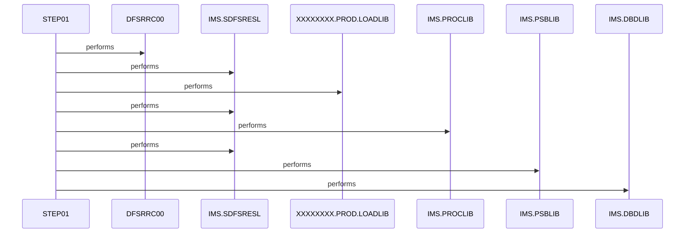

# CBPAUP0J

**File**: `jcl/CBPAUP0J.jcl`
**Type**: FileType.JCL
**Analyzed**: 2026-02-25 15:29:20.636659

## Purpose

This JCL defines a batch job to execute the IMS batch message processing (BMP) driver DFSRRC00, invoking application program CBPAUP0C with PSB PSBPAUTB to delete expired authorizations. It sets up required IMS libraries, control parameters via PARM and SYSIN, and directs outputs to SYSOUT datasets. The job is part of a card demo system as indicated by the job accounting information.

**Business Context**: Automates cleanup of expired authorizations in an IMS database, likely for a payment or card authorization system.

## Inputs

| Name | Type | Description |
|------|------|-------------|
| SYSIN | IOType.PARAMETER | Inline control card '00,00001,00001,Y' specifying PCB mask 00, GU transaction 00001, IO area 00001, and option Y for the IMS BMP execution |
| STEPLIB | IOType.OTHER | Load libraries containing IMS modules and application program CBPAUP0C |
| IMS | IOType.OTHER | PSBLIB and DBDLIB datasets providing PSB and database definitions for PSBPAUTB |
| PSBPAUTB | IOType.IMS_SEGMENT | IMS database segments accessed via the specified PSB for authorization data processing |

## Outputs

| Name | Type | Description |
|------|------|-------------|
| SYSPRINT | IOType.REPORT | Standard program print output including IMS processing logs |
| SYSUDUMP | IOType.REPORT | System dump output generated on program abends |
| SYSOUT | IOType.REPORT | Miscellaneous IMS and step outputs |

## Called Programs

| Program | Call Type | Purpose |
|---------|-----------|---------|
| DFSRRC00 | CallType.STATIC_CALL | Drives the IMS BMP region to execute application program CBPAUP0C for deleting expired authorizations |

## Business Rules

- **BR001**: Executes IMS BMP job to delete expired authorizations only under specific control parameters

## Paragraphs/Procedures

### STEP01
This is the primary and only step in the JCL job, responsible for orchestrating the execution of the IMS batch program to delete expired authorizations. It consumes input datasets including STEPLIB for load modules (lines 26-27), PROCLIB (29), DFSRESLB (28), DFSSEL (31), and IMS PSBLIB/DBDLIB (33-34), as well as inline SYSIN control data '00,00001,00001,Y' (37) which defines the PCB mask, GU transaction ID, IO area size, and processing option for the BMP region. The step produces outputs directed to multiple SYSOUT datasets such as SYSOUX (39), SYSOUT (40), SYSPRINT (45), SYSUDUMP (46), and others for logs, prints, and dumps. There is no conditional business logic within the JCL itself; instead, it configures the environment via PARM='BMP,CBPAUP0C,PSBPAUTB' (25) to statically call DFSRRC00, which in turn runs the application logic in CBPAUP0C against IMS databases defined by PSBPAUTB. Error handling is provided implicitly through dump datasets like ABENDAID (42), SYSUDUMP (46), and IMSERR (47), which capture abend information without explicit conditional checks in the JCL. The step does not call any subordinate steps or additional programs beyond the EXEC PGM=DFSRRC00 (24). Overall, it serves as the entry point for the batch deletion process as described in the job header comment (21).

## Sequence Diagram

