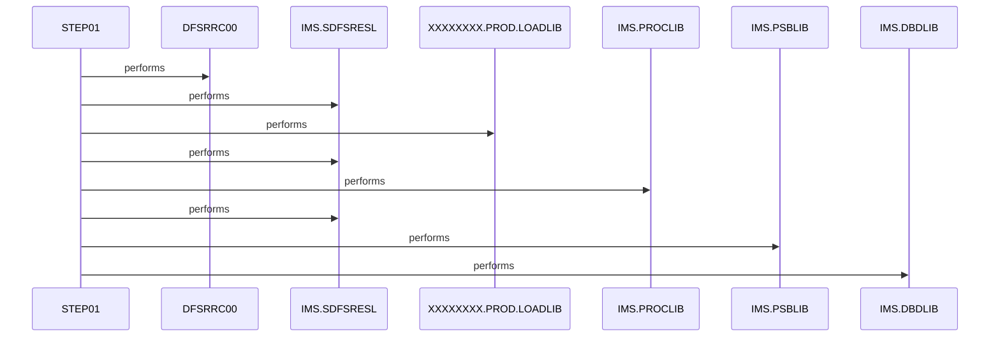

# CBPAUP0J

**File**: `jcl/CBPAUP0J.jcl`
**Type**: FileType.JCL
**Analyzed**: 2026-02-10 17:21:48.697546

## Purpose

This JCL executes an IMS program (DFSRRC00) to delete expired authorizations using the BMP region controller. It specifies the program CBPAUP0C and PSB PSBPAUTB for the IMS execution.

**Business Context**: UNKNOWN

## Inputs

| Name | Type | Description |
|------|------|-------------|
| IMS.SDFSRESL | IOType.FILE_SEQUENTIAL | IMS RESLIB |
| XXXXXXXX.PROD.LOADLIB | IOType.FILE_SEQUENTIAL | Production Load Library |
| IMS.PROCLIB | IOType.FILE_SEQUENTIAL | IMS PROCLIB |
| IMS.PSBLIB | IOType.FILE_SEQUENTIAL | IMS PSB Library |
| IMS.DBDLIB | IOType.FILE_SEQUENTIAL | IMS DBD Library |
| SYSIN | IOType.FILE_SEQUENTIAL | Input control statements for the IMS program, containing parameters '00,00001,00001,Y' |

## Outputs

| Name | Type | Description |
|------|------|-------------|
| SYSOUX | IOType.REPORT | System output |
| SYSOUT | IOType.REPORT | System output |
| SYSABOUT | IOType.REPORT | System output for ABEND information |
| ABENDAID | IOType.REPORT | System output for ABEND AID |
| SYSPRINT | IOType.REPORT | System print output |
| SYSUDUMP | IOType.REPORT | System user dump |
| IMSERR | IOType.REPORT | IMS error output |

## Called Programs

| Program | Call Type | Purpose |
|---------|-----------|---------|
| DFSRRC00 | CallType.STATIC_CALL | IMS program execution |

## Paragraphs/Procedures

### STEP01
This JCL step executes the IMS program DFSRRC00. It defines the execution parameters for the IMS BMP region, specifying CBPAUP0C as the application program and PSBPAUTB as the PSB. The STEPLIB DD statements define the load libraries required for the IMS execution, including the IMS RESLIB and a production load library. DFSRESLB defines the IMS RESLIB. PROCLIB defines the IMS procedure library. DFSSEL defines the IMS SDFSRESL dataset. The IMS DD statements define the PSBLIB and DBDLIB datasets. SYSIN provides input control statements to the IMS program. The remaining DD statements define various SYSOUT datasets for capturing program output, error messages, and dumps. IEFRDER and IMSLOGR are dummy datasets.

## Open Questions

- ? What is the exact purpose of the CBPAUP0C program?
  - Context: The JCL executes CBPAUP0C, but its specific function is not clear from the JCL alone.
- ? What is the purpose of the input parameters '00,00001,00001,Y' passed via SYSIN?
  - Context: The meaning of these parameters is not evident from the JCL.

## Sequence Diagram

