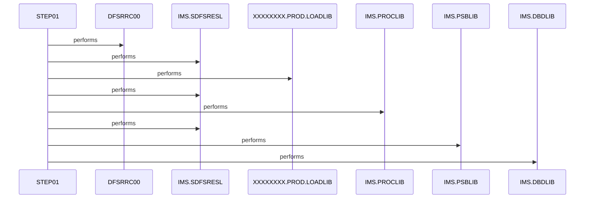

# CBPAUP0J

**File:** jcl/CBPAUP0J.jcl
**Type:** JCL
**Status:** In Progress
**Iterations:** 1
**Analyzed:** 2026-02-24 04:00:08.841674

## Purpose

This JCL job CBPAUP0J executes the IMS region controller DFSRRC00 to run application program CBPAUP0C in BMP mode with PSB PAUTB for deleting expired authorizations from an IMS database. It specifies necessary IMS libraries, PSB/DBD libraries, and inline SYSIN control data. Output is directed to multiple SYSOUT datasets for logs, prints, and dumps.

**Business Context:** IMS database maintenance for deleting expired authorizations in a card demo system
**Program Type:** BATCH
**Citations:** Lines 1, 21, 24, 25, 36

## Inputs

### SYSIN
- **Type:** PARAMETER
- **Description:** Inline IMS control statements '00,00001,00001,Y' specifying processing criteria such as database ID, segment levels, or options for the CBPAUP0C program
- **Lines:** 36, 37

### STEPLIB
- **Type:** OTHER
- **Description:** Concatenated load libraries containing IMS modules and application program CBPAUP0C
- **Lines:** 26, 27

### DFSRESLB
- **Type:** OTHER
- **Description:** IMS steplib for resource modules
- **Lines:** 28

### PROCLIB
- **Type:** OTHER
- **Description:** IMS proclib for procedures
- **Lines:** 29

### DFSSEL
- **Type:** OTHER
- **Description:** IMS selection library
- **Lines:** 31

### IMS
- **Type:** OTHER
- **Description:** Concatenated PSBLIB and DBDLIB providing PSB PAUTB and database definitions for application access
- **Lines:** 33, 34

## Outputs

### SYSOUX
- **Type:** REPORT
- **Description:** IMS-specific output
- **Lines:** 39

### SYSOUT
- **Type:** REPORT
- **Description:** Standard job output
- **Lines:** 40

### SYSABOUT
- **Type:** REPORT
- **Description:** Program about or informational output
- **Lines:** 41

### ABENDAID
- **Type:** REPORT
- **Description:** Abend diagnostic aid output
- **Lines:** 42

### SYSPRINT
- **Type:** REPORT
- **Description:** Print file for compiler or program output
- **Lines:** 45

### SYSUDUMP
- **Type:** REPORT
- **Description:** System dump for diagnostics
- **Lines:** 46

### IMSERR
- **Type:** REPORT
- **Description:** IMS error messages
- **Lines:** 47

## Called Programs

| Program | Call Type | Purpose | Line |
|---------|-----------|---------|------|
| [DFSRRC00](./DFSRRC00.cbl.md) | STATIC_CALL | IMS region controller to invoke CBPAUP0C in BMP mode | 24 |
| [CBPAUP0C](./CBPAUP0C.cbl.md) | DYNAMIC_CALL | Application program to delete expired authorizations using PSB PAUTB | 25 |

## Key Paragraphs

### STEP01
**Purpose:** STEP01 is the only execution step in this JCL job and serves as the primary orchestrator for running the IMS batch deletion process. It consumes input from multiple DD datasets including STEPLIB for load modules (lines 26-27), DFSRESLB (28), PROCLIB (29), DFSSEL (31), IMS PSB/DBDLIB (33-34), and inline SYSIN control data '00,00001,00001,Y' (36-37) which provides parameters for IMS database access by CBPAUP0C. It produces outputs to SYSOUT-class datasets such as SYSOUX (39), SYSOUT (40), SYSABOUT (41), ABENDAID (42), SYSPRINT (45), SYSUDUMP (46), and IMSERR (47) for capturing program output, logs, dumps, and errors. Business logic is not implemented directly in JCL but delegated via EXEC PGM=DFSRRC00 with PARM='BMP,CBPAUP0C,PSBPAUTB' (24-25) to execute the authorization deletion. No conditional decisions are made in the JCL; processing flow is linear based on program success. Error handling is provided implicitly through ABENDAID and SYSUDUMP DDs to capture abend details if DFSRRC00 or CBPAUP0C fails. Dummy DDs IEFRDER (43) and IMSLOGR (44) satisfy program I/O requirements without files. This step controls the overall job flow for the 'DELETE EXPIRED AUTHORIZATIONS' purpose (21). It statically calls DFSRRC00, which dynamically invokes CBPAUP0C for the core IMS processing.
- Calls: DFSRRC00, CBPAUP0C
- Lines: 24-47

## Error Handling

- **Program abend or IMS failure:** Capture abend information in ABENDAID and SYSUDUMP datasets
  (Lines: 42, 46)

## Resolved Questions

- **Q:** Exact meaning of SYSIN data '00,00001,00001,Y'?
  **A:** **The SYSIN data `'00,00001,00001,Y'` is a comma-separated parameter record directly accepted into the `PRM-INFO` working-storage field (lines 98-109 in `cbl/CBPAUP0C.cbl`) via `ACCEPT PRM-INFO FROM SYSIN` (line 189). No parsing (e.g., UNSTRING) occurs; the 16-character input maps positionally to the field's layout (total ~17 chars with trailing FILLER):**

```
01 PRM-INFO.
   05 P-EXPIRY-DAYS     PIC 9(02).     ← '00' (expiry days threshold = 0; used as WS-EXPIRY-DAYS)
   05 FILLER            PIC X(01).     ← ','
   05 P-CHKP-FREQ       PIC X(05).     ← '00001' (checkpoint frequency = 1 summary records processed)
   05 FILLER            PIC X(01).     ← ','
   05 P-CHKP-DIS-FREQ   PIC X(05).     ← '00001' (checkpoint display frequency = every 1st checkpoint)
   05 FILLER            PIC X(01).     ← ','
   05 P-DEBUG-FLAG      PIC X(01).     ← 'Y' (enables DEBUG-ON displays in read/delete/checkpoint logic)
   05 FILLER            PIC X(01).     ← (unused)
```

**Usage in `CBPAUP0C.cbl` (BMP IMS program):**
- **P-EXPIRY-DAYS ('00')**: Moved to `WS-EXPIRY-DAYS` (line 198) if numeric (it is). In `4000-CHECK-IF-EXPIRED` (lines 277-298), deletes details if `(CURRENT-YYDDD - WS-AUTH-DATE) >= 0` days old (i.e., **all** authorizations, since diff >= 0 always holds for past/current dates). Defaults to 5 if non-numeric.
- **P-CHKP-FREQ ('00001')**: Checkpoint trigger (lines 160-163). After `WS-AUTH-SMRY-PROC-CNT > '00001'` summaries processed, calls `9000-TAKE-CHECKPOINT` (IMS CHKP). Defaults to 5 if spaces/0/low-values.
- **P-CHKP-DIS-FREQ ('00001')**: In `9000-TAKE-CHECKPOINT` (lines 359-364), displays checkpoint success msg every 1st CHKP (`WS-NO-CHKP >= '00001'`). Defaults to 10.
- **P-DEBUG-FLAG ('Y')**: Sets `DEBUG-ON` (line 106). Enables extra DISPLAYs in read/delete/checkpoint paragraphs (e.g., lines 219, 251, 307).

**Sources checked**:
- JCL: `jcl/CBPAUP0J.jcl` (SYSIN at line 37; runs `DFSRRC00` BMP w/ `CBPAUP0C` + `PSBPAUTB`).
- COBOL: `cbl/CBPAUP0C.cbl` full source (lines 98-109 define; 189 accepts; 196-209 validate; used in 160, 359, 4000/9000 paras).
- No skills found; code searches confirmed structure/matches; citadel analysis showed para flows (e.g., MAIN-PARA → 1000-INITIALIZE → usage).

This config aggressively deletes **all** expired (age >=0 days) pending auths from IMS DB (PAUTSUM0 root + PAUTDTL1 children via GN/GNP/DLET), with frequent checkpoints (every 1 summary) and debug output.
- **Q:** What specific IMS database, DBD, and segments are accessed by CBPAUP0C?
  **A:** **IMS Database and DBD:** INCONCLUSIVE. No specific IMS database name or DBD name is mentioned in CBPAUP0C.cbl, its preprocessor includes (CIPAUSMY, CIPAUDTY), or the JCL CBPAUP0J.jcl. The program accesses the database indirectly via PSB **PSBPAUTB** (specified in JCL as PAUTB and hardcoded in code), using the **second PCB** (PAUT-PCB-NUM = +2, referenced as PCB(PAUT-PCB-NUM) in all DL/I calls). The DBD is defined at the PSB/PCB level (not in application source code), likely named something like PAUTDBD based on naming conventions, but no confirmation found.

**Segments Accessed:**
- **PAUTSUM0** (parent/summary segment): Accessed via `GN` (Get Next sequential) in 2000-FIND-NEXT-AUTH-SUMMARY (lines ~223-226) and `DLET` (Delete) in 6000-DELETE-AUTH-SUMMARY (lines ~335-338).
- **PAUTDTL1** (child/details segment): Accessed via `GNP` (Get Next Predictive/Parent-qualified) in 3000-FIND-NEXT-AUTH-DTL (lines ~255-258) and `DLET` (Delete) in 5000-DELETE-AUTH-DTL (lines ~310-313).

**What was checked:**
- `citadel_analyze_file` on cbl/CBPAUP0C.cbl: Confirmed structure, paragraphs (e.g., MAIN-PARA performs read/delete logic), calls (GN/GNP/DLET), and includes (CIPAUSMY, CIPAUDTY).
- `search_code` for 'CBPAUP0C', 'PAUTB', 'PCB|DBD|GU|GN|ISRT|DLET|GHU|GHN', 'PAUT': Located PSB='PSBPAUTB', PCB=+2, all DL/I calls and segments.
- `citadel_get_includes` on cbl/CBPAUP0C.cbl: Only CIPAUSMY/CIPAUDTY (likely segment I/O area definitions; no DBD found).
- No skills via `search_skills` for 'CBPAUP0C'/'PAUTB'.
- No DBD/database strings in code; typical for IMS apps (resolved via PSB compile).

The program deletes expired pending authorizations by sequentially reading summaries (PAUTSUM0), qualifying details (PAUTDTL1), checking expiration dates, and deleting both (with checkpoints). Sources: cbl/CBPAUP0C.cbl analysis.

## Sequence Diagram



---
*Generated by War Rig WAR_RIG*