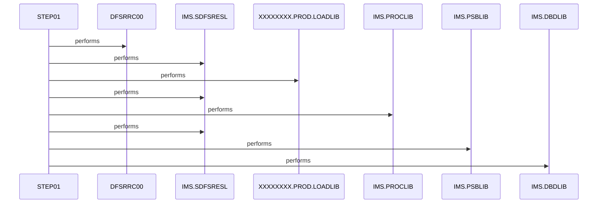

# CBPAUP0J

**File**: `jcl/CBPAUP0J.jcl`
**Type**: FileType.JCL
**Analyzed**: 2026-02-09 15:49:00.931061

## Purpose

This JCL executes an IMS program (CBPAUP0C) to delete expired authorizations. It defines the execution environment, including program name, parameters, libraries, and input/output datasets required for the IMS program to run.

**Business Context**: UNKNOWN

## Inputs

| Name | Type | Description |
|------|------|-------------|
| SYSIN | IOType.PARAMETER | Input parameters for the IMS program, likely related to authorization expiration criteria. The example shows '00,00001,00001,Y' as input. |
| IMS.SDFSRESL | IOType.FILE_SEQUENTIAL | IMS RESLIB library containing IMS modules. |
| IMS.PSBLIB | IOType.FILE_SEQUENTIAL | IMS PSB library containing program specification blocks. |
| IMS.DBDLIB | IOType.FILE_SEQUENTIAL | IMS DBD library containing database description blocks. |
| IMS.PROCLIB | IOType.FILE_SEQUENTIAL | IMS procedure library. |
| XXXXXXXX.PROD.LOADLIB | IOType.FILE_SEQUENTIAL | Production load library containing the CBPAUP0C program. |

## Outputs

| Name | Type | Description |
|------|------|-------------|
| SYSOUX | IOType.REPORT | System output for user messages. |
| SYSOUT | IOType.REPORT | Standard system output. |
| SYSABOUT | IOType.REPORT | System output for ABEND information. |
| ABENDAID | IOType.REPORT | System output for ABEND aid information. |
| SYSPRINT | IOType.REPORT | System print output. |
| SYSUDUMP | IOType.REPORT | System user dump output. |
| IMSERR | IOType.REPORT | IMS error output. |
| IEFRDER | IOType.FILE_SEQUENTIAL | Dummy dataset for logging. |
| IMSLOGR | IOType.FILE_SEQUENTIAL | Dummy dataset for IMS logging. |

## Called Programs

| Program | Call Type | Purpose |
|---------|-----------|---------|
| DFSRRC00 | CallType.STATIC_CALL | IMS control region program that initiates the execution of the BMP region. |

## Paragraphs/Procedures

### CBPAUP0J
[Citadel] Paragraph identified by static analysis

### STEP01
[Citadel] Paragraph identified by static analysis

## Open Questions

- ? What is the exact purpose of the SYSIN input? What are the meanings of the parameters '00,00001,00001,Y'?
  - Context: The JCL provides the SYSIN DD statement, but the meaning of the input parameters is not clear from the JCL itself.
- ? What specific authorization data is being deleted by the CBPAUP0C program?
  - Context: The JCL indicates the deletion of expired authorizations, but the specific data being manipulated is not clear.

## Sequence Diagram

