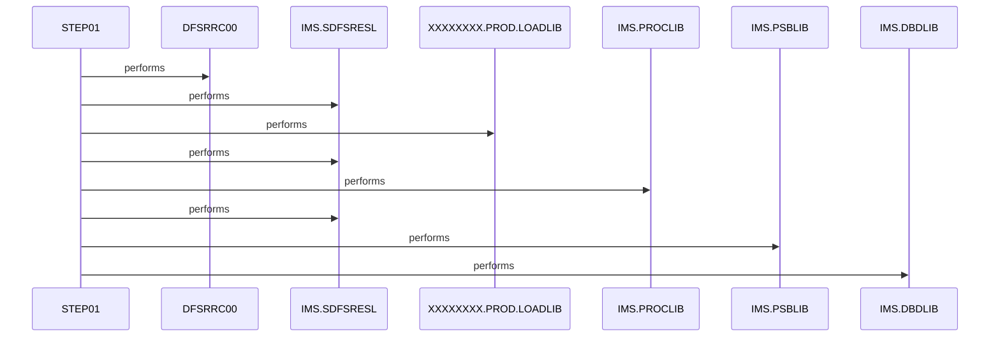

# CBPAUP0J

**File**: `jcl/CBPAUP0J.jcl`
**Type**: FileType.JCL
**Analyzed**: 2026-03-04 04:45:52.103162

## Purpose

This JCL executes an IMS program (DFSRRC00) to delete expired authorizations using a BMP (Batch Message Processing) region. It specifies the program CBPAUP0C and PSB (Program Specification Block) named PSBPAUTB.

**Business Context**: This job likely supports security and compliance by removing outdated access permissions.

## Inputs

| Name | Type | Description |
|------|------|-------------|
| IMS.SDFSRESL | IOType.FILE_SEQUENTIAL | IMS RESLIB library containing IMS modules. |
| XXXXXXXX.PROD.LOADLIB | IOType.FILE_SEQUENTIAL | Application load library containing the CBPAUP0C program. |
| IMS.PROCLIB | IOType.FILE_SEQUENTIAL | IMS procedure library. |
| IMS.PSBLIB | IOType.FILE_SEQUENTIAL | IMS PSB library containing PSBPAUTB. |
| IMS.DBDLIB | IOType.FILE_SEQUENTIAL | IMS DBD library. |
| SYSIN | IOType.FILE_SEQUENTIAL | Input control statements for the IMS program. Contains parameters '00,00001,00001,Y'. |

## Outputs

| Name | Type | Description |
|------|------|-------------|
| SYSOUX | IOType.REPORT | System output. |
| SYSOUT | IOType.REPORT | System output. |
| SYSABOUT | IOType.REPORT | System output for ABEND information. |
| ABENDAID | IOType.REPORT | System output for ABEND aid information. |
| SYSPRINT | IOType.REPORT | System print output. |
| SYSUDUMP | IOType.REPORT | System user dump output. |
| IMSERR | IOType.REPORT | IMS error output. |
| IEFRDER | IOType.OTHER | Dummy dataset for IEFRDER. |
| IMSLOGR | IOType.OTHER | Dummy dataset for IMSLOGR. |

## Called Programs

| Program | Call Type | Purpose |
|---------|-----------|---------|
| DFSRRC00 | CallType.STATIC_CALL | IMS control region program, used to execute a BMP application. |

## Paragraphs/Procedures

### STEP01
This step executes the IMS program DFSRRC00 in a BMP region to delete expired authorizations. It specifies the program to be executed (CBPAUP0C) and the PSB to be used (PSBPAUTB) via the PARM parameter. The STEPLIB DD statements define the libraries containing the IMS modules and the application load library. DFSRESLB defines the IMS RESLIB. PROCLIB defines the IMS procedure library. The SYSIN DD statement provides input control statements to the IMS program. Several SYSOUT DD statements define the output datasets for various system messages and dumps. IEFRDER and IMSLOGR are defined as DUMMY datasets, possibly indicating that logging or recovery is not enabled for this execution.

## Open Questions

- ? What is the exact purpose of the parameters passed in the SYSIN DD statement?
  - Context: The meaning of '00,00001,00001,Y' is unclear without further information about the CBPAUP0C program.

## Sequence Diagram

```mermaid
sequenceDiagram
    participant STEP01 as STEP01
    participant DFSRRC00 as DFSRRC00
    participant IMS_SDFSRESL as IMS.SDFSRESL
    participant XXXXXXXX_PROD_LOADLIB as XXXXXXXX.PROD.LOADLIB
    participant IMS_PROCLIB as IMS.PROCLIB
    participant IMS_PSBLIB as IMS.PSBLIB
    participant IMS_DBDLIB as IMS.DBDLIB
    STEP01->>DFSRRC00: performs
    STEP01->>IMS_SDFSRESL: performs
    STEP01->>XXXXXXXX_PROD_LOADLIB: performs
    STEP01->>IMS_SDFSRESL: performs
    STEP01->>IMS_PROCLIB: performs
    STEP01->>IMS_SDFSRESL: performs
    STEP01->>IMS_PSBLIB: performs
    STEP01->>IMS_DBDLIB: performs
```
