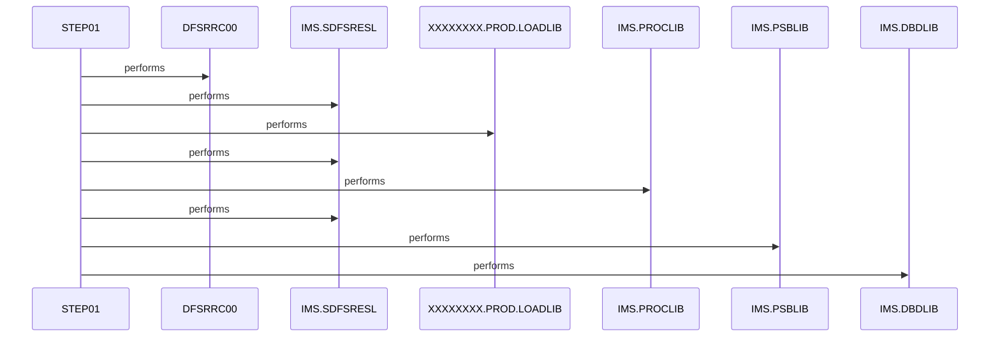

# CBPAUP0J

**File**: `jcl/CBPAUP0J.jcl`
**Type**: FileType.JCL
**Analyzed**: 2026-02-27 14:45:27.036249

## Purpose

This JCL executes an IMS Batch Message Processing (BMP) program CBPAUP0C to delete expired authorizations. It defines the necessary datasets for the IMS environment and specifies the program parameters.

**Business Context**: This job is likely part of a security or compliance process to remove outdated access rights.

## Inputs

| Name | Type | Description |
|------|------|-------------|
| IMS.SDFSRESL | IOType.FILE_SEQUENTIAL | IMS system library containing the required modules. |
| XXXXXXXX.PROD.LOADLIB | IOType.FILE_SEQUENTIAL | Application load library containing the CBPAUP0C program. |
| IMS.PROCLIB | IOType.FILE_SEQUENTIAL | IMS procedure library. |
| IMS.PSBLIB | IOType.FILE_SEQUENTIAL | IMS PSB library containing PSBPAUTB. |
| IMS.DBDLIB | IOType.FILE_SEQUENTIAL | IMS DBD library. |
| SYSIN | IOType.FILE_SEQUENTIAL | Input data for the CBPAUP0C program. The provided data '00,00001,00001,Y' is likely used as parameters for the program's execution. |

## Outputs

| Name | Type | Description |
|------|------|-------------|
| SYSOUX | IOType.REPORT | System output. |
| SYSOUT | IOType.REPORT | System output. |
| SYSABOUT | IOType.REPORT | System output for ABEND information. |
| ABENDAID | IOType.REPORT | System output for ABEND AID information. |
| SYSPRINT | IOType.REPORT | System print output. |
| SYSUDUMP | IOType.REPORT | System user dump output. |
| IMSERR | IOType.REPORT | IMS error output. |

## Paragraphs/Procedures

### STEP01
This step executes the IMS program DFSRRC00, which is a control region program for IMS BMP execution. The PARM parameter specifies 'BMP' indicating a Batch Message Processing program, 'CBPAUP0C' which is the name of the actual program being executed, and 'PSBPAUTB' which is the PSB (Program Specification Block) name. The STEPLIB DD statements define the libraries where the program DFSRRC00 and CBPAUP0C can be found. DFSRESLB points to the IMS RESLIB. The IMS DD statement defines the PSBLIB and DBDLIB to be used by the program. SYSIN provides input data to the CBPAUP0C program. The remaining DD statements define the various SYSOUT datasets for capturing program output, error messages, and dumps. IEFRDER and IMSLOGR are DUMMY datasets, likely indicating that logging is suppressed or handled elsewhere.

## Open Questions

- ? The purpose of the input data '00,00001,00001,Y' passed via SYSIN is unclear.
  - Context: Without access to the CBPAUP0C program source code, it's impossible to determine how this data is used.

## Sequence Diagram

```mermaid
sequenceDiagram
    participant STEP01 as STEP01
    participant DFSRRC00 as DFSRRC00
    participant IMS_SDFSRESL as IMS.SDFSRESL
    participant XXXXXXXX_PROD_LOADLIB as XXXXXXXX.PROD.LOADLIB
    participant IMS_PROCLIB as IMS.PROCLIB
    participant IMS_PSBLIB as IMS.PSBLIB
    participant IMS_DBDLIB as IMS.DBDLIB
    STEP01->>DFSRRC00: performs
    STEP01->>IMS_SDFSRESL: performs
    STEP01->>XXXXXXXX_PROD_LOADLIB: performs
    STEP01->>IMS_SDFSRESL: performs
    STEP01->>IMS_PROCLIB: performs
    STEP01->>IMS_SDFSRESL: performs
    STEP01->>IMS_PSBLIB: performs
    STEP01->>IMS_DBDLIB: performs
```
