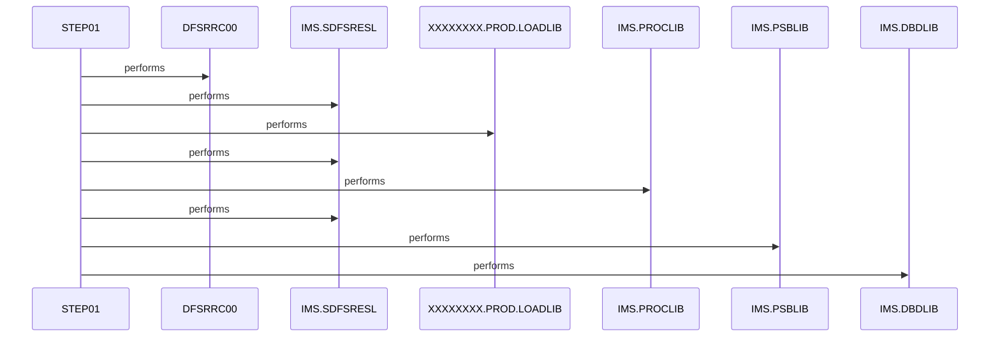

# CBPAUP0J

**File**: `jcl/CBPAUP0J.jcl`
**Type**: FileType.JCL
**Analyzed**: 2026-03-04 03:33:46.562955

## Purpose

This JCL job executes an IMS program (DFSRRC00) to delete expired authorizations using a BMP (Batch Message Processing) region. It specifies the program CBPAUP0C and PSB PSBPAUTB for the IMS execution.

**Business Context**: This job likely serves to maintain security and compliance by removing outdated access permissions within the IMS system.

## Inputs

| Name | Type | Description |
|------|------|-------------|
| SYSIN | IOType.PARAMETER | Contains input parameters for the IMS program, including parameters related to date and time. The example shows '00,00001,00001,Y'. |
| IMS.SDFSRESL | IOType.FILE_SEQUENTIAL | IMS RESLIB library containing the IMS runtime environment. |
| IMS.PROCLIB | IOType.FILE_SEQUENTIAL | IMS procedure library. |
| IMS.PSBLIB | IOType.FILE_SEQUENTIAL | IMS PSB library containing program specification blocks. |
| IMS.DBDLIB | IOType.FILE_SEQUENTIAL | IMS DBD library containing database description blocks. |
| XXXXXXXX.PROD.LOADLIB | IOType.FILE_SEQUENTIAL | Application load library (likely contains CBPAUP0C). |

## Outputs

| Name | Type | Description |
|------|------|-------------|
| SYSOUX | IOType.REPORT | System output. |
| SYSOUT | IOType.REPORT | System output. |
| SYSABOUT | IOType.REPORT | System output for ABEND information. |
| ABENDAID | IOType.REPORT | System output for ABEND aid. |
| SYSPRINT | IOType.REPORT | System print output. |
| SYSUDUMP | IOType.REPORT | System dump output. |
| IMSERR | IOType.REPORT | IMS error output. |
| IEFRDER | IOType.OTHER | Dummy dataset for logging. |
| IMSLOGR | IOType.OTHER | Dummy dataset for IMS logging. |

## Paragraphs/Procedures

### STEP01
This step executes the IMS program DFSRRC00, which is a control region program for IMS. The PARM parameter specifies that it will run as a BMP (Batch Message Processing) region, executing the program CBPAUP0C using the PSB PSBPAUTB. The STEPLIB DD statements define the libraries needed to execute the IMS program, including the IMS RESLIB and a production load library. DFSRESLB points to the IMS RESLIB. PROCLIB points to the IMS procedure library. DFSSEL points to the IMS RESLIB. IMS DD statements define the PSBLIB and DBDLIB. SYSIN provides input parameters to the CBPAUP0C program. The remaining DD statements define various output datasets for system messages, dumps, and logging. IEFRDER and IMSLOGR are DUMMY datasets, indicating that logging is suppressed.

## Open Questions

- ? What is the exact purpose and format of the SYSIN input?
  - Context: The provided SYSIN data '00,00001,00001,Y' is not self-explanatory without further documentation or the CBPAUP0C source code.
- ? What specific error conditions are handled by the IMS program CBPAUP0C?
  - Context: The JCL does not provide details on the error handling within the CBPAUP0C program itself.

## Sequence Diagram

```mermaid
sequenceDiagram
    participant STEP01 as STEP01
    participant DFSRRC00 as DFSRRC00
    participant IMS_SDFSRESL as IMS.SDFSRESL
    participant XXXXXXXX_PROD_LOADLIB as XXXXXXXX.PROD.LOADLIB
    participant IMS_PROCLIB as IMS.PROCLIB
    participant IMS_PSBLIB as IMS.PSBLIB
    participant IMS_DBDLIB as IMS.DBDLIB
    STEP01->>DFSRRC00: performs
    STEP01->>IMS_SDFSRESL: performs
    STEP01->>XXXXXXXX_PROD_LOADLIB: performs
    STEP01->>IMS_SDFSRESL: performs
    STEP01->>IMS_PROCLIB: performs
    STEP01->>IMS_SDFSRESL: performs
    STEP01->>IMS_PSBLIB: performs
    STEP01->>IMS_DBDLIB: performs
```
