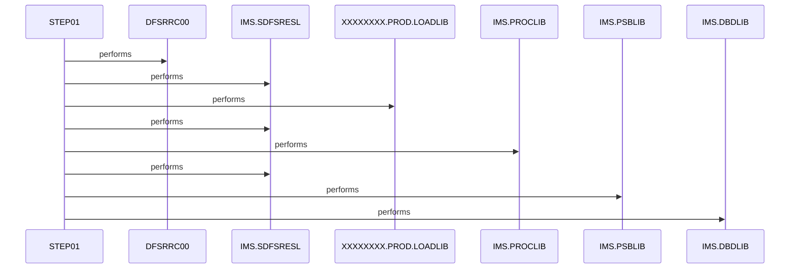

# CBPAUP0J

**File**: `jcl/CBPAUP0J.jcl`
**Type**: FileType.JCL
**Analyzed**: 2026-03-03 16:51:27.249311

## Purpose

This JCL executes an IMS program (DFSRRC00) to delete expired authorizations. It defines the program to be executed, the parameters passed to it, and the necessary datasets for the IMS environment.

**Business Context**: Authorization management and cleanup within an IMS environment.

## Inputs

| Name | Type | Description |
|------|------|-------------|
| IMS.SDFSRESL | IOType.FILE_SEQUENTIAL | IMS RESLIB dataset containing required modules. |
| XXXXXXXX.PROD.LOADLIB | IOType.FILE_SEQUENTIAL | Application load library. |
| IMS.PROCLIB | IOType.FILE_SEQUENTIAL | IMS procedure library. |
| IMS.PSBLIB | IOType.FILE_SEQUENTIAL | IMS PSB library. |
| IMS.DBDLIB | IOType.FILE_SEQUENTIAL | IMS DBD library. |
| SYSIN | IOType.FILE_SEQUENTIAL | Input data for the IMS program, likely containing parameters for the authorization deletion process. |

## Outputs

| Name | Type | Description |
|------|------|-------------|
| SYSOUX | IOType.REPORT | System output. |
| SYSOUT | IOType.REPORT | System output. |
| SYSABOUT | IOType.REPORT | System output for ABEND information. |
| ABENDAID | IOType.REPORT | System output for ABEND aid. |
| SYSPRINT | IOType.REPORT | System print output. |
| SYSUDUMP | IOType.REPORT | System user dump. |
| IMSERR | IOType.REPORT | IMS error output. |

## Called Programs

| Program | Call Type | Purpose |
|---------|-----------|---------|
| DFSRRC00 | CallType.STATIC_CALL | IMS control region program that executes the authorization deletion logic. |

## Paragraphs/Procedures

### STEP01
This step executes the IMS program DFSRRC00. It defines the program to be executed and passes parameters 'BMP,CBPAUP0C,PSBPAUTB' to it. 'BMP' indicates that the program runs as a Batch Message Processing program. 'CBPAUP0C' is likely the program name executed within the IMS environment to perform the authorization deletion. 'PSBPAUTB' is the PSB (Program Specification Block) name, which defines the database resources the program can access. The step also defines the STEPLIB, DFSRESLB, PROCLIB, IMS, DFSSEL DD statements, which are required for the IMS environment to locate the necessary libraries and datasets. SYSIN provides input data for the program. The output datasets (SYSOUT, SYSPRINT, etc.) are defined for capturing program output, error messages, and dumps. IEFRDER and IMSLOGR are defined as DUMMY datasets, indicating that they are not used in this execution.

## Open Questions

- ? What specific criteria are used to determine which authorizations are 'expired'?
  - Context: The JCL executes a program to delete expired authorizations, but the definition of 'expired' is not evident from the JCL itself.
- ? What is the format and content of the SYSIN dataset?
  - Context: SYSIN provides input to the CBPAUP0C program, but the specific data it contains and its structure are unknown.

## Sequence Diagram

```mermaid
sequenceDiagram
    participant STEP01 as STEP01
    participant DFSRRC00 as DFSRRC00
    participant IMS_SDFSRESL as IMS.SDFSRESL
    participant XXXXXXXX_PROD_LOADLIB as XXXXXXXX.PROD.LOADLIB
    participant IMS_PROCLIB as IMS.PROCLIB
    participant IMS_PSBLIB as IMS.PSBLIB
    participant IMS_DBDLIB as IMS.DBDLIB
    STEP01->>DFSRRC00: performs
    STEP01->>IMS_SDFSRESL: performs
    STEP01->>XXXXXXXX_PROD_LOADLIB: performs
    STEP01->>IMS_SDFSRESL: performs
    STEP01->>IMS_PROCLIB: performs
    STEP01->>IMS_SDFSRESL: performs
    STEP01->>IMS_PSBLIB: performs
    STEP01->>IMS_DBDLIB: performs
```
