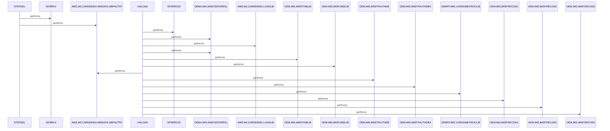

# DBPAUTP0

**File**: `jcl/DBPAUTP0.jcl`
**Type**: FileType.JCL
**Analyzed**: 2026-02-09 15:48:59.573412

## Purpose

This JCL job unloads the DBD DBPAUTP0 to a sequential dataset. It first deletes the output dataset if it exists, then executes the IMS program DFSRRC00 with parameters to perform the unload. The job also defines various IMS libraries and control datasets required for the unload process.

**Business Context**: UNKNOWN

## Inputs

| Name | Type | Description |
|------|------|-------------|
| OEM.IMS.IMSP.SDFSRESL | IOType.FILE_SEQUENTIAL | IMS RESLIB library containing IMS modules. |
| AWS.M2.CARDDEMO.LOADLIB | IOType.FILE_SEQUENTIAL | Application load library. |
| OEM.IMS.IMSP.PSBLIB | IOType.FILE_SEQUENTIAL | IMS PSB library. |
| OEM.IMS.IMSP.DBDLIB | IOType.FILE_SEQUENTIAL | IMS DBD library. |
| OEM.IMS.IMSP.PAUTHDB | IOType.FILE_SEQUENTIAL | IMS database dataset. |
| OEM.IMS.IMSP.PAUTHDBX | IOType.FILE_SEQUENTIAL | IMS database index dataset. |
| OEMPP.IMS.V15R01MB.PROCLIB(DFSVSMDB) | IOType.FILE_SEQUENTIAL | IMS VSAM parameter library. |
| OEM.IMS.IMSP.RECON1 | IOType.FILE_SEQUENTIAL | IMS RECON1 dataset. |
| OEM.IMS.IMSP.RECON2 | IOType.FILE_SEQUENTIAL | IMS RECON2 dataset. |
| OEM.IMS.IMSP.RECON3 | IOType.FILE_SEQUENTIAL | IMS RECON3 dataset. |

## Outputs

| Name | Type | Description |
|------|------|-------------|
| AWS.M2.CARDDEMO.IMSDATA.DBPAUTP0 | IOType.FILE_SEQUENTIAL | Unloaded DBD data. |
| SYSPRINT | IOType.REPORT | Job log and program output. |
| SYSUDUMP | IOType.REPORT | Memory dump in case of abend. |

## Called Programs

| Program | Call Type | Purpose |
|---------|-----------|---------|
| IEFBR14 | CallType.STATIC_CALL | Deletes the output dataset AWS.M2.CARDDEMO.IMSDATA.DBPAUTP0 if it exists. |
| DFSRRC00 | CallType.STATIC_CALL | Unloads the DBD DBPAUTP0. |

## Paragraphs/Procedures

### STEPDEL
This step deletes the existing output dataset AWS.M2.CARDDEMO.IMSDATA.DBPAUTP0 before the unload process begins. It executes the utility program IEFBR14, which is a null program often used for dataset allocation and deletion. The SYSPRINT DD statement directs the output of the IEFBR14 program to the job log. The SYSUT1 DD statement defines the dataset to be deleted, specifying its name, disposition (MOD,DELETE), unit (SYSDA), and space allocation (TRK,0). This ensures that any previous version of the output dataset is removed, preventing potential conflicts during the subsequent unload step. The step does not consume any specific input data, but it relies on the existence of the dataset defined in the SYSUT1 DD statement. The successful execution of this step prepares the system for the creation of a new output dataset in the UNLOAD step.

### ~~UNLOAD~~ (Dead Code)
*Paragraph 'UNLOAD' is never PERFORMed or referenced by any other paragraph or program*

## Dead Code

The following artifacts were identified as dead code by static analysis:

| Artifact | Type | Line | Reason |
|----------|------|------|--------|
| UNLOAD | paragraph | 15 | Paragraph 'UNLOAD' is never PERFORMed or referenced by any other paragraph or program |

## Open Questions

- ? What is the business context of this job?
  - Context: The JCL does not provide information about the business process it serves.

## Sequence Diagram

