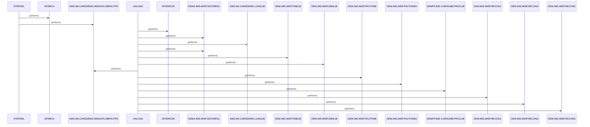

# DBPAUTP0

**File:** jcl/DBPAUTP0.jcl
**Type:** JCL
**Status:** In Progress
**Iterations:** 1
**Analyzed:** 2026-02-24 03:59:19.390998

## Purpose

This JCL defines a batch job that first deletes any existing unload dataset AWS.M2.CARDDEMO.IMSDATA.DBPAUTP0 and then executes the IMS unload utility DFSRRC00 to unload the DBPAUTP0 database using user routine DFSURGU0 into a new sequential dataset. The job is part of the CardDemo application as indicated by dataset naming and version comments.

**Business Context:** Supports IMS database maintenance for the CardDemo_v2.0 application by unloading DBPAUTP0 database segments for potential backup, transport, or utility processing.
**Program Type:** BATCH
**Citations:** Lines 1, 7, 15, 16, 25, 46

## Inputs

### SYSUT1
- **Type:** FILE_SEQUENTIAL
- **Description:** Existing unload dataset targeted for deletion in STEPDEL
- **Lines:** 9

### DDPAUTP0
- **Type:** FILE_SEQUENTIAL
- **Description:** IMS PAUTHDB dataset providing DBD definitions for DBPAUTP0
- **Lines:** 31

### DDPAUTX0
- **Type:** FILE_SEQUENTIAL
- **Description:** IMS PAUTHDBX dataset providing additional DBD definitions
- **Lines:** 32

### DFSCTL
- **Type:** PARAMETER
- **Description:** Inline control statements for DFSRRC00 including SBPARM ACTIV=COND
- **Lines:** 34

### DFSVSAMP
- **Type:** FILE_SEQUENTIAL
- **Description:** Sample VSAM DBD definitions from DFSVSMDB
- **Lines:** 33

## Outputs

### DFSURGU1
- **Type:** FILE_SEQUENTIAL
- **Description:** Sequential unload dataset containing DBPAUTP0 database segments (LRECL=27990, RECFM=VB)
- **Lines:** 25

### SYSPRINT
- **Type:** REPORT
- **Description:** Utility messages and diagnostics for both steps
- **Lines:** 8, 23

### SYSUDUMP
- **Type:** REPORT
- **Description:** System dump output for debugging abends
- **Lines:** 36

## Called Programs

| Program | Call Type | Purpose | Line |
|---------|-----------|---------|------|
| [IEFBR14](./IEFBR14.cbl.md) | STATIC_CALL | Delete prior version of unload dataset to avoid conflicts | 7 |
| [DFSRRC00](./DFSRRC00.cbl.md) | STATIC_CALL | Perform IMS database unload operation on DBPAUTP0 | 15 |

## Business Rules

### BR001: Always delete existing unload dataset before generating a new one
**Logic:** STEPDEL uses IEFBR14 with DISP=(MOD,DELETE) unconditionally prior to UNLOAD
**Conditions:** Sequential execution with no COND parameters
**Lines:** 7, 10

### BR002: Unload IMS database DBPAUTP0 using specific user routine and conditional activation
**Logic:** DFSRRC00 invoked with PARM=(ULU,DFSURGU0,DBPAUTP0) and DFSCTL SBPARM ACTIV=COND
**Conditions:** ACTIV=COND in control cards
**Lines:** 16, 35

## Data Flow

### Reads From
- **DBPAUTP0 (IMS Database)**: all fields
  (Lines: 16)
- **DDPAUTP0/DDPAUTX0/DFSVSAMP**: all fields
  (Lines: 31, 32, 33)

### Writes To
- **DFSURGU1**: Unloaded database segments
  (Lines: 25)

## Key Paragraphs

### DBPAUTP0
**Purpose:** This is the JOB statement that defines the overall job parameters including name 'DBPAUTP0', class A, message class X, region 0K, time limit 30 minutes, and notify to &SYSUID. It establishes the execution environment for all subsequent steps without processing any data itself. No inputs are consumed at this level; it relies on system parameters. Outputs are job-level logs via MSGCLASS. No business logic or decisions are implemented here. Error handling is standard JCL job abend propagation. It orchestrates sequential execution of STEPDEL followed by UNLOAD without any conditional logic. Comments indicate purpose as DB unload (lines 4-5,12-13). Version information from CardDemo_v2.0 is noted (line 46).
- Calls: STEPDEL, UNLOAD
- Lines: 1-2

### STEPDEL
**Purpose:** This job step executes the IEFBR14 utility solely to delete any existing version of the target unload dataset AWS.M2.CARDDEMO.IMSDATA.DBPAUTP0. It consumes the dataset reference via SYSUT1 DD with DISP=(MOD,DELETE), UNIT=SYSDA, SPACE=(TRK,0). No other inputs or working data are read. It produces no new data files but modifies the catalog by deleting the dataset if present. No business decisions or validations are performed; it's a preparatory cleanup step. Error handling relies on standard IEFBR14 return codes, with no explicit COND or IF in JCL to skip subsequent steps. SYSPRINT is routed to SYSOUT=* for any messages. Called unconditionally after the JOB statement. Control passes to UNLOAD next.
- Called by: DBPAUTP0
- Calls: IEFBR14
- Lines: 7-10

### UNLOAD
**Purpose:** This job step executes the IMS DFSRRC00 utility to unload the DBPAUTP0 database using PARM=(ULU,DFSURGU0,DBPAUTP0), producing a sequential VB file of database segments. It consumes IMS libraries from STEPLIB, DFSRESLB, IMS DDs (PSBLIB, DBDLIB), DBD datasets (DDPAUTP0, DDPAUTX0, DFSVSAMP), inline DFSCTL parameters (SBPARM ACTIV=COND), and RECON1-3 datasets. Dummy DDs for DFSWRK01 and DFSSRT01 indicate no work/sort files needed. Outputs the unload data to DFSURGU1 (newly allocated, cataloged, with specific DCB params), SYSPRINT, and SYSUDUMP. Implements unload logic via utility with conditional activation per control cards; no JCL-level conditions. Errors cause step ABEND with dumps to SYSUDUMP. Called sequentially after STEPDEL. Handles full database unload without field-level transforms visible in JCL.
- Called by: STEPDEL
- Calls: DFSRRC00
- Lines: 15-45

## Error Handling

- **IEFBR14 delete failure (non-zero RC):** Step abend; no COND parameter so job may continue to UNLOAD depending on system settings
  (Lines: 7)
- **DFSRRC00 unload failure:** Step abend with SYSUDUMP output
  (Lines: 15, 36)

## Open Questions

- **Purpose of DFSURGU0 user routine**
  - Context: Referenced in PARM but source code not provided
  - Suggestion: Review DFSURGU0 source or IMS documentation

## Resolved Questions

- **Q:** Role of RECON1, RECON2, RECON3 datasets
  **A:** **RECON1, RECON2, RECON3 are the IMS reconciliation (RECON) datasets required by the IMS Database Unload utility (DFSRRC00 with ULU function and user routine DFSURGU0) for the full-function HIDAM database DBPAUTP0.**

### Key Evidence from Source Code (jcl/DBPAUTP0.jcl):
- Defined in the UNLOAD step (lines 15-45):
  ```
  //UNLOAD   EXEC PGM=DFSRRC00,REGION=4M,
  //         PARM=(ULU,DFSURGU0,DBPAUTP0)
  ...
  //RECON1 DD DSN=OEM.IMS.IMSP.RECON1,DISP=SHR
  //RECON2 DD DSN=OEM.IMS.IMSP.RECON2,DISP=SHR
  //RECON3 DD DSN=OEM.IMS.IMSP.RECON3,DISP=SHR
  ```
- These are standard IMS Recon DD names (up to 3 datasets for redundancy). IMS full-function databases (like HIDAM, confirmed in ims/DBPAUTP0.dbd via skills) require RECON datasets for utilities to access dynamic metadata, log records, and checkpoint info during unload.
- Supporting DDs in the step: `DFSCTL` (control statements with `SBPARM ACTIV=COND`), `SYSUDUMP`, `DDPAUTP0`/`DDPAUTX0` (primary/index datasets), `DFSWRK01`/`DFSSRT01` (DUMMY work/sort files).
- No other RECON references in codebase (searched patterns: 'RECON[123]?', 'RECON', '//RECON1.*DSN', 'RECON1.*DD', 'DFSRRC00.*RECON').

### Context:
- **No explicit comments** in JCL explain them, but dataset names (`OEM.IMS.IMSP.RECON*`) match IMS installation standards.
- **Skills checked**: `jcl` (DBPAUTP0 summary, no RECON detail), `ims` (DBPAUTP0 as HIDAM/VSAM), `system-overview`. No skills for DFSRRC00/DFSURGU0/RECON.
- **Why required**: IMS Unload reads RECONs for database status/changes (e.g., for HIDAM root/index handling). Omitted = utility failure.

Sources: jcl/DBPAUTP0.jcl (full read), search_code results, loaded skills (`jcl`, `ims`, `system-overview`).

## Sequence Diagram



---
*Generated by War Rig WAR_RIG*