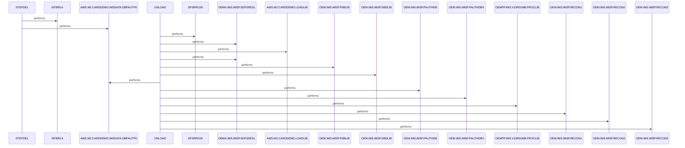

# DBPAUTP0

**File**: `jcl/DBPAUTP0.jcl`
**Type**: FileType.JCL
**Analyzed**: 2026-02-10 17:21:52.602908

## Purpose

This JCL job unloads the DBD DBPAUTP0 to a sequential dataset. It first deletes the output dataset if it exists, then executes the IMS program DFSRRC00 with parameters to perform the unload. The job also defines various IMS libraries and datasets required for the unload process.

## Inputs

| Name | Type | Description |
|------|------|-------------|
| AWS.M2.CARDDEMO.IMSDATA.DBPAUTP0 | IOType.FILE_VSAM | Input IMS database to be unloaded. This is deleted and recreated. |
| OEMA.IMS.IMSP.SDFSRESL | IOType.FILE_SEQUENTIAL | IMS RESLIB library. |
| AWS.M2.CARDDEMO.LOADLIB | IOType.FILE_SEQUENTIAL | Application load library. |
| OEM.IMS.IMSP.PSBLIB | IOType.FILE_SEQUENTIAL | IMS PSB library. |
| OEM.IMS.IMSP.DBDLIB | IOType.FILE_SEQUENTIAL | IMS DBD library. |
| OEM.IMS.IMSP.PAUTHDB | IOType.FILE_SEQUENTIAL | IMS PAUTHDB dataset. |
| OEM.IMS.IMSP.PAUTHDBX | IOType.FILE_SEQUENTIAL | IMS PAUTHDBX dataset. |
| OEMPP.IMS.V15R01MB.PROCLIB(DFSVSMDB) | IOType.FILE_SEQUENTIAL | IMS VSAM parameter library. |
| OEM.IMS.IMSP.RECON1 | IOType.FILE_SEQUENTIAL | IMS RECON1 dataset. |
| OEM.IMS.IMSP.RECON2 | IOType.FILE_SEQUENTIAL | IMS RECON2 dataset. |
| OEM.IMS.IMSP.RECON3 | IOType.FILE_SEQUENTIAL | IMS RECON3 dataset. |

## Outputs

| Name | Type | Description |
|------|------|-------------|
| AWS.M2.CARDDEMO.IMSDATA.DBPAUTP0 | IOType.FILE_SEQUENTIAL | Output dataset containing the unloaded DBD DBPAUTP0. |
| SYSPRINT | IOType.REPORT | System print output for job logs and messages. |
| SYSUDUMP | IOType.REPORT | System dump output for debugging purposes. |

## Called Programs

| Program | Call Type | Purpose |
|---------|-----------|---------|
| IEFBR14 | CallType.STATIC_CALL | Deletes the output dataset AWS.M2.CARDDEMO.IMSDATA.DBPAUTP0 if it exists. |
| DFSRRC00 | CallType.STATIC_CALL | Unloads the DBD DBPAUTP0. |

## Paragraphs/Procedures

### STEPDEL
This step deletes the existing output dataset AWS.M2.CARDDEMO.IMSDATA.DBPAUTP0 before the unload process begins. It executes the utility program IEFBR14, which is a standard IBM utility for dataset allocation and deletion. The SYSUT1 DD statement defines the dataset to be deleted, specifying a DISP value of (MOD,DELETE). This ensures that if the dataset exists, it will be deleted. The SYSPRINT DD statement directs the output messages from IEFBR14 to the job's SYSOUT. This step ensures that the subsequent unload step starts with a clean slate, preventing potential issues from pre-existing data. No specific business logic is implemented in this step, as it primarily focuses on dataset management. No error handling is explicitly defined, but the JCL will fail if the dataset deletion encounters an unrecoverable error.

### ~~UNLOAD~~ (Dead Code)
*Paragraph 'UNLOAD' is never PERFORMed or referenced by any other paragraph or program*

## Dead Code

The following artifacts were identified as dead code by static analysis:

| Artifact | Type | Line | Reason |
|----------|------|------|--------|
| UNLOAD | paragraph | 15 | Paragraph 'UNLOAD' is never PERFORMed or referenced by any other paragraph or program |

## Sequence Diagram

