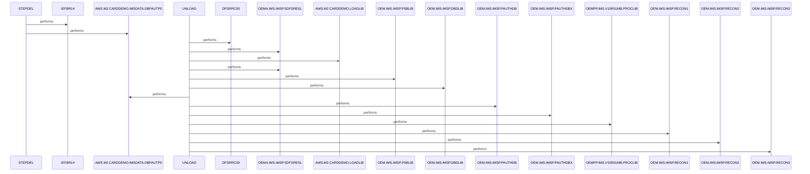

# DBPAUTP0

**File**: `jcl/DBPAUTP0.jcl`
**Type**: JCL
**Analyzed**: 2026-02-24 17:39:45.321664

## Purpose

This JCL job unloads the DBPAUTP0 database using the IMS Database Image Copy utility (DFSRRC00). It first deletes the output dataset if it exists, then executes the unload, and finally catalogs the new unloaded dataset.

## Inputs

| Name | Type | Description |
|------|------|-------------|
| OEM.IMS.IMSP.PAUTHDB | FILE_VSAM | Input database file for DBPAUTP0 unload process. |
| OEM.IMS.IMSP.PAUTHDBX | FILE_VSAM | Index file associated with the PAUTHDB database. |
| OEM.IMS.IMSP.PSBLIB | FILE_SEQUENTIAL | IMS PSB library. |
| OEM.IMS.IMSP.DBDLIB | FILE_SEQUENTIAL | IMS DBD library. |
| OEMPP.IMS.V15R01MB.PROCLIB(DFSVSMDB) | FILE_SEQUENTIAL | IMS VSAM parameter library. |
| OEM.IMS.IMSP.RECON1 | FILE_SEQUENTIAL | IMS Recovery Control Data Set 1. |
| OEM.IMS.IMSP.RECON2 | FILE_SEQUENTIAL | IMS Recovery Control Data Set 2. |
| OEM.IMS.IMSP.RECON3 | FILE_SEQUENTIAL | IMS Recovery Control Data Set 3. |

## Outputs

| Name | Type | Description |
|------|------|-------------|
| AWS.M2.CARDDEMO.IMSDATA.DBPAUTP0 | FILE_VSAM | Unloaded database output dataset. |
| SYSPRINT | REPORT | System print output for job execution messages and diagnostics. |
| SYSUDUMP | REPORT | System dump output for debugging purposes. |

## Called Programs

| Program | Call Type | Purpose |
|---------|-----------|---------|
| IEFBR14 | STATIC_CALL | Deletes the existing output dataset AWS.M2.CARDDEMO.IMSDATA.DBPAUTP0 before the unload process. |
| DFSRRC00 | STATIC_CALL | Executes the IMS Database Image Copy utility to unload the DBPAUTP0 database. |

## Paragraphs/Procedures

### STEPDEL
This step deletes the output dataset AWS.M2.CARDDEMO.IMSDATA.DBPAUTP0 if it already exists. It uses the IEFBR14 program, a utility whose sole purpose is to perform dataset operations. The SYSPRINT DD defines the output for system messages. The SYSUT1 DD defines the dataset to be deleted, specifying its DSN, disposition, unit, and space allocation. The disposition (MOD,DELETE) indicates that if the dataset exists, it should be deleted. This ensures that the subsequent unload step starts with a clean slate and avoids potential conflicts if the dataset already exists. No specific business logic is implemented in this step, as it is purely a housekeeping task to manage the output dataset. No error handling is explicitly defined; any errors during dataset deletion will result in a JCL error and job termination. No other programs or paragraphs are called from this step.

### ~~UNLOAD~~ (Dead Code)
*Paragraph 'UNLOAD' is never PERFORMed or referenced by any other paragraph or program*

## Dead Code

The following artifacts were identified as dead code by static analysis:

| Artifact | Type | Line | Reason |
|----------|------|------|--------|
| UNLOAD | paragraph | 15 | Paragraph 'UNLOAD' is never PERFORMed or referenced by any other paragraph or program |

## Open Questions

- ? What is the exact purpose and structure of the DFSURGU0 control statement dataset?
  - Context: The JCL refers to DFSURGU0 in the PARM parameter of the UNLOAD step, but the content and structure of this control statement dataset are not defined within the JCL itself.

## Sequence Diagram

