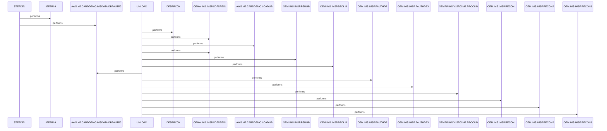

# DBPAUTP0

**File**: `jcl/DBPAUTP0.jcl`
**Type**: FileType.JCL
**Analyzed**: 2026-03-04 03:33:20.129368

## Purpose

This JCL job unloads the DBD DBPAUTP0. It first deletes the output dataset if it exists, then executes the unload program (DFSRRC00) to extract the database definition. The job defines the necessary datasets for the unload process, including libraries, RECON datasets, and output datasets.

**Business Context**: Database administration and maintenance, specifically for extracting and potentially migrating or backing up database definitions.

## Inputs

| Name | Type | Description |
|------|------|-------------|
| OEM.IMS.IMSP.PSBLIB | IOType.FILE_SEQUENTIAL | IMS PSB Library |
| OEM.IMS.IMSP.DBDLIB | IOType.FILE_SEQUENTIAL | IMS DBD Library |
| OEMPP.IMS.V15R01MB.PROCLIB(DFSVSMDB) | IOType.FILE_SEQUENTIAL | IMS VSAM parameters |
| OEM.IMS.IMSP.RECON1 | IOType.FILE_SEQUENTIAL | IMS RECON1 dataset |
| OEM.IMS.IMSP.RECON2 | IOType.FILE_SEQUENTIAL | IMS RECON2 dataset |
| OEM.IMS.IMSP.RECON3 | IOType.FILE_SEQUENTIAL | IMS RECON3 dataset |
| OEMA.IMS.IMSP.SDFSRESL | IOType.FILE_SEQUENTIAL | IMS SDFSRESL Library |
| OEM.IMS.IMSP.PAUTHDB | IOType.FILE_SEQUENTIAL | IMS PAUTHDB dataset |
| OEM.IMS.IMSP.PAUTHDBX | IOType.FILE_SEQUENTIAL | IMS PAUTHDBX dataset |
| AWS.M2.CARDDEMO.LOADLIB | IOType.FILE_SEQUENTIAL | Load library |

## Outputs

| Name | Type | Description |
|------|------|-------------|
| AWS.M2.CARDDEMO.IMSDATA.DBPAUTP0 | IOType.FILE_SEQUENTIAL | Output dataset containing the unloaded DBD DBPAUTP0. |
| SYSPRINT | IOType.REPORT | System print output for job execution messages and diagnostics. |
| SYSUDUMP | IOType.REPORT | System dump output in case of abend. |

## Called Programs

| Program | Call Type | Purpose |
|---------|-----------|---------|
| DFSRRC00 | CallType.STATIC_CALL | IMS DL/I Resource Recovery Services common service routine, used here to unload the DBD. |
| IEFBR14 | CallType.STATIC_CALL | IBM utility to delete and define datasets. |

## Paragraphs/Procedures

### DBPAUTP0
This is the main JOB statement for the DBPAUTP0 JCL. It defines the job name, accounting information, class, message class, region size, time limit, and notification settings. The job is named 'DBPAUTP0 DB UNLOAD' and is assigned to class A. The MSGCLASS is set to X, the REGION is set to 0K, and the TIME limit is set to 30 minutes. The NOTIFY parameter is set to the user ID (&SYSUID), so the user will be notified when the job completes. This paragraph sets the overall execution environment for the subsequent steps in the JCL, ensuring that the job runs with the specified resources and configurations. It does not directly process data or call other programs but rather provides the overarching context for the entire job execution. The job card initiates the execution sequence, setting the stage for the dataset deletion and DBD unload steps.

### STEPDEL
This step deletes the output dataset AWS.M2.CARDDEMO.IMSDATA.DBPAUTP0 if it already exists. It uses the IEFBR14 program, a standard IBM utility for dataset operations. The SYSPRINT DD statement directs the output of the IEFBR14 program to the SYSOUT. The SYSUT1 DD statement defines the dataset to be deleted, specifying the dataset name (AWS.M2.CARDDEMO.IMSDATA.DBPAUTP0), disposition (MOD,DELETE), unit (SYSDA), and space allocation (TRK,0). The DISP=(MOD,DELETE) parameter indicates that if the dataset exists, it should be deleted. This step ensures that the subsequent unload step starts with a clean slate, preventing potential conflicts or errors due to pre-existing data. It is a housekeeping step that prepares the environment for the DBD unload process by removing any previous versions of the output dataset. The successful execution of this step is crucial for the overall success of the job, as it avoids potential issues related to dataset contention or incorrect data.

### ~~UNLOAD~~ (Dead Code)
*Paragraph 'UNLOAD' is never PERFORMed or referenced by any other paragraph or program*

## Dead Code

The following artifacts were identified as dead code by static analysis:

| Artifact | Type | Line | Reason |
|----------|------|------|--------|
| UNLOAD | paragraph | 15 | Paragraph 'UNLOAD' is never PERFORMed or referenced by any other paragraph or program |

## Sequence Diagram

```mermaid
sequenceDiagram
    participant STEPDEL as STEPDEL
    participant IEFBR14 as IEFBR14
    participant AWS_M2_CARDDEMO_IMSDATA_DBPAUTP0 as AWS.M2.CARDDEMO.IMSDATA.DBPAUTP0
    participant UNLOAD as UNLOAD
    participant DFSRRC00 as DFSRRC00
    participant OEMA_IMS_IMSP_SDFSRESL as OEMA.IMS.IMSP.SDFSRESL
    participant AWS_M2_CARDDEMO_LOADLIB as AWS.M2.CARDDEMO.LOADLIB
    participant OEM_IMS_IMSP_PSBLIB as OEM.IMS.IMSP.PSBLIB
    participant OEM_IMS_IMSP_DBDLIB as OEM.IMS.IMSP.DBDLIB
    participant OEM_IMS_IMSP_PAUTHDB as OEM.IMS.IMSP.PAUTHDB
    participant OEM_IMS_IMSP_PAUTHDBX as OEM.IMS.IMSP.PAUTHDBX
    participant OEMPP_IMS_V15R01MB_PROCLIB as OEMPP.IMS.V15R01MB.PROCLIB
    participant OEM_IMS_IMSP_RECON1 as OEM.IMS.IMSP.RECON1
    participant OEM_IMS_IMSP_RECON2 as OEM.IMS.IMSP.RECON2
    participant OEM_IMS_IMSP_RECON3 as OEM.IMS.IMSP.RECON3
    STEPDEL->>IEFBR14: performs
    STEPDEL->>AWS_M2_CARDDEMO_IMSDATA_DBPAUTP0: performs
    UNLOAD->>DFSRRC00: performs
    UNLOAD->>OEMA_IMS_IMSP_SDFSRESL: performs
    UNLOAD->>AWS_M2_CARDDEMO_LOADLIB: performs
    UNLOAD->>OEMA_IMS_IMSP_SDFSRESL: performs
    UNLOAD->>OEM_IMS_IMSP_PSBLIB: performs
    UNLOAD->>OEM_IMS_IMSP_DBDLIB: performs
    UNLOAD->>AWS_M2_CARDDEMO_IMSDATA_DBPAUTP0: performs
    UNLOAD->>OEM_IMS_IMSP_PAUTHDB: performs
    UNLOAD->>OEM_IMS_IMSP_PAUTHDBX: performs
    UNLOAD->>OEMPP_IMS_V15R01MB_PROCLIB: performs
    UNLOAD->>OEM_IMS_IMSP_RECON1: performs
    UNLOAD->>OEM_IMS_IMSP_RECON2: performs
    UNLOAD->>OEM_IMS_IMSP_RECON3: performs
```
