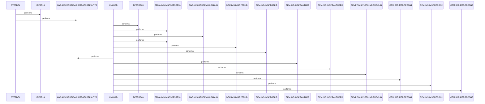

# DBPAUTP0

**File**: `jcl/DBPAUTP0.jcl`
**Type**: FileType.JCL
**Analyzed**: 2026-03-03 16:51:08.281226

## Purpose

This JCL job unloads a DBD named DBPAUTP0. It first deletes the output dataset if it exists, then executes the unload process using the IMS program DFSRRC00.

## Inputs

| Name | Type | Description |
|------|------|-------------|
| OEM.IMS.IMSP.SDFSRESL | IOType.FILE_SEQUENTIAL | IMS RESLIB |
| AWS.M2.CARDDEMO.LOADLIB | IOType.FILE_SEQUENTIAL | Load library |
| OEM.IMS.IMSP.PSBLIB | IOType.FILE_SEQUENTIAL | IMS PSBLIB |
| OEM.IMS.IMSP.DBDLIB | IOType.FILE_SEQUENTIAL | IMS DBDLIB |
| OEM.IMS.IMSP.PAUTHDB | IOType.FILE_SEQUENTIAL | IMS PAUTHDB |
| OEM.IMS.IMSP.PAUTHDBX | IOType.FILE_SEQUENTIAL | IMS PAUTHDBX |
| OEMPP.IMS.V15R01MB.PROCLIB(DFSVSMDB) | IOType.FILE_SEQUENTIAL | IMS VSAMP |
| OEM.IMS.IMSP.RECON1 | IOType.FILE_SEQUENTIAL | IMS RECON1 |
| OEM.IMS.IMSP.RECON2 | IOType.FILE_SEQUENTIAL | IMS RECON2 |
| OEM.IMS.IMSP.RECON3 | IOType.FILE_SEQUENTIAL | IMS RECON3 |

## Outputs

| Name | Type | Description |
|------|------|-------------|
| AWS.M2.CARDDEMO.IMSDATA.DBPAUTP0 | IOType.FILE_SEQUENTIAL | Output dataset for the unloaded DBD |
| SYSUDUMP | IOType.FILE_SEQUENTIAL | System dump output |

## Called Programs

| Program | Call Type | Purpose |
|---------|-----------|---------|
| IEFBR14 | CallType.STATIC_CALL | To delete the output dataset before the unload process |
| DFSRRC00 | CallType.STATIC_CALL | To unload the DBD |

## Paragraphs/Procedures

### DBPAUTP0
This is the main JOB statement for the DBPAUTP0 job. It defines the job name, class, message class, region size, time limit, and notification settings. The job is named 'DBPAUTP0 DB UNLOAD' and is assigned to class A with message class X. It specifies a region size of 0K and a time limit of 30 minutes. It also sets up notification to the user ID associated with the job. This paragraph does not directly consume or produce data but sets the overall environment for the job execution. It does not call any other programs or paragraphs directly, but its parameters influence the execution of subsequent steps. There is no specific error handling within this JOB statement itself, but errors in job setup would prevent the job from executing.

### STEPDEL
This step deletes the output dataset AWS.M2.CARDDEMO.IMSDATA.DBPAUTP0 if it exists. It executes the program IEFBR14, a standard utility for dataset operations. The SYSPRINT DD statement directs the output to the job log. The SYSUT1 DD statement defines the dataset to be deleted, specifying a disposition of MOD (modify if exists) and DELETE (delete the dataset). The UNIT parameter specifies a direct access storage device (SYSDA), and SPACE=(TRK,0) indicates that no space is required as the dataset is being deleted. This step ensures that a previous version of the output dataset does not interfere with the current unload process. If the dataset does not exist, the step will complete successfully without error. It does not call any other programs or paragraphs.

### ~~UNLOAD~~ (Dead Code)
*Paragraph 'UNLOAD' is never PERFORMed or referenced by any other paragraph or program*

## Dead Code

The following artifacts were identified as dead code by static analysis:

| Artifact | Type | Line | Reason |
|----------|------|------|--------|
| UNLOAD | paragraph | 15 | Paragraph 'UNLOAD' is never PERFORMed or referenced by any other paragraph or program |

## Sequence Diagram

```mermaid
sequenceDiagram
    participant STEPDEL as STEPDEL
    participant IEFBR14 as IEFBR14
    participant AWS_M2_CARDDEMO_IMSDATA_DBPAUTP0 as AWS.M2.CARDDEMO.IMSDATA.DBPAUTP0
    participant UNLOAD as UNLOAD
    participant DFSRRC00 as DFSRRC00
    participant OEMA_IMS_IMSP_SDFSRESL as OEMA.IMS.IMSP.SDFSRESL
    participant AWS_M2_CARDDEMO_LOADLIB as AWS.M2.CARDDEMO.LOADLIB
    participant OEM_IMS_IMSP_PSBLIB as OEM.IMS.IMSP.PSBLIB
    participant OEM_IMS_IMSP_DBDLIB as OEM.IMS.IMSP.DBDLIB
    participant OEM_IMS_IMSP_PAUTHDB as OEM.IMS.IMSP.PAUTHDB
    participant OEM_IMS_IMSP_PAUTHDBX as OEM.IMS.IMSP.PAUTHDBX
    participant OEMPP_IMS_V15R01MB_PROCLIB as OEMPP.IMS.V15R01MB.PROCLIB
    participant OEM_IMS_IMSP_RECON1 as OEM.IMS.IMSP.RECON1
    participant OEM_IMS_IMSP_RECON2 as OEM.IMS.IMSP.RECON2
    participant OEM_IMS_IMSP_RECON3 as OEM.IMS.IMSP.RECON3
    STEPDEL->>IEFBR14: performs
    STEPDEL->>AWS_M2_CARDDEMO_IMSDATA_DBPAUTP0: performs
    UNLOAD->>DFSRRC00: performs
    UNLOAD->>OEMA_IMS_IMSP_SDFSRESL: performs
    UNLOAD->>AWS_M2_CARDDEMO_LOADLIB: performs
    UNLOAD->>OEMA_IMS_IMSP_SDFSRESL: performs
    UNLOAD->>OEM_IMS_IMSP_PSBLIB: performs
    UNLOAD->>OEM_IMS_IMSP_DBDLIB: performs
    UNLOAD->>AWS_M2_CARDDEMO_IMSDATA_DBPAUTP0: performs
    UNLOAD->>OEM_IMS_IMSP_PAUTHDB: performs
    UNLOAD->>OEM_IMS_IMSP_PAUTHDBX: performs
    UNLOAD->>OEMPP_IMS_V15R01MB_PROCLIB: performs
    UNLOAD->>OEM_IMS_IMSP_RECON1: performs
    UNLOAD->>OEM_IMS_IMSP_RECON2: performs
    UNLOAD->>OEM_IMS_IMSP_RECON3: performs
```
